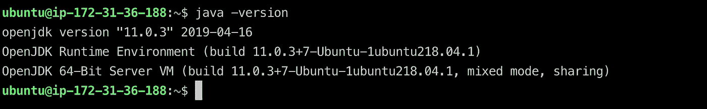

# 在 AWS 的 Ubuntu 上安装一个 Kafka 集群

> 原文：<https://towardsdatascience.com/install-a-kafka-cluster-on-ubuntu-in-aws-17c951287284?source=collection_archive---------11----------------------->

## 通过 AWS 中的 Kafka 消息主干构建实时数据功能


# 概观

数以万计的组织正在使用 Kafka，包括超过三分之一的财富 500 强公司。这些公司包括十大旅游公司、十大银行中的 7 家、十大保险公司中的 8 家、十大电信公司中的 9 家，等等。LinkedIn、微软和网飞每天用 Kafka 处理四条逗号消息(10 亿条)。它是管理和处理数据流运动的核心。

Kafka 经常在实时流数据架构中使用，以提供实时分析。由于 Kafka 是一个快速、可伸缩、持久和容错的发布-订阅消息传递系统，因此 Kafka 用于 JMS 和 RabbitMQ 由于容量和响应性而可能不被考虑的用例中。Kafka 具有更高的吞吐量、可靠性和复制特性，这使其适用于跟踪服务呼叫(跟踪每个呼叫)或跟踪 IOT 传感器数据等传统 MOM 可能不考虑的事情。

在这篇文章中，我将介绍在 AWS 中的 Linux Ubuntu 上安装 Kafka 的过程，并开始运行一些简单的示例。我将在以后的文章中介绍 Kafka 是如何工作的，以及一些使用 Java 和 Node 的用例。

# 入门指南

登录您的 AWS 帐户，如果您没有帐户，请创建一个新帐户。如果您使用免费服务，将不会被收费。点击了解有关免费层[的更多信息。](https://aws.amazon.com/free/)

让我们生成一个密钥对。转到 **EC2- >键对**。密钥对将允许您 SSH 并连接到您的 EC2 实例。选择您喜欢的地区并点击**创建配对**或导入一个已经存在的配对。


下载您的密钥对。

请确保限制文件的权限:

```
chmod 400 <key pair name>.pem
```

# 设置您的实例

让我们为 EC2 实例提供一个 Ubuntu 映像。

转到 **EC2 仪表板**并点击启动实例。

选择 Ubuntu 图像。


保留所有默认选项，点击**查看并启动**。

请注意，Kafka 的官方建议是最低 t2.medium，但此选项不在免费层范围内，会让您花钱，因此在本练习中，我们将使用 t2.micro。

选择在上一步中生成的密钥对。

回到 Instances 列表，您应该看到新的 EC2 实例启动了。

# 连接到您的实例

单击实例，并在描述选项卡上复制公共 DNS (IPv4)

```
ssh -i ~/.ssh/<key pair name.pem> ubuntu@<Public DNS (IPv4)>
```

您应该会看到 Ubuntu 欢迎屏幕:


太好了！！您已连接到 EC2 实例


# 安装 Java

让我们开始安装吧。第一步是更新实例并安装 Java。

运行以下命令:

```
sudo apt-get update 
sudo apt upgrade
sudo add-apt-repository ppa:linuxuprising/java 
sudo apt install openjdk-11-jre-headless
```

测试您的 Java 安装:



# 安装卡夫卡

现在，让我们使用以下命令安装合流 Kafka:

```
wget -qO - https://packages.confluent.io/deb/5.2/archive.key | sudo apt-key add -
sudo add-apt-repository "deb [arch=amd64] https://packages.confluent.io/deb/5.2 stable main"
sudo apt-get update && sudo apt-get install confluent-platform-2.12
```

恭喜你！！您现在已经在 AWS 中的 Ubuntu 上安装了一个 Kafka 服务器。

# 配置 Kafka

让我们用 1 个 Kafka 代理和 1 个主题来配置 Kafka 的最小安装。
导航到您的 Kafka 安装

# 卡夫卡经纪人

编辑文件**服务器.属性**

```
sudo nano /etc/kafka/server.properties
```

取消对以下行的注释:

```
metric.reporters=io.confluent.metrics.reporter.ConfluentMetricsReporter
confluent.metrics.reporter.bootstrap.servers=localhost:9092
confluent.metrics.reporter.topic.replicas=1
```

用 Ctrl+0 和 Ctrl+X 保存以退出

# 控制中心

编辑文件**控制中心生产属性**

```
sudo nano /etc/confluent-control-center/control-center.properties
```

取消对以下行的注释，并编辑为您的服务器名称或本地主机:

```
bootstrap.servers=localhost:9092 
zookeeper.connect=localhost:2181
```

在文件末尾添加以下几行:

```
confluent.controlcenter.internal.topics.partitions=1 confluent.controlcenter.internal.topics.replication=1 confluent.controlcenter.command.topic.replication=1 confluent.monitoring.interceptor.topic.partitions=1 confluent.monitoring.interceptor.topic.replication=1
```

# 连接器

```
sudo nano /etc/kafka/connect-distributed.properties
```

在文件末尾添加以下几行:

```
consumer.interceptor.classes=io.confluent.monitoring.clients.interceptor.MonitoringConsumerInterceptor producer.interceptor.classes=io.confluent.monitoring.clients.interceptor.MonitoringProducerInterceptor
```

# 开始卡夫卡

让我们开始 Kafka 服务:

```
sudo systemctl start confluent-zookeeper 
sudo systemctl start confluent-kafka 
sudo systemctl start confluent-schema-registry 
sudo systemctl start confluent-kafka-connect 
sudo systemctl start confluent-kafka-rest 
sudo systemctl start confluent-ksql 
sudo systemctl start confluent-control-center
```

您可以使用以下命令检查服务状态:

```
systemctl status confluent*
```

服务将在以下端口上运行:

ComponentPortKafka 经纪人(纯文本)9092

合流控制中心 9021

Kafka 连接 REST API 8083

KSQL 服务器 REST API 8088

REST 代理 8082

模式注册表 REST API 8081

动物园管理员 2181

要访问您的控制中心，请确保在 AWS 中打开端口 9021。
转到您的实例**描述**选项卡，并单击安全组已创建。包括端口 9021 的新入站规则。你可以限制你的 IP 地址或者允许所有人访问。


导航到您的 **<公共 DNS (IPv4) > :9021** ，您应该会看到您的控制中心。


恭喜你！！


*原载于*[*https://marcoslombog.com*](https://marcoslombog.com/2019/07/16/kafka-ubuntu-aws.html)*。*