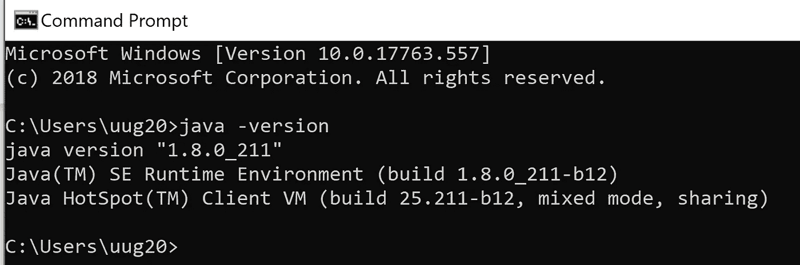

# 在 Windows 10 上安装 Apache PySpark

> 原文：<https://towardsdatascience.com/installing-apache-pyspark-on-windows-10-f5f0c506bea1?source=collection_archive---------0----------------------->

## 产品推荐数据科学项目的 Apache Spark 安装说明

在过去的几个月里，我一直在从事一个数据科学项目，该项目处理一个巨大的数据集，因此有必要使用 Apache PySpark 提供的分布式环境。

在 Windows 10 上安装 PySpark 的时候纠结了很多。所以我决定写这篇博客来帮助任何人在 Windows 10 机器上轻松安装和使用 Apache PySpark。

## 1.第一步

PySpark 需要 Java 版本 7 或更高版本和 Python 版本 2.6 或更高版本。让我们首先检查它们是否已经安装或安装，并确保 PySpark 可以与这两个组件一起工作。

**安装 Java**

检查您的机器上是否安装了 Java 版本 7 或更高版本。为此，在命令提示符下执行以下命令。

如果安装了 Java 并配置为从命令提示符运行，那么运行上面的命令应该会将关于 Java 版本的信息打印到控制台。否则，如果您收到如下消息:

*‘Java’不被识别为内部或外部命令、可操作程序或批处理文件。*

然后你得装 java。

a)为此下载 java 从[下载免费 Java 软件](https://www.java.com/download/)

b)获得 Windows x64(如 jre-8u92-windows-x64.exe ),除非您使用的是 32 位版本的 Windows，在这种情况下，您需要获得 *Windows x86 离线*版本。

c)运行安装程序。

d)安装完成后，关闭当前的命令提示符(如果它已经打开),重新打开并检查是否可以成功运行 ***java - version*** 命令。

**2。步骤 2**

**Python**

Python 被许多其他软件工具使用。因此，很可能您的计算机上已经有了所需的版本(在我们的例子中是 2.6 或更高版本)。要检查 Python 是否可用并找到其版本，请打开命令提示符并键入命令 **python - version**

如果安装了 Python 并将其配置为从命令提示符运行，那么运行上面的命令应该会将 Python 版本的信息打印到控制台。例如，我在笔记本电脑上得到以下输出:

C:\Users\uug20>python 版本
Python 3.7.3

相反，如果您收到一条类似这样的消息

*“‘python’不被识别为内部或外部命令、可操作程序或批处理文件。”*

意味着你需要安装 Python。为此，

a)进入 Python [下载](https://www.python.org/downloads/windows/)页面。

b)点击*最新 Python 2 版本*链接。

c)下载 Windows x86–64 MSI 安装程序文件。如果您使用 32 位版本的 Windows，请下载 Windows x86 MSI 安装程序文件。

d)运行安装程序时，在**自定义 Python** 部分，确保选择了选项*将 python.exe 添加到路径*。如果未选择此选项，某些 PySpark 实用程序(如 pyspark 和 spark-submit)可能无法工作。

e)安装完成后，关闭命令提示符(如果它已经打开),重新打开并检查您是否可以成功运行 **python - version** 命令。

**3。第三步**

**安装 Apache Spark**

a)转到 Spark [下载](http://spark.apache.org/downloads.html)页面。

b)选择 Spark 的最新稳定版本。

c) *选择包类型:s* 选择为最新版本的 Hadoop 预构建的版本，如*为 Hadoop 2.6 预构建的版本*。

d) *选择下载类型:*选择*直接下载*。

e)点击*下载 Spark* 旁边的链接，下载一个压缩的 tar 文件，文件结尾为。tgz 扩展如 spark-1.6.2-bin-hadoop2.6.tgz。

f)安装 Apache Spark 时，您不必运行任何安装程序。使用 [7Zip](http://www.7-zip.org/) 工具/其他工具将下载的 tar 文件解压缩到您选择的任何文件夹中。

确保包含 Spark 文件的文件夹路径和文件夹名称不包含任何空格。

我在我的 D 盘上创建了一个名为 spark 的文件夹，并在一个名为 spark-2.4.3-bin-hadoop2.7 的文件夹中提取压缩的 tar 文件。因此，所有 spark 文件都在一个名为 D:\ Spark \ Spark-2 . 4 . 3-bin-Hadoop 2.7 的文件夹中。在本文中，我们将这个文件夹称为 SPARK_HOME。

要测试安装是否成功，请打开命令提示符，转到 SPARK_HOME 目录并键入 bin\pyspark。这将启动 PySpark shell，它可用于与 Spark 交互工作。

最后一条消息提示了如何使用 sc 或 sqlContext 名称在 PySpark shell 中使用 Spark。例如，在 shell 中键入 sc.version 应该会打印出 Spark 的版本。您可以像退出任何 Python shell 一样退出 PySpark shell 通过键入 exit()。

PySpark shell 在退出时输出一些消息。因此，您需要按 enter 键返回到命令提示符。

**4。步骤 4**

**配置火花装置**

最初，当您启动 PySpark shell 时，它会生成大量类型为 INFO、ERROR 和 WARN 的消息。让我们看看如何删除这些消息。

默认情况下，Windows 上的 Spark 安装不包括 Spark 使用的 winutils.exe 实用程序。如果您没有告诉您的 Spark 安装在哪里寻找 winutils.exe，您将会在运行 PySpark shell 时看到如下错误消息

*"错误外壳:在 hadoop 二进制文件路径 Java . io . io 中找不到 winutils 二进制文件异常:在 Hadoop 二进制文件中找不到可执行文件 null\bin\winutils.exe。"*

该错误消息不会阻止 PySpark shell 启动。但是，如果您尝试使用 bin\spark-submit 实用程序运行一个独立的 Python 脚本，您将会得到一个错误。例如，当您在 SPARK_HOME 目录中时，尝试在命令提示符下运行 examples 文件夹中的 wordcount.py 脚本。

*" bin \ spark-submit examples \ src \ main \ python \ word count . py readme . MD "*

**安装 winutils**

让我们下载 winutils.exe 并配置我们的 Spark 安装来找到 winutils.exe。

a)在 SPARK_HOME 文件夹中创建一个 hadoop\bin 文件夹。

b)下载 hadoop 版本的[winutils.exe](http://github.com/steveloughran/winutils)，Spark 安装就是针对该版本构建的。在我的例子中，hadoop 版本是 2.6.0。于是我[下载了](http://github.com/steveloughran/winutils/raw/master/hadoop-2.6.0/bin/winutils.exe)Hadoop 2 . 6 . 0 的 winutils.exe，复制到 SPARK_HOME 文件夹下的 hadoop\bin 文件夹。

c)在 Windows 中创建一个名为 SPARK_HOME 的系统环境变量，指向 SPARK_HOME 文件夹路径。

d)在 Windows 中创建另一个名为 HADOOP_HOME 的系统环境变量，该变量指向 SPARK_HOME 文件夹中的 HADOOP 文件夹。

由于 hadoop 文件夹位于 SPARK_HOME 文件夹内，因此最好使用值%SPARK_HOME%\hadoop 来创建 HADOOP_HOME 环境变量。这样，如果 SPARK_HOME 更新了，您就不必更改 HADOOP_HOME。

如果现在从 Windows 命令提示符下运行 bin\pyspark 脚本，与 winutils.exe 相关的错误消息应该会消失。

**5。步骤 5**

**配置火花的日志级别**

每当您启动或退出 PySpark shell 或运行 spark-submit 实用程序时，控制台中仍然会有许多额外的信息消息。因此，让我们对我们的 Spark 安装再做一个更改，以便只将警告和错误消息写入控制台。为了做到这一点:

a)将 SPARK_HOME\conf 文件夹中的 log4j.properties.template 文件复制为 SPARK_HOME\conf 文件夹中的 log4j.propertiesfile。

b)将 log4j.rootCategory 属性值设置为 WARN，console。

c)保存 log4j.properties 文件。

现在，任何信息性消息都不会记录到控制台中。

**总结**

为了使用 PySpark，启动命令提示符并切换到 SPARK_HOME 目录。

a)要启动 PySpark shell，请运行 bin\pyspark 实用程序。进入 PySpark shell 后，使用 sc 和 sqlContext 名称并键入 exit()返回到命令提示符。

b)要运行独立的 Python 脚本，请运行 bin\spark-submit 实用程序，并在命令提示符下指定 Python 脚本的路径以及 Python 脚本需要的任何参数。例如，要从 SPARK_HOME 文件夹中的 examples 目录运行 wordcount.py 脚本，可以运行以下命令:

"*bin \ spark-提交示例\ src \ main \ python \ word count . py readme . MD*"

**6。第六步**

**重要提示:我在安装时遇到了一个问题**

在我的 Windows 10 机器上完成安装程序后，我得到了以下错误信息。

文件" C:\ Users \ uug 20 \ anaconda 3 \ lib \ site-packages \ zmq \ back end \ cy thon \ _ _ init _ _。py”，第 6 行，在 <module>from。import(常量，错误，消息，上下文，import 错误:DLL 加载失败:找不到指定的模块。</module>

**解决方案:**

我刚想出如何修复它！

在我的例子中，我没有意识到我必须向 PATH 环境变量添加三个与 miniconda 相关的路径。

*C:\ Users \ uug 20 \ anaconda 3*

*C:\ Users \ uug 20 \ anaconda 3 \ Scripts*

*C:\ Users \ uug 20 \ anaconda 3 \ Library \ bin*

之后，我没有收到任何错误信息，pyspark 开始正常工作，并在命令提示符下键入 pyspark 后打开了 Jupyter 笔记本。

希望这对你也有用！