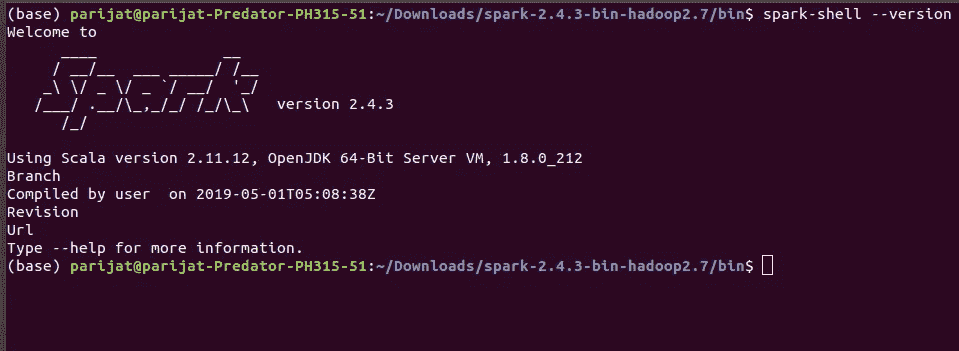

# 在 ubuntu 18.04 上安装 PySpark 和 JAVA 8

> 原文：<https://towardsdatascience.com/installing-pyspark-with-java-8-on-ubuntu-18-04-6a9dea915b5b?source=collection_archive---------3----------------------->


source: [https://bigdatapath.wordpress.com/2018/02/03/introduction-to-apache-spark/](https://bigdatapath.wordpress.com/2018/02/03/introduction-to-apache-spark/)

## 分布式机器学习的基本设置

经过几个小时的挣扎，我终于安装了 java 8，spark 并配置了所有的环境变量。我浏览了许多中型文章和 StackOverflow 答案，但没有一个特定的答案或帖子解决了我的问题。所以这只是我的一点小小的努力。

我的机器安装了 ubuntu 18.04，我使用的是 java 8 和 anaconda3。如果您按照步骤操作，您应该可以毫无问题地安装 PySpark。

1.  **确保你已经安装了 java。**

如果没有，请在终端中运行以下命令:

```
sudo apt install openjdk-8-jdk
```

安装后，如果您在终端中键入 **java -version** ，您将得到:

```
openjdk version "1.8.0_212"
OpenJDK Runtime Environment (build 1.8.0_212-8u212-b03-0ubuntu1.18.04.1-b03)
OpenJDK 64-Bit Server VM (build 25.212-b03, mixed mode)
```

**2。从** [**下载火花 https://spark.apache.org/downloads.html**](https://spark.apache.org/downloads.html?)

记住你下载的目录。我把它放在我的默认下载文件夹中，我将在那里安装 spark。

**3。设置 JAVA _ HOME 环境变量。**

为此，在终端中运行以下命令:

```
sudo vim /etc/environment
```

它将在 vim 中打开文件。然后，在 PATH 变量后的新行中添加

```
JAVA_HOME="/usr/lib/jvm/java-8-openjdk-amd64"
```

wq 型！然后退出。这将在文件中保存编辑。后来，在终端运行中

```
source /etc/environment
```

不要忘记在终端中运行最后一行，因为这将创建环境变量并将其加载到当前运行的 shell 中。现在，如果你跑

```
echo $JAVA_HOME
```

输出应该是:

```
/usr/lib/jvm/java-8-openjdk-amd64
```

就像加进去的一样。现在 ubuntu 的一些版本不在每次打开终端时运行`/etc/environment`文件，所以最好把它加入进来。bashrc 文件为。bashrc 文件在每次打开时都会加载到终端。因此，在终端中运行以下命令，

```
vim ~/.bashrc
```

文件打开。在末尾添加

```
source /etc/environment
```

稍后我们将在它下面添加 spark 变量。现在退出并加载。bashrc 文件，通过运行下面的命令。

```
source ~/.bashrc 
```

或者您可以退出此终端并创建另一个终端。现在，如果您运行 echo $JAVA_HOME，您应该会得到预期的输出。

**4。安装 spark。**

转到下载 spark zip 文件的目录，运行命令安装它:

```
cd Downloads
sudo tar -zxvf spark-2.4.3-bin-hadoop2.7.tgz
```

> 注意:如果您的 spark 文件是不同的版本，请相应地修改名称。

**5。为 spark 配置环境变量。**

```
vim ~/.bashrc
```

在末尾增加以下内容:

```
export SPARK_HOME=~/Downloads/spark-2.4.3-bin-hadoop2.7
export PATH=$PATH:$SPARK_HOME/bin
export PATH=$PATH:~/anaconda3/bin
export PYTHONPATH=$SPARK_HOME/python:$PYTHONPATH
export PYSPARK_DRIVER_PYTHON="jupyter"
export PYSPARK_DRIVER_PYTHON_OPTS="notebook"
export PYSPARK_PYTHON=python3
export PATH=$PATH:$JAVA_HOME/jre/bin
```

保存文件并退出。最后，加载。bashrc 文件在终端中再次被

```
source ~/.bashrc
```

现在运行:

```
pyspark
```

这将为您打开一个 jupyter 笔记本。我卸载并再次运行命令来安装 spark 和 java。最后，如果你做了:

```
cd $SPARK_HOME
cd bin 
spark-shell --version
```

你会看到这样的图像。



## 结论

我希望这篇文章能帮助你安装 spark。今天，Spark 已经成为分布式机器学习的一个非常重要的工具，它是任何数据科学家或机器学习工作的必备简历。设置 spark 可能是首先要做的事情，其次是学习 spark 数据框架，然后在任何项目中使用它。

## 接触

如果你热爱数据科学，让我们在 [linkedin](https://www.linkedin.com/in/parijatbhatt/) 上联系或者在这里关注我。如果你喜欢这个故事，请鼓掌欣赏。谢谢:)