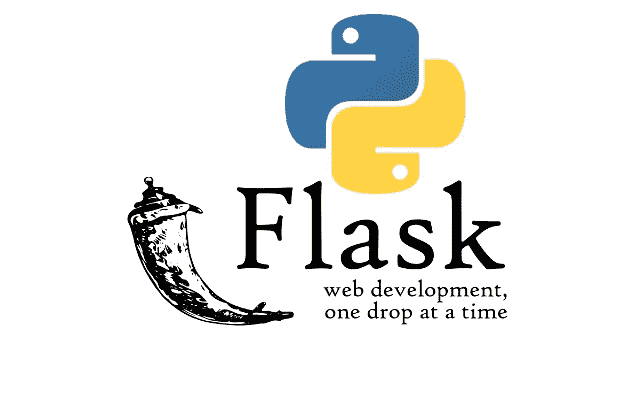
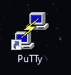
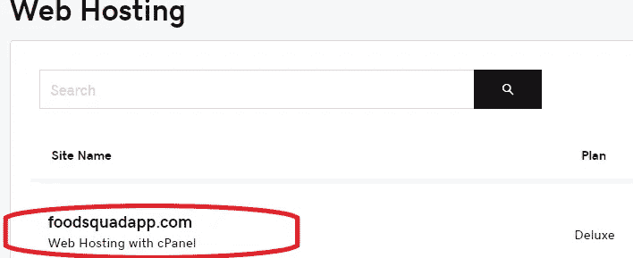
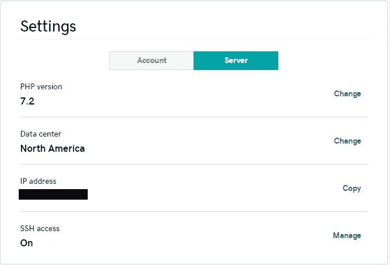

# 在 GoDaddy 上安装 Python 3 和 Flask

> 原文：<https://towardsdatascience.com/installing-python-3-and-flask-on-godaddy-1635fe6f24bc?source=collection_archive---------6----------------------->



这篇文章过时了。Flask 需要 Python 3.7 >，请到[这里](https://medium.com/@jordan.b.ireland/ebe764ab78a7)查看更新的指令。

**最近**我决定在我的 GoDaddy 主机上托管我的 Python 应用程序，并花了几个小时调试，因为在 Heroku/Apache 独立服务器之外的其他服务器上安装 Python 和 Flask 的文档很难获得。我想把它放在我的托管平台上的原因是因为 Heroku 和其他人不能支持我的 web 应用程序需求。它们受限于功率和内存限制。任何复杂的应用程序都应该通过自己的平台托管，因为这样会快得多。

**下面的 Github 文件可以在这里找到**[](https://github.com/Jordan-Ireland/articles/tree/master/Installing%20Python%20and%20Flask%20on%20GoDaddy)

****在接下来的**几周，我将更新这篇文章，为新用户提供每个主题的链接，并且随着新问题的出现，还将增加更多的故障诊断内容。**

## **目录:**

*   **[先决条件](#4a73)**
*   **[安装 Python](#64ec)**
*   **[安装砂箱](#0feb)**
*   **[设置你的烧瓶应用](#5fb2)**
*   **[启用 SSH](#3a5e)**
*   **[故障排除](#4eab)**

# ****先决条件****

**[ᴛᴏᴘ^](#99b2)**

**在开始之前，你需要下载一些东西或者做一些准备。**

****这些**指令已经在 GoDaddy Shared 和 GoDaddy Business hosting 上进行了测试。[](#91f8)**

## **您将需要:**

*   **一个 GoDaddy 托管帐户，至少有 1 个网站托管。**
*   **PuTTy 是一个免费的 SSH 控制台，用于连接 GoDaddy 服务器。这将用于安装 Python。**
*   **通过 GoDaddy 的 SSH 访问。([下面的说明](#3a5e))**
*   **稳定的互联网连接。如果互联网中断，安装将会停止，您必须卸载它并重新开始。我对这个有很多问题。**
*   **编程 IDE。我用 [PyCharm](https://www.jetbrains.com/pycharm/download/) 处理 Python/CGI，用 [Visual Studio](https://visualstudio.microsoft.com/free-developer-offers/) 处理 HTML、CSS 和 Javascript。**

# **安装 Python**

**[ᴛᴏᴘ^](#99b2)**

## *****登录 PuTTy(或其他 SSH 终端):*****

****一旦** PuTTy 安装完毕，就可以开始安装 Python 了。打开 PuTTy 控制台。**

****

**PuTTy Icon. Don’t open PuTTyGen**

**[](#4e13)**键入**您的主机名，这将是您在 GoDaddy 上启用 [SSH](#3a5e) 时的 IP 地址。这可以在`Server`子菜单下的主机设置中找到。您的端口几乎总是为`22`，但是请仔细检查以确保正确。这可以在 SSH 启用菜单中找到。点击打开，它将开始连接。**

****PuTTy** 将创建一个到 GoDaddy 服务器的安全连接；它会提示您输入用户名进入**主** FTP 账户。这将在您启用 SSH 的主机设置下找到。这将是一串字母字符和数字，都是小写字母。该密码将与用于登录 GoDaddy 的密码相同。**

****一旦**登录到 PuTTy，键入以下命令开始安装过程。**

```
**##** *Download Python 3.5.7 (latest version GoDaddy supports as of writing)* $ wget [https://www.python.org/ftp/python/3.5.7/Python-3.5.7.tgz](https://www.python.org/ftp/python/3.5.7/Python-3.5.7.tgz)**##** *Once wget is done downloading* $ tar xvzf Python-3.5.7.tgz**##** *Once tar is done decompressing*$ cd Python-3.5.7**##** *This should take you to the main Python Directory*$ ./configure --prefix=$HOME/.local**##** This step sets up your configuration and makes files**$** make
**$** make install**##** *This will create the Python files and folders, but will take a long time. The last command will install* pip *and* setuptools *which will be used to install any package you want*
```

****上面的**步骤将下载并安装 Python、pip 和设置工具。如果有任何错误，请参见下面的故障排除部分。(这将随着更多错误的发现而更新)**

****接下来的**需要完成 Python 的安装并确保环境变量已经设置好。**

```
**$** cd $home
**$** vi .bash_profile**##** Press enter and change the file to equal this EXACTLYPATH=$HOME/.local/bin:$PATH
export PATH**##** Once done, Type :wq and press enter. This will save your file and close it**$** python3 -V
**>>** Python 3.5.7
```

****那里**你去吧！如果你只是想在 GoDaddy 上安装 Python3，你可以就此打住！如果你想在 GoDaddy 上部署 Flask 或 Heroku 应用，请继续这篇文章。**

# **安装烧瓶**

**[ᴛᴏᴘ^](#99b2)**

***注意:如果你使用的是子域，确保子域文件夹在 public_html 里面，除了你需要添加* `*subdomain_name/*` *到这些指令之外，这些指令都是一样的。***

```
**##** Install Virtual Environment Package
**$** python3 -m pip install virtualenv**##** Navigate to your CGI-BIN folder inside public_html
**$** cd $home
**$** cd public_html/cgi-bin**##** Create Virtual Environment. 'venv' can be named whatever you want, but just change the other code accordingly.
$ virtualenv venv**##** Activate the virtual environment
**$** source venv/bin/activate
**$** pip install Flask
**$** deactivate
```

****Flask** 现已安装，可在接下来的步骤中用于设置 Flask 应用程序以在 GoDaddy 主机上运行。**

****你**也可以安装任何需要的包，就像本地机器上面的步骤一样。安装前一定要用`source venv/bin/activate`激活虚拟环境，否则无法工作。**

# **设置您的 Flask 应用程序**

**[ᴛᴏᴘ^](#99b2)**

****为了发布 GoDaddy 托管的应用程序，您需要将其转换为 GoDaddy 可以使用的东西。为此，我们将不得不使用一个名为`wsgiref`的包。不需要下载任何东西，因为这个包从 2.7 开始就包含在 Python 中了。****

**一旦你完成这些说明，这个就是你最终的文件夹结构。(你可以从我的 Github 复制/粘贴源代码，但在修改任何选项之前，请确保你完全理解)。静态文件夹是可选的，它允许你在你的 Flask 应用中使用 CSS 和 Javascript，但是那是另外一篇文章。**

```
public_html/
├── .htaccess
└── cgi-bin/
    ├── app.cgi
    ├── app.py
    ├── templates/
    │   └── home.html
    └── venv/
```

****将**在`cgi-bin`中新建一个文件，命名为`app.cgi`。以下代码应该放在该文件中，并根据您的网站设置进行更改。[](#e9f0)**

**用户名将与您登录 PuTTy 或其他 SSH 终端时的用户名相同。**

```
#!/home/USERNAME/.local/bin/python3
import os
import syssys.path.insert(0,
                '/home/USERNAME/public_html/cgi-bin/venv/lib/python3.5/site-packages')from wsgiref.handlers import CGIHandlerfrom app import appclass ProxyFix(object):
    def __init__(self, app):
        self.app = app

    def __call__(self, environ, start_response):
        environ['SERVER_NAME'] = ""
        environ['SERVER_PORT'] = "80"
        environ['REQUEST_METHOD'] = "GET"
        environ['SCRIPT_NAME'] = ""
        environ['QUERY_STRING'] = ""
        environ['SERVER_PROTOCOL'] = "HTTP/1.1"
        return self.app(environ, start_response)if __name__ == '__main__':
    app.wsgi_app = ProxyFix(app.wsgi_app)
    CGIHandler().run(app)app.wsgi_app = ProxyFix(app.wsgi_app)
CGIHandler.run(app)
```

**让我们稍微分解一下代码。第一行是被称为`shebang`的，它告诉程序使用什么 shell。在本例中，我们正在运行 python，因此我们需要将它指向 python shell，它位于`/local`文件夹中。**

**接下来你导入你的应用，就像一个普通的 __init__。py 文件。`class ProxyFix`初始化应用程序，并确保设置正确的环境变量。您可以根据需要更改和删除环境变量，但是这些应该适用于大多数项目。需要改变的主要是`'QUERY_STRING' & 'REQUEST_METHOD'`。如果设置了这些，对 Flask 应用程序的所有调用都将是 GET 请求，查询字符串将是`NONE`。**

****在`cgi-bin`中创建**另一个名为`app.py`的新文件，并键入以下代码。这段代码设置了一个测试应用程序，所以 Flask 有一些东西要显示。**

```
from flask import Flask, render_templateapp = Flask(__name__)@app.route('/')
def home():
    return render_template('home.html')
```

****在**内`cgi-bin`创建一个名为`templates`的文件夹，并在该文件夹内创建一个名为`home.html`的文件**

```
<!DOCTYPE html>
<html>
    <head>
        <title>Home</title>
    </head>
    <body>
        <h2>It Works! Congrats!</h2>
    </body>
</html>
```

****在**主`public_html`文件夹中插入一个名为`.htaccess`的文件。下面的代码将所有传入的请求指向你的 app.cgi 文件，并确保唯一运行的是你的 Flask 应用。将用户名更改为您用于 SSH 终端的主 FTP 帐户。**

```
Options +ExecCGI 
AddHandler cgi-script .py
RewriteEngine On
RewriteCond %{REQUEST_FILENAME} !-f 
RewriteRule ^(.*)$ /home/USERNAME/public_html/python/cgi-bin/app.cgi/$1 [L]
```

**我在这里会完全诚实，我不是这方面的专家。htaccess 文件，但我能够得到这个工作与一些摆弄左右。确保你完全复制粘贴了这个。如果差了一个空格或一个字母，就不行了。**

****那里**你去吧！一旦这些都上传完成，输入你的网址并祈祷吧！您可以开始扩展并确保导入所有需要的包。您最有可能创建一个脚本来检查安装并为您安装它们，但这不是本文的内容。**

****最重要的是，你的应用程序不会打印或输出任何非 HTML 格式的内容。这是在任何平台上发布任何 Flask 应用程序的一个缺点。****

****【GoDaddy 内的所有 Python 和 CGI 文件必须将权限设置为 755。请确保在尝试打开 URL 之前进行检查。****

# ******如何启用 SSH******

****[ᴛᴏᴘ^](#99b2)****

*   ****登录 [GoDaddy 主机](https://myh.godaddy.com/#/hosting/all)****
*   ****单击您托管的网站:****

********

*   ****在右边，点击`Settings`菜单下的`Server`按钮****
*   ****点击`SSH Access`旁边的`Manage`。****
*   ****从那里你所要做的就是将开关拨到`On`****

********

****注意:记住你的端口号(22)、用户名和 IP 地址。这将位于帐户选项卡下的设置菜单中，但我们将在 Python 安装期间使用它们。****

******注 cPanel 密码是您登录 GoDaddy 使用的密码。******

# ****解决纷争****

****[ᴛᴏᴘ^](#99b2)****

****尝试通过 URL 打开 flask 应用程序时，我收到错误 500。****

*   ****检查 GoDaddy cPanel 中的错误日志。它会让你很好地了解正在发生的事情。最常见的情况是没有安装软件包，或者 Python 安装失败而没有抛出错误。****
*   ****或者，确保您的应用程序根本不打印或试图访问控制台，这将使应用程序崩溃。****
*   ****环境变量也可能不正确。最常见的是 SERVER_NAME 和 SERVER PORT，它们必须与上面脚本中的完全相同。****

******Python 安装失败。是在** `**make**` **或者** `**make install**` **期间抛出错误。******

*   ****最有可能的是，由于`ctypes`的错误，安装失败。这些都包含在 Python 2.7 中，但是 GoDaddy 没有将它们安装到他们的 Python 版本中。尝试下载旧版本或新版本的 Python。烧瓶兼容 2.7。*及以上，不包括 3.0。*–3.4.*****
*   ****确保您对尝试安装 Python 的文件夹具有读/写权限。****

****尝试打开应用程序时，我收到一个 404 错误。****

*   ****检查你的。htaccess 文件，并确保它和我的完全一样。****
*   ****请确保@app.route 具有有效的端点，即:/home，/，/index****

*****这些尚未通过 GoDaddy 或 Windows 主机在 VPS 主机上进行测试。据我所知，GoDaddy Windows 不支持 Python。*****

*****这段代码摘自 GoDaddy 的博客文章* [*此处*](https://www.godaddy.com/garage/how-to-install-and-configure-python-on-a-hosted-server/) *，已经修改为与 Flask 一起工作，并添加了一些自定义代码。*****

*****感谢 Flask 文档为用户提供了一个起点。* [*文档链接*](https://flask.palletsprojects.com/en/1.1.x/deploying/mod_wsgi/)****