# 在 Windows 10 上安装支持 CUDA、cuDNN 和 GPU 的 Tensorflow

> 原文：<https://towardsdatascience.com/installing-tensorflow-with-cuda-cudnn-and-gpu-support-on-windows-10-60693e46e781?source=collection_archive---------0----------------------->

在本系列的第 1 部分中，我讨论了如何升级您的 PC 硬件，以集成 CUDA Toolkit 兼容的图形处理卡，例如 Nvidia GPU。第 2 部分介绍了在 Windows 10 上安装 CUDA、cuDNN 和 Tensorflow。下面这篇文章假设你已经在你的电脑上安装了一个兼容 CUDA 的 GPU 但是如果你还没有准备好，本系列的[第 1 部分](/pimp-up-your-pc-for-machine-learning-d11f68c2815)将帮助你设置硬件，为这些步骤做好准备。

# 第一步:检查你需要安装的软件

假设您的电脑上已经安装了 Windows，您将在这些步骤中安装的其他软件包括:-

*   Microsoft Visual Studio
*   NVIDIA CUDA 工具包
*   NVIDIA cuDNN
*   计算机编程语言
*   Tensorflow(有 GPU 支持)

# 步骤 2:下载 Visual Studio 速成版

## Visual Studio 是 CUDA 工具包的先决条件

安装 Nvidia CUDA Toolkit 需要 Visual studio(这个先决条件这里指的是)。如果您试图在没有安装 Visual Studio 的情况下下载并安装 CUDA Toolkit for Windows，您会得到如图 1 所示的消息。

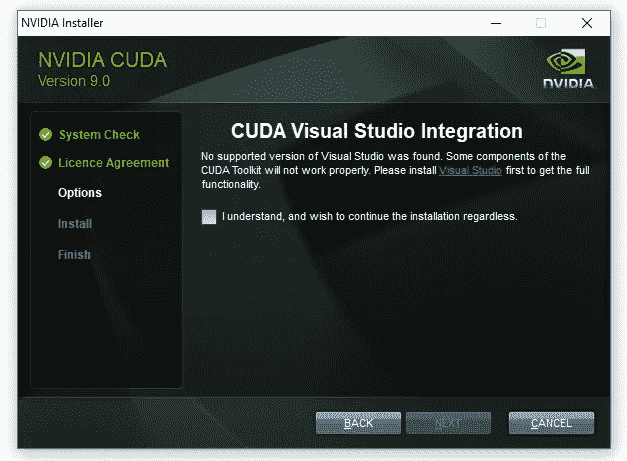

Fig 1: Message when attempting to install CUDA Toolkit without Visual Studio

## 选择和下载 Visual Studio 速成版

在撰写本文时，Visual Studio 的最新版本(免费)是 Visual Studio Express Community Version 2017，如图 2 所示。加入“[Visual Studio Dev Essentials](https://visualstudio.microsoft.com/dev-essentials/#software)”，然后搜索想要的 Visual Studio 版本，就可以免费获得 Visual Studio 以前的版本。

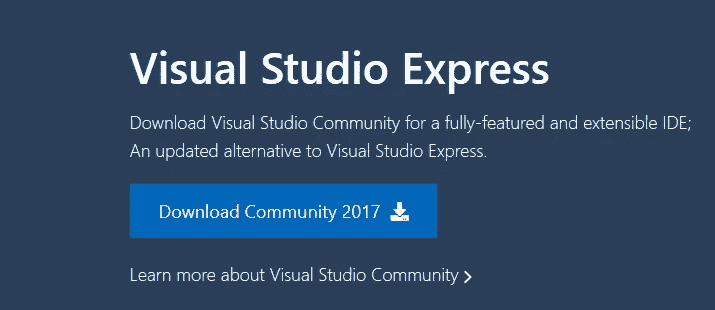

Fig 2: Visual Studio Community 2017 (free)

## 安装 Visual Studio 速成版

一旦您下载了 Visual Studio 速成版，它的安装就很简单了。图 3 显示了下载的可执行文件。

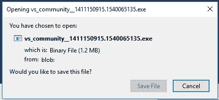

Fig 3: The Visual Studio Community executable file

当你按下图 3 中的“保存文件”选项时，图 4 中的窗口将会出现，你可以在这里设置安装选项(或者像我一样，让它们保持默认设置)。

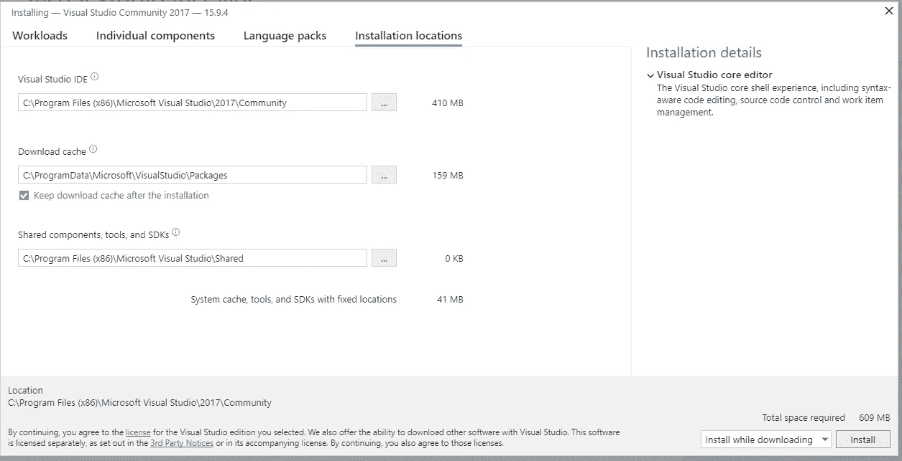

Fig 4: installation window for Visual Studio Community 2017

在安装过程中，Visual Studio 会提示您是否'*希望在没有工作负荷*的情况下继续。我在这里按了“继续”,因为我根本不想使用工作负载。

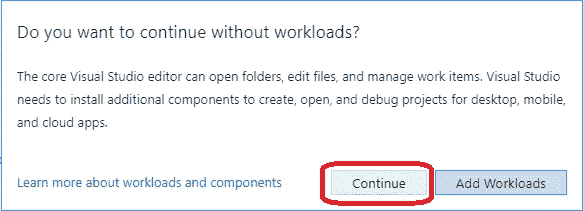

Fig 5: I didn’t add workloads on prompting by Visual Studio

**安装 Visual Studio 后，可能需要重新启动电脑** d

安装 Visual Studio 后，我开始直接下载并尝试安装 CUDA Toolkit for Windows——这一步是我将在下面描述的第 3 步。我得到消息说 *Visual Studio 仍在运行，并阻止 CUDA 工具包*的安装。在尝试再次安装 CUDA Toolkit 之前重启我的电脑解决了这个问题。

# 第三步:下载适用于 Windows 10 的 CUDA 工具包

这些 CUDA 安装步骤大致基于[Nvidia CUDA windows 安装指南](https://docs.nvidia.com/cuda/cuda-installation-guide-microsoft-windows/index.html)。CUDA 工具包(免费)可以从 Nvidia 网站[这里](http://developer.nvidia.com/cuda-downloads)下载。

在撰写本文时，所提供的 CUDA 工具包的默认版本是 10.0 版，如图 6 所示。但是，你应该检查你选择下载和安装哪个版本的 CUDA 工具包，以确保与 Tensorflow 的兼容性(期待本流程的**步骤 7** )。当你进入 [Tensorflow 网站](https://www.tensorflow.org/install/gpu)时，可用的 Tensorflow 最新版本(1.12.0)需要 **CUDA 9.0** ，而不是 CUDA 10.0。要找到 CUDA 9.0，您需要导航到图 6 右下角的“Legacy Releases”。

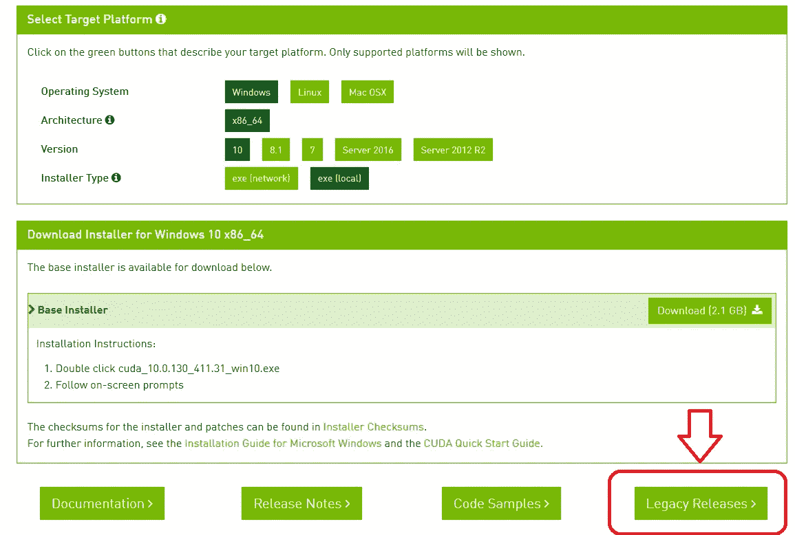

Fig 6: The default (most recent) version of CUDA for Windows is cuda_10.0.130_411.31_win10.exe. For CUDA 9.0, choose “Legacy Releases”

**步骤 3.1:从 CUDA 工具包档案下载 CUDA 9.0**

选择“遗留版本”会将您带到 CUDA 工具包归档。根据 [Tensorflow 安装](https://www.tensorflow.org/install/gpu)指南，所需的 CUDA 版本为 9.0，如图 7 所示。

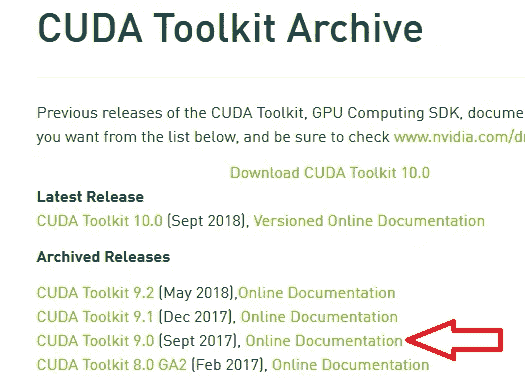

Fig 7: List of archived CUDA releases still available for download — CUDA Toolkit 9.0 (Sept 2017)

**步骤 3.2:安装 CUDA 9.0**

CUDA 9.0 以基础安装和四个补丁的形式提供；必须首先安装 CUDA 9.0 的基础安装，然后安装补丁。我选择的基本安装选项如图 8 所示。

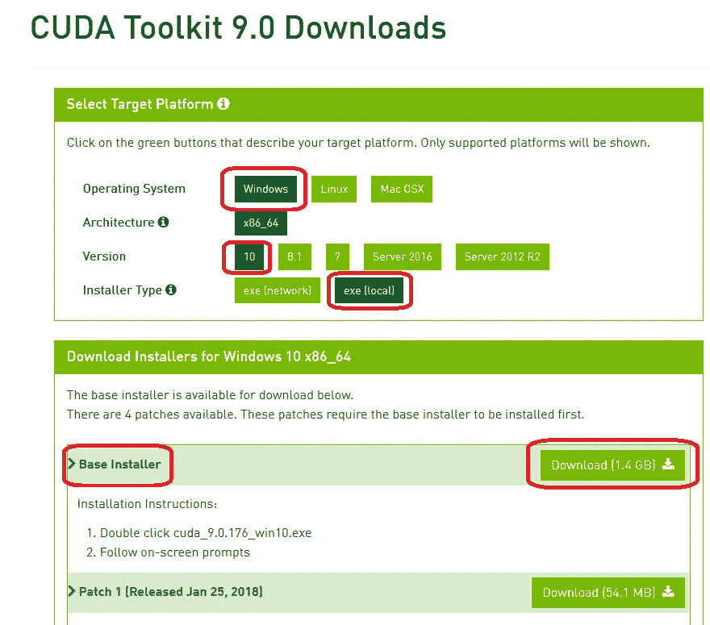

Fig 8: Options chosen for the base installation of CUDA 9.0 for Windows base installer

运行刚刚下载的基础安装程序将产生 CUDA 安装包窗口，如图 9 所示。

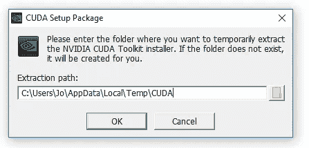

Fig 9: CUDA Setup Package for CUDA base installer

CUDA 安装程序解压到您的电脑上，完成后，NVIDIA CUDA Toolkit 安装将开始；你会收到一条大意如此的信息。整个安装过程中产生的 NVIDIA 安装程序窗口如图 10-图 13 所示。我选择了快速安装选项(图 10)。

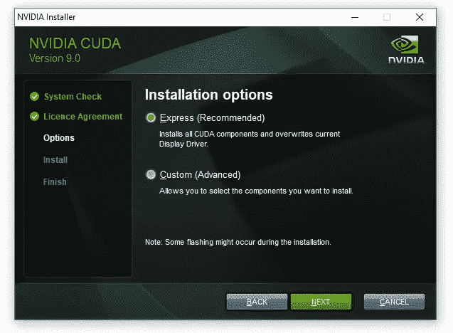

Fig 10: Installation options for CUDA 9.0 base installer — I chose the Express option

图 11 提供了选择安装位置的机会；我选择了所提供的默认位置，对于 CUDA 来说是:

```
C:\Program Files\NVIDA GPU Computing Toolkit\CUDA\v9.0
```

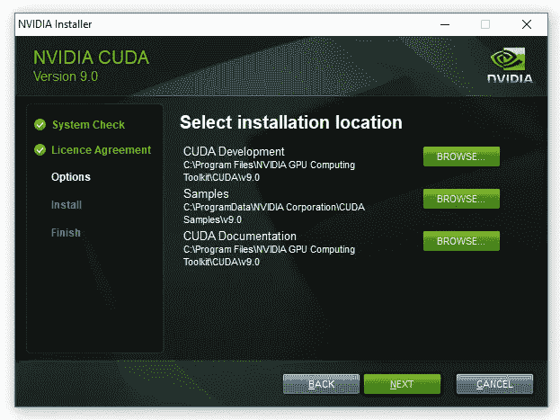

Fig 11 : CUDA 9.0 base installation — selecting CUDA installation location

下面的图 12 显示了依赖于 Visual studio 的 CUDA 安装，先前在**步骤 1** 中安装。

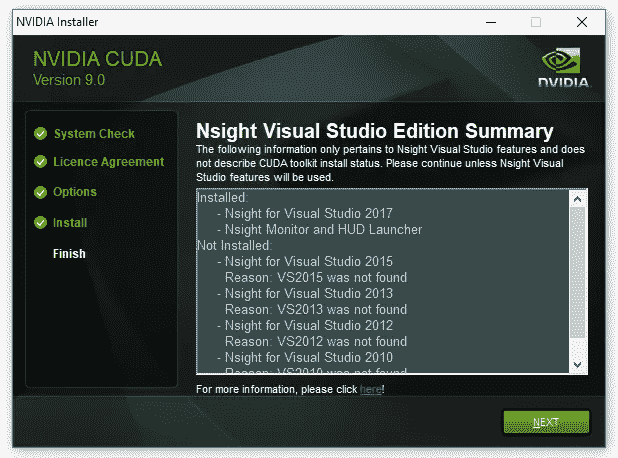

Fig 12: CUDA 9.0 base installation process — window showing installations relying on Visual Studio

在上面图 12 所示的窗口中按下“下一步”,出现最后的安装窗口，如下图 13 所示，其中 NVIDIA 安装程序被标记为完成。

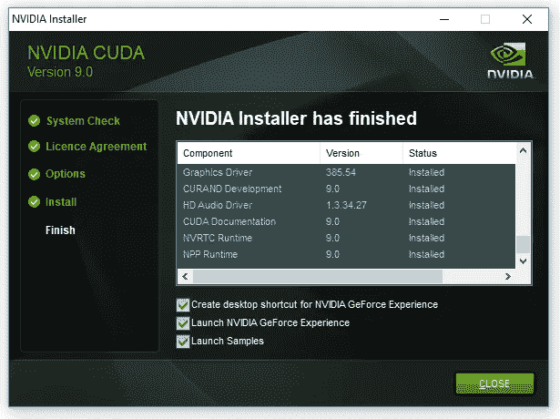

Fig 13: Final installation window for CUDA 9.0 base installer

# 第四步:下载 Windows 10 CUDA 补丁

在撰写本文时，有四个 CUDA 补丁需要获取(以及基础安装程序)，所以让我们去下载这些补丁吧。它们如图 14 所示

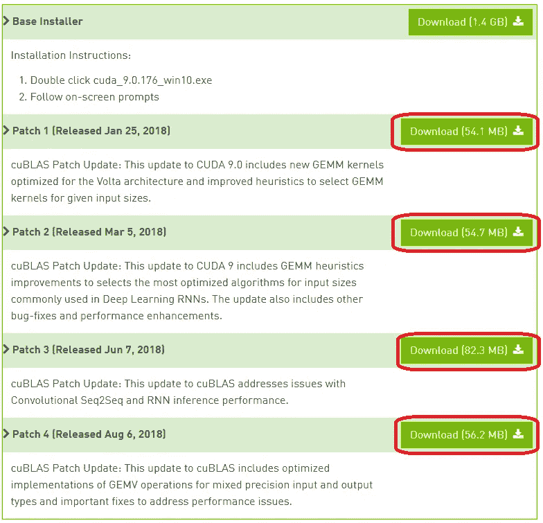

Fig 14: Downloading and installing the additional four patches for CUDA 9.0

下载这四个修补程序后，它们可以按照与基本安装程序相同的方式进行安装，安装窗口会在整个过程中提供指导。

# 第 5 步:下载并安装 cuDNN

安装了 CUDA 9.0 基础安装程序及其四个补丁后，下一步是找到 CuDNN 的兼容版本。根据 Tensorflow 网站上的信息，具有 GPU 支持的 Tensorflow 要求 cuDNN 版本至少为[7.2](https://www.tensorflow.org/install/gpu)。

**步骤 5.1:下载 cuDNN**

为了[下载 CuDNN](https://developer.nvidia.com/cudnn) ，你必须注册成为 NVIDIA 开发者计划的成员(这是免费的)。


Fig 15: Creating a free membership account in order to download cuDNN

当您创建一个帐户，登录并填写一些关于您为什么使用该帐户的其他必需的细节时，您会得到如图 16 所示的下载页面。

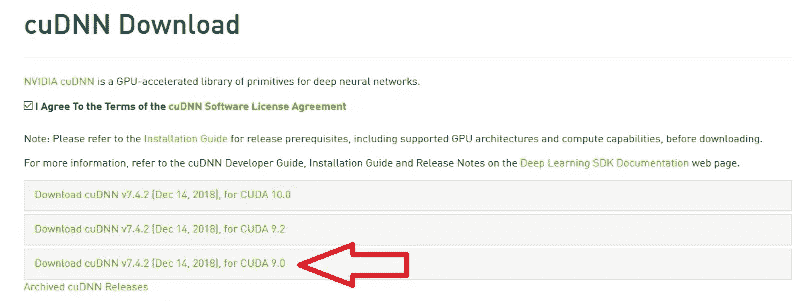

Fig 16: cuDNN download page with selection of cuDNN v.7.4

由于我下载的是 CUDA 9.0，cuDNN 对应的版本是 7.4.2 版。选择 cud nn 7 . 4 . 2 版可下载如下名称的 zip 文件:

```
cudnn-9.0-windows10-x64-v7.zip 
```

**步骤 5.2:解压 cuDNN 文件并复制到 CUDA 文件夹**

Nvidia 的说明[提供了对 windows cuDNN 安装的支持，Tensorflow 网站上的说明也是如此；基于我对这些指令的实现，我以提炼的形式复制了这些指令。就我而言，我下载了 cuDNN。将上面命名的 zip 文件压缩到一个文件夹中，该文件夹在我的 PC 上有以下路径(您的路径无疑会不同)。](https://docs.nvidia.com/deeplearning/sdk/cudnn-install/index.html#install-windows)

```
C:\Users\jo\Documents\cuDNN_downloads\
```

在下面的说明中，我将文件夹路径“*C:\ Users \ jo \ Documents \ cud nn _ downloads \*”(上面提到的)称为“ *< downloadpath >* ”，这样，zip 文件现在位于以下路径中:

```
<downloadpath>\cudnn-9.0-windows10-x64-v7.5.0.56.zip
```

我拉开了拉链。zip”文件，因此包含所需 cuDNN 文件的解压缩文件夹结构现在是:-

```
<downloadpath>\cudnn-9.0-windows10-x64-v7.5.0.56\
```

解压缩后的 cuDNN 文件夹子目录中有三个文件，它们将被复制到 CUDA Toolkit 目录中。它们是 cudnn64_7.dll、cudnn.h 和:

**1。cudnn64_7.dll**

cudnn64_7.dll 可以在下载的 cudnn 文件的以下路径中找到:

```
<downloadpath>\cudnn-9.0-windows10-x64-v7.5.0.56\cuda\bin\cudnn64_7.dll
```

假设您将 CUDA 9.0 安装到了它的默认路径(正如我在**步骤 2.3** 中所做的)，即下面的默认路径:

```
C:\Program Files\NVIDA GPU Computing Toolkit\CUDA\v9.0
```

可以将 *cudnn64_7.dll* 文件直接复制到 CUDA 文件夹的 *bin* 文件夹路径中(注意:不需要新建任何子文件夹):

```
C:\Program Files\NVIDIA GPU Computing Toolkit\CUDA\v9.0\bin\
```

**2。cudnn.h**

和上面的 cudnn64_7.dll 文件一样，下载并解压 cudnn 文件夹后，可以在路径中找到头文件 *cudnn64.h* :

```
<downloadpath>\cudnn-9.0-windows10-x64-v7.5.0.56\cuda\ include\cudnn.h
```

同样，假设您像我在**步骤 2.3** 中一样将 CUDA 9.0 安装到默认路径中，将 *cudnn.h* 直接复制到 CUDA 文件夹中，路径如下(不需要新建子文件夹):

```
C:\Program Files\NVIDIA GPU Computing Toolkit\CUDA\v9.0\include\
```

**3。cudnn.lib**

的。lib 文件 *cudnn.lib* 可以在下载的 cudnn 路径中找到:

```
<downloadpath>\cudnn-9.0-windows10-x64-v7.5.0.56\cuda\lib\x64\cudnn.lib
```

将 cudnn.lib 直接复制到 CUDA 文件夹中，路径如下:

```
C:\Program Files\NVIDIA GPU Computing Toolkit\CUDA\v9.0\lib\x64\
```

**步骤 5.3:检查在 Windows 中设置了 CUDA 环境变量**

最后，Nvidia 的[指令指示您确保 CUDA 环境变量已经预先设置好，如下所示:](https://docs.nvidia.com/deeplearning/sdk/cudnn-install/index.html#install-windows)

```
Variable Name: CUDA_PATH 
Variable Value: C:\Program Files\NVIDIA GPU Computing Toolkit\CUDA\v9.0
```

在 Windows 10 中，可以通过选择以下选项找到环境变量:

*控制面板*->-*系统和安全*->-*系统*->-*高级系统设置*。

这将打开一个名为“系统属性”的窗口(图 17)，此时应该选择“环境变量”按钮。

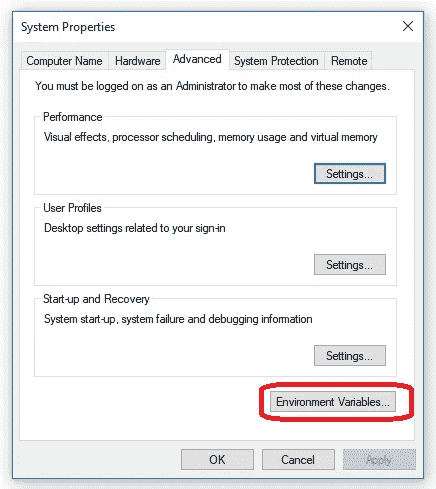

Fig 17: Environment Variables button (in System Properties window) for setting and checking CUDA paths

当环境变量窗口出现时，在“系统变量”中(在窗口的下半部分)，点击“路径”并选择按钮“编辑”。将出现一个新窗口，名为“编辑环境变量”，如下图 18 所示。

在检查环境变量时，我发现确定 CUDA 安装路径的安装过程— **步骤 3.2** ，见图 11——已经向 CUDA 添加了两条路径。这些路径如下面的图 18 所示，所以我发现我不需要再添加一个 CUDA 路径。

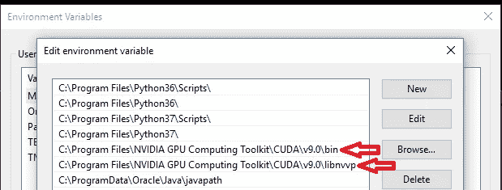

Fig 18: Default paths previously created during CUDA 9.0 installation process

# 步骤 6:安装 Python(如果你还没有的话)

既然已经安装了 CUDA 和 cuDNN，是时候安装 Python 了，以便稍后安装 Tensorflow。在撰写本文时，Python 3 可用的最新版本是 Python 3.7，但 Tensorflow 所需的 [Python 3 版本是 3.4、3.5 或 3.6](https://www.tensorflow.org/install/pip) 。Python 3.6 可以从[这里](https://www.python.org/downloads/)为 Windows 10 下载。当您运行 Python installer for windows 时，将出现图 19 中的设置窗口。

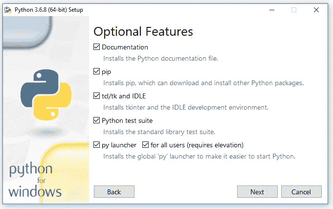

Fig 19: Python 3.6 installation screen; I choose all the optional features on this screen (pip and IDLE are both used in subsequent steps)

在 Python 安装期间，我选择了上面图 19 中的所有选项。这些选项很有用:Python 的“pip”安装程序在本指南的**步骤 7.2** 中用于安装 Tensorflow。此外，我在**步骤 8** 使用了名为“IDLE”的 IDE(用于编写和运行 python 代码的集成开发环境)。

在“高级选项”中(如下图 20 所示)，我为所有用户选择了 Python 的安装(默认情况下没有勾选)；这提供了更有用的系统范围的安装。

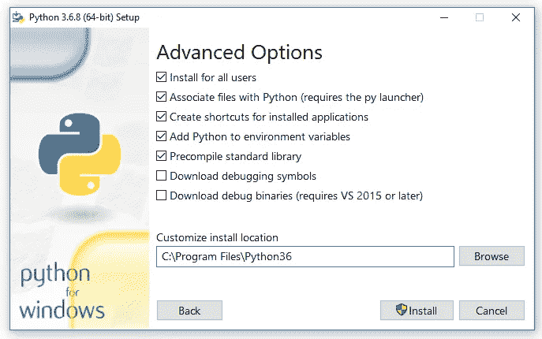

Fig 20: Advanced options available when installing Python 3.6

# 步骤 7:安装带 GPU 支持的 Tensorflow

Tensorflow [提供指令](https://www.tensorflow.org/install/gpu)来检查 CUDA、cuDNN 和(可选:CUPTI)安装目录是否被正确添加到 PATH 环境变量中。由于三个 cuDNN 文件被复制到 CUDA 的子文件夹中，所以我没有更新现有的 CUDA 环境变量路径。

**步骤 7.1:使用管理权限调用命令提示符**

在此步骤中，将执行 Tensorflow 的系统范围安装，而不是每个用户的安装。Tensorflow 的系统范围安装需要管理权限，因此，相应地，命令提示符应该以管理权限运行。

通过在搜索栏中运行' *cmd* '打开命令提示符，然后右键单击命令提示符选择'以管理员身份运行'。这将打开 Administrator:命令提示符，如图 21 所示。

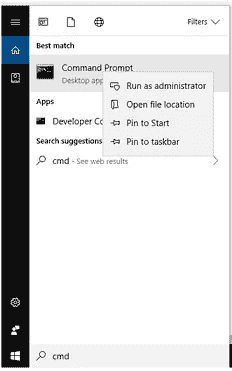

Fig 21: Running the command prompt as administrator from the Windows 10 search bar

**步骤 7.2:通过 python pip 在系统范围内安装 tensor flow**

打开命令提示符后，带 GPU 支持的 Tensorflow 的系统范围安装命令如下:

```
pip3 install --upgrade tensorflow-gpu
```

“pip3”命令(相对于“pip”)是必需的，因为安装到 Python 3。在命令提示符下执行该命令如图 22 所示。

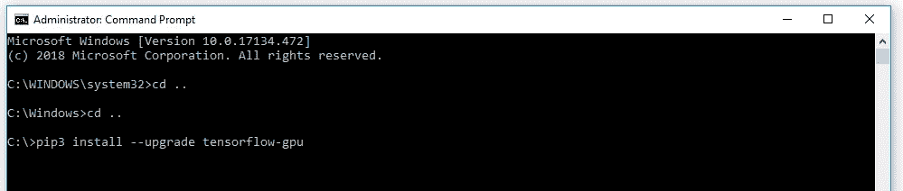

Fig 22: Pip install command for Tensorflow with GPU support

该命令的输出如图 23 所示，如果一切按计划进行，最终应该会有一条消息确认 Tensorflow 已经成功安装。

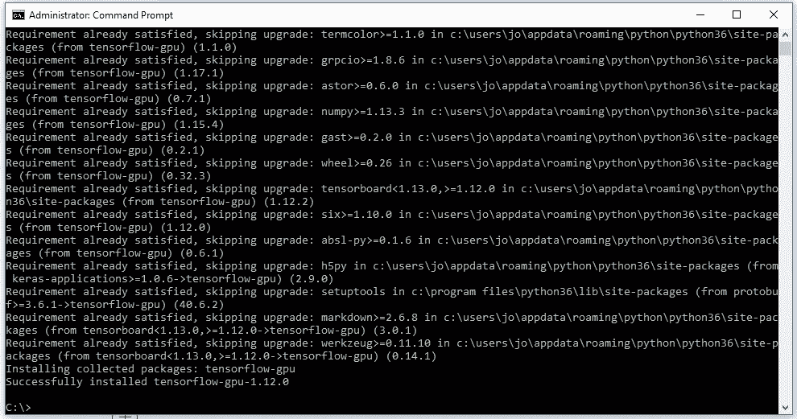

Fig 23: Command prompt messages shown when Tensorflow GPU 1.12.0 installed successfully.

# 步骤 8:测试 TensorFlow 的安装及其对 GPU 的访问

进入 windows 中的开始菜单，搜索名为“idle”的 IDE，如果你像我在**步骤 6** 中所做的那样选择，它将作为 python 安装的一部分进行安装。一个 Python 窗口应该显示为***Python 3.6 . x Shell***。在提示符下(用'> > >')导入 Tensorflow 包。这将检查 Tensorflow 是否已安装(因为您可以导入它)。空闲 shell 导入 tensorflow 包的命令如下:

```
# importing the tensorflow package
import tensorflow as tf 
```

要测试您的 Tensorflow 安装对 CUDA 的支持，您可以在 shell 中运行以下命令:

```
tf.test.is_built_with_cuda()
```

最后，为了确认 GPU 对 Tensorflow 可用，您可以使用 TensorFlow 中的内置实用函数进行测试，如下图[所示](https://www.tensorflow.org/api_docs/python/tf/test/is_gpu_available):

```
tf.test.is_gpu_available(cuda_only=False, min_cuda_compute_capability=None)
```

从这里返回一个结果需要几分钟；完成后返回 ***真*** ，然后提示` **> > >** '再次出现。导入 tensorflow 和这些测试都显示在 Python IDLE Shell 的图 24 中。

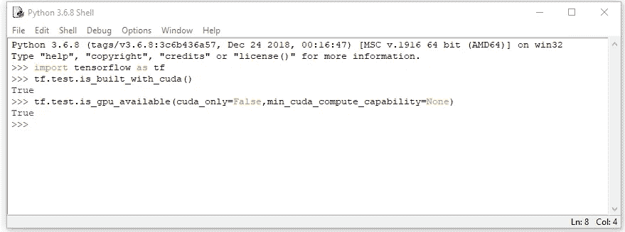

Fig 24: Using the IDLE python IDE to check that Tensorflow has been built with CUDA and that the GPU is available

# 结论

这是我安装 Visual Studio、CUDA Toolkit、CuDNN 和 Python 3.6 的步骤，最终目的是在 Windows 10 上安装支持 GPU 的 Tensorflow。迄今为止，我基于 GPU 的机器学习和深度学习工作一直在 Linux Ubuntu 机器上进行；出于同样的原因，很多机器学习社区的在线支持都集中在 Ubuntu 上。

对于机器学习来说，使用 Windows 的主要缺点是，与在 Linux 上相比，需要从源代码中构建更多的东西(例如使用 [Cmake](https://cmake.org/) )，并且还需要为构建过程安装额外的软件，例如 Visual Studio。例如，如果您要在 Windows 上安装 Caffe2 ,则没有预构建的二进制文件，Windows build 处于测试和 beta 模式。我在 Windows 10 上安装 CUDA 和 cuDNN 更多的是出于好奇，只是想看看它有多简单(或其他)。

正如我在[第一部分](/pimp-up-your-pc-for-machine-learning-d11f68c2815)中所暗示的，现在 CUDA、cuDNN 和 Tensorflow 已经成功安装在 Windows 10 上，并且我已经检查了 Tensorflow 对 GPU 的访问，我将清除整个 Windows 10 操作系统，以便全新安装 Ubuntu 18.04 LTS。这个新的 Ubuntu 安装将在本系列的第 3 部分中讨论。

这篇文章也在 https://schoolforengineering.com 的[这里](https://schoolforengineering.com/tutorial/install-tensorflow-cuda-gpu-windows-10/)发表过。