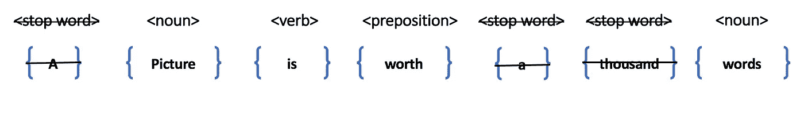

# 实例选择:数据采样背后的神话

> 原文：<https://towardsdatascience.com/instance-selection-the-myth-behind-data-sampling-d3556ea2e37d?source=collection_archive---------23----------------------->

任何大数据系统中最常见和最具挑战性的问题之一是选择分层样本，使其能够代表整个数据群体的特征。从数据注释到评估数据集的选择，数据采样是每个数据科学解决方案成功的关键。高效采样也是一个关键要求，因为它假设在这个采样集上训练的机器学习模型和生成的洞察对更广泛的集合适用。

> **实例选择的概念是通过保持基本分布不变从总体中选择一个子集，以便采样数据能够代表整个数据总体的特征。**

让我们假设您有大约 100 亿个未标记的数据点。要解决你遇到的这类问题，可能需要一种监督的方法。现在的问题是*如何注释所有这些数据点？*除非你想出一种方法来自动化注释过程，否则在许多人类专家的帮助下，这将花费大量的时间。即使我们设法拥有所有数据的标签，由于资源限制，在非常大量的数据上训练机器学习模型有时也是不可行的，并且可能消耗非常大量的时间来训练，这也导致不可行的状态。同时，大量的数据可能彼此相似。因此在图案中引入了冗余。这种冗余数据在模型的学习过程中帮助不大。我们可以通过仔细分析数据集中存在的所有维度来大幅缩减数据集，从而减少训练时间并提高性能。

实际上，处理这种情况的方法是计算在可用时间和可用资源内可以注释的数据量，并从总体中选择许多样本，使样本遵循总体数据的相同基本分布。有两种方法可以实现这一目标:

1.  定量取样
2.  数据驱动采样[实例选择]

2 训练机器学习模型的主要目的是学习多个类别/聚类之间的决策边界，或者学习输入数据分布。从统计学上来说，对于这些情况，只要群体和采样数据之间的基础数据分布不变，学习将是相似的。

1.  **定量抽样:**这种抽样技术需要大量的领域知识和对数据的深入理解。该策略根据数据类型而不同，无论是文本数据、图像数据、音频数据还是视频数据等。

一、**唯一性:**采样的第一步是找出唯一的数据点。独特性可以用几种方式来定义。在文本数据的情况下，如果两个文档具有相同顺序的完全相同的单词集，则它们可以被认为是重复的，或者在图像数据的情况下，如果两个图像数据(相同大小)之间的欧几里德距离小于ε，则这些可以被认为是重复的。找出所有重复的数据点，其中只有一个将代表其他重复的数据点。

二。**模式:**这一步非常棘手，需要领域知识。大多数情况下，我们需要手动或通过半自动过程从数据中识别一组模式/结构。如果我们有一个时间序列数据，也许一个模式是周期性的。也许我们能发现一种模式每个月都在重复。然后，我们需要选择分布在一年中每个月的候选数据，但对个别月份的数据进行缩减采样。

对于文本数据，在删除停用词后，我们可以用相应的“词性”替换每个词，如下所示:

POS tag of text document

可以将词性标签序列视为给定文本的结构，并基于词性标签序列进行数据的重复数据删除。但是我们需要确保在样本空间中维护词汇。

**2。数据驱动采样:**实例选择首先从所有重要维度的数据采样开始。进行数据驱动采样的方法之一是首先以监督或非监督的方式学习数据的分布式嵌入表示，然后遵循候选选择的贪婪算法，其思想是选择一个数据点作为位于 delta-ball 距离内的所有其他数据点的代表。如下图所示，每个浅绿色或浅红色圆圈是一个半径为δ的球体，仅从球体中选择一个数据点作为球体的代表。关于 delta 的选择有不同的研究。可以在质心和边界区域周围选择较小的增量，而在其他区域选择相对较大的增量值。增量越大，表示越稀疏。对δ的这种选择将确保质心和边界区域中的密集群体，而导致中间区域周围的稀疏群体。

Visualization of delta-ball sphere

在文本数据的情况下，可以利用 word2vec、fasttext 或 Glove 嵌入，而在图像数据的情况下，可以训练低延迟分类器模型来获得分布式嵌入表示。

**结论:**从数据收集到模型维护，在数据科学产品生命周期的每一步，相关数据点的选择都起着至关重要的作用:

I .人类专家用于注释的所有数据点是什么。

二。所有数据点将用于模型训练。

三。如何对评估数据集进行采样以测量已训练模型的性能。

四。历史中的所有数据点都需要重新运行更新的模型，因此我们只在选择的实例上重新运行模型，这些实例很可能会绕过邻居群集。

**Git:** 助手代码可用[这里](https://github.com/sanku-lib/instance_selection.git)