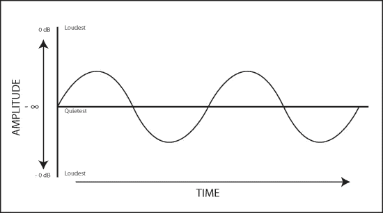

# 用于音频分析的瞬时频率特征与频谱特征

> 原文：<https://towardsdatascience.com/instantaneous-frequency-features-vs-spectogram-features-for-audio-analysis-fac224d84152?source=collection_archive---------38----------------------->

What a spectrogram looks like.

## 音频信号表示

首先，让我们试着理解音频信号是如何表示的。音频信号由不同的正弦分量组成，可以用数学方法表示如下:

其中 x(t):信号，r(t):幅度，θ(t):信号正弦分量的相位。

音频信号的幅度-时间表示可以如下所示:

Amplitude time representation.

## 音频信号的频谱图特征

它是信号频谱随时间变化的直观表示。可以使用几种方法生成频谱图，包括傅立叶变换、小波变换和带通滤波器。

设 x 是长度为 n 的信号。考虑长度为 m 的 x 的连续段(或“片段”)，其中 m ≤ n，设 X ∈ R ^(m×(N−m+1)是以连续段作为连续列的矩阵。换句话说，[x[0]，x[1]，。。。，x[m 1]]^t 是第一列，[x[1]，x[2]，。。。x[m]]^T 是第二列，依此类推。X 的行和列都是按时间索引的。

窗口大小为 m 的 x 的谱图是矩阵 xˇ，其列是 x 的列的 DFT。因此

xˇ的行按频率索引，列按时间索引。

python 中的声谱图定义在[声谱图](https://librosa.github.io/librosa/generated/librosa.feature.melspectrogram.html)中提供。

## 瞬时频率特征

瞬时频率特征也称为 IF，当与 mel-filterbank 结合时，产生 ifgram 特征矩阵，而不是频谱图特征矩阵。

对于音频信号，瞬时频率在数学上定义为:

其中φ(t)表示瞬时频率，d(θ(t))表示相位，t 表示音频信号的时间参数。mel-ifgram 特征矩阵具有类似于 Mel-spectra gram 特征矩阵的形状，但是包括时间导数分量。数学上，mel-ifgram 特征矩阵可以定义为 IF 频谱图和滤波器组矩阵的点积。

在 [Ifgram](https://librosa.github.io/librosa/generated/librosa.core.ifgram.html) 中解释了 python3 中瞬时频率特性的实现。