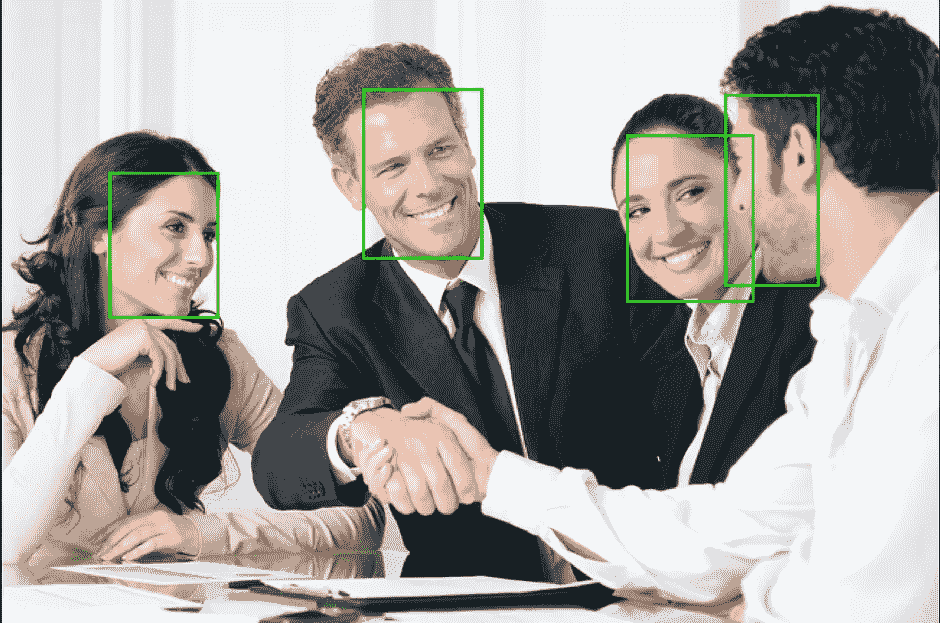
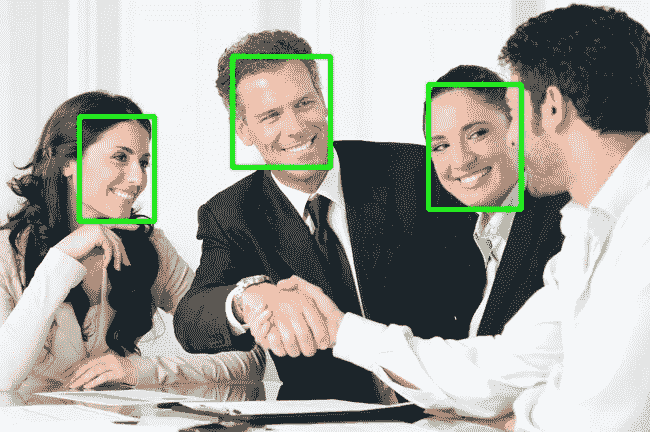
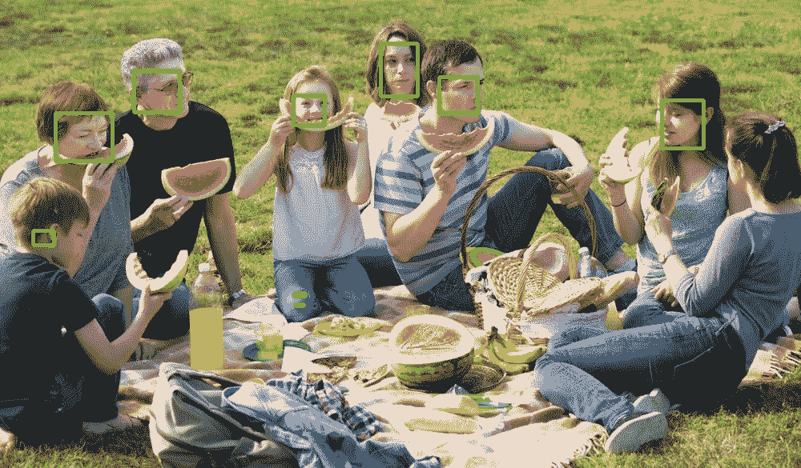

# 在你的应用中集成人脸检测

> 原文：<https://towardsdatascience.com/integrate-face-detection-in-your-app-df29f6ae932a?source=collection_archive---------24----------------------->

## 不要不知所措，因为将人脸检测添加到您的应用程序从未如此容易！

Face detection on an original image by [Austin Distel](https://unsplash.com/@austindistel?utm_source=unsplash&utm_medium=referral&utm_content=creditCopyText) on [Unsplash](https://unsplash.com/?utm_source=unsplash&utm_medium=referral&utm_content=creditCopyText)

> 很多时候，人脸检测不是应用程序的主要焦点，但却是一个重要的组件，许多开发人员只是被将人脸检测添加到他们的应用程序的想法所淹没。

如果应用程序要计算进出商店的人数，开发人员需要检测的人脸来计算人数。在这样的情况下，他们肯定不希望重新发明轮子，建立自己的*人脸检测器*(除非你有巨大的预算和开发时间，当然还有机器学习团队)。相反，他们希望获得市场上已有的*人脸检测器*，并将其集成到他们的应用程序中，并继续专注于他们应用程序的目标。

> 想象一下，如果像 Facebook Messenger、WhatsApp 和 Viber 这样的即时通讯平台都要重新发明 [TCP/IP](https://en.wikipedia.org/wiki/Internet_protocol_suite) ，那么今天还会有多少即时通讯平台存在。

在这篇文章中，我将讨论你可以从*(还有很多我没有探索的，所以也可以随意寻找其他解决方案)和*中选择的一些选项，以及示例 python 代码，用于*人脸检测*。

因此，让我们来看看今天您可以选择的一些*人脸检测器*，以便您可以轻松地将其集成到您的应用程序中，减少您的开发时间，使您能够更快地交付给您的客户。

## [微软 Azure Face API](https://azure.microsoft.com/en-au/services/cognitive-services/face/)

Face API 是微软 Azure 提供的认知服务之一。它可以用于使用客户端 SDK 在本地或使用 REST API 在云中检测人脸。面向 Face API 的客户端 SDK 可用于。NET，Python，Java，Node.js. Go，还有 iOS。

下面是使用 Face API Python Client SDK 进行*人脸检测*的代码片段:

下面是在一些面部图像上运行上述人脸 API Python 客户端 SDK *人脸检测*代码的输出:

从上面的输出图像中，我们可以观察到所有正面人脸都被检测到，一些侧面人脸被检测到，而一些被 Microsoft Azure Face API 遗漏。

关于 Azure Face API 的更多细节，请参考[文档](https://docs.microsoft.com/en-au/azure/cognitive-services/face/overview)。

## 亚马逊认知

亚马逊 Rekognition 可以检测图像和视频中的人脸。当提供人脸图像或视频时，它给出人脸所在位置的信息。Amazon Rekognition 在云端进行人脸检测，并提供 Java、Python、.NET、Ruby 和 Node.js 来封装实现，让开发者更容易使用。

以下是使用 Python SDK 将 Amazon Rekognition 用于*人脸检测*的示例代码:

下面是在一些面部图像上使用 Python SDK 对*面部检测*代码运行上述 Amazon Rekognition 的输出:

从上面的结果中，我们可以看到所有的人脸，正面和侧面人脸都被 Amazon Rekognition 检测到了。

关于亚马逊 Rekognition 的更多细节，请参考[文档](https://docs.aws.amazon.com/rekognition/latest/dg/what-is.html)。

## [Xailient FaceSDK](https://sdk.xailient.com?utm_campaign=Faces%20SDK&utm_source=Blog)

Xailient 的 FaceSDK 是世界上最快的人脸检测器。*人脸检测*发生在设备本身，并针对 Raspberry Pi 等边缘设备的使用进行了优化。Xailient 的 Face SDK 适用于 ARM 32、ARM 64 和 x86_64 设备。

当您下载 FaceSDK 时，它附带了示例代码和测试图像，您可以毫不费力地看到它正在运行。

以下是使用 Xailient Python Face SDK 进行*人脸检测*的示例代码:

以下是 Xailient FaceSDK 对相同输入面部图像的输出:

我们可以观察到，使用 Xailient FaceSDK 可以检测到所有正面和大部分侧面轮廓的面。

有关 Xailient FaceSDK 的更多信息，请参考[网站](https://sdk.xailient.com?utm_campaign=Faces%20SDK&utm_source=Blog)。

## [谷歌云视觉 API](https://cloud.google.com/vision/)

谷歌的云视觉 API 也有一个*人脸检测*功能。类似于 Amazon Rekognition，为包括 C#、Go、Java、Node.js、Python PHP、Ruby 在内的不同语言提供了使用人脸检测的客户端 SDK。

下面是使用谷歌云视觉 API Python SDK 的*人脸检测*的示例代码:

下面是在一些面部图像上运行上述谷歌云视觉 API Python SDK *人脸检测*代码的输出:

使用 Google Vision API，可以检测到大多数人脸，包括正面和侧面。

有关谷歌用于*人脸检测*的云视觉 API 的更多信息，请参考[文档](https://cloud.google.com/vision/docs/detecting-faces#vision_face_detection-python)。

在这篇文章中，我们看了一些*人脸检测器*:微软 Azure FaceAPI，亚马逊 Rekognition，Xailient FaceSDK 和谷歌云视觉 API，用 Python 编写了样本代码，并输出了在一些面部图像上运行它们的图像。虽然**亚马逊人脸识别**在样本输入图像中显示出最好的结果，但所有四个*人脸检测器*表现同样出色。使用**微软 Azure FaceAPI** 、**亚马逊 Rekognition** 和**谷歌云视觉 API** 在云上为*人脸检测*处理图像，而使用 **Xailient SDK** 在本地(设备上)处理图像。这四个工具都很容易使用， **Xailient SDK** 是最简单的，因为它需要最少的代码来运行*面部检测*。

您正在使用人脸检测构建什么应用程序？你用的是哪个人脸检测器？ ***在下面留下你的想法作为评论。***

原载于*[*www.xailient.com/blog*](https://www.xailient.com/post/integrate-face-detection-in-your-app)*。**

**更多故事:**

*[*在计算受限的设备上运行深度学习计算机视觉的挑战*](https://www.xailient.com/post/challenges-of-running-deep-learning-computer-vision-on-computationally-limited-devices)*

*[*运行物体检测上的挣扎*](https://www.xailient.com/post/struggles-of-running-object-detection-on-a-raspberry-pi)*

*[*你现在需要从云计算转移到边缘计算！*](https://www.xailient.com/post/cloud-computing-to-edge-computing)*