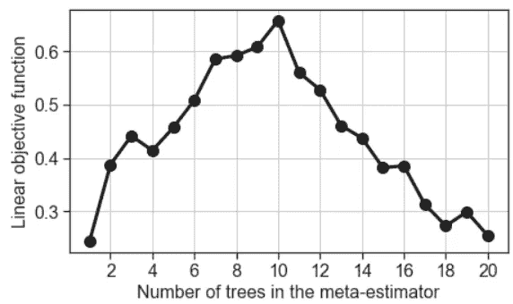

# 将业务优化与机器学习模型相集成

> 原文：<https://towardsdatascience.com/integrating-business-optimization-with-a-machine-learning-model-ad0471420693?source=collection_archive---------9----------------------->

## 在本文中，我们阐述了将优化业务指标的目标与机器学习管道相集成的概念。具体来说，我们展示了一个简单的优化循环如何围绕一个核心 ML 算法来引导它实现特定的业务目标的案例说明。

# 介绍

机器学习(ML)的需求量很大。人工智能的这一分支正在颠覆传统和现代商业实践，并带来一生一次的变革。

 [## 机器学习革命:人工智能如何改变你的业务

### 像机器学习(ML)这样有影响力的技术，很难避免夸张。当然，数十亿…

www.forbes.com](https://www.forbes.com/sites/allbusiness/2018/10/20/machine-learning-artificial-intelligence-could-transform-business/#7815726cc6c3) 

然而，关于 ML 算法、工具和技术的学术讨论和在线文章通常只关注它们的实现、性能、部署和可伸缩性。

也详细讨论了 ML 的业务方面，但是这些讨论通常与核心算法或 ML 管道有些距离。很难找到一个简单的 ML 管道的例子，它整合了实现体面的 ML 性能和满足相当普通和直观的业务目标的双重目标。

然而，大公司在他们的运营中不断地进行这种整合——应用 ML 并调整管道以推动它满足整体业务目标(或其子集)。

> 对于年轻的数据科学和 ML 实践者来说，如何用一个足够简单的例子——也许是几行代码——来演示这个想法并不是很直观。

在本文中，我们展示了一个这样的例子。

# 机器学习问题:高精度

对于案例说明，我们将想象一个非常简单的场景— **一家全新的创业公司通过提供基于 ML 的预测分析产生收入**。

特别是，它们接收数据流并预测二进制类作为输出——“是”或“否”。在其服务的核心，他们使用基于决策树的分类模型和集成技术——使用 [AdaBoost 分类器](/boosting-algorithm-adaboost-b6737a9ee60c)。

> 他们预测的准确度越高，收入就越高。

当然，你可以做一个随机的预测(下面没有任何模型),仍然有 50%的预测正确。因此，**他们只有在高于某个阈值**的更高精度下才能获得报酬，这个阈值可以低至 50%。例如，如果他们对某项工作的预测准确率为 75%，那么他们将获得与 75% — 50% = 25%成比例的收入。

但是它们是如何达到更高的精度的呢？

一个简单直观的答案是调整算法的超参数。在像 [**AdaBoost**](https://en.wikipedia.org/wiki/AdaBoost) 这样的算法中有相当多的超参数——大部分与底层的基本估计量有关。对于决策树，这些可以是每片叶子的最小样本数、最大树深度、像[基尼指数](http://www.learnbymarketing.com/481/decision-tree-flavors-gini-info-gain/)这样的分裂标准等等。然而，为了使这个例子简单，我们选择了**最直观的超参数——应用于增强的树估计器的数量**。

在其核心，[集成技术，如 Boosting](https://machinelearningmastery.com/boosting-and-adaboost-for-machine-learning/) 通过保持基本估计器相对简单和低精度(略高于 50%是好的)来工作。他们通过并行使用大量这种简单的基本估计器来实现**强大的泛化能力，并对其预测进行平均，动态更新估计器在前一次迭代中出错的例子。**

**Source**: Realizing Low-Energy Classification Systems by Implementing Matrix Multiplication Directly Within an ADC ( [IEEE Transactions on Biomedical Circuits and Systems](https://www.researchgate.net/journal/1932-4545_IEEE_Transactions_on_Biomedical_Circuits_and_Systems))

因此，毫不奇怪，较高数量的基本估计量可能导致更大的泛化能力——对客户数据(真正的未知测试集)的更高准确性。

之前，我们建立了一个简单的场景，即收入与客户提供的数据的预测准确度成正比。

因此，似乎最大化 ML 模型准确性的策略，从而最大化公司的收入，是**保持单个基础评估者真正简单**——选择树的最大深度，比如 2 或 3——并且**使用大量的基础评估者**。

> 这似乎是一个简单的策略。但是，它可能不是最佳的。

**收入不是利润**。十有八九，年轻的初创公司希望利润最大化，而不仅仅关注收入，因为这显示了他们的长期生存能力，并有助于他们获得更多投资和更多客户。

让我们稍微深入一下利润方面。

# 商业目标:利润最大化

利润是王道(至少在大多数商业情况下是如此)，对于大多数类型的企业来说，利润是经济附加值的一个非常好的指标。没有人更喜欢以较低的运营成本获得可观的收入。

我们了解 ML 模型和收入之间的关系。但是，运营成本与模型有什么关系呢？

在现实生活中，这可能非常复杂。但是为了便于说明，**我们可以简单地假设成本与模型拟合和预测的总计算时间成比例**。

这并不难想象，因为如果年轻的初创公司租用某种云服务来托管和运行他们的 ML 算法，例如 AWS EC2，这种情况将是类似的，它是基于总计算时间计费的。

现在，您还记得感兴趣的超参数 Boosting 算法的基本估计数吗？坏消息是，这个数字越大，算法的计算量就越大，模型拟合和预测的计算时间就越长。

> 因此，我们确定了 ML 算法的单个超参数和两个业务指标(收入和成本)之间的关键关系。

什么是利润？这是一个很好的古老定义，

> 利润=收入-成本

# 最优化问题:如何选择最大似然算法来实现利润最大化？

这与传统的关于 ML 算法选择的讨论有些不同，不是吗？你可能已经做过很多次了，

*   偏差-方差权衡分析
*   对超参数进行网格搜索以确定最佳精度
*   争论 ML 性能测量的正确标准— [准确度/精确度/召回率？F1 比分](/accuracy-precision-recall-or-f1-331fb37c5cb9)？ [ROC 曲线和 AUC](/understanding-auc-roc-curve-68b2303cc9c5) ？
*   头脑风暴数据获取和注释策略——进行特定的特征工程有意义吗？为增加训练集的大小而多花钱买几个标注有意义吗？

> 所有这些仍然至关重要。

但是，从商业的角度来看，很可能你被评判的唯一标准是你的 ML 算法能产生多少利润。如果它是一个很大的正数，高层管理人员很可能不会追问你算法的细节。如果是负面的，一切都可能失控！

因此，我们必须采取以下平衡措施，

我们构建了一个极其简单的场景，但至少，它显示了一个公平的机会，即一个算法选择可以与一个关键的业务指标紧密结合。

当一个模型参数同时影响两个输出(在我们的例子中是精度和成本)时，优秀的工程师会怎么做？

> 他们优化。

他们试图找到模型参数的最佳设置，这将最大化业务指标，在这种情况下是利润。

让我们通过一个简单的代码演示来看看如何做到这一点。

# 演示:以业务为中心的 ML 优化

事实上，遵循代码是乏味的，而且会让人分心。创意和图片好多了:-)

因此，我将让您从 Github repo 这里的派生并复制这个演示的[代码。但是主要思想如下，](https://github.com/tirthajyoti/Machine-Learning-with-Python/blob/master/Business_optimization/Self_optimizing_ML_simple_example.ipynb)

**感兴趣的超参数——决策树估计器的数量**——已经被编码为目标函数的参数，优化器算法可以最小化该参数。目标函数值的计算考虑了验证集上的提升算法精度和与模型拟合和预测所花费的时间成比例的简单成本项。

下面是训练集和验证集的准确性如何随着决策树估计器的数量而变化。

这里是计算时间(模型拟合和预测)，

很明显，对于少数估计器，精确度从低值开始，但是在数量达到一定水平后 T4 就会饱和。另一方面，计算负荷持续增加。

因此，随着**边际收益率(就提高精确度而言)在某一水平达到峰值**然后下降，继续增加估值器的数量是没有意义的。

啊…就是这个…著名的 [**边际收益率**](https://en.wikipedia.org/wiki/Marginal_return) ，对商界人士来说是如此的近和贵。

机器学习科学家、工程师和业务开发团队终于有了一个共同的概念来思考，一个共同的衡量标准来绘图和决策。

为了更清楚地说明这种行为，我们构建了一个 ***目标函数***—**通过在一个具有适当权重的线性函数中组合验证集精度和计算时间，将精度和计算成本集成到单个标量输出**中。如果我们绘制目标函数，可以清楚地看到 MRR 行为，

很容易看出，在这个等式中，准确度系数是正数，而计算时间系数是负数，以反映目标的真实性质——从收入中减去成本。

在 [Github repo](https://github.com/tirthajyoti/Machine-Learning-with-Python/blob/master/Business_optimization/Self_optimizing_ML_simple_example.ipynb) 中，我还展示了如何通过调用 **Scipy 包**中的函数来解决优化问题。对于这个特定的例子，目标函数是非常简单的，并且一个简单的图将显示演变，以确定包括在 ML 算法中的树的最佳数量是大约 10 或 11。所以，确实不需要使用 Scipy 函数。

但是，同样的想法可以扩展到一个更复杂的目标函数，其中包括过多的最大似然超参数。然后，优化算法的全部能力可以用来解决以业务为中心的优化。

参见本文中关于 Scipy 优化算法的讨论，

 [## SciPy 优化及其在机器学习中的应用

### 我们展示了如何使用 Python 中最流行的科学分析包— SciPy 来执行优化，并讨论了…

towardsdatascience.com](/optimization-with-scipy-and-application-ideas-to-machine-learning-81d39c7938b8) 

# 摘要

在本文中，我们讨论了以业务为中心的优化。讨论了一个简单的演示来清楚地说明这个想法——通常，ML 算法及其设置的选择需要由业务度量优化的总体目标来指导。在这种努力中，用优化循环包装核心 ML 算法对于快速决策非常方便。

事实上，在我之前的一篇文章 的 [**中，我谈到了这个想法不需要局限于单一类型的机器学习，甚至是单一类型的分析过程，而是可以跨越多种定量学科——ML 模型、统计估计、随机模拟等。—全部输入到一个通用优化引擎。**](/optimization-with-scipy-and-application-ideas-to-machine-learning-81d39c7938b8)

如果您有任何问题或想法要分享，请通过[**tirthajyoti【AT】Gmail . com**](mailto:tirthajyoti@gmail.com)联系作者。另外，你可以查看作者的 [**GitHub**](https://github.com/tirthajyoti?tab=repositories) **资源库**中其他有趣的 Python、R 或 MATLAB 代码片段和机器学习资源。如果你像我一样，对机器学习/数据科学充满热情，请随时在 LinkedIn 上[添加我，或者在 Twitter 上](https://www.linkedin.com/in/tirthajyoti-sarkar-2127aa7/)[关注我。](https://twitter.com/tirthajyotiS)

 [## Tirthajyoti Sarkar - Sr .首席工程师-半导体、人工智能、机器学习- ON…

### 通过写作使数据科学/ML 概念易于理解:https://medium.com/@tirthajyoti 开源和有趣…

www.linkedin.com](https://www.linkedin.com/in/tirthajyoti-sarkar-2127aa7/)