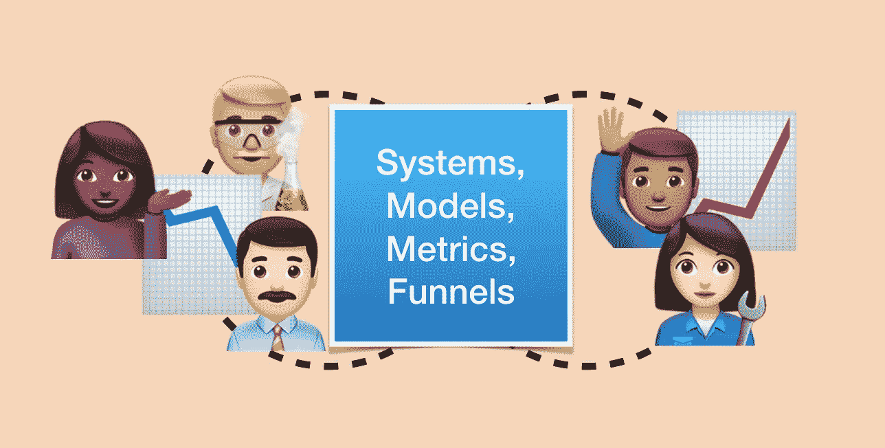

# 在以用户为中心的 ML 模型开发中整合人物角色

> 原文：<https://towardsdatascience.com/integrating-personas-in-user-centered-ml-model-development-afb593741c49?source=collection_archive---------16----------------------->

## 有一个来自以用户为中心的设计领域的关键工具，它可以改变我们从根本上设计和构建 ML 系统的方式。

How do we keep users at the forefront of our ML systems?

ML 模型开发困难重重，充满挑战——不仅难以构建能够提供经过适当格式化、预处理、缩放和训练的大型数据集的数据管道，还存在平衡、偏差、训练外性能和整体模型性能的问题。

所有这些工作会导致我们只见树木不见森林。

## 我们应该问的更深、更基本的问题

开发正确的模型架构和数据管道，虽然华而不实，值得新闻报道，但只是过程的一部分。是的，积累一个大的数据集对于建立一个有效的 ML 模型是非常重要的，但是它又一次忽略了开发 ML 产品的一些更基本的挑战:

*   这种模型实际上解决了用户的需求吗，或者我们只是“用机器学习来解决问题”,希望会出现一些神奇而强大的东西？
*   这个模型是否正确地模拟了用户问题的输入？或者我们的系统中有没有其他我们没有考虑到的输入？
*   如果我们实现了机器学习系统，是否会出现我们没有考虑到的二阶效应？

在我的[上一篇文章](https://www.g9labs.com/2019/10/06/what-training-an-audio-recognition-cnn-taught-me-about-parenting-and-about-humane-ml/)和我的 [PyGotham 演讲](https://www.youtube.com/watch?v=sT_yS8XAQEw)中，我认为在问题域中建立模型的最佳方式是在整个开发生命周期中从根本上保持用户的中心地位。事实证明，在过去的几十年里，以用户为中心的设计领域一直倡导这种思想。

# 什么是以用户为中心的设计？什么是人物角色？

**以用户为中心的研究**的核心是*人物角色*，它们是真实用户的虚拟表现，为我们的开发工作提供信息。由[程序员艾兰·库伯在](https://www.cooper.com/journal/2008/05/the_origin_of_personas/)80 年代开发，角色:

*   是团队根据真实客户创造的虚构角色
*   用名字、爱好和生活趣闻将它们带入生活
*   叙述他们的目标、恐惧和与产品相关的目标

当整个团队将角色内在化时，它有助于集中他们的工作。他们现在可以称呼用户的名字，考虑他们开发的每个产品功能或机器学习能力是否会影响他们的客户个人。

简而言之，人物角色激励我们的客户，并把他们放在我们做出的每个产品(和数据)决策的首位。

# 见见团队

想象一个场景在 AcmeWidgets.com 的工程团队中展开，我们的团队正在为电子商务零售商开发一个推荐系统，以在产品页面上显示相关商品。为了做到这一点，一个由 ML 工程师和数据科学家组成的技术娴熟的团队聚集起来构建这个系统。

团队首先为他们的模型定义一个*目标函数*。在这种情况下，团队决定选择一个使购物车价值最大化的函数(我们的目标函数)。例如，它可能会发现用户倾向于在我们的目录中购买一系列高价商品。

然而，事情很快就出了岔子。该团队注意到，他们的模型最终给出了低质量的推荐，牺牲了长期客户保持率来换取平均订单价值的短期提升。该团队发现，他们的模型最终会促使客户购买他们并不真正想要或需要的物品，从而降低客户对产品和业务的长期忠诚度。事实上，推荐引擎推荐的产品最终会以高得多的比率被退回，从而导致企业的运营支出和成本。

Photo by [Christina @ wocintechchat.com](https://unsplash.com/@wocintechchat?utm_source=medium&utm_medium=referral) on [Unsplash](https://unsplash.com?utm_source=medium&utm_medium=referral)

当然，这只是调整模型的问题！团队回到绘图板，这一次推出了一个模型，该模型改变了模型的目标函数，以最小化其产品的回报率。模型经过测试，瞧，系统又开始愉快地运行了。用户似乎对他们的购买很满意…

…直到三个月后，他们发现与这个推荐引擎交互的用户实际上比那些没有看到推荐的用户更频繁地离开产品！事实证明，这些推荐让用户如此不安和愤怒，以至于他们甚至懒得返回。

因此，团队回到了绘图板，沮丧并对他们在项目的下一次迭代中可能发现的其他东西有一种不祥的预感。

# 哪里出了问题？

Photo by [Kelly Sikkema](https://unsplash.com/@kellysikkema?utm_source=medium&utm_medium=referral) on [Unsplash](https://unsplash.com?utm_source=medium&utm_medium=referral)

如果我们回去和团队一起参加他们的项目回顾会，我们可能会听到这样的反映:

*   *在我们的模型中，我们没有考虑全套的用户生命周期指标*
*   *我们考虑得不够全面*
*   *我们冲向市场，相信我们知道正确的前进方向*
*   *有些客户边缘案例我们没有考虑*

当然，这些东西很多只能从经验中学习！但是，对于这个项目来说，还有更好的前进方式吗？

关键问题是团队只在战术层面思考。他们认为——“哦，推荐引擎应该很简单。我们将为我们的模型引入架构 X，针对目标 Y 进行训练，并在我们能够实现模型性能 Z 时交付它。

# 人物角色让我们站在客户的角度，因此我们可以发展专家的直觉

ML 从业者经常会告诉你，一个伟大的 ML 系统融合了*领域专长*和*专家直觉*。这意味着 ML 模型必须由团队成员设计，他们对业务领域有深刻的理解，对数据集有深刻的熟悉，对客户的需求有深刻的直觉。

你如何获得领域专业知识？嗯，你必须让合适的人加入到团队中，解决合适的问题，在模型开发过程中的所有环节考虑客户。用户角色是如何帮助我们避免这种情况的？

想象一下，在开始的时候，团队同意将他们的客户视为现实世界中活生生的人。事实上，他们的 UX 同事做了一系列客户访谈，得出了一系列客户综合草图:

# *办公室管理员卢克*

Photo by [Marius Ciocirlan](https://unsplash.com/@madebymarius?utm_source=medium&utm_medium=referral) on [Unsplash](https://unsplash.com?utm_source=medium&utm_medium=referral)

## **剖面图**

卢克是一名 31 岁的男子，住在印第安纳波利斯，是一家小型物流公司的办公室管理员

## **动机**

Luke 需要在办公室存放一些小工具，供员工使用。考虑到办公室的小配件经常缺货，他需要每隔几周就补充一些。他害怕不得不重新登录网站下订单，因为他觉得这很乏味。

## **目标**

*同一 SKU 的无缝、定期订单再履行*

# *和谐，婚礼策划*

Photo by [Kim Carpenter](https://unsplash.com/@kimberly123?utm_source=medium&utm_medium=referral) on [Unsplash](https://unsplash.com?utm_source=medium&utm_medium=referral)

## **简介**

27 岁的哈莫尼住在波士顿，经营着一家刚刚起步的活动策划公司。她喜欢在自己的活动中提供 Acme 小配件，因为它们受到客人的喜爱，并为她的企业提供了她需要的知名度。

## **动机**

哈莫尼梦想在她的城市建立一个活动策划帝国

## **目标**

*独特、难找、令人向往的小配件，让她的生意脱颖而出*

# *天齐，自由职业爸爸*

Photo by [JodyHongFilms](https://unsplash.com/@jhong8?utm_source=medium&utm_medium=referral) on [Unsplash](https://unsplash.com?utm_source=medium&utm_medium=referral)

## **简介**

田琦是一名生活在上海的远程自由职业者，他享受在家工作的灵活性，因为这让他可以在伴侣全职工作的同时为家人照看孩子。

## **动机**

天齐希望在预算有限的情况下，过上有序、高效的家居生活

## **目标**

以预算价格购买他想要的东西。

# 如何将人物角色整合到模型开发中

我们可能想要考虑人物角色的原因是，这样我们可以直接了解我们客户的*目标*和*动机*。Harmony 希望发现流行的独特商品。卢克只是想完成办公室的一个经常性订单。天齐想要最便宜的东西。

## 经常讨论它们

该团队在考虑其推荐算法时，应在开发其模型时主动提及 Harmony、Luke 和 Tianqi 的名字-

> 队友 1:如果我们选择使用协作过滤模型，我们必须考虑这样一个事实，即我们只有非常小的用户样本量符合 Luke 的用例(power fulfiller)。我担心在任何有意义的信号出现之前，Luke 的团队会看到许多垃圾推荐，并对我们的产品失去兴趣。
> 
> *队友 2:是啊，的确如此。但我们知道，Harmony 的团队占我们销售额的 75%以上。这里有很多机会。如果我们用强盗的方法呢？这应该有望最大限度地减少出现在用户面前的不良推荐的数量。*
> 
> *队友 1:这主意不错。鉴于我们的经营规模，我们可以很快学会，我们可以尽量减少向卢克团队提供糟糕建议的时间。*

或者考虑开发过程中的另一个场景，团队不得不在野外与推荐者进行负面互动:

> 队友 1:我们在 Twitter 上收到一些客户反馈，说我们的产品太贵了。显然，一些顾客觉得他们被骗了，购买了他们并不需要的东西——天齐一族。我们如何确定人们确实收到了有价值的推荐呢？
> 
> *队友 2:为什么他们觉得自己的物品没有价值？*
> 
> *队友 1:由于某种原因，我们的推荐系统正在制造某种买家的遗憾。我们可能会过度宣传我们的一些促销活动，或者我们可能会推出一些有质量问题的产品。*
> 
> *队友 2:让我先和我们的 UX 设计师朱莉谈谈，看看是否有某种用户研究可以证实或验证这个假设。如果我们需要将某种功能重新整合到我们的模型中，以确保我们做出真正高质量的推荐，那么就让我们整合它吧。否则，如果我们的建议不符合标准，让我们测试一个新的模型变体，我们根本不会显示任何结果。*
> 
> *队友 2:知道了。*

看到了吗？我们希望将这种以客户为中心的全面对话融入团队的自然工作方式中。所有这些都是通过客户角色实现的。

## 让他们看得见，摸得着

我在创业公司工作的时候，我们经常把客户角色打印出来，贴在墙上给团队看。当团队看到活生生的顾客时，他们会想起他们是在为谁解决问题。如果团队陷入了只讨论特征工程问题、精确召回曲线和准确性指标的深层技术细节的陷阱，在房间里提醒您的客户将有助于将 ML 产品与您正在解决的实际客户问题联系起来。

# 最后

Photo by [Philipe Cavalcante](https://unsplash.com/@philipegd?utm_source=medium&utm_medium=referral) on [Unsplash](https://unsplash.com?utm_source=medium&utm_medium=referral)

人物角色是强大的——但他们不是银弹。人物角色帮助我们做的是把我们的客户想象成真实的人，有真实的目标、动机和挫折。当我们定义我们的客户时，我们给自己一个词汇，将他们作为一等公民来讨论，然后围绕他们确定我们的技术解决方案。

哦——顺便说一下，谷歌的人与人工智能研究(PAIR)团队对设计以人为中心的人工智能产品的过程进行了更多的思考。[通读他们的最佳实践指南](https://pair.withgoogle.com/)，从他们构建 ML 产品的丰富经验中学习。

*你怎么看？你有以客户为中心构建 ML 模型的经验吗？伸出手让我在 Twitter 上知道在* [*@andrewhao*](https://www.twitter.com/andrewhao) 。

# 参考

*   [谷歌—人+人工智能研究](https://design.google/library/ai/) —谷歌设计
*   [近距离观察人物角色](https://www.smashingmagazine.com/2014/08/a-closer-look-at-personas-part-1/) —粉碎杂志
*   [人物的起源](https://www.cooper.com/journal/2008/05/the_origin_of_personas/) —艾兰·库伯
*   [PyGotham 2019:神经网络能让我成为更好的父母吗？](https://www.youtube.com/watch?v=sT_yS8XAQEw&feature=youtu.be) —安德鲁·郝

*原载于***。**