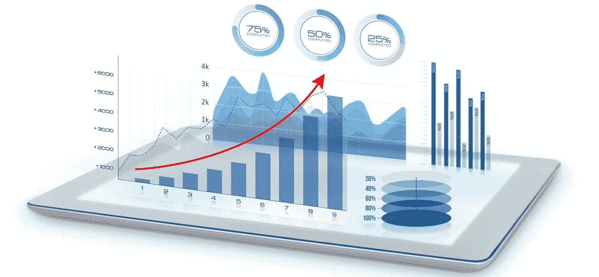
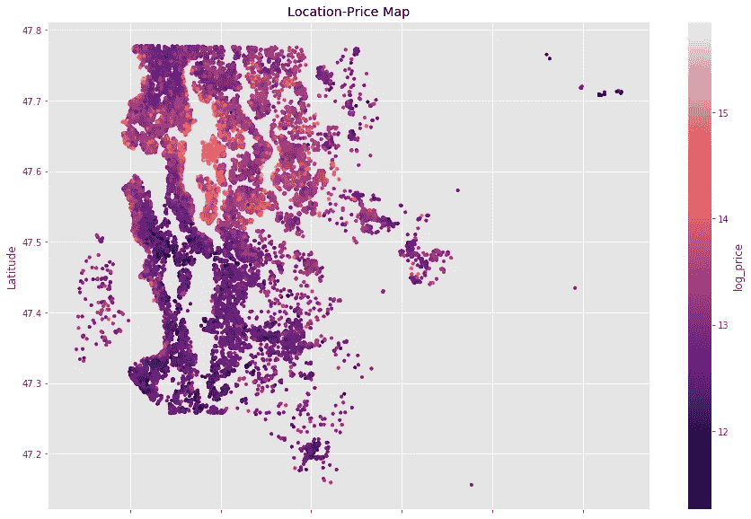
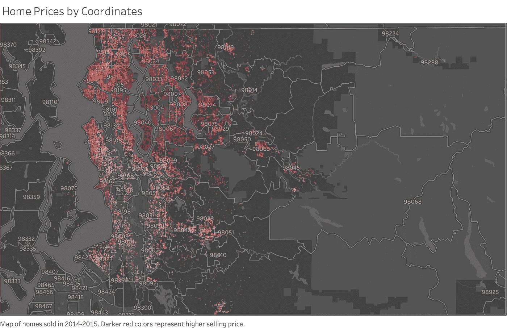

# 集成 Python 和 Tableau

> 原文：<https://towardsdatascience.com/integrating-python-tableau-5511dd7102e9?source=collection_archive---------5----------------------->

## 通过引人入胜的数据可视化，让您的分析栩栩如生。



当对大型和非结构化数据集执行深入分析时，Python 和相关机器学习库的威力怎么强调都不为过。Matplotlib 是帮助我们可视化结果的一个很好的工具，但是它的风格化选项并不总是最适合用于演示和仪表板。当然，你可以让它工作，但是像 Tableau 这样的可视化软件更适合帮助你讲述你的故事。

为了说明这一点，考虑一个来自[金县住房数据集](https://www.kaggle.com/harlfoxem/housesalesprediction)的简单例子。在探索性分析中，您可能会发现位置是价格的重要预测因素，但您想知道是使用邮政编码还是 GPS 坐标作为预测因素。通过创建一个带有经纬度坐标的散点图，创建一个基于价格的彩色地图，我们可以了解哪里的价格最高。

```
ax = housing_data.plot.scatter('long', 'lat', 
                               c = 'log_price',
                               s = housing_data['log_price'],
                               colormap = 'magma', 
                               figsize=(15, 10), 
                               title='Location-Price Map')
ax.set(xlabel='Longitude', ylabel='Latitude')
plt.show()
```



基于此，我们得到一种感觉，即经纬度与价格之间的关系有点像抛物线，从这里，你可以决定如何继续分析。然而，如果你想让高级经理更清楚地知道哪里的价格最高，这种可视化效果并不理想。使用 Tableau，我们可以创建这样的东西:



可以用 Python 中的库创建这样的东西吗？我想是这样的，但是专用于数据可视化的软件可以帮助你以更高的效率获得这些结果。更重要的是，这个软件使得比较不同的风格变得更加容易。请看下面的信息图，它展示了 1999 年至 2016 年美国心脏病死亡率的变化。


此图表结合了 Tableau 的可视化效果和 PowerPoint 中的动画选项。我们如何利用 Tableau 的可视化能力和 Python 的分析能力？我会给你三个选择，并强调每个选择的利弊。在这篇文章的末尾可以找到实现的相关文档的链接。

## 泰比

任何想要结合这些工具的人都可能很快找到[标签](https://www.tableau.com/about/blog/2017/1/building-advanced-analytics-applications-tabpy-64916)选项。Tableau 本身开发了 TabPy，并允许您在 Tableau 的计算列中运行 Python 脚本。部署机器学习模块后，您可以将调用函数合并到计算变量列中。

作为一个用例，考虑一个基于位置和其他因素预测房价的机器学习模型。一个住宅开发商可能试图决定在哪里建立一个新的社区，他们想知道在哪里可以得到最好的价格给定的一般特点的家居设计。业务分析师只需输入设计细节和潜在位置，Tableau 将立即提供相关地图和价格预测。

此外，TabPy 还支持高级特性，比如身份验证管理和代码发布。然而，伴随这些特性而来的是额外的复杂性:安装并不总是容易的，对遗留 Python 代码的支持使其运行繁重，并且脚本实现并不总是干净的。但最重要的是，TabPy 依赖于使用 Tableau 服务器，这是一种付费服务。换句话说，这不适用于 Tableau Public，Tableau 的免费版本。基于这些原因，AltTabPy 应运而生。

## AltTabPy

[AltTabPy](https://community.tableau.com/docs/DOC-22730) 的主要目标是简化和精简 TabPy 的关键功能。就大小而言，AltTabPy 只有 TabPy 的 5%,这使得它的效率令人难以置信。安装可以通过一个简单的 pip 命令完成。并且将代码合并到 Tableau 计算列中要干净得多。

但是，它不提供 TabPy 的高级功能。考虑到这一点，AltTabPy 对于资源有限、没有遗留代码负担的公司或个人来说是一个极好的选择。价值主张实际上与 TabPy 相同，但针对的是不同的用户。最重要的是，不需要 Tableau 服务器。

## CSV 共享

尽管功能有限，但 CSV 共享是将数据从 Python 发送到 Tableau 的最简单方式。该选项非常适合于显示历史数据，而不需要即时预测新数据。它也适用于不需要对新数据进行即时预测的单一分析。

这里的方法非常简单，只需对相关数据运行机器或深度学习模型，并将结果数据帧保存到 CSV。

```
df.to_csv('filename.csv')
```

从这里，Tableau 可以从主屏幕上的**连接**菜单连接到相关文件，并选择**文本文件。**从可持续发展的角度来看，数据科学家应该设计代码，以便在新的数据预测可用时更新 CSV 文件。通过刷新 Tableau 中的连接，可以将新数据合并到相关的可视化中。

如果数据科学家被授予写 SQL 服务器的权限，这种策略也可以适用于 SQL。

这里最大的缺点是使用 Tableau 的业务分析师不能添加新数据来预测结果。相反，他们将不得不依靠其他团队来生成预测结果，然后才能将其纳入可视化。

## 结论

TabPy 是一个端到端的解决方案，允许在团队设置中真正集成 Python 和 Tableau。然而，它带来了更多的复杂性和更高的成本。

AltTabPy 提供了更大的简单性，并且不需要对 Tableau 服务器进行投资。对于使用新版本 Python 并且不需要遗留支持的初创公司来说，这是一个很好的选择。

CSV 共享非常适合不需要共享数据的个人和不需要快速部署机器学习模型的公司。

## 来源

TabPy 和 AltTabPy 的官方文档可以在下面找到:

*   [PyTab](https://github.com/tableau/TabPy/blob/master/docs/tabpy-tools.md)
*   [替代](https://alttabpy.readthedocs.io/en/latest/index.html)