# 雪花中的智能计算

> 原文：<https://towardsdatascience.com/intelligent-computing-in-snowflake-2be96ac11049?source=collection_archive---------11----------------------->

再过一周多一点，我将前往旧金山参加 Snowflake 的首届[用户峰会](https://www.snowflake.com/summit/)，在那里我将就澳大利亚私人健康保险行业的数据共享发表演讲。

我不仅为会议感到兴奋，而且当我在那里的时候，我也真的很兴奋能去 Numenta 的办公室参加 [meetup 活动](https://www.meetup.com/numenta/events/261028169/)。

雪花已经建立了下一代数据仓库，Numenta 正在建立我认为是下一代机器学习算法，所以这将是一个重要的一周！

自从大约 15 年前我在大学第一次研究机器学习以来，我对它一直有着浓厚的兴趣。那是在上一个人工智能冬天的中期，所以我对这门课没有太多期望，因为没有人真正谈论它。但它很吸引人，富有哲学挑战性，给我留下了持久的印象。

在我目前的工作中，我开始从事涉及当代机器学习的数据分析过程。但是意识到它的一些局限性，并且永远对人类智力的工作方式感到好奇，我一直密切关注 Numenta 的[研究](https://numenta.com/neuroscience-research/)，并且多年来一直是他们的[社区](https://discourse.numenta.org)的一员。

因此，为了让我对即将到来的旅行感到兴奋，这篇文章是我结合两种技术的一个实验；在雪花上运行 Numenta 当前的数据库内智能计算算法，并使用它来检测数据序列中的异常。

# AI 不是已经智能了吗？

简单来说，机器学习算法(包括深度学习)允许我们通过使用历史数据来训练一个模型，从而进行预测。作为学习算法，这种想法是，如果一些信息对一个结果具有预测能力，并且你有很多例子，那么你不必指定一个精确的公式来进行预测。相反，你可以用蛮力和一些巧妙的捷径来近似它。

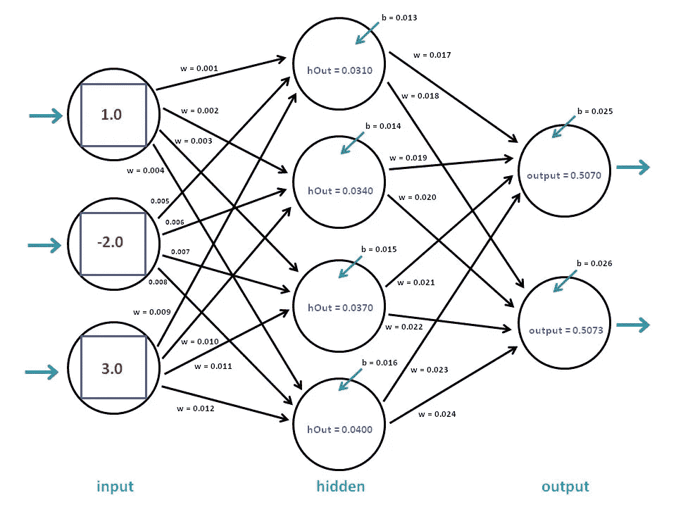

credit: [https://visualstudiomagazine.com](https://visualstudiomagazine.com)

在某些情况下(比如我之前的 Medium 故事中的基于树的学习)，你会得到一个可解释的预测，而使用[神经网络](/everything-you-need-to-know-about-neural-networks-and-backpropagation-machine-learning-made-easy-e5285bc2be3a)它可能更像是一个黑箱。但在这两种情况下，你通常都在寻求最小化特定预测任务的误差，这样你就可以自动将其应用于新数据。

这篇文章的目的绝不是贬低这些机器学习方法的强大。它们被全世界最大的公司和最聪明的人用来解决实际问题。给定足够的样本数据，他们可以对图像进行分类，将语音转换为文本，或者预测能源消耗。使用规则而不是数据，他们可以学习赢得像围棋这样的游戏，或者在雅达利游戏中取得成功(没有享受部分)。

不仅如此，即使在我们破解了哺乳动物智能的难题之后，这些传统方法对于某些类型的分析仍然至关重要，在这些分析中，我们实际上并不需要类似人类的推理。

但是，尽管它们打着人工智能的旗号，甚至被称为“神经”网络，但重要的是要认识到，它们的工作方式与人类和其他动物的智能工作方式非常不同。相比之下，人类大脑使用未标记数据的时间流不断预测和学习，并且使用单一的通用算法非常有效。

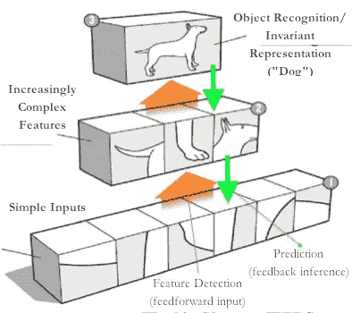

credit: [http://dmangus.blogspot.com](http://dmangus.blogspot.com/2013/04/ben-thomas-blog-web-portals-and-mouse.html)

我们的大脑也非常擅长保持“不变”的表示和关系的层次，所以我们可以很容易地从一个不熟悉的角度识别一只狗，并直观地理解它更像一只猫，而不是一条鱼。这就是为什么我们的婴儿在图像识别方面轻而易举地超过了最好的深度学习算法，这是实现完全自动驾驶道路车辆比最初预期的要远得多的核心。

# Numenta AI 方法有何不同？

Numenta 采取了一种“生物约束”的方法，并正在开发一种被称为分层时间记忆(HTM)的理论，这意味着他们不会将任何人脑不会做的事情纳入他们的算法中(根据神经科学研究告诉我们的)。

Numenta 的任务是了解智能如何在大脑中工作，以便他们可以在软件中实现它，并建立智能系统。从行业的角度来看，他们仍然处于边缘，但他们的研究正在进步，并且总是令人着迷，尤其是对任何对计算机科学和神经科学有双重兴趣的人来说。例如，最近有很多关于网格细胞结构的关注，一个古老的导航机制如何适应高等教育。我希望 6 月 meetup 活动上的研究更新会围绕丘脑的作用，以及他们如何将注意力的作用纳入他们的理论。

我们的大脑包含现有的最好的通用学习算法。因此，尽管前方仍有许多发现，但该理论吸引我的是，随着它的成型，它的学习将不会像当前的 ML 那样受到限制——我们可以用它来构建的可能性确实是巨大的。

你可以通过观看 Youtube 上的 [HTM 学校](https://www.youtube.com/channel/UC8-ttzWLgXZOGuhUyrPlUuA)来开始了解 HTM，它会带你了解基础知识。或者，如果你是一个爱读书的人，你不能错过《智力的 T2》，这本书由 Numenta 的联合创始人杰夫·霍金斯所著，最初概述了 HTM 的基础。

# 它能做什么？

除了保持研究本身的开放性，Numenta 还有一个名为 [nupic](https://github.com/numenta/nupic/) 的开源项目，实现了 HTM 理论中描述的学习算法。它主要是一个研究工具，它还不像一个完全正常工作的大脑。如果是这样的话，我相信这项技术已经在几乎所有的系统中使用了！

它已经被各种社区成员移植到其他语言中，有些人甚至用自己的一些想法进行了修改。

除了开源项目，还有一些商业应用正在出现。例如[皮质。IO](https://www.cortical.io/) 正在将 HTM 专门应用于自然语言理解。

无论如何，要回答这个问题，它目前能做得很好的是学习序列而不需要太多的刚性，并预测下一个值。这又可以用于检测具有一定噪声容限的数据序列中的异常。

# 雪花实现

我将在雪花中进行一个非常基础的学习练习，使用简单的数字序列。

为此，我们需要构建几个组件，但在进入细节之前，我想先展示一个快照:

1.  我们在雪花中构建的内容(右侧)
2.  其中每个部分都符合 HTM 理论(中间)，并且
3.  这在生物学上是对应的(在左边)。

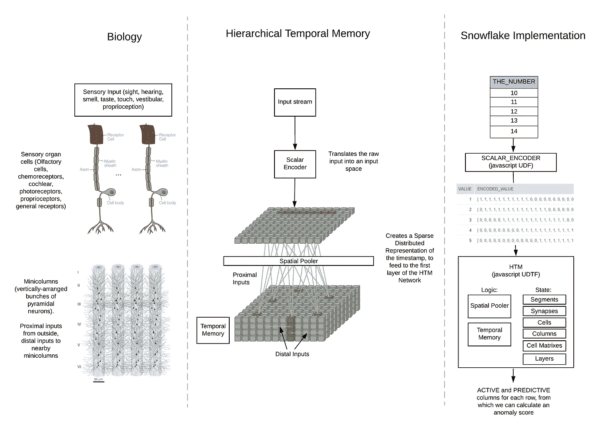

让我们从上到下努力吧。

## 编码器

编码器是我们的数据通过的第一个地方。

它们是初始大脑输入的一种快捷抽象，就像视觉皮层或听觉皮层一样。原始输入被映射成具有一些重要属性的稀疏表示，在本文中[有更详细的描述。有趣的事实:你的大脑皮层没有视觉、听觉和嗅觉的概念，也不关心信号来自你的哪个感官。它只是使用单一的通用机制进行学习和预测，编码器是通向它的门户。](https://arxiv.org/ftp/arxiv/papers/1602/1602.05925.pdf)

我将使用一个 [javascript UDF](https://docs.snowflake.net/manuals/sql-reference/udf-js.html) 为雪花构建一个标量编码器。输入将是一个单一的数字，输出将是一个位的数组，其中一些是活动的，而大多数不是。

通过借用一些 [Numenta 的 javascript 代码](https://buildinghtm.systems/encoding-numbers/)并做一些修改，我为自己节省了一些时间:

编码器的特性之一(来自上述论文)是:

> 相同的输入应该总是产生相同的 SDR 作为输出。

这意味着我们可以在雪花 UDF 上设置“不可变”属性，并从缓存中受益匪浅。

用值 1 到 5 来演示:

```
select 1 as value, SCALAR_ENCODER(1,1024,0,250,14,false) as ENCODED_VALUE
union all
select 2 as value, SCALAR_ENCODER(2,1024,0,250,14,false) as ENCODED_VALUE
union all
select 3 as value, SCALAR_ENCODER(3,1024,0,250,14,false) as ENCODED_VALUE
union all
select 4 as value, SCALAR_ENCODER(4,1024,0,250,14,false) as ENCODED_VALUE
union all
select 5 as value, SCALAR_ENCODER(5,1024,0,250,14,false) as ENCODED_VALUE
```

编码器输出 1024 位宽的稀疏数组，输入值范围为 0–250，宽度为 14。

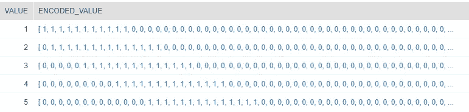

如您所见，数字越接近，比特重叠越多。我们这样做是因为我们认为它们“语义相似”。

我们正在有效地构建类似于耳蜗毛细胞的东西，其中每一个输出位都可以活跃在许多类似的输入中。

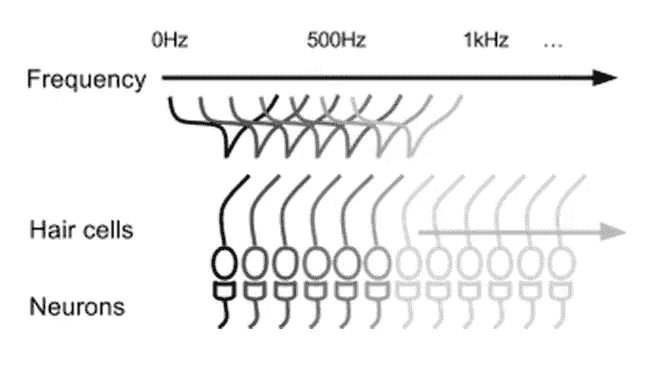

credit: Numenta

## 空间池


A Sparse Distributed Representation (credit: Numenta)

在计算机中，我们密集地编码信息，但在我们的大脑中，它非常稀疏，这不是存储有效的，但产生了其他重要的属性，如噪声耐受性。这些被称为稀疏分布式表示(SDRs)。

因此，空间池的作用是将编码输入作为 SDR 之一投射到迷你列中。微柱是一束束垂直排列的神经元群，它们接收共同的输入并相互连接。

## 顺序记忆

大脑基本上是一个记忆系统，根据过去的序列不断预测未来的状态，并相应地加强/削弱突触。这就是 Hebbian learning，我记得是“一起火，一起线”。大脑只能在大约 20 瓦的功率下运行，因为它是连续有效的，它不像我们通常用计算机那样处理信息。

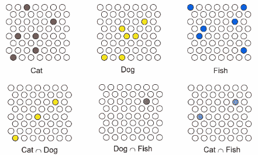

credit: brainworkshow.sparsey.com

随着信号在大脑的层次中向上移动，混沌的原始感觉输入最终成为稳定的概念(你可以在神经元放电模式中看到这一点)，两个 SDR 之间的重叠量对应于语义相似性。

序列记忆(也称为时间记忆)的作用是使用远端连接(横向延伸到其他微柱)将微柱置于基于其对先前序列的识别的预测状态。

对于空间池和序列记忆，我将再次借用别人的代码。这次是 [HTM.js](https://github.com/htm-community/htm.js/) ，一个由 Numenta 社区成员 Paul Lamb 构建的 javascript HTM 实现。同样，我所做的只是稍微修改它，使其在雪花上下文中工作。

在 HTM.js 中，所有不同的生物构造(细胞、列、层、突触等)都在不同的文件中被建模为它们自己的 javascript 原型。我将把它们全部放入另一个雪花 [javascript 用户定义的表格函数(UDTF](https://docs.snowflake.net/manuals/sql-reference/udf-js-table-functions.html) )，以及所有的学习和预测控制器逻辑。

最终版 UDTF 的源代码可以在[这里](https://github.com/jamesweakley/snowflake-ml/blob/master/htm/htm.sql)找到(它太大了，无法在这里显示)。

有了这个函数，我们可以运行遍历表的列的查询，并一次性学习它找到的值的序列。HTM 网络的状态存在于 UDTF 执行者的记忆中，最初是随机的，但随着它学习到的每个新值而改变。这当然意味着我们故意不利用 UDTFs 通常具有的雪花引擎的并行性，因为处理顺序很重要。

所以我们来试试吧！我会尽可能用 Tableau 来保持这种视觉效果。


从一个数字从 10 到 20 的表开始，循环回到 10，无限期地继续下去。

我把这个表叫做 LOOPING_NUMBERS，列叫做 _NUMBER。

从视觉上看，顺序是:

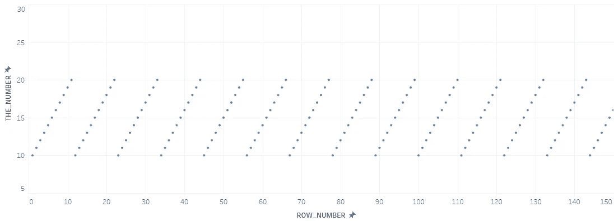

让我们看看我们的 HTM·UDTF 能否学会这个序列。

但首先，HTM.js 实际上采用密集表示的稀疏数组。显然，它希望输入数组只保存 1 的索引位置，而不是一长串 0 和 1。这就是我添加 DENSE_OUTPUT 参数的原因，如果设置为 true，我的 1，2，3，4，5 序列将如下所示:

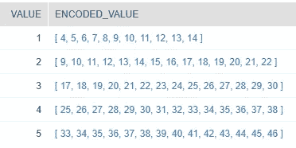

Look, they fit on the screen now!

好，那么使用我们的输入表 LOOPING_NUMBERS，我们首先通过标量编码器运行 _NUMBER 列，然后通过 HTM 网络。

```
select 
THE_NUMBER,
SCALAR_ENCODER(THE_NUMBER,1024,0,250,20,true) as ENCODED_INPUT,
ACTIVE,
PREDICTIVE
from LOOPING_NUMBERS,
table(HTM(SCALAR_ENCODER(THE_NUMBER,1024,0,250,20,true)))
```

下面是我们得到的一个例子:

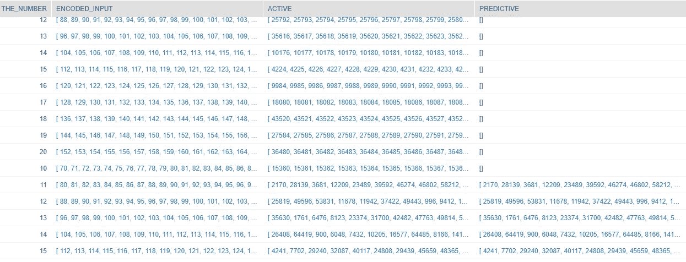

我将结果集向下滚动到预测开始的地方。你可能会想，这样解读有点难。活动列包含活动小列的索引，预测列是也处于预测状态的活动小列的索引。

为了更好地理解发生了什么，我们可以简单地使用预测的成功率来计算异常分数:

```
select THE_NUMBER,
    SCALAR_ENCODER(THE_NUMBER),
    ACTIVE,
    PREDICTIVE, 
    ARRAY_SIZE(ACTIVE)-ARRAY_SIZE(PREDICTIVE) as NOT_PREDICTED_COUNT,
    NOT_PREDICTED_COUNT/ARRAY_SIZE(ACTIVE) as ANOMALY_SCORE
from LOOPING_NUMBERS,
table(HTM(SPARSE_TO_DENSE(SCALAR_ENCODER(THE_NUMBER))));
```

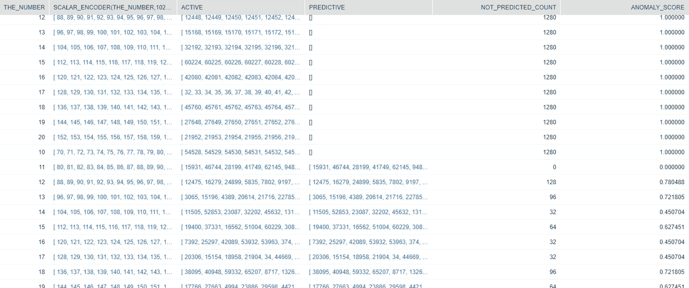

现在我们有了一个异常分数，我们可以直观地看看 HTM 网络经历了什么:

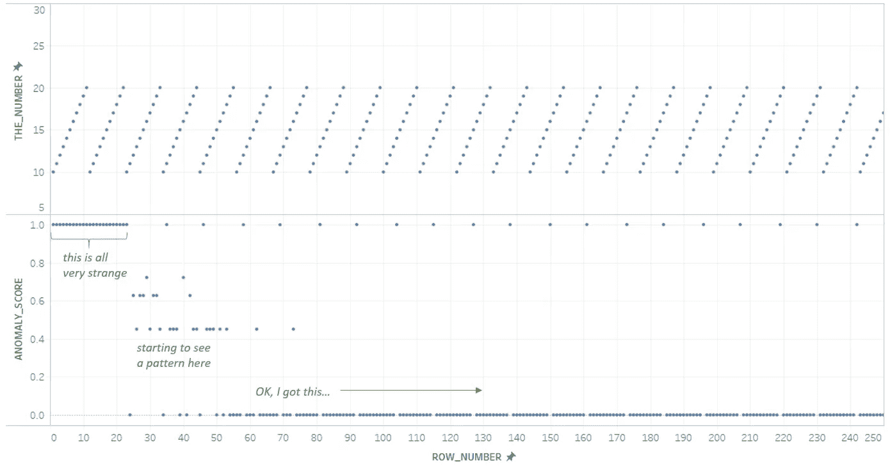

有点像刚出生的婴儿，一开始什么都不懂，然后模式开始变得熟悉。

顶部偶尔留下的异常痕迹是怎么回事？这是由学习重复输入的方式造成的影响，在主要的 python nupic 代码库中有减轻它的方法，它们只是在 HTM.js 中不存在。所以请相信我，忽略它们:)

现在让我们扔一些曲线球，看看会发生什么。我们给它 10，11，13，13，而不是 10，11，12，13。

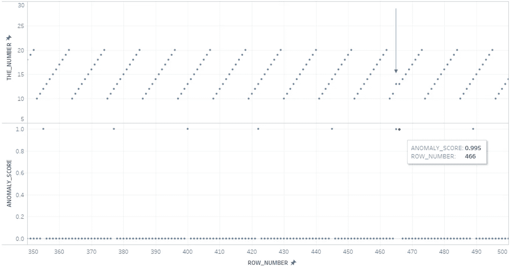

网络检测到几乎确定的异常。不完全是 100%的原因是因为在编码器输出中 12 和 13 之间有相当大的重叠，所以仍然预测了少量的活动列。

现在让我们用一个 10 的大序列来给它一个惊喜，因为那是非常不同的。

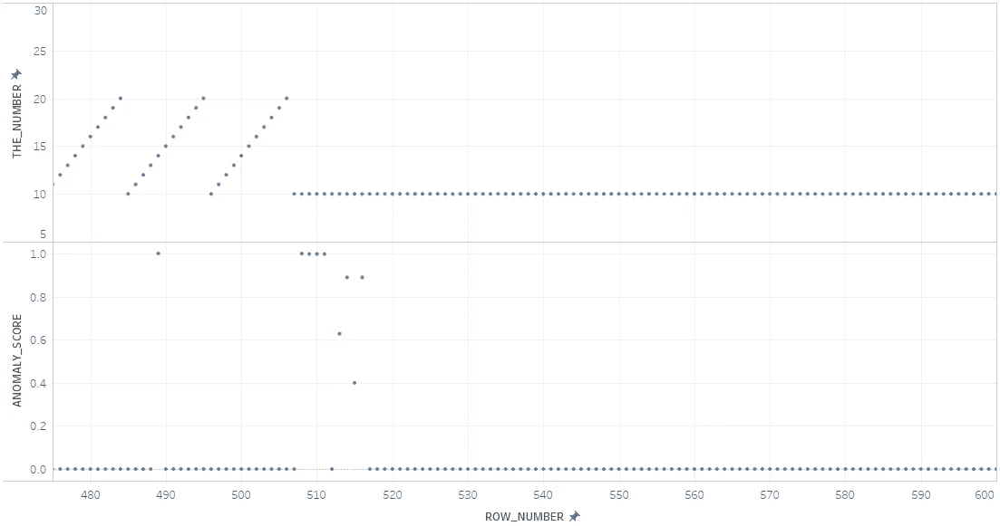

网络再次吐出它的咖啡，并在调整到新的序列之前短暂地困惑。

让我们再试一次，重复序列 10，12，14，16，18，20，19，17，15，13，11:

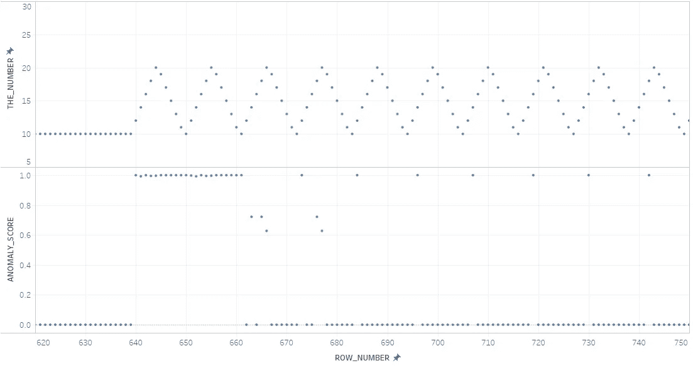

与之前类似，但调整期更长，因为新序列需要更长时间重复。

现在让我们做一些有趣的事情来结束，并回到最初的 10，11，12，13，14，15，16，17，18，19，20 的顺序。你可能会想，随着所有的变化，它已经被遗忘很久了。事实上，网络拥有巨大的存储容量，在识别它之前几乎不会漏过一个节拍:

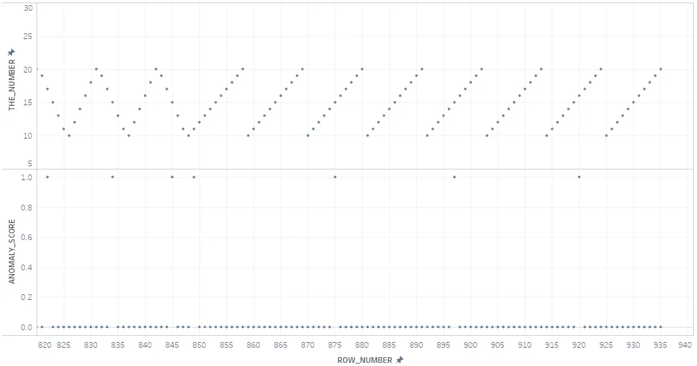

# 摘要

我希望你读这本书的时候和我整理的时候一样开心。如果你和我一样，HTM 一开始会让人望而生畏，但如果你对智力的工作方式感兴趣，研究它会非常有价值。我开始将生物启发的学习算法视为我们建设更智能系统的道路上至关重要的一部分。

雪花作为一个云数据仓库给我留下了深刻的印象，似乎不可避免的是，我们将继续看到它得到扩展，变得越来越多才多艺。这是一个非常非传统的数据仓库任务的另一个例子，使用它的引擎很容易实现。

同样，如果您有兴趣了解更多信息，请访问 Numenta 社区，并且不要忘记介绍自己！。