# P2P 贷款的智能贷款选择

> 原文：<https://towardsdatascience.com/intelligent-loan-selection-for-peer-to-peer-lending-575dfa2573cb?source=collection_archive---------21----------------------->

## 在贷款选择中控制风险的同时使用神经网络对贷款俱乐部进行自动投资

# 介绍

在这篇文章中，我描述了如何训练一个神经网络来评估大众借贷平台 Lending Club 上提供的贷款。我还介绍了如何测试模型，如何调整贷款选择中的风险，以及如何使用 Lending Club 的 API 使用模型进行自动投资。

为了让您保持兴趣，下面是回溯测试结果的预览:

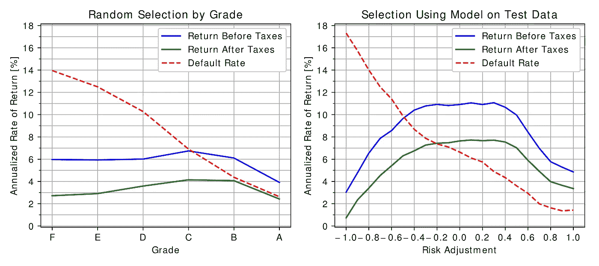

左边的图表显示了随机选择贷款的模拟投资组合的回报，这些贷款按照 Lending Club 指定的等级进行筛选。右边的图表显示了神经网络选择不同风险调整水平的贷款时的回报。

# 借贷俱乐部

lending Club([www.lendingclub.com](http://www.lendingclub.com))是一个允许任何人投资消费贷款的平台，每笔贷款只要 25 美元。贷款金额从 1000 美元到 40000 美元不等，期限为 36 或 60 个月。许多借款人借出贷款来巩固债务，但也有各种其他目的；比如:家装、医疗费用、商业贷款等。

Lending Club 主要通过向借款人收取 1%至 6%的贷款发起费来赚钱，但他们也会从支付给贷款人的任何款项中扣除 1%。这意味着 Lending Club 的主要动机是发放尽可能多的贷款，无论贷款质量如何，投资者在选择投资哪些贷款时必须小心谨慎。有一个基于可定制过滤器的自动投资选项，但是这种方法不太灵活。一些第三方公司收费提供更复杂的投资组合管理服务。

Lending Club 允许投资者开立正常的应税账户，以及延税退休账户。后者更可取，因为消费贷款是一种税收效率非常低的投资选择。原因是利息收入按所得税率征税(大多数人是 22%或 24%)，而被冲销的贷款损失的本金通常只能用来抵消长期资本利得(大多数人的税率是 15%)。

## 史料

Lending Club 提供在该平台上发放的所有贷款的历史数据。这些数据包括申请贷款时已知的所有信息，还包括绩效数据，如贷款状态(当前、逾期、全额支付或注销)、偿还的本金金额、支付的利息金额、滞纳金和收回金额。

出于这个项目的目的，我考虑了 2007 年 6 月至 2015 年 12 月期间发放的贷款，筛选出尚未完全支付或冲销的贷款。考虑的贷款总数是 829000。以下是这些贷款的结果。

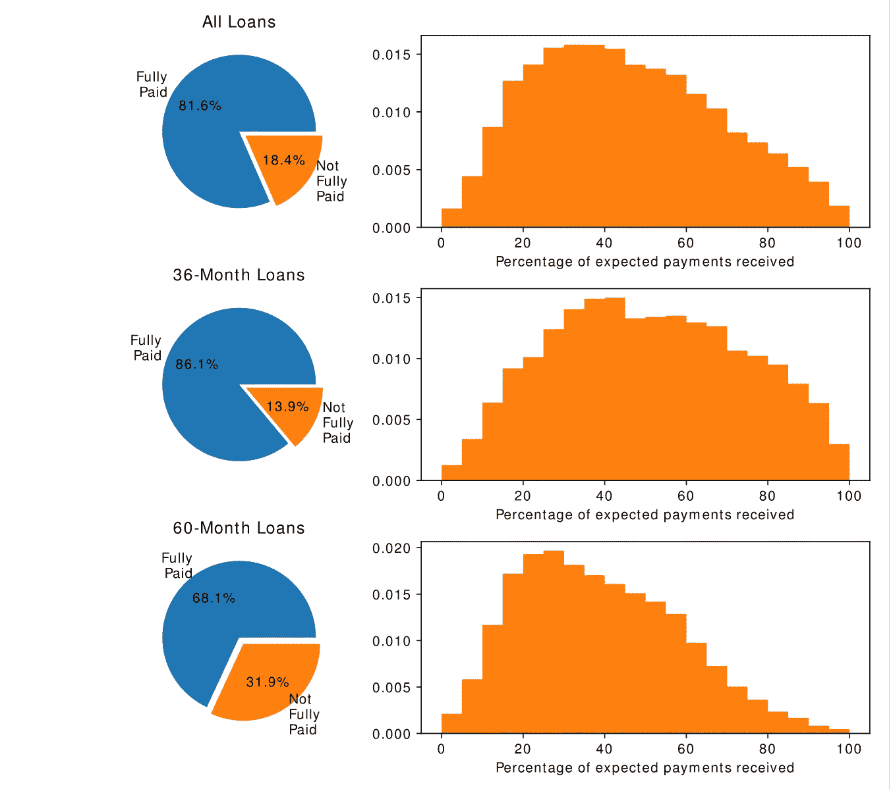

## 贷款列表

平台上当前列出的贷款数据可以用一个简单的 web API 以 JSON 格式检索。也可以使用 API 投资贷款。

太平洋时间早上 6 点、10 点、下午 2 点和 6 点，新贷款会在 Lending Club 平台上列出。有许多投资者使用软件自动投资贷款非常快，只要他们变得可用。

为了感受一下最好的贷款获得资金的速度有多快，我设置了一个脚本，每 5 秒查询一次贷款列表，从列表时间后一秒开始。下图显示了贷款的融资水平。每张图表都是在同一天不同的上市时间记录的。

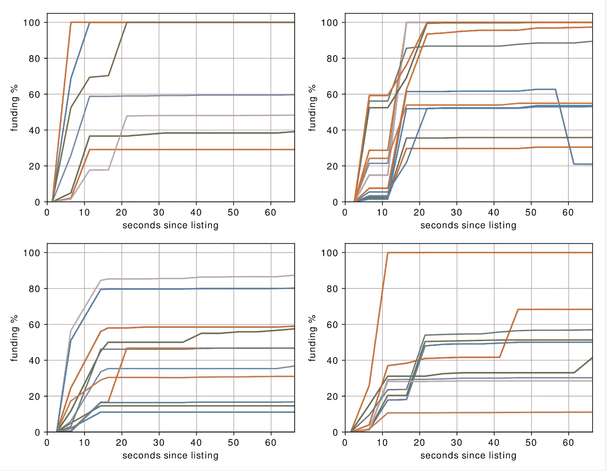

可以看到，一些贷款(可能是最好的贷款)在 5 到 20 秒后就获得了全部资金，而在 20 秒后，活动逐渐减少。

虽然 Lending Club 每月发放超过 50000 笔贷款，但在撰写本文时，平均只有 1200 笔贷款可用于人工投资或使用 API 进行投资。绝大多数贷款是提供给机构投资者或有自动投资设置的个人。目前还不清楚贷款是如何在这些群体之间分配的，分配是否是随机的。

## 数据清理

Lending Club 提供的贷款数据有点乱，需要大范围清理才能使用。例如，历史贷款数据中的就业时间长度具有这样的值:“1 年”、“3 年”或“10 年以上”，而当前列出的贷款中的相同字段仅具有月数。像这样的例子还有很多。此外，历史数据和列表数据的列名也不同。

除了清理之外，我还对数据做了一些调整，使其更适合:

*   我把最早的信用额度日期换算成了信用额度年龄。
*   我取了各种“months since”字段的倒数(例如 mths_since_last_major_derog，mths_since_recent_inq，…)。这将时间间隔转换成与这些事件的频率相关的东西。当事件从未发生时，它还允许使用合理的值 0。这由原始数据集中的空字段表示。
*   我通过基于期限、利率和贷款金额重新计算，修复了“分期付款”列中的一些值(包含一些贷款的无效数据)。

# 回溯测试

为了进行回溯测试，我实现了一个贷款和投资组合模拟器。投资组合由现金余额和贷款集合组成。模拟器以一个月的离散时间步长工作。每个月，对于投资组合中的每笔贷款，都会进行分期付款，从而增加投资组合的现金余额。一旦贷款全部还清(包括收回)，它将从投资组合中删除。

Lending Club 没有提供关于确切付款日期和金额的数据。他们提供的是最后一次收到付款的日期以及收到的本金、利息、滞纳金和收回的总金额。对于模拟器，我必须做一些假设:

*   我假设本金、利息和滞纳金在贷款期限内按月等额支付(从发放贷款之日到收到最后一笔付款之日)，但永远不会超过定期分期付款的金额。如果这不足以支付收到的全部金额，则认为剩余部分将在最后一期支付。这包括提前支付剩余余额的情况。
*   我假设在最后一次付款后 6 个月收到了收回款项。
*   我假设贷款在最后一次付款后 4 个月被注销。根据 Lending Club 的说法，这是典型的，但他们的数据中没有提供这种程度的细节。何时注销贷款实际上只与税务计算有关，因为它决定了该事件是被视为长期资本损失还是短期资本损失。

实际的回溯测试采用一个清理过的贷款数据表，其中有一个额外的“_score”列，包含评分算法的输出。分数可以来自神经网络或随机数发生器，以进行随机测试进行比较。然后，贷款数据按发放贷款的月份分组。

为了启动这个投资组合，在最初的 12 个月里，每个月会有 1000 美元加入到这个投资组合中。之后，只有贷款的收益可以用于再投资。每个月，可用的现金余额被投资到当月发放的贷款中，将最小金额 25 美元投资到尽可能多的贷款中。例如，如果在给定的一个月中有$1132 可用，那么 45 (=floor(1132/25))个最高得分的贷款每个被提供$25。

开始的时候，Lending Club 每月不会发放那么多贷款。在将数据集分成训练和测试数据之后，在测试数据集的前几个月中没有足够的贷款给算法选择。由于这个原因，模拟开始的时间要晚一些，此时每月可用的贷款是投资所需贷款的四倍。

一旦历史贷款表用尽，回溯测试通过每月提取任何现金余额来结束投资组合，直到所有贷款都被完全处理。在这一点上，投资组合的价值回到 0，投资组合的回报率可以计算出来。

模拟应纳税帐户时，投资组合的现金余额每月会因当月产生的纳税义务而减少。纳税义务是收到的利息、滞纳金和回收乘以所得税率，减去已冲销贷款的剩余本金乘以适用的长期或短期资本利得税率。后面部分中的所有模拟都使用这些税率:收入和短期资本利得为 24%，长期资本利得为 15%。

该模拟还计算默认利率，即每年冲销的本金的百分比。为了计算这一点，模拟跟踪了一个假设场景，其中没有违约，但违约贷款的剩余本金没有被冲销，而是像贷款提前还清一样进行分配。这种无违约情景和实际收益率之间的差额就是违约率。

## 投资组合的回报率

计算有多次存款和取款的投资组合的回报率并不简单。

我的方法基于一个事务列表，其中每个列表条目代表一个固定的时间段，比如一个月。边界条件是投资组合在交易列表前后的值为零。

示例[1000，1000，0，0，0，-300，-1000，-800]:

从一个空的投资组合开始，第一期和第二期前存 1000，第 6 期前取 300，第 7 期前取 1000，最后取 800，使投资组合余额回到 0。

本例的净收益为 100 英镑(取款总额比存款总额多 100 英镑)。这里的结果是每期的平均回报率为 0.00854 (0.854%)。如果期限是一个月，那么年化回报率是 10.74%。

该函数如下所示:

`sim(list, ror)`用列表中的交易和每期收益率(ror)模拟投资组合。该函数返回列表覆盖的时间段后投资组合的值。如果 ror 参数等于投资组合的实际收益率，那么结果应该为零(基于边界条件)。如果 ror 参数高于实际收益率，则 sim 函数将返回一个正值。如果 ror 参数太低，情况正好相反。

root_scalar 函数搜索使`sim(list, ror)`的结果为零的 ror 值。

## 贷款回报率

同样的方法可以用来计算单笔贷款的收益率。

示例[1000，-100，-100，-100，-100，-100，-100，-100，-100，-100，-100，-100，-100]:

发行了一笔价值 1000 英镑的贷款，分 11 期偿还，每期 100 英镑。平均回报为每期 1.623%，如果期限为一个月，则年化 21.31%。

下图显示了 x 个月后违约的不同贷款的年化回报率。贷款有两种不同的期限(36 个月和 60 个月)和三种不同的利率(5%，10%，15%)。

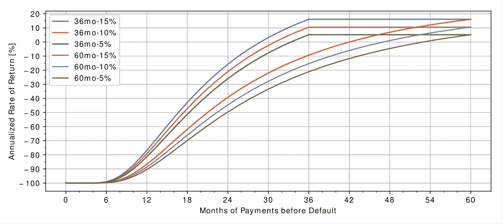

例如，一笔为期 36 个月、利率为 10%的贷款在 24 次还款后违约，你的年回报率为-21%。不幸的是，这并不容易转化为整个投资组合的回报率。如果你要投资这笔贷款，如果你要立即将所有收益投资于具有完全相同资产的贷款，那么你的整个投资组合也将呈现-21%的年回报率。

# 构建和训练神经网络

对于神经网络，我使用了 Keras 和 Tensorflow 库，它们为您完成了几乎所有繁重的工作。Tensorflow 是后端，允许您构建可以映射到可用 CPU 和 GPU 资源的计算图。Keras 在此基础上增加了神经网络方面，如层定义、激活函数和训练算法。

## 更多数据预处理

在将贷款数据输入神经网络之前，还有一些处理工作要做。仍然有分类数据需要转换—例如，贷款目的(“债务合并”、“房屋修缮”、“商业”…)，或者居住州(“CA”、“NY”…)。这些需要被转换成一次性编码:

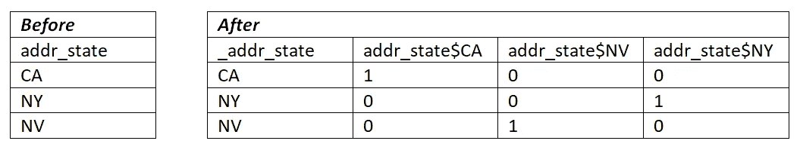

如果类别只有几个成员，将它们合并到“其他”类别中有助于防止过度匹配。在上面的示例中，可以添加另一列“addr_state$OTHERS”来捕获贷款少于 1000 笔的所有州。

添加到“addr_state”列的前导下划线是我的约定，表示在将数据输入神经网络之前，应该删除该列。这同样适用于新贷款列表数据中不可用的列，因为它们与贷款的结果相关，而贷款的结果还不知道(loan_status，total_rec_int …)。

## 选择网络应该预测什么

这些是我评估过的选项:

*   二进制输出:全额支付与冲销。
*   平滑输出:收到的付款总额占预期付款的比例。

也可以在二进制和平滑输出之间进行插值，如下面的代码所示。“平滑度”参数值 0 选择二进制输出，而值 1 选择平滑输出。

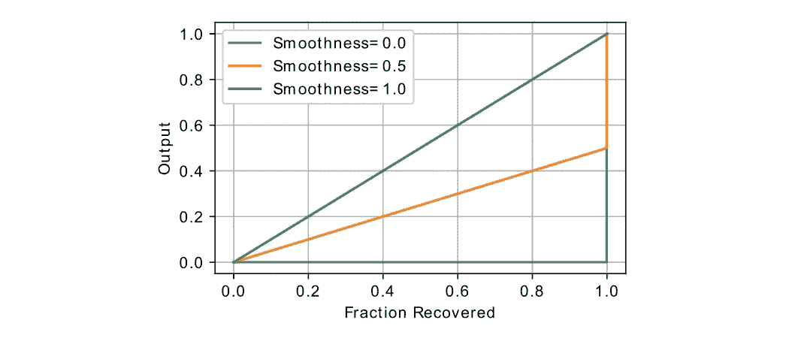

使用二进制输出丢弃了有价值的信息，因为神经网络不知道贷款何时违约。在期限结束前几个月发生违约，要比首次付款前违约好得多。与此同时，选择完全平滑的产出会让一笔即将到期的违约贷款看起来非常类似于一笔完全偿还的贷款，尽管这在概念上有很大的不同。

完全平滑的输出有一个直观的优点:它是线性的，可以对多个贷款的结果进行平均，以得出这些贷款组合的支付分数。例如，如果训练数据集中有三笔参数非常相似的贷款，并且结果分别为 1.0、1.0 和 0.7，则平均值为 0.9。这相当于投资所有三笔贷款的回报率。当神经网络看到这样的贷款时，它产生这个输出是有意义的。同样的贷款，当使用二元期权时，得分分别为 1.0，1.0 和 0.0，平均为 0.67。因此，使用二元期权的模型预计会更加规避风险。

更多关于控制风险厌恶和比较图表可以在控制风险部分找到。

此时，我们有了全数字的 x 和 y 数据，并且可以将数据从 pandas 数据帧转换为 Keras 框架所期望的 numpy 数组。在这一点上，存储列名的序列是很重要的，以便以后在将训练好的网络应用于贷款列表时，可以准备列表数据，以便列处于正确的顺序，并且分类数据的一次性编码等同于训练数据。

最后一步是缩放数据，使所有输入值的大小大致相同。我评估了几个选项:

*   (最小值，最大值)-> (0，1)
*   (最小值，最大值)-> (-1，1)
*   (-sigma，平均值，+sigma) -> (-1，0，1)

最后一个选项产生的结果明显好于前两个。同样，保存每一列的缩放参数很重要，这样可以将相同的缩放应用于列表数据。

## 定义网络

网络的确切结构似乎并不重要。我对随机结构进行了一些测试，除非它们非常退化，否则它们会产生类似的结果。

输入层从贷款数据中提取大约 160 列(居住州的一次性编码产生许多列)。

输出层由具有线性激活函数的单个神经元组成。

受“通过混合激活函数进化简约网络”(Hagg、Mensing 和 Asteroth)的启发，我使用了具有混合激活函数的层，但在训练期间没有任何进化:

为了减少过度拟合，我发现高斯噪声层是最有效的。添加辍学层也可以帮助，但我没有成功的正则化。

仍然有一些过度拟合，但是在回溯测试中，与测试数据相比，当使用训练数据时，回报率仅高大约一个百分点。

## 解释输出

神经网络的输出可以解释为我们可以预期收到的总付款(分期付款乘以月期限)的一部分。例如，一笔分期付款为 500 美元、期限为 36 个月的贷款的总支出为 18，000 美元。如果该贷款的模型输出为 0.9，这意味着模型预计支付额为 0.9 * 18，000 美元= 16，200 美元。

为了给贷款打分，我们真正想知道的是三年后的预期支出占初始本金的比例:

分数= y * (1.0+(int_rate/12)) ⁶，其中 y 是模型的原始输出

请注意，该公式中的月数固定为 36，即使是 60 个月的贷款也是如此，以便进行比较。因此，即使是 60 个月的贷款，分数也相当于 36 个月的预期回报。

# 结果

这是引言中的图表，比较了不同投资策略下投资组合的收益。

左边的图表显示了投资组合的回报率，其中贷款是按等级过滤的，但在其他方面是随机选取的。该等级由 Lending Club 指定，与违约概率相对应，并决定借款人必须支付的利率。人们可以看到，违约率(每年冲销的未偿还本金的百分比)随着等级的提高而降低。

右边的图表显示了使用上述模型对贷款进行评分并做出投资决策的投资组合的回报率。对模型的输出进行后处理以调整风险。这在下一节“控制风险”中有更详细的描述。

## 控制风险

当使用模型进行投资决策时，需要调整贷款选择，以实现低违约率，同时保持高投资回报。可以在两个地方调整选择算法的风险级别:在训练模型时，或者作为使用模型输出时的后处理步骤。后者更实用，因为可以更快地做出改变，而不必训练新的模型，并且相同的模型可以用于不同的策略。

## 通过后处理进行风险调整

默认情况下，贷款的得分是根据以下公式从模型的预测(y)中计算出来的:

得分= y * (1.0+(int_rate/12)) ⁶

这是前面图表中风险调整参数为 0.0 的点。

在极端情况下，参数为-1.0(代表最高风险)，根本不使用模型的预测，只有利率进入得分:

分数= 1.0 * (1.0+(int_rate/12)) ⁶

它只选择利率最高的贷款。

另一方面，当参数为+1.0(代表最低风险)时，仅使用模型的预测，而不对利率进行任何调整:

得分= y

这旨在将违约率降至最低。

在默认公式中使用 y 之前，可以通过调整 y 在这些情况之间进行插值:

得分= risk_adjust(y，adj) * (1.0+(int_rate/12)) ⁶

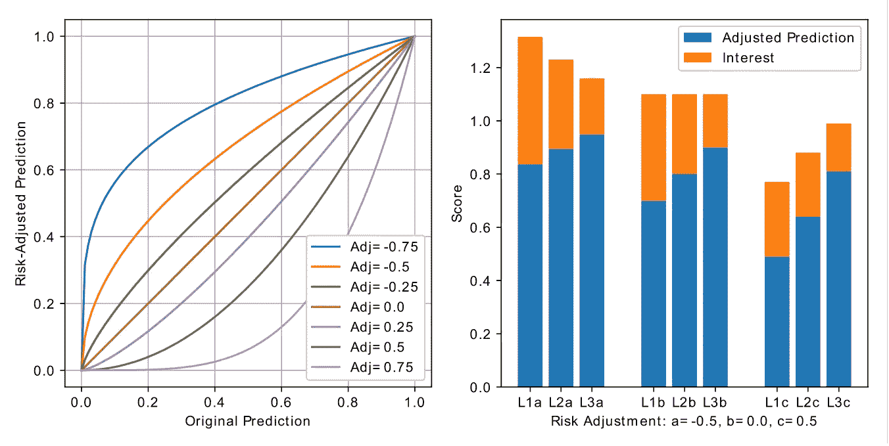

具有不同参数的风险调整函数如左图所示。调整函数的关键属性是它改变点(1，1)附近曲线的斜率。该函数在 adj=-0.5 时取 y 的平方根，在 adj=0.0 时不改变 y，在 adj=0.5 时将 y 提升到 2 的幂。

在任何情况下，该函数将 y 提升到 adj 确定的某个幂，并对拐点情况进行特殊处理:

当 adj 低于零时，通过减少与良好贷款预测相比的相对差异，对不良贷款的预测进行调整，以使它们看起来更好。当 adj 高于零时，对不良贷款的预测会进行调整，通过增加相对差异使它们看起来更糟。

右图显示了三种不同贷款(L1、L2 和 L3)在三种不同风险调整(a、b 和 c)下的得分。蓝色条代表调整后的预测(risk_adjust(y，adj))，而蓝色和橙色条的组合代表最终得分。橙色条显示利率对最终得分的影响。

在中间(L1b、L2b 和 L3b ),没有风险调整，在本例中选择贷款的预测和利率，使得最终得分相同。我们可以看到，贷款 L1 收到最低的预测(违约概率最高)，但它有最高的利率来弥补差额。贷款 L3 具有最高的预测值(最低的违约概率)，但它也具有较低的利率，因此最终得分与其他贷款相同。

在左侧(L1a、L2a 和 L3a)，应用了-0.5 的风险调整，这将原始预测提高到更接近 1，从而减小它们之间的相对差异。现在，利率最高的贷款 L1 战胜了其他贷款，尽管它的预期风险更高。

在右边(L1c、L2c 和 L3c)，应用了+0.5 的风险调整，这使原始预测更接近 0，增加了它们之间的相对差异。现在，被认为更安全的贷款 L3 战胜了其他贷款，尽管它的利率更低。

我选择这个特殊的函数进行风险调整是因为这些特性:

*   它将 0 到 1 的输入范围转换为 0 到 1 的输出范围。
*   它以一致的方式缩放相对差异:y1/y2 = y3/y4<=>f(y1)/f(y2)= f(y3)/f(y4)
*   它在调整范围的末端收敛到有意义的极值:
*   *在 adj=-1.0 时，它收敛到一条穿过点(1，1)的水平线，这意味着将任何预测调整为 1，这意味着只有利率用于评分。*
*   *在 adj=+1.0 时，它收敛到穿过点(1，1)的垂直线，增加了相对差异，使得无论利率如何，它都不能克服调整后预测中的差异。这意味着利率是不重要的，只有预测被用来获得分数，导致贷款的选择只基于违约概率。*

# 通过培训进行风险调整

在训练模型时，有各种方法来控制贷款选择中的风险:

*   模型输出的目标值可以调整。可以对训练数据使用类似于上述的风险调整，或者可以改变先前讨论的平滑度参数。
*   样本的权重可以调整，这样拖欠的贷款就有更高的权重，或者权重可以是产值的函数。

这些方法控制内置于模型中的内在风险。同时，可以使用通过后处理的风险调整方法:

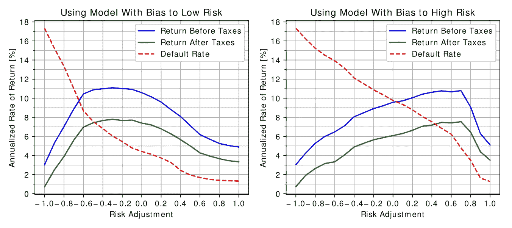

左边的数字来自一个本质上选择低风险投资的模型。它的平滑度参数为 0.5，并通过一个与全额支付贷款与冲销贷款之比成比例的因子来提高冲销贷款的权重。

右边的数字来自一个本质上挑选风险更高的投资的模型。它用平滑度参数 1.0 和所有样本的相同权重来训练。

参考模型(来自上面结果部分的图)的训练平滑度为 1.0，并增加了冲销贷款的权重。

在这些例子中，回报率接近 11%的平稳期比参考模型小。似乎最好用内在风险偏差来训练模型，使得平台的宽度最大化，并且在后处理期间仅需要有限的风险调整。

## 违约率变化时的绩效

只有在经济条件稳定的情况下，训练和配置模型和选择算法以最大化回报率(由回溯测试确定)才是有效的方法。观察模型在影响违约率的不同条件下的表现也很有趣。

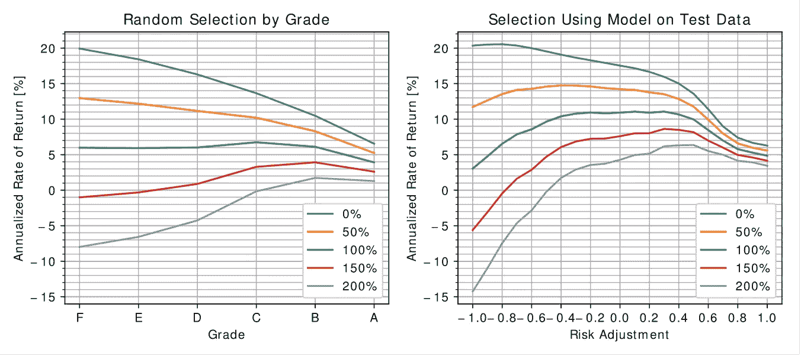

上图显示了不同违约率下的假设收益率。蓝线显示假设没有违约(0%)时的回报，绿线是违约率没有变化(100%)的参考，紫线显示假设违约率翻了一番(200%)时的回报。

## 贷款有限选择的效果

正如我前面提到的，Lending Club 只为基于 API 的投资提供一小部分贷款。如果贷款的选择有限，为了投资可用的现金余额，必须选择更大比例的贷款。为了说明这种效果，我进行了模拟，每月随机选择一个贷款子集，算法可以从中进行选择。

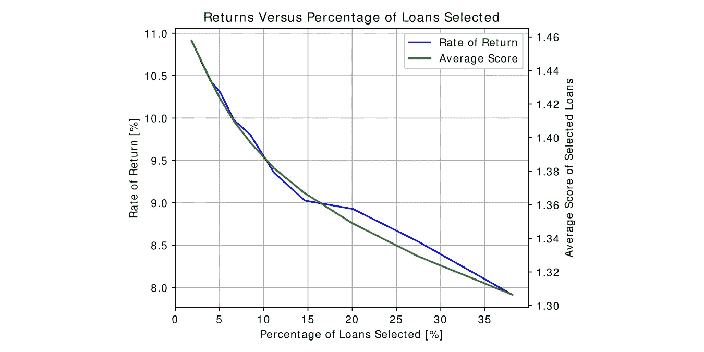

正如预期的那样，随着可供选择的贷款减少，投资组合的回报率下降，因此选择的贷款比例增加。还可以清楚地看到，由评分算法分配的所选贷款的平均分数与回报率非常相关。

# 回顾回溯测试

在这个模型被用于实际贷款投资之前，还有一个障碍需要克服，那就是需要额外的测试。在我之前讨论的回溯测试中，该算法可以访问给定月份列出的所有贷款，并能够从中选择最佳贷款，直到不再有现金余额。

在现实生活中，我们不可能等那么久。贷款是小批量上市的，每天四次，必须实时做出决定，以避免其他投资者抢走最好的贷款。

我们从每批贷款中挑选出最佳贷款直到现金余额耗尽的策略并不是最优的，因为一些批次可能有高比例的良好贷款，而其他批次可能只有不良贷款。一个更好的策略是将一定的现金余额设定为大于零，以便保留一笔储备，在几笔贷款同时上市的情况下购买优质贷款。同时，现金余额不应过高，以避免损失回报(Lending Club 不对现金余额支付利息)。

如前所述，该模型为每笔贷款分配一个分数，该分数大致代表预期的总回报。现在的目标是找到这个分数的阈值，它可以用来决定是否投资贷款，同时保持合理的现金余额。换句话说，我需要实现一个控制循环，根据可用现金余额来调节选择阈值。

我的方法是基于 PI(比例积分)控制器。下图显示了一个控制器的现金余额和选择阈值，该控制器被设置为将现金余额保持在$200 左右。

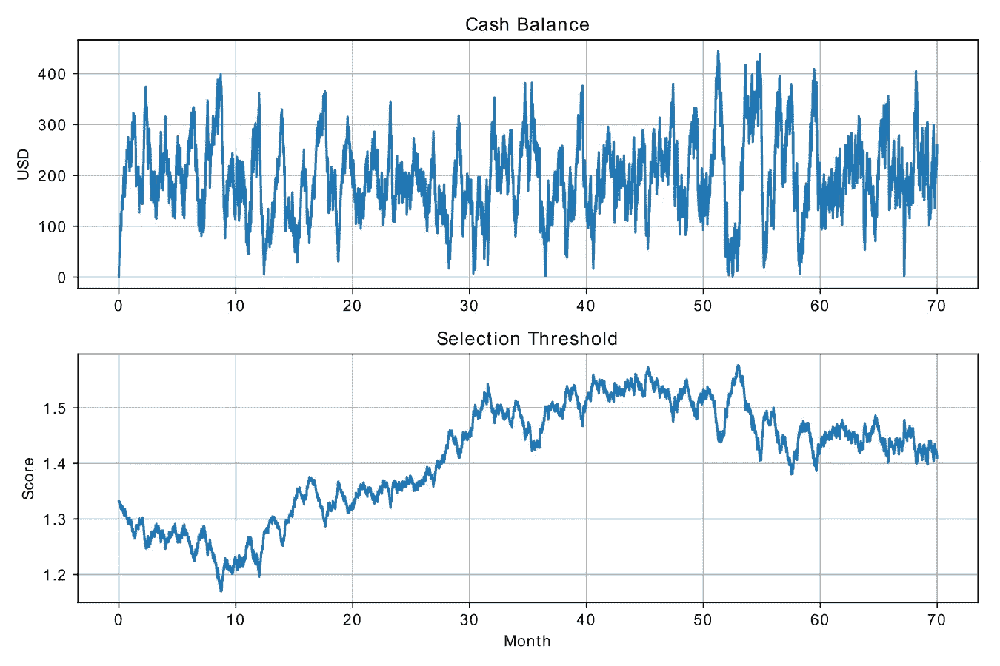

以下是相关代码:

控制器对参数的变化相对不敏感。我对它们进行了调整，使选择阈值相对平滑，并保持现金余额不会偏离太多。只有积分项的控制器也是可能的，但是它会导致现金余额更大的波动。

投资组合模拟器现在将某个月发放的贷款列表分成 120 个随机批次(30 天内每天 4 个)，每个批次中的贷款数量大致相等，但随机。同时，当月收到的付款被平均分成 120 份。然后，模拟器为每个批次运行控制回路和选择算法。

使用这种控制器的模拟投资组合产生的回报与使用早期方法模拟的投资组合的回报没有区别，早期方法可以获得在一个月内发放的所有贷款。

# 自动投资

要设置自动投资，有必要在列出新贷款时每天运行四次脚本。任务或 cron 作业在列表时间前几分钟启动脚本。

该脚本执行以下操作:

1.  加载模型和 PI 控制器的状态。
2.  确定下一批贷款上市的确切时间。
3.  如果需要，在下一次列表时间前几秒钟睡眠。
4.  查询当前现金余额，以确定投资贷款的最大数量。
5.  将现金余额输入 PI 控制器，以计算新的选择阈值。
6.  一直睡到准确的列表时间，或者一秒钟后考虑到时钟的差异。
7.  检索贷款列表。
8.  通过模型和评分算法运行列表，并根据分数对它们进行排序。
9.  编制一份分数高于阈值的贷款清单。如果现金余额太低，无法投资所有这些贷款，那么就尽可能多地拿最高分。
10.  订购这些贷款。
11.  保存 PI 控制器的状态信息供下次使用。

还要避免多次投资同一笔贷款。当从 Lending Club 查询列表时，有一个选项只包括在最近的列表时间列出的贷款。只要脚本获得正确的时间，相同的贷款列表不会被检索超过一次。作为额外的预防措施，还可以验证作为每个贷款记录的一部分的上市时间是当前的和预期的。

例如，该脚本可以在本地运行，并由 Windows 任务计划程序触发。这有点不切实际，除非你有一台专用的电脑，在需要的时间开机并在线。

更好的解决方案是将脚本转移到云服务，让它在那里运行。有各种各样的选择适合网络托管，如谷歌云或 Heroku。迁移到这些服务可能有点棘手，因为他们期望应用程序是 web 服务，并且他们不提供持久的文件系统。因此，所有文件 IO 都需要被转换以使用远程文件系统或数据库。

最后，我使用了 [PythonAnywhere](http://www.pythonanywhere.com) ，它提供了一个基于云的环境，其行为就像 Linux 系统上的普通用户帐户，包括持久文件存储和调度任务的能力。

# 结论

虽然模拟结果看起来很有希望，自动投资脚本也在发挥作用，但对我的回报会有什么影响还有待观察。因此，最终分析将不得不推迟，直到有可能对违约率做出首次估计。

经济的变化会对结果产生影响。同样可以肯定的是，Lending Club 利用他们的贷款数据对贷款业绩做出了更好的预测，并改进了他们的算法来分配利率。这将减少甚至消除随机选择贷款的投资组合和使用我的模型的投资组合之间的相对表现差异。