# Azure 中智能、实时和可扩展的视频处理

> 原文：<https://towardsdatascience.com/intelligent-realtime-and-scalable-video-processing-in-azure-201f87104f03?source=collection_archive---------5----------------------->

# 1.介绍

在本教程中，创建了一个端到端项目，以便在 Azure 中进行智能、实时和可伸缩的视频处理。在这种情况下，可以利用火车的视频检测涂鸦和识别车皮号码。本项目的性质如下:

*   检测涂鸦和识别车牌号的智能算法
*   从边缘到云端实时可靠地处理视频
*   可扩展以适应视频数量的指数级增长
*   可以针对任何视频处理功能进行优化的功能项目

该项目的架构可描述如下:

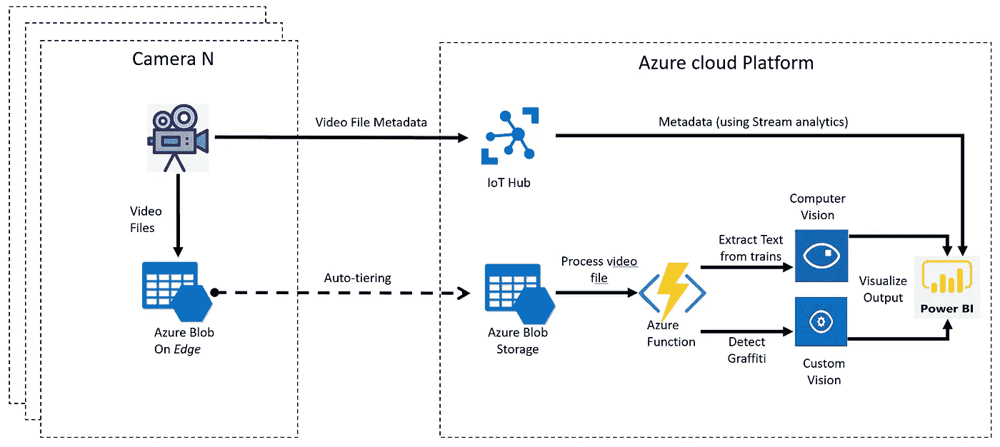

1\. Architecture overview

在这个博客中，这个架构是这样实现的:

*   2a。检测火车上涂鸦的认知服务(自定义视觉)
*   2b。识别货车编号的认知服务(计算机视觉 OCR)
*   3.用于视频并行处理的 Azure 函数
*   4.用于可视化的 Power BI(可选)
*   5.用于数据自动分层的物联网边缘架构(可选)
*   6.结论

在这个博客中，所有的视频处理都是在 Azure 中完成的。参考[这个后续教程](https://medium.com/@rebremer/how-to-deploy-your-ai-model-on-edge-devices-8c38a9519c58)其中涂鸦检测是在摄像头(边缘)本身上完成的。下一章，将部署 Azure 认知服务。

# 2.Azure 认知服务

[Azure 认知服务](https://azure.microsoft.com/en-us/services/cognitive-services/)是一组可以注入你的应用的 API。它包含语音识别、图片中的对象识别和语言翻译的智能算法。这些模型大多是预先训练好的，可以集成到您的项目中。大多数模型也可以作为容器部署在边缘。在这个项目中，将使用两个 API:

*   将用于检测火车上涂鸦的自定义视觉。这个模型需要有/没有涂鸦的火车的图片来学习。这一步可以被视为“在已经在 Azure Cognitive Services 中训练过的图像识别模型的神经网络中添加最后一个自定义层”
*   将用于识别列车上车厢号计算机视觉 OCR。这种模式不需要培训，可以下架

在本章的剩余部分，将执行以下步骤:

*   2a。培训和部署自定义视觉 API 来检测涂鸦
*   2b。部署 OCR 计算机视觉 API

以及实现的架构的以下部分:

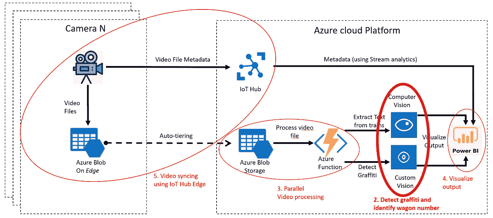

2\. Cognitive services to detect graffiti and identif wagon number

## 2a。培训和部署自定义视觉 API 来检测涂鸦

转到[自定义视觉网站](https://www.customvision.ai/)并使用您的 Azure 广告凭证登录。登录后，选择创建具有属性“分类”和“多类(每个图像一个标签)”的自定义视觉项目，另请参见下文。

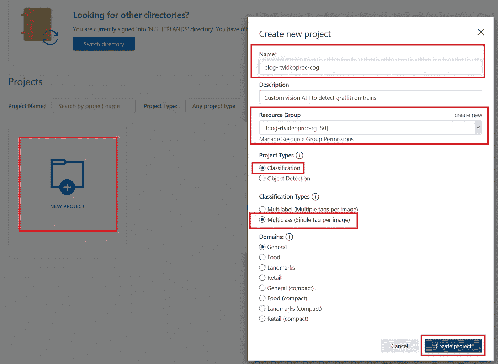

2a1\. Create Custom Vision API project

然后将以下图像下载到以下 git 项目中的文件夹[cognitive services](https://github.com/rebremer/realtime_video_processing/tree/master/CognitiveServices)/CustomVisionImages 中:

```
[https://github.com/rebremer/realtime_video_processing.git](https://github.com/rebremer/realtime_video_processing.git)
```

第一步，将带有涂鸦标签的涂鸦图片添加到您的项目中。其次，将带有标记涂鸦的 no_graffiti 图片添加到您的项目中，然后进行底片处理。然后使用快速通道训练模型，也见下文。

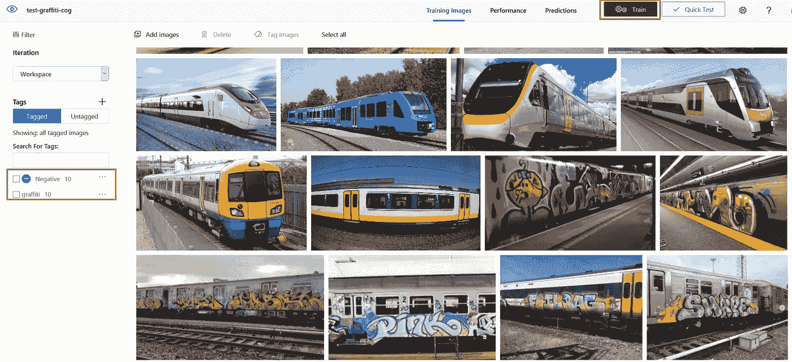

2a2\. Train Custom Vision Api project

一旦您训练了模型，您可以通过点击“快速测试”来测试模型，然后使用之前下载的 git 项目从测试文件夹中选择一个图像。

## 2b。部署 OCR 计算机视觉 API

转到在步骤 2a 中创建的资源组，部署 OCR 计算机视觉 API。点击添加按钮，在搜索框中输入“**计算机视觉**”。选择 F0 作为定价层。部署计算机视觉 API 后，资源组将如下所示。

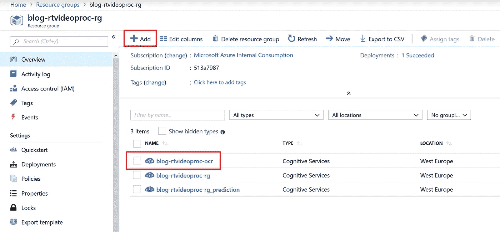

2b1\. Resource group after Custom Vision API and Computer Vision for OCR is deployed

在下一章中，API 将用于检测视频中的涂鸦和货车号。

# 3.用于并行视频处理的 Azure 函数

一旦一个新的视频被上传(同步)到 Azure Blob 存储器中，它将立即被如下处理:

*   Azure Blob 存储有一个触发器，它执行一个简单的 Azure 函数，向 Azure 队列发送消息
*   Azure Queue 有一个执行高级 Azure 功能的触发器，该功能 1)从 blob 存储帐户检索视频，2)使用 OpenCV 每秒获取一帧视频，3)检测帧上的涂鸦，识别货车号并将结果写入 csv 文件

Azure 队列步骤是并行视频所必需的。在 blob 触发器直接触发高级 Azure 功能的情况下，视频仅被串行处理。并行视频处理架构如下所示。

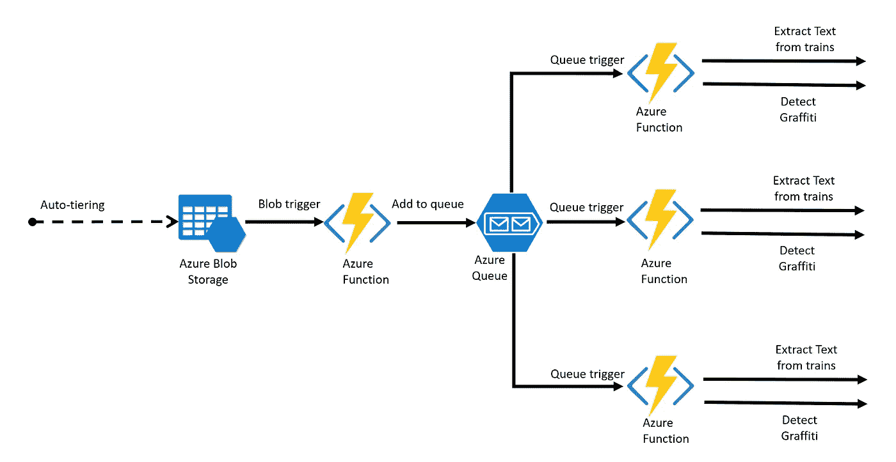

3.1\. Parallel video processing

在本章的剩余部分，将执行以下步骤:

*   3a。用 docker 安装 Azure 函数的预备程序
*   3b。使用 blob 容器和队列创建 Azure 存储帐户
*   3c1。(可选)为 Azure 函数 Blob 触发器创建 docker 图像
*   3c2。部署 Azure 函数 Blob 触发器
*   3d1。(可选)为 Azure 函数队列触发器创建 docker 映像
*   3d2。部署 Azure 函数队列触发器
*   3e。用视频运行测试

以及实现的架构的以下部分:

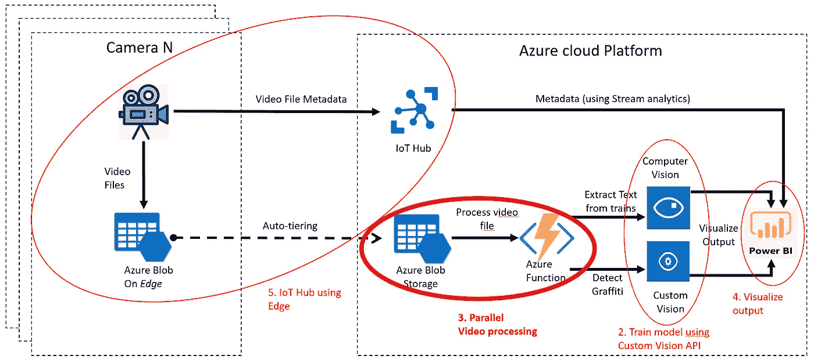

3.2\. Steps in blog plotted on Architecture. Parallel video processing in bold as next step

其中并行视频处理能力的细节可以在前面的图 3.1“并行视频处理”中找到。

## 3a。用 docker 安装 Azure 函数的预备程序

为了从视频创建帧，需要一个带有 OpenCV 的 Azure 函数。为此，使用了一个带有 Python 的 Azure 函数，该函数使用一个预装了 OpenCV 依赖项的 docker 映像。为此，需要安装以下预备程序:

*   安装 [Visual Studio 代码](https://code.visualstudio.com/)
*   安装 [Azure 核心工具版本 2.x](https://docs.microsoft.com/en-us/azure/azure-functions/functions-run-local#v2) 。
*   安装 [Azure CLI](https://docs.microsoft.com/en-us/cli/azure/install-azure-cli) 。此博客需要 Azure CLI 版或更高版本。运行`az --version`找到您拥有的版本。
*   (可选，如果你想创建自己的图像)安装 [Docker](https://docs.docker.com/install/)
*   (强烈推荐)在运行本教程中的命令之前，请先执行本教程中的命令

## 3b。使用 blob 容器和队列创建 Azure 存储帐户

需要 Azure 存储帐户来上传视频和运行 Azure 队列服务，Azure 功能将在这些服务上触发。打开 Visual Studio 代码，打开一个新的终端会话，并执行以下命令:

```
az loginaz group create -n blog-rtvideoproc-rg -l westeuropeaz storage account create -n <stor name> -g blog-rtvideoproc-rg --sku Standard_LRS
az storage container create -n videoblob --account-name <stor name>
az storage container create -n pics --account-name <stor name>
az storage container create -n logging --account-name <stor name>
az storage blob upload -f Storage/ImageTaggingLogging.csv -c logging -n ImageTaggingLogging.csv --account-name <stor name> --type appendaz storage queue create -n videoqueue --account-name <stor name>
```

确保将<stor name="">的全局唯一名称作为存储帐户名。</stor>

## 3c1。(可选)为 Azure 函数 Blob 触发器创建 docker 图像

在这一步中，创建了一个简单的 Azure 函数，当一个新的视频被添加到存储帐户时，该函数被触发。然后提取视频的名称，并将其添加到在步骤 3b 中创建的存储队列中。打开 Visual Studio 代码，创建一个新的终端会话并执行以下命令(出现提示时选择 python 作为运行时)

```
func init afpdblob_rtv --docker
cd afpdblob_rtv
func new --name BlobTrigger --template "Azure Blob Storage trigger"
```

随后，打开 Visual Studio 代码，选择“文件”，选择“打开文件夹”，然后选择在前面的命令中创建的目录 afpdblob_rtv，另请参见下文:

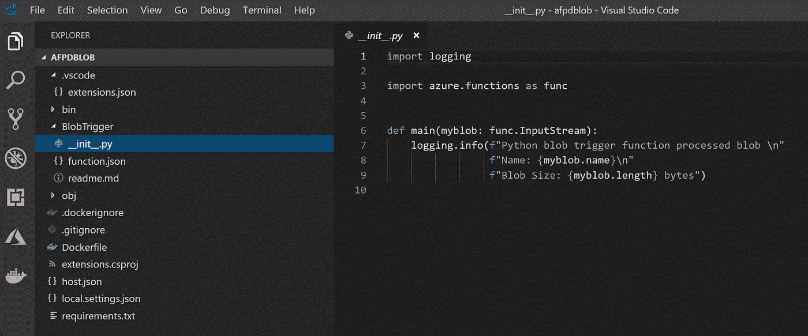

3c1\. Azure Function Blob trigger

在此项目中，替换以下文件的内容

```
BlobTrigger/__init__.py
BlobTrigger/function.json
Dockerfile
requirements.txt
```

同 github 项目内容[https://github . com/reb remer/real time _ video _ processing/tree/master/azure function/afpdblob _ RTV/](https://github.com/rebremer/realtime_video_processing/tree/master/AzureFunction/afpdblob/)。下一步是构建 docker 映像，并将 docker 映像发布到公共 Docker Hub。或者，也可以使用私有的 Azure 容器注册中心(ACR ),但是要确保设置了凭证。执行以下命令发布到 docker hub

```
docker login
docker build --tag <<your dockerid>>/afpdblob_rtv .
docker push <<your dockerid>>/afpdblob_rtv:latest
```

## 3c2。部署 Azure 函数 Blob 触发器

在这一步中，docker 映像被部署为 Azure 函数。如果您跳过了 3c1 部分来创建自己的 docker 映像，您可以用 bremerov 替换<your dockerid="">，即 bremerov/afpdblob_rtv:latest。执行以下命令:</your>

```
az appservice plan create --name blog-rtvideoproc-plan2 --resource-group blog-rtvideoproc-rg --sku B1 --is-linuxaz functionapp create --resource-group blog-rtvideoproc-rg --os-type Linux --plan blog-rtvideoproc-plan --deployment-container-image-name <your dockerid>/afpdblob_rtv:latest --name blog-rtvideoproc-funblob --storage-account <stor name>az functionapp config appsettings set --name blog-rtvideoproc-funblob --resource-group blog-rtvideoproc-rg --settings remoteStorageInputContainer="videoblob" `
AzureQueueName="videoqueue" `
remoteStorageAccountName="<stor name>" `
remoteStorageAccountKey="<stor key>"az functionapp restart --name blog-rtvideoproc-funblob --resource-group blog-rtvideoproc-rg
```

当功能被正确部署后，在门户中创建的功能如下

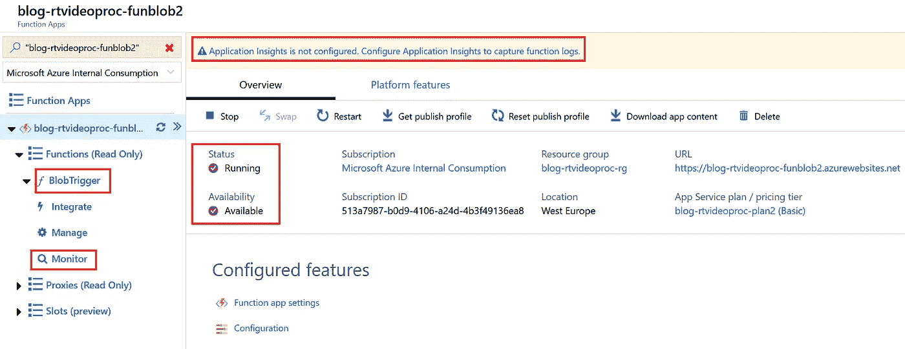

3c2.1 Azure Function Blob trigger deployed correctly

当您在 Blob Trigger 上打卡时，您可以看到 docker 图像中的代码。最后一步，添加应用洞察(见截图)并按照向导进行操作。这使您能够在 Monitor 选项卡中查看日志记录。作为测试，找到视频 Video1_NoGraffiti_wagonnumber。MP4，并使用向导将其上传到 blob 存储容器视频博客，见下文

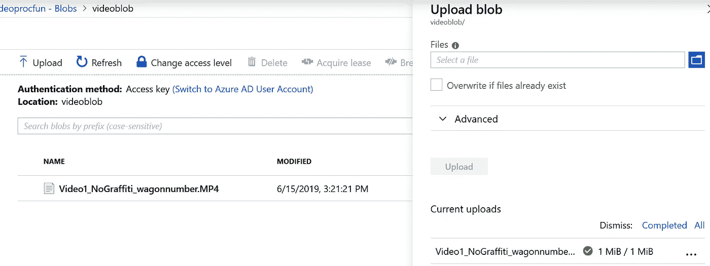

3c2.2 Upload blob

视频上传后，使用 blob 触发器触发 Azure 函数，一个 json 文件被添加到 Azure queue videoqueue，如下所示

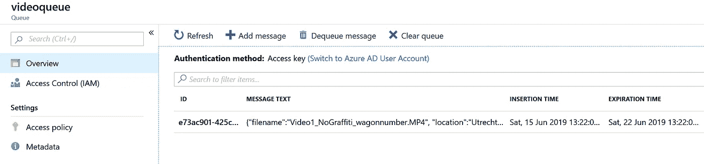

3c2.3 Json file with video name added to queue

## 3d1。(可选)为 Azure 函数队列触发器创建图像

在这一步中，创建了一个 advancedAzure 函数，当消息被发送到在步骤 3c2 中部署的 Azure 队列时，该函数被触发。打开 Visual Studio 代码，创建一个新的终端会话并执行以下命令(出现提示时选择 python 作为运行时)

```
func init afpdqueue_rtv --docker
cd afpdqueue_rtv
func new --name QueueTrigger --template "Azure Queue Storage trigger"
```

随后，打开 Visual Studio 代码，选择“文件”，选择“打开文件夹”，然后选择在前面的命令中创建的目录 afpdblob，另请参见下文:

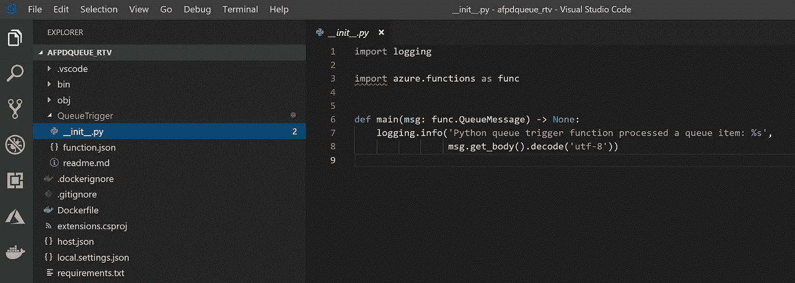

3d1.1 Azure Function Queue trigger

在此项目中，替换以下文件的内容

```
QueueTrigger/__init__.py
QueueTrigger/function.json
Dockerfile
requirements.txt
```

同 github 项目内容[https://github . com/rebremer/real time _ video _ processing/tree/master/azure function/afpdqueue _ RTV/](https://github.com/rebremer/realtime_video_processing/tree/master/AzureFunction/afpdblob/)。下一步是构建 docker 映像，并将 docker 映像发布到公共 Docker Hub。或者，也可以使用私有的 Azure 容器注册中心(ACR ),但是要确保设置了凭证。执行以下命令发布到 docker hub

```
docker login
docker build --tag <<your dockerid>>/afpdqueue_rtv .
docker push <<your dockerid>>/afpdqueue_rtv:latest
```

## 3d2。部署 Azure 函数队列触发器

在这一步中，docker 映像被部署为 Azure 函数。如果您跳过了 3d1 部分来创建自己的 docker 映像，您可以用 bremerov 替换<your dockerid="">,即 bremerov/afpdqueue_rtv:latest。执行以下命令:</your>

```
az functionapp create --resource-group blog-rtvideoproc-rg --os-type Linux --plan blog-rtvideoproc-plan --deployment-container-image-name **<your dockerid>**/afpdqueue_rtv:latest --name blog-rtvideoproc-funqueue --storage-account <stor name>az functionapp config appsettings set --name blog-rtvideoproc-funqueue --resource-group blog-rtvideoproc-rg --settings `
remoteStorageAccountName="<stor name>" `
remoteStorageAccountKey="<stor key>" `
remoteStorageConnectionString="<stor full connection string>" `
remoteStorageInputContainer="videoblob" `
AzureQueueName="videoqueue" `
remoteStorageOutputContainer="pics" `
region="westeurope" `
cognitiveServiceKey="<key of Computer vision>" `
numberOfPicturesPerSecond=1 `
loggingcsv="ImageTaggingLogging.csv" `
powerBIConnectionString=""az functionapp restart --name blog-rtvideoproc-funqueue --resource-group blog-rtvideoproc-rg
```

当正确部署了这些功能后，就会在门户中创建如下功能。

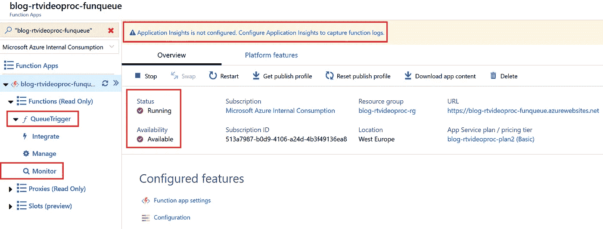

3d2.1 Azure Function Queue trigger deployed correctly

同样，选择添加 Applications Insights(参见顶部屏幕截图)，您可以选择为 blob 触发器创建的相同 application Insights 资源。Application Insights 可用于查看 monitor 选项卡中 QueueTrigger 的日志记录。

如果 Azure 函数队列触发器成功运行，Azure 队列中的消息将被处理，图片日志可在 pics 目录中找到，见下文

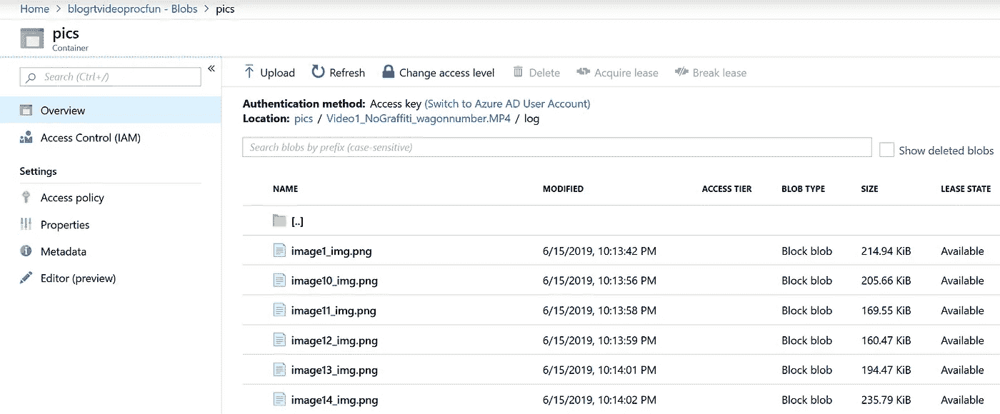

3d2.2 Videos logging in frames

日志也可以在文件 logging/imagetaggingloging . CSV 中找到。在下一部分中，输出在 Power BI 中可视化。

# 4.用于可视化的 Power BI(可选)

Power BI 旨在提供交互式可视化和商业智能功能，其界面非常简单，最终用户可以创建自己的报告和仪表板。在这个博客中，它被用来创建一个流媒体仪表板，当检测到涂鸦伴随着车号时，它会发出警报。在本章的剩余部分，将执行以下步骤:

*   4a。安装电源 BI 的准备工作
*   4b。创建流式数据集
*   4c。从磁贴创建仪表板
*   4d。将 Power BI 链接添加到 Azure 函数

以及实现的架构的以下部分:

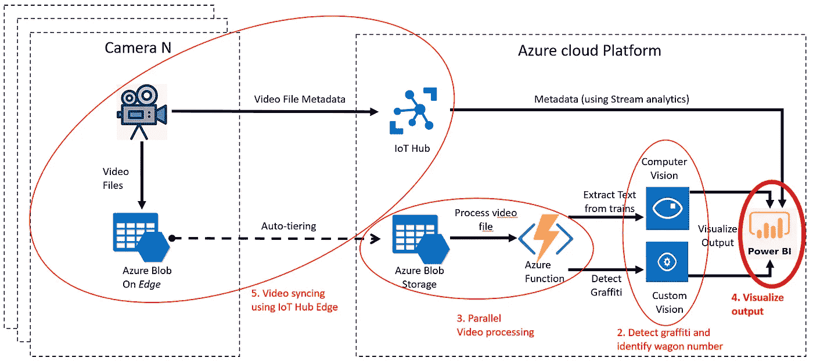

4\. Steps in blog plotted on Architecture. Visualize output in bold as next step

请注意，完成博客物联网中心的最后一步并不需要可视化输出。

**4a。安装电源 BI** 的准备工作

在这篇博客中，所有数据集和仪表板将直接在 Power BI 中创建，因此没有必要安装 Power BI dashboard。转到以下链接创建帐户:

[](https://powerbi.microsoft.com/en-us/) [## Power BI |交互式数据可视化 BI 工具

### 借助 Microsoft Power BI 的交互式数据可视化 BI 工具，以全新的方式查看您公司的数据。

powerbi.microsoft.com](https://powerbi.microsoft.com/en-us/) 

**4b。创建流数据集**

登录后，转到您的工作区，选择创建，然后选择流式数据集。这个流数据集是从您的 Azure 函数队列触发器推送的。

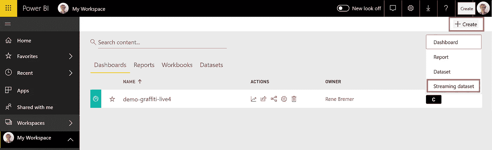

4b1\. Create streaming dataset

在向导中选择 API {}，然后添加以下字段(字段也可以在 __init__ 中)。publishPowerBI()方法中 Azure 函数队列触发器的 py

```
location (Text)
track (Text)
time (DateTime)
trainNumber (Text)
probGraffiti (Number)
caption (Text)
sasPictureTrainNumber (Text)
sasPictureGraffiti (Text)
```

## 4c。从磁贴创建仪表板

在下一步中，将基于流式数据集创建一个实时控制面板，一旦有新数据进入，该控制面板将自动刷新。首先，创建一个报表和一个可视化表格。只需将所有字段添加到该表格中。接下来，选择“锁定视觉对象”来创建视觉对象的活动 dasboard，也见下文。

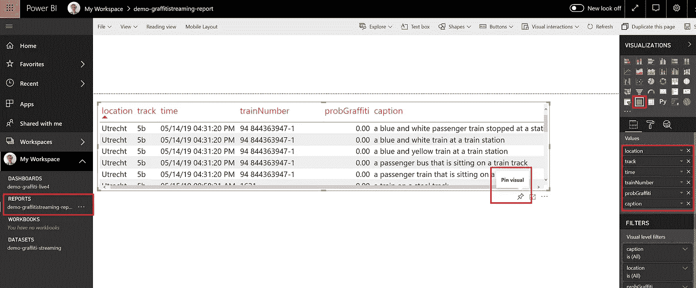

4c1\. Create streaming dataset

这样，可以在一个报告中创建多个视觉效果，并发布到同一个仪表板上。请参见下面的仪表板示例。

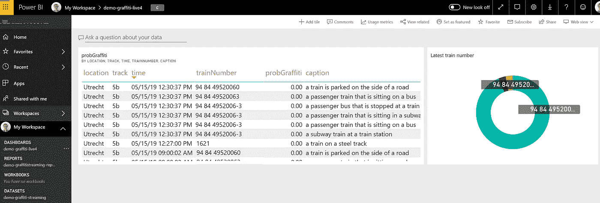

4c2\. Example dashboard

## 4d。将 Power BI 链接添加到 Azure 函数

最后，需要将 Power BI push URL 添加到 Azure 函数队列触发器中，以便发布数据。单击您的流数据集的…,选择 API 信息并复制 URL，如下所示。

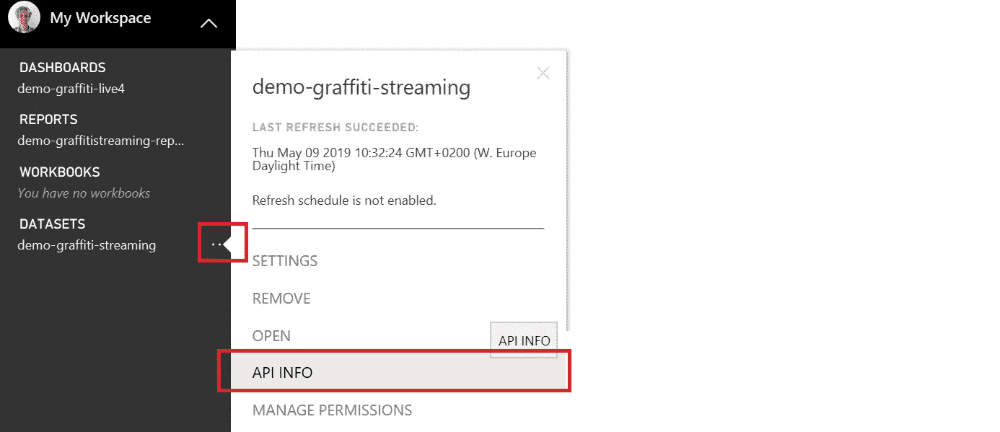

4d1\. API info

随后，将 Power BI push URL 添加到您的 Azure 函数队列触发器，并重新启动该函数，见下文。

```
az functionapp config appsettings set --name blog-rtvideoproc-funqueue --resource-group blog-rtvideoproc-rg --settings `
powerBIConnectionString="<Power BI push URL"az functionapp restart --name blog-rtvideoproc-funqueue --resource-group blog-rtvideoproc-rg
```

删除视频 Video1_NoGraffiti_wagonnumber。MP4 并将其再次上传到您的 blob 存储帐户的 videoblob 容器中。这将把数据推送到您的 Power BI 仪表板。

# 5.用于数据自动分层的物联网边缘(可选)

物联网边缘上的 Azure Blob 存储是一个轻量级 Azure 一致模块，它提供本地块 Blob 存储。借助分层功能，数据会自动从本地 blob 存储上传到 Azure。这在以下情况下尤其有用:1)设备(如照相机)存储容量有限，2)要处理大量设备和数据，以及 3)互联网连接时断时续。在这篇博客中，一个相机在一个 Ubuntu 虚拟机上被模拟，这个虚拟机使用了 Blob on Edge。在本章的剩余部分，将执行以下步骤:

*   5a。创建物联网中心和 Ubuntu 虚拟机作为边缘设备
*   5b。将模块 Blob 存储添加到边缘设备
*   5c。使用边缘设备模拟摄像机

以及实现的架构的以下部分:

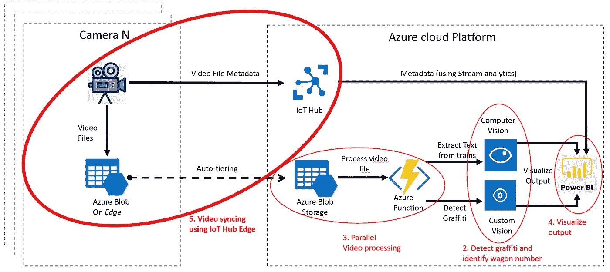

5\. Steps in blog plotted on Architecture. IoT Hub Edge in bold as next step

## 5a。在物联网边缘安装 Azure Blob 存储的准备工作

为了在 IoT Edge 上使用 Azure Blob 存储，需要运行以下命令(更多详细信息，请参见[此处](https://docs.microsoft.com/en-us/azure/iot-edge/quickstart-linux))。

```
az extension add --name azure-cli-iot-extaz vm create --resource-group blog-rtvideoproc-rg --name blog-rtvideoproc-edge --image microsoft_iot_edge:iot_edge_vm_ubuntu:ubuntu_1604_edgeruntimeonly:latest --admin-username azureuser --generate-ssh-keys --size Standard_DS1_v2az iot hub create --resource-group blog-rtvideoproc-rg --name blog-rtvideoproc-iothub --sku F1az iot hub device-identity create --hub-name blog-rtvideoproc-iothub --device-id blog-rtvideoproc-edge --edge-enabled
```

运行以下命令检索密钥

```
az iot hub device-identity show-connection-string --device-id blog-rtvideoproc-edge --hub-name blog-rtvideoproc-iothub
```

并使用以下命令将此密钥添加到您的虚拟机中

```
az vm run-command invoke -g blog-rtvideoproc-rg -n blog-rtvideoproc-edge --command-id RunShellScript --script "/etc/iotedge/configedge.sh '<device_connection_string from previous step>'"
```

正确创建物联网集线器和边缘设备后，您应该会在门户中看到以下内容

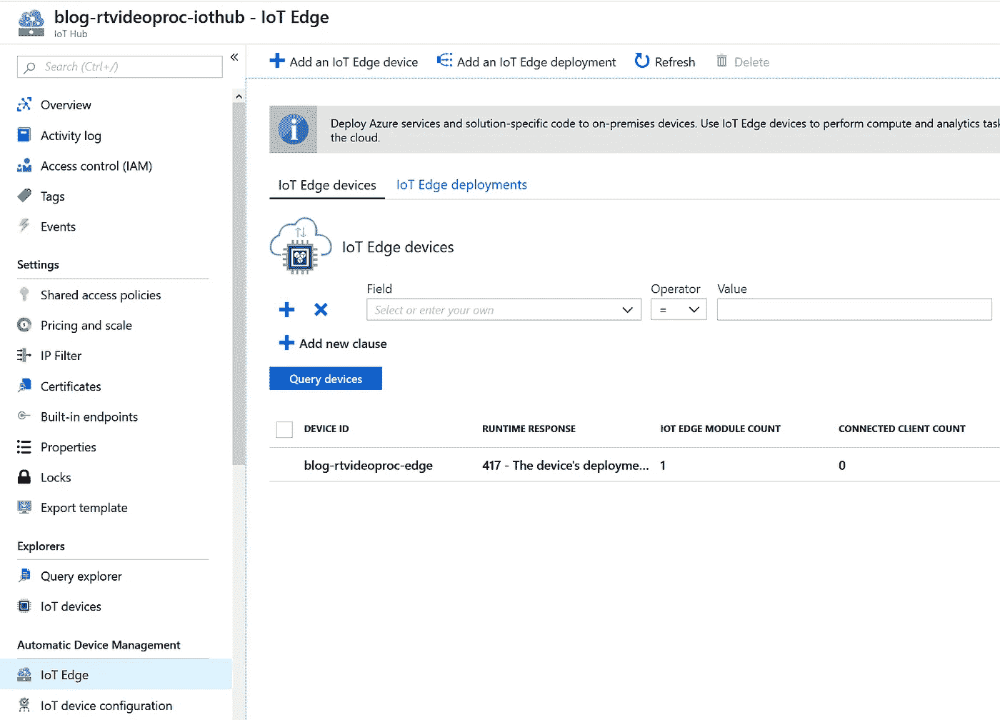

## 5b。将模块 Blob 存储添加到边缘设备

在该步骤中，Blob 存储模块被安装在边缘设备上。选择您的边缘设备，并使用 Azure 门户按照教程中的步骤进行操作

[](https://docs.microsoft.com/en-us/azure/iot-edge/how-to-deploy-blob) [## 将 Azure Blob 存储模块部署到设备- Azure IoT Edge

### 有几种方法可以将模块部署到物联网边缘设备，所有这些方法都适用于物联网边缘上的 Azure Blob 存储…

docs.microsoft.com](https://docs.microsoft.com/en-us/azure/iot-edge/how-to-deploy-blob) 

在这种情况下，使用以下容器创建选项

```
{
  "Env":[
    "LOCAL_STORAGE_ACCOUNT_NAME=localvideostor",
    "LOCAL_STORAGE_ACCOUNT_KEY=xpCr7otbKOOPw4KBLxtQXdG5P7gpDrNHGcrdC/w4ByjMfN4WJvvIU2xICgY7Tm/rsZhms4Uy4FWOMTeCYyGmIA=="
  ],
  "HostConfig":{
    "Binds":[
        "/srv/containerdata:/blobroot"
    ],
  "PortBindings":{
    "11002/tcp":[{"HostPort":"11002"}]
    }
  }
}
```

以及下面的“设置模块 twin 的期望属性”:

```
{
  "properties.desired": {
    "deviceToCloudUploadProperties": {
      "uploadOn": true,
      "uploadOrder": "OldestFirst",
      "cloudStorageConnectionString": "<your stor conn string>",
      "storageContainersForUpload": {
        "localvideoblob": {
          "target": "videoblob"
        }
      },
      "deleteAfterUpload":false
    }
  }
}
```

如果一切都部署成功，门户中应该有以下内容

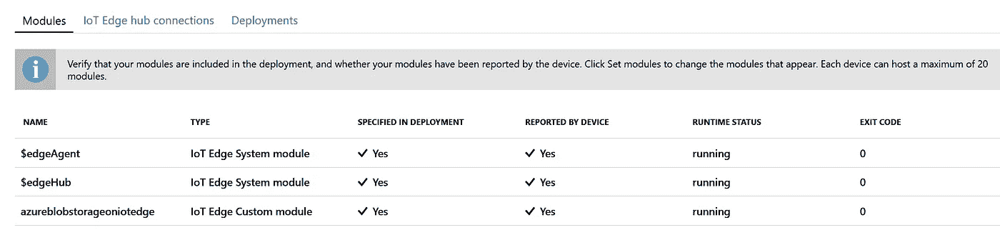

5b. Blob on Edge successfully deployed

此外，您可以从 CLI 运行以下命令，以查看是否一切安装正确。

```
ssh azureuser@<<public IP of your Ubuntu VM>>
sudo systemctl status iotedge 
journalctl -u iotedge
cd /srv/containerdata
ls -la
```

如果一切都部署成功，我们可以运行一个相机模拟器，上传一个文件到您的本地 blob 存储在下一部分。

## 5c。使用边缘设备模拟摄像机

在这篇博客的最后一部分，我们将使用一个相机模拟器，将一个文件放在边缘设备上。

首先，您需要打开 Ubuntu 虚拟机的入站端口 11002。找到虚拟机的网络安全组(NSG)并添加端口 11002，另请参见下文

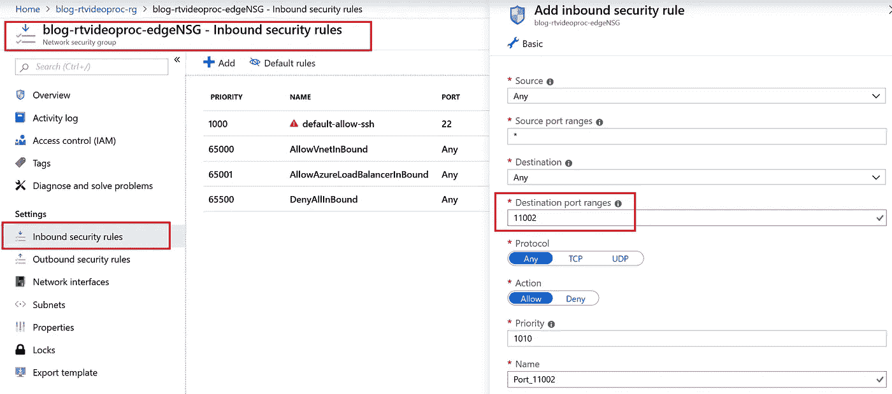

5c1\. Add port 11002 to NSG

从 CameraSimulator/CameraSimulator . py 中的 github 运行代码，在这个项目中，替换你的 UbuntuVM 的 IP 地址和你要上传的视频文件的位置。

该模拟器上传视频并触发本教程中完成的所有操作，即 1)将视频同步到存储帐户，因为自动分层已启用，2)触发处理视频的博客触发器和队列触发器功能，3)调用认知服务来检测涂鸦并识别货车编号，以及 4)将结果推送到 Power BI dashboard，另请参见下文。

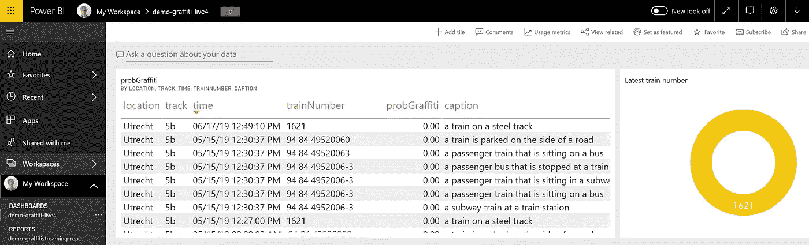

5c2\. End result project

# 6.结论

在这篇博客中，为了在 Azure 中进行智能、实时和可伸缩的视频处理，创建了一个端到端的项目。在这方面，创造了一种能力，可以检测涂鸦和识别车厢号码使用视频的火车。在这种情况下，使用了以下 Azure 函数

*   认知服务被用作智能算法来检测火车上的涂鸦(自定义视觉 API)和 OCR 来识别货车编号(计算机视觉 API)
*   使用 Python 和 docker 的 Azure 函数以可扩展的方式实时处理视频
*   Azure Blob 存储和边缘计算用于处理从边缘到云的可靠视频。
*   使用仪表盘中的流数据增强 BI 的可视化输出

在这个博客中，所有的视频处理都是在 Azure 中完成的。在本博客的后续部分，涂鸦检测模型将被部署在摄像头(edge)上，这样可以节省数据传输，并且可以节省成本。已经看到[本教程](https://github.com/Azure-Samples/Custom-vision-service-iot-edge-raspberry-pi)这是如何在不同的场景中完成的。最后，请参见下面描述的项目架构:


6\. Intelligent, realtime and scalable video processing in Azure