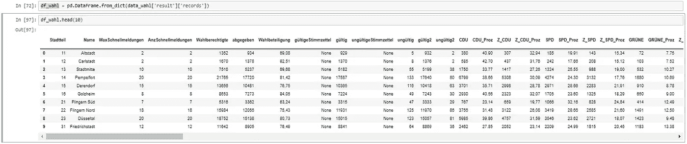

# 与 Plotly 的交互式 Choropleth 地图

> 原文：<https://towardsdatascience.com/interactive-choropleth-maps-with-plotly-46c34fba0e48?source=collection_archive---------3----------------------->

## 如何从 Api 读取数据，匹配地理和非空间数据并创建交互式地图


*最近，我想可视化上次联邦选举的数据。我住在德国的杜塞尔多夫，我想知道哪个政党在哪个地区有相对优势。
令人惊讶的是，这比预期的要难一点。因此，我想在这里分享我的经验。我们将一起经历以下步骤:*

0.准备工作
1。通过 Api 读取 GeoJSON 和 JSON 格式的数据
2。从 GeoJSON 数据中提取相关特征
3。用色标和鼠标悬停定制我们的地图。将所有东西放在一起，增加互动性

## 0.准备

您可以按照本教程使用自己的数据集来创建自己的地图。最简单的方法是使用 GeoJSON 或 JSON 格式的数据。在这里，您可以看看本教程中的数据:

[https://open data . dueseldorf . de/API/action/datastore/search . JSON？resource _ id = 6893 a12e-3d 75-4b2f-bb8b-708982 bea 7b 7](https://opendata.duesseldorf.de/api/action/datastore/search.json?resource_id=6893a12e-3d75-4b2f-bb8b-708982bea7b7)

[https://open data . Dusseldorf . de/sites/default/files/stadt teil _ WGS 84 _ 4326 . geo JSON](https://opendata.duesseldorf.de/sites/default/files/Stadtteile_WGS84_4326.geojson)


Fig. 1: GeoJSON- And Geo-Data

对于本教程，您还需要一个 mapbox 帐户。Mapbox 提供了灵活的地理数据 API。使用 Mapbox API，我们可以将个人数据映射到可缩放的世界地图上。你可以在 www.mapbox.com 开一个账户。您需要一个单独的令牌来使用 mapbox 服务，该服务可在帐户设置下找到:


Fig. 2: Mapbox Account Settings

## **1。通过 Api 读取 GeoJSON 和 JSON 格式的数据**

GeoJSON 是地理要素的开放标准格式。在这个标准中，数据的存储遵循特定的结构。要素可以是点、线、面，甚至是这三种类型的组合。例如，多边形(特定房间内的封闭区域)可能如下所示:

```
{
"type": "Polygon",
"coordinates": [
[[35, 10], [45, 45], [15, 40], [10, 20], [35, 10]],
[[20, 30], [35, 35], [30, 20], [20, 30]]
]
}
```

在我们的示例中，我们还将访问 GeoJSON 数据，并将其与 JSON 数据相结合。网站上有杜塞尔多夫地区的地理数据和选举数据。但是，数据是分离的，我们必须在以后合并它们。

首先，我们导入所有必需的库:

```
import pandas as pd
import numpy as np
import urllib.request, json
import requests
```

现在我们可以读取 URL 的内容了:

```
url_wahl_2017 = 'https://opendata.duesseldorf.de/api/action/datastore/search.json?resource_id=6893a12e-3d75-4b2f-bb8b-708982bea7b7'
url_stadtteile = 'https://opendata.duesseldorf.de/sites/default/files/Stadtteile_WGS84_4326.geojson'geo_data = requests.get(url_stadtteile).json()
data_wahl = requests.get(url_wahl_2017).json()
```

这两个数据源现在都可以作为嵌套字典使用。使用`data_wahl['result']['records']`可以显示各个选区的选举结果:


Fig. 3: Election results of the individual districts

我们现在可以将字典中的相关选举数据导入到 pandas 数据框架中:

```
df_wahl = pd.DataFrame.from_dict(data_wahl['result']['records'])
```



Fig. 4: Election results as dataframe

## 2.从 GeoJSON 数据中提取相关特征

现在我们来看看地理数据。为了使用 Plotly 进行进一步处理，我们现在从地理数据请求中提取相关要素:

```
sources=[{"type": "FeatureCollection", 'features': [feat]} for feat in geo_data['features']]
```

列表`sources`包含城市所有部分的坐标。我们稍后将把这个列表交给`Mapbox`对象，以便呈现各个地区。地区的 id 也从地理数据中提取:

```
tx_ids=[geo_data['features'][k]['properties']['Stadtteil'] for k in range(len(geo_data['features']))]
```

我们稍后需要 id 来为每个政党和每个地区分配正确的色阶。

## 3.用色标和鼠标悬停定制我们的地图

为了以后能够动态地给城市的各个部分着色，我们需要每一方各自的百分比范围。最亮的阴影被指定为最低值，最暗的阴影被指定为最高值。为此，我们为每个政党和每个地区确定最低和最高值:

```
parties = ['Wahlsieger_proz','CDU_Proz','SPD_Proz','DIE LINKE_Proz','GRÜNE_Proz','AfD_Proz','FDP_Proz']for n in range(0,len(rate_list)):dct[rate_list[n]] = [df.loc[stadtteil, parties[n]] for stadtteil in tx_ids]dct_min[mins_list[n]] = min(dct[rate_list[n]])dct_max[maxs_list[n]] = max(dct[rate_list[n]])
```

现在我们为每一方创建它自己的色标。最重要的是，我关注的是派对的颜色:

```
#Winner
pl_colorscale= [[0.0, ‘rgb(255, 255, 204)’],
[0.35, ‘rgb(161, 218, 180)’],
[0.5, ‘rgb(65, 182, 196)’],
[0.6, ‘rgb(44, 127, 184)’],
[0.7, ‘rgb(8, 104, 172)’],
[1.0, ‘rgb(37, 52, 148)’]]#CDU
cdu_colorscale= [[0.0, ‘rgb(224, 224, 224)’],
[0.35, ‘rgb(192, 192, 192)’],
[0.5, ‘rgb(160, 160, 160)’],
[0.6, ‘rgb(128, 128, 128)’],
[0.7, ‘rgb(96, 96, 96)’],
[1.0, ‘rgb(64, 64, 64)’]]#SPD
spd_colorscale= [[0.0, ‘rgb(255, 153, 153)’],
[0.35, ‘rgb(255, 102, 102)’],
[0.5, ‘rgb(255, 51, 51)’],
[0.6, ‘rgb(255, 0, 0)’],
[0.7, ‘rgb(204, 0, 0)’],
[1.0, ‘rgb(153, 0, 0)’]]#Die Grünen
gruene_colorscale= [[0.0, ‘rgb(153, 255, 204)’],
[0.35, ‘rgb(102, 255, 178)’],
[0.5, ‘rgb(51, 255, 153)’],
[0.6, ‘rgb(0, 255, 128)’],
[0.7, ‘rgb(0, 204, 102)’],
[1.0, ‘rgb(0, 153, 76)’]]#Die Linke
linke_colorscale= [[0.0, ‘rgb(255, 153, 204)’],
[0.35, ‘rgb(255, 102, 178)’],
[0.5, ‘rgb(255, 51, 153)’],
[0.6, ‘rgb(255, 0, 128)’],
[0.7, ‘rgb(204, 0, 102)’],
[1.0, ‘rgb(153, 0, 76)’]]#AFD
afd_colorscale= [[0.0, ‘rgb(153, 255, 255)’],
[0.35, ‘rgb(102, 255, 255)’],
[0.5, ‘rgb(51, 255, 255)’],
[0.6, ‘rgb(0, 255, 255)’],
[0.7, ‘rgb(0, 204, 204)’],
[1.0, ‘rgb(0, 153, 153)’]]#FDP
fdp_colorscale=[[0.0, ‘rgb(255, 255, 204)’],
[0.35, ‘rgb(255, 255, 153)’],
[0.5, ‘rgb(255, 255, 102)’],
[0.6, ‘rgb(255, 255, 51)’],
[0.7, ‘rgb(255, 255, 0)’],
[1.0, ‘rgb(204, 204, 0)’]]
```

下面这个函数是我从一个[教程](https://plot.ly/~empet/14692/mapbox-choropleth-that-works-with-plotly/#/)里拿来的，强烈推荐:

现在，我们将该函数用于之前创建的迷你和最大字典，以创建单独的色阶:

我们希望在一张卡片上标明各自的选举获胜者，在另一张卡片上标明各个政党。为此，我们改编鼠标悬停文本:

```
text_win=[c+’<br>Election winner was the ‘+ w + ‘ with ‘ + ‘{:0.2f}’.format(r)+’%’ for c, r, w in zip(counties, dct[rate_list[0]], wahlsieger_c)]text_cdu=[c+’<br>The CDU had ‘ + ‘{:0.2f}’.format(r)+’%’ for c, r in zip(counties, dct[rate_list[1]])]text_spd=[c+’<br>The SPD had ‘ + ‘{:0.2f}’.format(r)+’%’ for c, r in zip(counties, dct[rate_list[2]])]text_linke=[c+’<br>The Linke had ‘ + ‘{:0.2f}’.format(r)+’%’ for c, r in zip(counties, dct[rate_list[3]])]text_gruene=[c+’<br>The Grünen had ‘ + ‘{:0.2f}’.format(r)+’%’ for c, r in zip(counties, dct[rate_list[4]])]text_afd=[c+’<br>The AfD had ‘ + ‘{:0.2f}’.format(r)+’%’ for c, r in zip(counties, dct[rate_list[5]])]text_fdp=[c+’<br>The FDP had ‘ + ‘{:0.2f}’.format(r)+’%’ for c, r in zip(counties, dct[rate_list[6]])]
```

## 4.将所有东西放在一起，增加互动性

我们现在必须注意以下几点。`data`包括代表地区形状的地理数据和鼠标悬停文本。但我们希望灵活的色阶取决于下拉菜单中的选择和每个地区政党的相对实力。这些色阶由`layer`表示。可以将数据分配给一个列表。根据下拉列表的选择，我们将列表中各个元素的可见性设置为`True`或`False`。例如，如果我们有一个包含三条记录的列表，并且想要呈现第一条记录，我们给出一个条目列表`[True,False,False]`作为`visible`的参数。

我们首先创建`data`列表。我们提取每个地区的经度和纬度元素，并将它们添加到列表中:

图层也收集在一个列表中:

现在我们添加下拉菜单。首先，我们将完成条目的标签和相应的可见条件。最后，我们提交数据和图层列表:

在`visible`列表中，我们定义显示`data`列表的哪个元素。为了让色阶相应地适应，我们还必须在`"mapbox.layers"`下定义我们的`layers`列表。

如果我们将所有内容放在一起，我们会得到以下代码:

如果你想运行代码，你需要修改第 10 行的`mapbox_access_token`。

您的结果应该如下所示:


Fig. 5: Final Plot With Interactivity

## 结论和最终想法

用 Python 处理 GeoJSON 和 JSON 格式非常容易。使用 Plotly，您可以根据地理信息创建美丽的 Choropleth 地图。如果你想使用下拉菜单增加交互性，那就有点棘手了，因为你需要为每一层添加单独的色阶。然而，`args`提供了所需的灵活性。在下一步中，添加一个单独的 colorbar 图例还是不错的。此外，说明更多的社会人口特征也很有意思。所以要有创意！

## 开源代码库

笔记本:
[https://Github . com/BD 317/geodata/blob/master/API-Duesseldorf-Github % 20(1)。ipynb](https://github.com/bd317/geodata/blob/master/API-Duesseldorf-Github%20(1).ipynb)

## 进一步的信息

choropleth 绘图的一般文档:

[https://plot.ly/python/choropleth-maps/](https://plot.ly/python/choropleth-maps/)

恩培特的一本伟大的笔记本，作为 Plotly choropleth 地图的介绍；

 [## ' b '与 Plotly | empet | Plotly 一起工作地图箱 choropleth '

### 编辑描述

plot.ly](https://plot.ly/~empet/14692/mapbox-choropleth-that-works-with-plotly/#/) 

同一用户对新 Plotly trace-type choroplethmapbox 的更新:

 [## b '带有下拉菜单的 choroplethmapbox | empet | Plotly '

### 编辑描述

plot.ly](https://plot.ly/~empet/15237/choroplethmapbox-with-dropdown-menu/#/) 

Fig. 6: New trace type — Choroplethmapbox

[如果您喜欢中级和高级数据科学，并且还没有注册，请随时使用我的推荐链接加入社区。](https://medium.com/@droste.benedikt/membership)