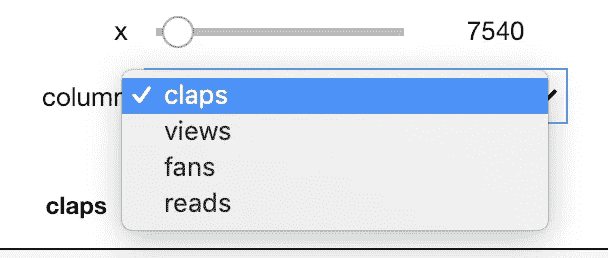

# Jupyter 笔记本中的交互式控件

> 原文：<https://towardsdatascience.com/interactive-controls-for-jupyter-notebooks-f5c94829aee6?source=collection_archive---------1----------------------->


[(Source)](https://www.pexels.com/photo/architecture-buildings-city-cityscape-358274/)

## 如何使用交互式 IPython 小部件来增强数据探索和分析

在数据探索中，很少有操作比一次又一次地重新运行同一个单元效率更低，每次都略微更改输入参数。尽管知道这一点，我仍然发现自己重复执行单元格只是为了做出最微小的改变，例如，为一个函数选择不同的值，选择不同的日期范围进行分析，甚至调整一个[情节可视化](/the-next-level-of-data-visualization-in-python-dd6e99039d5e?source=user_profile---------7------------------)的主题。这不仅效率低下，而且令人沮丧，扰乱了探索性数据分析的流程。

这个问题的理想解决方案是使用交互式控件来改变输入，而不需要重写或重新运行代码。幸运的是，正如 Python 中经常出现的情况，已经有人遇到了这个问题，并开发了一个很好的工具来解决它。在本文中，我们将了解如何开始使用 [IPython 小部件](https://ipywidgets.readthedocs.io/en/stable/user_guide.html) ( `ipywidgets`)，这是一行代码就可以构建的交互式控件。这个库允许我们将 Jupyter 笔记本从静态文档转变为交互式仪表板，非常适合探索和可视化数据。

点击下图，您可以在 [mybinder](http://mybinder.org) 上查看一个完全交互式的跑步笔记本，其中包含本文中的小部件。

[](https://mybinder.org/v2/gh/WillKoehrsen/Data-Analysis/widgets-stable?filepath=widgets%2FWidgets-Overview.ipynb)

Widgets notebook on mybinder.org

不幸的是，IPython 小部件不能在 GitHub 或 nbviewer 上渲染，但是你仍然可以[访问笔记本并在本地运行](https://github.com/WillKoehrsen/Data-Analysis/blob/master/widgets/Widgets-Overview.ipynb)。


Example of interactive widgets for data visualization

# IPywidgets 入门

像往常一样，第一步是[安装库](https://ipywidgets.readthedocs.io/en/stable/user_install.html) : `pip install ipywidgets`。完成后，您可以通过以下方式激活 Jupyter 笔记本的小部件

```
jupyter nbextension enable --py widgetsnbextension
```

要使用 JupyterLab，请运行:

```
jupyter labextension install @jupyter-widgets/jupyterlab-manager
```

要在笔记本中导入`ipywidgets`库，运行

```
import ipywidgets as widgets
from ipywidgets import interact, interact_manual
```

## 单线交互式控件

假设我们有以下中等文章统计的数据框架(这些是我的实际统计，你可以在本文中看到[如何获得它们):](/analyzing-medium-story-stats-with-python-24c6491a8ff0?source=user_profile---------11------------------)


Dataframe of Medium stats

怎样才能查看所有阅读量超过 1000 的文章？这里有一个方法:

```
df.loc[df['reads'] > 1000]
```

但是如果我们想显示超过 500 次鼓掌的文章，我们必须写另一行代码:

```
df.loc[df['claps'] > 500]
```

如果我们能够快速地改变这些参数——包括列和阈值——而不需要编写更多的代码，这不是很好吗？试试这个:

```
[@interact](http://twitter.com/interact)
def show_articles_more_than(column='claps', x=5000):
    return df.loc[df[column] > x]
```


Interactive controls using @interact

使用`[@interact](https://ipywidgets.readthedocs.io/en/stable/examples/Using%20Interact.html)`[装饰器，IPywidgets 库](https://ipywidgets.readthedocs.io/en/stable/examples/Using%20Interact.html)自动给我们一个文本框和一个滑块来选择列和数字！它查看我们函数的输入，并根据类型创建交互式控件。现在，我们可以使用控件(小部件)对数据进行分段，而无需编写代码。

你可能已经注意到小部件的一些问题— `x`可能会变成负数，我们必须输入正确的`column`名字。我们可以通过为函数参数提供特定参数来解决这些问题:



Improved widgets for subsetting data.

现在我们得到一个列的下拉列表(带有列表中的选项)和一个限定在一个范围内的整数滑块(格式是`(start, stop, step)`)。通读[文档](https://ipywidgets.readthedocs.io/en/stable/examples/Using%20Interact.html)了解函数参数如何映射到小部件的全部细节。

我们可以使用同一个`@interact`装饰器快速地将任何普通功能变成一个交互式小部件。例如，我们可能希望快速浏览目录中的大量图像:

```
import os
from IPython.display import Image@[interact](http://twitter.com/interact)
def show_images(file=os.listdir('images/')):
    display(Image(fdir+file))
```


Example of browsing images using IPython widgets

现在，我们可以快速循环所有图像，而无需重新运行单元。如果你正在构建一个卷积神经网络，并且[想要检查你的网络已经错误分类的图像](https://github.com/jupyter-widgets/ipywidgets/blob/master/docs/source/examples/Image%20Browser.ipynb)，这实际上可能是有用的。

小部件在数据探索方面的用途是无限的。另一个简单的例子是寻找两列之间的相关性:


Widget for correlation between two columns.

ipywidgets GitHub 上有很多有用的例子。

## 用于绘图的微件

交互式小部件对于选择要绘制的数据特别有帮助。我们可以使用相同的`@interact`装饰器来可视化我们的数据:


Interactive scatter plot made using cufflinks+plotly with IPywidgets controls

在这里，我们使用惊人的[袖扣+plotly 组合](/the-next-level-of-data-visualization-in-python-dd6e99039d5e?source=user_profile---------7------------------)来制作一个带有*交互式 IPython 控件*的*交互式 plot* 。

你可能已经注意到剧情更新有点慢。如果是这种情况，我们可以使用`@interact_manual`，它需要一个按钮来更新。


Button made with @interact_manual decorator.

现在，只有按下按钮时，绘图才会更新。这对于需要一段时间才能返回输出的函数很有用。

## 扩展交互控件的功能

为了从 IPywidgets 库中获得更多，我们可以自己制作小部件并在`interact`函数中使用它们。我最喜欢的小工具之一是`DatePicker`。假设我们有一个函数`stats_for_article_published_between`，它获取开始和结束日期，并打印两者之间发布的所有文章的统计数据。我们可以使用下面的代码来实现这种交互

现在我们得到了两个交互式日期选择小部件，这些值被传递到函数中([详见笔记本](https://mybinder.org/v2/gh/WillKoehrsen/Data-Analysis/widgets-stable?filepath=widgets%2FWidgets-Overview.ipynb)):


Interactive date selection controls.

类似地，我们可以使用同一个`DataPicker`交互式小部件创建一个函数，绘制一个列直到某个日期的累计总数。


Cumulative plot of a column using interactive widgets.

如果我们想让一个小部件的选项依赖于另一个小部件的值，我们使用`observe`函数。在这里，我们修改了图像浏览器函数来选择目录和图像。显示的图像列表根据我们选择的目录进行更新。

Code to make the images widget dependent on the value of the directory widget


Left show image options when the directory is “images” and right shows options when directory is “nature”.

## 可重复使用的部件

当我们想要跨单元格重用小部件时，我们只需要将它们分配给`interact`函数的输出。

现在，为了重用`stats`小部件，我们可以只在单元格中调用`stats.widget` 。


The same widget used in another cell.

这让我们可以在笔记本上重用我们的小部件。请注意，小部件是相互关联的，这意味着一个单元格中的值将自动更新为您在另一个单元格中为同一小部件选择的值。

我们还没有涵盖 IPywidgets 的所有功能。例如，我们可以将值链接在一起，创建定制的小部件，制作按钮，制作动画，创建带有选项卡的仪表板，等等。[查看文档以备将来使用](https://ipywidgets.readthedocs.io/en/stable/user_guide.html)。尽管这里只涉及了很少的一部分，我希望您能看到交互式控件是如何增强笔记本工作流程的！


Simple widget to select theme for a plot.

# 结论

Jupyter 笔记本是一个很好的数据探索和分析环境。然而，它本身并没有提供最好的功能。使用像[笔记本扩展](/jupyter-notebook-extensions-517fa69d2231?source=user_profile---------19------------------)和交互式小工具这样的工具让笔记本变得栩栩如生，让我们作为数据科学家的工作更加高效。此外，构建小部件并在笔记本中使用它们非常有趣！重复编写大量代码来完成相同的任务并不愉快，但是使用交互式控件为我们的数据探索和分析创建了一个更自然的流程。

一如既往，我欢迎反馈和建设性的批评。我可以通过推特 [@koehrsen_will 联系到。](http://twitter.com/@koehrsen_will)