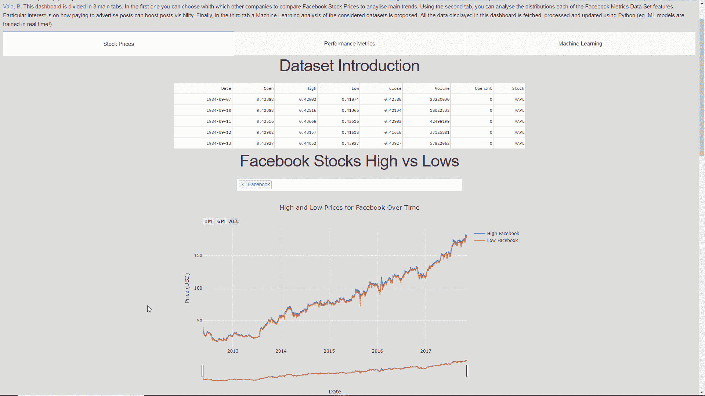
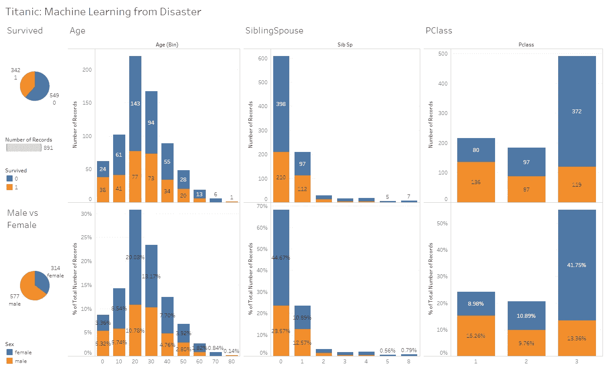
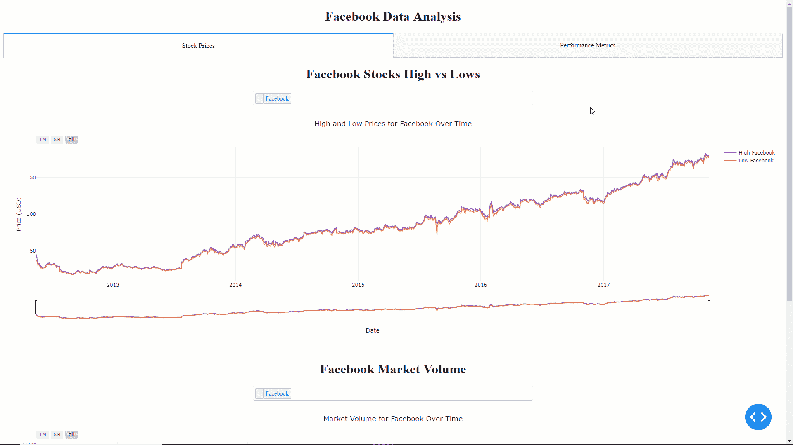
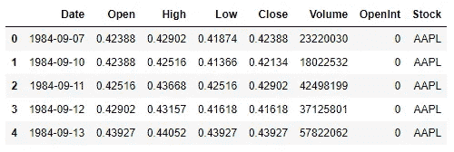
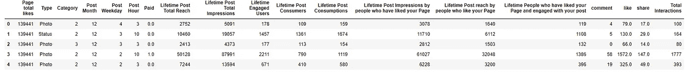
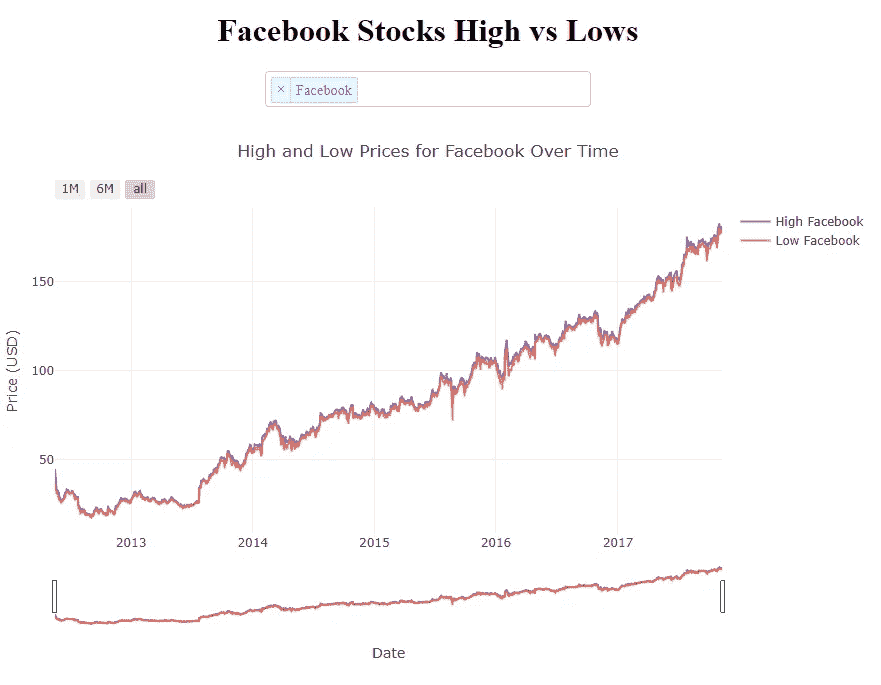
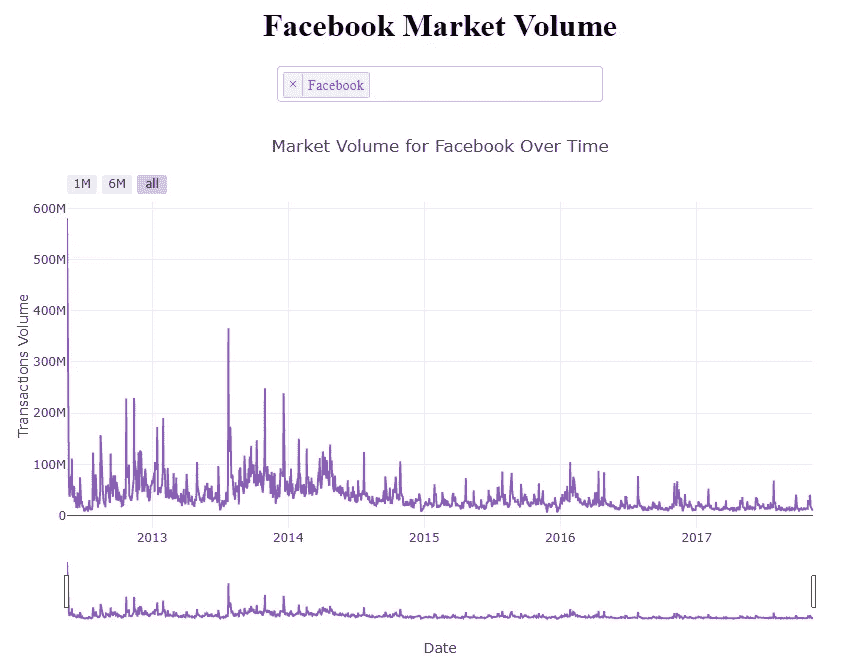
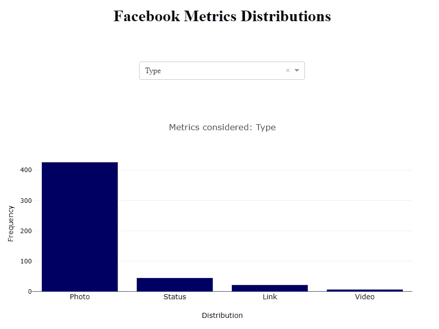

# 面向数据科学的交互式仪表盘

> 原文：<https://towardsdatascience.com/interactive-dashboards-for-data-science-51aa038279e5?source=collection_archive---------5----------------------->

## 用 Python 创建一个在线仪表板来分析脸书股票市场价格和业绩指标。



[Facebook Data Analysis Dashboard](https://pierpaolo28.github.io/Projects/dash_dashboard.html)

# 介绍

创建在线数据科学仪表板是交流数据科学项目结果的一种非常有效的方式。一个好的仪表板可以:

*   总结数据分析的主要结果。
*   让客户/公司经理能够测试一些参数的变化如何影响某个结果。
*   不断获取新数据以更新其图表和摘要。
*   允许我们使用预先训练的机器学习模型或在线训练它们来在线进行预测。

如今，有许多不同的服务可以用来创建仪表板。一些例子是:

*   **阴谋地破折号**
*   **散景仪表盘**
*   **谷歌数据工作室**
*   **画面**

前两个例子需要很好的 Python 编程知识来创建仪表板，相反，后两个例子不一定需要任何编程知识(它们提供了较少的定制选项)。



Figure 1: [Titanic Data Set Dashboard made using Tableau.](https://github.com/pierpaolo28/Data-Visualization/tree/master/Tableau%20%26%20Google%20Data%20Studio)

在本文中，我将带您了解如何使用 Plotly Dash 在线创建和部署仪表板。本文中使用的所有代码(以及更多！)可在我的 [GitHub 帐户](https://github.com/pierpaolo28/Data-Visualization/tree/master/Dash)上获得。

我的最终版本的仪表板可以通过[链接在线测试。](https://pierpaolo28.github.io/Projects/dash_dashboard.html)

# 破折号


Figure 2: Dash [1]

Dash 是一个开源 Python 库，由 Plotly 设计，用于创建基于 Web 的反应式应用程序。这个库建立在其他包之上，如:Flask、Plotly.js、React 和 React Js。

每个 Dash 应用程序都由两个主要部分组成:

*   **布局** =用于定义所有内容在应用程序上的布局。
*   **回调** =用于使仪表板的每个所需组件交互。

此外，Dash 还提供了一个 HTML 类的集合来生成 Python 中的 HTML 代码(***)Dash-HTML-components***)，Markdown 和 App 认证支持。

下面列出了开始使用 Dash 所需的所有必要库。

```
pip install dash   
pip install dash-renderer   
pip install dash-html-components 
pip install dash-core-components   
pip install plotly
```

为了创建下面的仪表板，我使用了两个不同的数据集。第一个是鲍里斯·马贾诺维奇的[庞大股市数据集，第二个是莫罗、s .、丽塔、p .、&瓦拉、B](https://www.kaggle.com/borismarjanovic/price-volume-data-for-all-us-stocks-etfs) 的[脸书指标数据集。](https://archive.ics.uci.edu/ml/datasets/Facebook+metrics)

在 dashboard 应用程序上加载第一个数据集之前，我执行了一些预处理分析，生成的数据集可在此处获得[。](https://raw.githubusercontent.com/pierpaolo28/Data-Visualization/master/Dash/stock_data.csv)

在本演示中，我们将一起创建一个由两个选项卡组成的控制面板。第一个选项卡将显示脸书、苹果、微软和特斯拉等公司的高、低和成交量股市指标。第二个选项卡将显示脸书性能指标数据集中每个可用特性的分布情况(图 3)。



Figure 3: Final Dashboard which we will create in this tutorial

如果你有兴趣给这个应用增加更多的功能，在[我的 GitHub 库](https://github.com/pierpaolo28/Data-Visualization/tree/master/Dash)有一个更高级的版本。

# 示范

首先我们需要创建一个名为 **a *pp.py*** 的 Python 文件，导入所有需要的依赖项。在这个文件中，我们将编写启动仪表板所需的所有代码。

我们将要使用的数据集将具有如图 4 和图 5 所示的结构。



Figure 4: Stock Dataset



Figure 5: Performance Metrics Dataset

然后，我们可以使用下面的代码设置我们的应用程序及其布局。布局存储在 ***app.layout*** 中，所有需要的 HTML 组件如 Div、H1、H2、P 等都已使用***dash _ HTML _ components******【HTML】***库添加。最后，我们可以使用***dash _ core _ components(DCC)***库向我们的仪表板添加交互组件(例如，选项卡、下拉菜单、单选按钮)。

在这种情况下，我决定将这个仪表板分成两个选项卡。在第一个示例中，将分析股票价格数据集，在第二个示例中，将分析绩效指标数据集。第一个选项卡的布局随后被分成另外两个部分，每个部分由一个 H1 标题、一个带有四个不同选项的下拉菜单和一个时间序列图组成。第二个选项卡由一个 H1 标题、一个包含 18 个不同选项的下拉菜单和一个直方图组成。

一旦定义了仪表板的布局，我们就可以继续设计图表以及它们与下拉菜单的交互。图形可以被设计为创建函数，而图形和下拉菜单之间的交互可以使用回调来设计。

下面的代码可以分为 3 个主要部分:一个高-低股票价格时间序列图，一个市场容量时间序列图和一个性能指标特征分布图。

前两个部分非常相似，事实上，它们是为了创建相同类型的图形而设计的。唯一的区别是，在第二张图中，只考虑了一个特征，而不是两个。

在 3 个部分的每一个中，回调( ***@app.callback*** )用于从下拉列表中获取选定的值，将它们作为输入发送给 graph 函数，然后获取该函数返回的变量，将其传递给布局中声明的图形。每当下拉列表中的值改变时，这些回调将被自动调用。由于之前在仪表板布局中设置的独特的 ***id*** 值，回调可以自动识别仪表板上可用的不同下拉列表中的哪些改变了值，以及随后要更新哪个图形。

下面显示的三个函数都使用 [Plotly 语法](https://plot.ly/python/)来创建图形。如果你以前从未使用过 Plotly，在我以前的一篇文章中，我已经谈到了[交互式数据可视化](/interactive-data-visualization-167ae26016e8)。

第一个函数将生成下图。



Figure 6: Facebook Stocks, High vs Lows

第二个将创建如图 7 所示的图形。



Figure 7: Facebook Market Volume

最后，第三个函数将在仪表板的第二个选项卡上生成特性分布直方图(图 8)。



Figure 8: Facebook Metrics Distribution

最后，我们可以使用下面两行代码启动一个本地服务器并运行我们的应用程序。

现在我们的应用程序已经准备好了，我们可以通过在当前工作目录中打开我们的计算机终端并键入 ***python app.py*** 来简单地午餐它。这将在 [http://127.0.0.1:8050/](http://127.0.0.1:8050/) 启动一个 web 服务器，点击此链接，我们将看到最终的 Python 应用程序正在运行。

可以轻松部署在线 Dash 应用程序，在 Heroku 上免费托管我们的应用程序。如果你有兴趣这样做，我写了另一篇关于在线机器学习部署的 [Flask 和 Heroku 的文章。此外，Dash](/flask-and-heroku-for-online-machine-learning-deployment-425beb54a274) [文档](https://dash.plot.ly/deployment)也提供了如何在 Heroku 上部署 Dash 应用程序的指导。

# 结论

可以通过添加其他功能来进一步开发该控制面板，例如:

*   使用 web 抓取机制实时获取新的股票市场数据，以更新所有相关的图表。
*   添加更多[数据可视化](/interactive-data-visualization-167ae26016e8)图表。
*   创建机器学习模型来进行预测(例如 [ARIMA](/stock-market-analysis-using-arima-8731ded2447a) ，LSTM)。
*   改进仪表板整体设计。

点击[此链接，可在线测试该仪表盘的更高级版本。](https://pierpaolo28.github.io/Projects/dash_dashboard.html)

如果您需要任何帮助来添加这些附加功能， [Dash 文档](https://dash.plot.ly/)是一个很好的起点。

*我希望你喜欢这篇文章，谢谢你的阅读！*

# 联系人

如果你想了解我最新的文章和项目[，请通过媒体](https://medium.com/@pierpaoloippolito28?source=post_page---------------------------)关注我，并订阅我的[邮件列表](http://eepurl.com/gwO-Dr?source=post_page---------------------------)。以下是我的一些联系人详细信息:

*   [领英](https://uk.linkedin.com/in/pier-paolo-ippolito-202917146?source=post_page---------------------------)
*   [个人博客](https://pierpaolo28.github.io/blog/?source=post_page---------------------------)
*   [个人网站](https://pierpaolo28.github.io/?source=post_page---------------------------)
*   [中等轮廓](https://towardsdatascience.com/@pierpaoloippolito28?source=post_page---------------------------)
*   [GitHub](https://github.com/pierpaolo28?source=post_page---------------------------)
*   [卡格尔](https://www.kaggle.com/pierpaolo28?source=post_page---------------------------)

# 文献学

[1] Dash 将 Python & R 模型在大规模上可操作化。访问地点:[https://plot.ly/dash](https://plot.ly/dash)