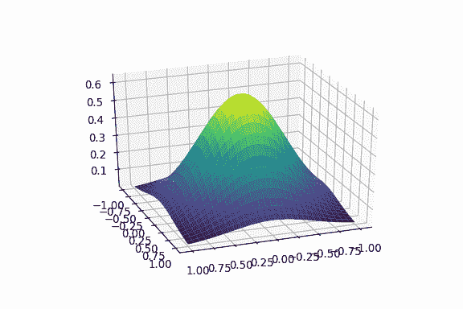
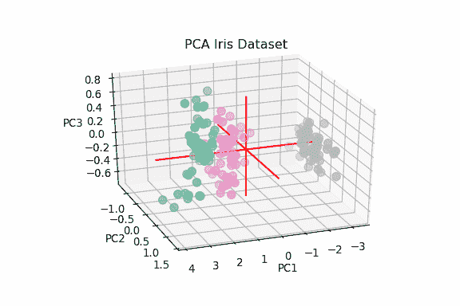
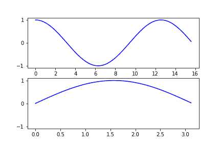
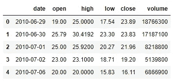
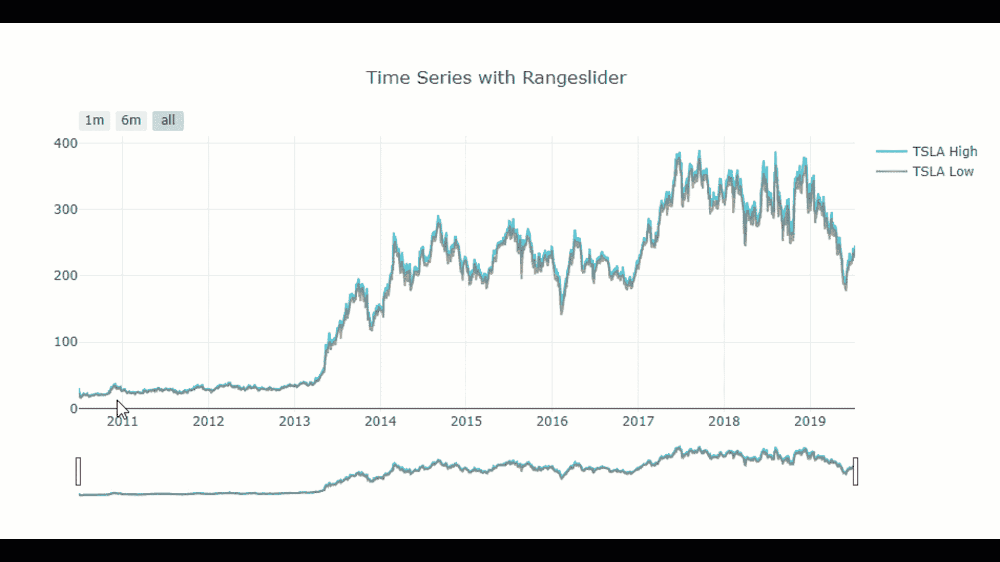
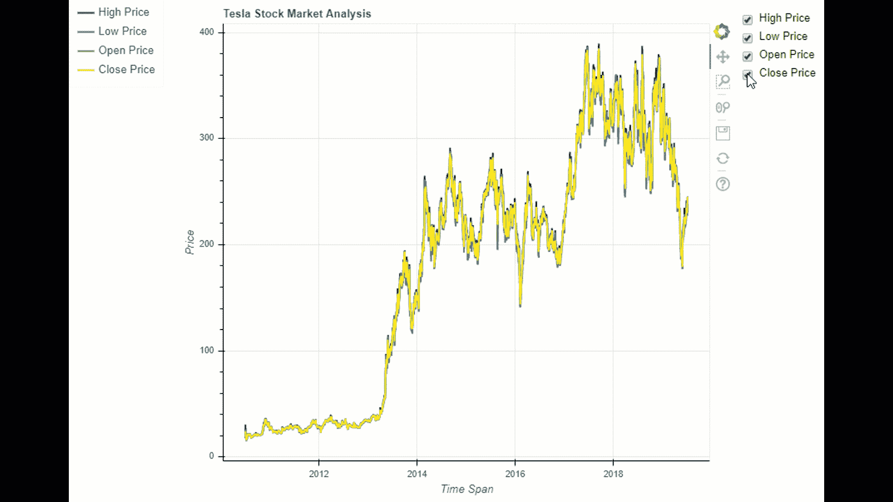
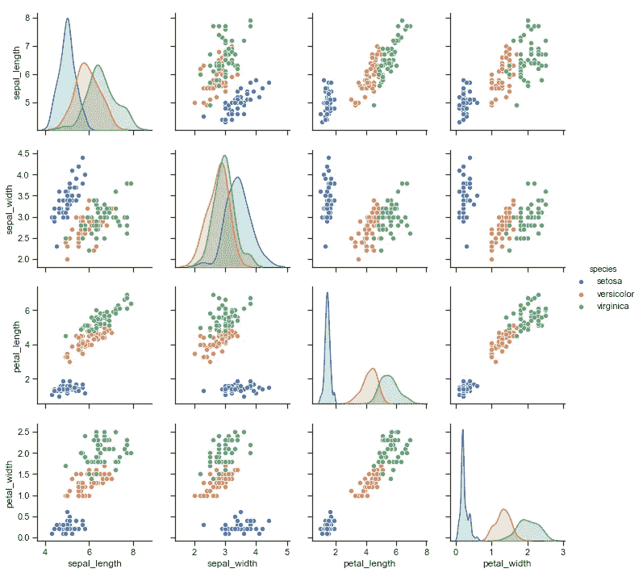
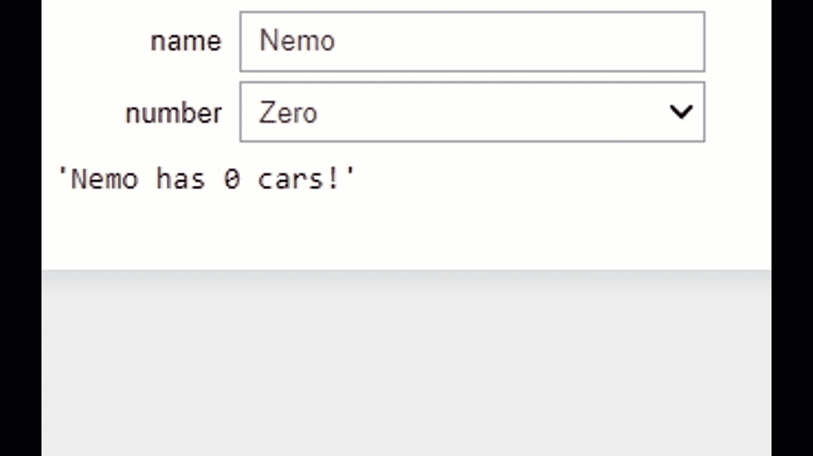

# 交互式数据可视化

> 原文：<https://towardsdatascience.com/interactive-data-visualization-167ae26016e8?source=collection_archive---------8----------------------->

## 使用 Python 库(如:Plotly、Bokeh、nbinteract 等)创建用于数据可视化的交互式绘图和微件

# 数据可视化

在分析数据集时，数据可视化是一个非常重要的步骤。如果执行准确，它可以:

*   帮助我们深入了解数据集背后的动态。
*   加快机器学习方面的分析。
*   让其他人更容易理解我们的数据集调查。

在本文中，我将使用实际的例子和有趣的可视化技术/部件向您介绍一些最常用的 Python 可视化库。我在本文中使用的所有代码都可以在这个 [GitHub 资源库](https://github.com/pierpaolo28/Data-Visualization/tree/master/Python%20Visualization%20Libraries)中找到。

# Matplotlib

Matplotlib 可能是 Python 最著名的数据可视化库。在这个例子中，我将带你浏览如何创建一个 *PCA 方差图*的动画 GIF。

首先，我们必须使用 Seaborn 加载[虹膜数据集](https://www.kaggle.com/arshid/iris-flower-dataset)并执行 PCA。随后，我们绘制了 20 幅 *PCA 方差图*的图形，同时改变了从轴的观察角度。为了创建 3D PCA 结果图，我使用了[Python 图库](https://python-graph-gallery.com/372-3d-pca-result/)作为参考。

最后，我们可以使用下面的函数从生成的 20 个图表中生成一个 GIF。

获得的结果应该与图 1 中的结果相同。这种相同的机制可以应用于许多其他应用，例如:动画分布、轮廓和[分类机器学习模型](https://pierpaolo28.github.io/Projects/project9.html)。

Figure 1: PCA variance plot

在 Matplotlib 中制作动画图形的另一种方法是使用 Matplotlib 动画 API。这个 API 可以让 as 制作一些简单的动画和活图。一些例子可以在[这里](https://github.com/pierpaolo28/Data-Visualization/blob/master/Matplotlib-Animations/Matplotlib%20Animation%20API.ipynb)找到。

# 赛璐珞

为了使 Matplotlib 中的动画更容易，可以使用赛璐珞库。这是通过创建一个照相机来完成的，该照相机的目的是每当图表的一个参数改变时拍摄该图表的快照。然后，所有这些图片被暂时存储并组合在一起，生成一个动画。

在下面的例子中，将为每个循环迭代生成一个快照，并使用 *animate()* 函数创建动画。

然后也可以使用 *ImageMagick* 将生成的动画存储为 GIF。产生的动画如图 2 所示。

Figure 2: Celluloid Example

# Plotly

plotly 是一个基于 plotly.js 构建的开源 Python 库，Plotly 有两种不同的模式:在线和离线。使用这个库，我们可以制作无限的离线模式图表和最多 25 个使用在线模式的图表。当安装 Plotly 时，尽管需要注册到他们的网站并获得一个 API 密匙来开始(而不是像本文中考虑的任何其他库一样只使用一个 *pip 安装*)。

在这篇文章中，我将带你看一个例子，使用离线模式来绘制特斯拉股票市场在很长一段时间内的最高价和最低价。我在这个例子中使用的数据可以在[这里](https://www.macrotrends.net/stocks/charts/TSLA/tesla/stock-price-history)找到。

首先，我们需要导入所需的 Plotly 库。

随后，我导入数据集并对其进行预处理，以实现最终的绘图。在这种情况下，我确保了要用于绘图的列的数据类型是正确的，并且日期的格式是(YYYY-MM-DD)。为此，我将高价和低价列转换为 double 数据类型，将日期列转换为 string 格式。随后，我将日期列从日/月/年格式转换为年/月/日格式，最后转换为年-月-日格式。

Figure 3: Tesla Dataset

最终，我使用 Plotly 库制作了特斯拉股票市场高低价格的时间序列图。多亏了 Plotly，这个图表将是交互式的。将光标放在时间序列的任何点上，我们可以得到最高价和最低价，使用按钮或滑块，我们可以决定我们要关注哪个时间段。

图 4 显示了最终结果。Plotly 文档提供了大量关于如何充分利用这个库的例子，其中一些可以在[这里](https://plot.ly/python/)找到。

Figure 4: Plotly Example

此外，还可以使用 [Plotly Chart Studio](https://help.plot.ly/embed-graphs-in-websites/) 嵌入在线 Plotly 图形。下面是一个交互式 Plotly 嵌入的例子(现在可以在你的设备上随意玩这个图形了！).

# 散景

Bokeh 库对 Python 和 JavaScript 都可用。它的大多数图形、交互和小部件都可以用 Python 来实现，但在某些情况下可能还需要使用 Javascript。

使用散景时，图表是通过将一个图层堆叠在另一个图层上来构建的。我们首先创建一个图形，然后在上面添加元素(字形)。根据我们试图制作的情节，字形可以是任何形式和形状(如线条、条形、圆形)。

使用 Boker 创建图时，一些工具会随图一起自动生成。它们是:到散景文档的参考链接、平移、框缩放、滚轮缩放、保存选项和重置图形按钮(与 Plotly 相同)。

作为一个实际的例子，我现在将介绍如何使用 Plotly 示例中使用的相同数据集制作一个交互式时间序列图。

对于本演示，将绘制四个不同的时间序列(高/低/开盘价和收盘价)，并将创建四个复选框。通过这种方式，用户可以选择选中/取消选中复选框，使任何四个时间序列从图表中消失。

在这个例子中，为了实现复选框功能，使用了 Javascript 而不是 Python。

结果图如图 5 所示。

Figure 5: Bokeh Demonstration

如上面的代码所示，绘图还被保存为一个 HTML 文件。这个选项也可以应用于 Plotly 图。如果你有兴趣测试自己用 Plotly 和 Bokeh 实现的情节，可以在[这里](https://pierpaolo28.github.io/Projects/project11.html)找到。

Plotly 和 Bokeh 都可以额外用作 Python 的仪表板框架，创造出相当惊人的结果[1，2]。

# 海生的

Seaborn 是一个基于 Matplotlib 构建的 Python 库，用于制作统计图。根据 Seaborn 的官方网站:

> 如果 Matplotlib“试图让简单的事情变得简单，让困难的事情变得可能”，Seaborn 也试图让一组定义明确的困难事情变得简单。

我现在将向您展示一个使用 Seaborn 的简单示例。如果你想了解更多关于这个图书馆的信息， [Seaborn example gallery](https://seaborn.pydata.org/examples/index.html) 是一个很好的起点。

在下面的例子中，我首先使用 Seaborn 加载了[虹膜数据集](https://www.kaggle.com/arshid/iris-flower-dataset)，然后创建了一个 pair-plot。

配对图是一种能够提供数据集中变量对的图形摘要的功能。这通过使用散点图和矩阵对角线的单变量分布表示来完成。图 6 显示了这一分析的结果。

Figure 6: Seaborn Pair-plot

# nbinteract

nbinteract 使我们能够在 Jupiter Notebook 中创建交互式小部件。如果需要，这些小部件也可以导出为 HTML 格式。nbinteract 在线实现的一个例子可以在[这里](https://pierpaolo28.github.io/Projects/interactivewidgets.html)找到。

作为一个简单的实现，这里将创建一个下拉菜单。更改汽车数量或车主姓名的选择将实时更新字符串(图 7)。

Figure 7: NBInteract Example

# 附加库

除了已经提到的库，另外两个常用的 Python 库还有 [Pygal](http://pygal.org/en/stable/documentation/index.html) 和 [Altair](https://altair-viz.github.io/gallery/index.html) 。它们都提供了与前面所示类似的绘图，但还可以用来创建其他形式的绘图，如:金字塔、树形图、地图和甘特图。

# 联系人

如果你想了解我最新的文章和项目[，请通过媒体](https://medium.com/@pierpaoloippolito28?source=post_page---------------------------)关注我，并订阅我的[邮件列表](http://eepurl.com/gwO-Dr?source=post_page---------------------------)。以下是我的一些联系人详细信息:

*   [领英](https://uk.linkedin.com/in/pier-paolo-ippolito-202917146?source=post_page---------------------------)
*   [个人博客](https://pierpaolo28.github.io/blog/?source=post_page---------------------------)
*   [个人网站](https://pierpaolo28.github.io/?source=post_page---------------------------)
*   [中等轮廓](https://towardsdatascience.com/@pierpaoloippolito28?source=post_page---------------------------)
*   [GitHub](https://github.com/pierpaolo28?source=post_page---------------------------)
*   [卡格尔](https://www.kaggle.com/pierpaolo28?source=post_page---------------------------)

# 文献学

[1]散景—图库，服务器应用示例。访问地点:[https://bokeh.pydata.org/en/latest/docs/gallery.html](https://bokeh.pydata.org/en/latest/docs/gallery.html)

[2] Plotly — Dash 应用程序库。访问地点:[https://dash-gallery.plotly.host/Portal/](https://dash-gallery.plotly.host/Portal/)