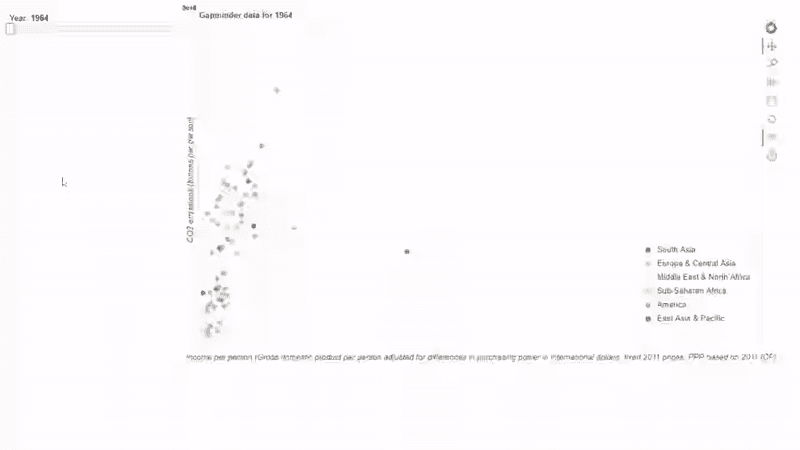

# 使用散景的 Python 交互式数据可视化

> 原文：<https://towardsdatascience.com/interactive-data-visualization-with-python-using-bokeh-4c71f8f7c817?source=collection_archive---------25----------------------->


Photo by [Yosh Ginsu](https://unsplash.com/photos/e4usjv5lmhE?utm_source=unsplash&utm_medium=referral&utm_content=creditCopyText) on [Unsplash](https://unsplash.com/search/photos/smoke-landscape?utm_source=unsplash&utm_medium=referral&utm_content=creditCopyText)

## 简单和基本的演练示例

最近我来到了这个图书馆，了解了一些，当然也尝试了一下，并决定分享我的想法。

来自官方网站:“Bokeh 是一个交互式可视化库，针对现代 web 浏览器进行演示。它的目标是提供优雅、简洁的通用图形结构，并通过超大型或流式数据集的高性能交互来扩展这种能力。Bokeh 可以帮助任何想要快速轻松地创建交互式绘图、仪表盘和数据应用的人。”我认为这很清楚，但如果能看到它的实际效果会更好，不是吗？

开始之前，请确保您的环境中安装了散景，如果没有，请遵循这里的安装说明。

所以我为自己创造了一些案例研究。决定将二氧化碳排放量的变化以及与 GDP 的相关性可视化(并检查这种相关性是否存在，因为你永远不知道:|)。

所以我拿了两个文件:一个是 Gapminder.org的二氧化碳排放量，另一个是 DataCamp 课程的(因为那个文件已经预处理过了😀是的，我是一个懒惰的混蛋😀 ).您也可以从这里下载这些文件。

[二氧化碳排放量人均吨数 csv](http://sergilehkyi.com/wp-content/uploads/2019/01/co2_emissions_tonnes_per_person.csv)

[gapminder_tidy.csv](http://sergilehkyi.com/wp-content/uploads/2019/01/gapminder_tidy.csv)

我们如何开始分析数据？正确，通过导入必要的包和导入数据本身(非常重要的:D)。然后，我们执行一些 EDA(探索性数据分析)来了解我们正在处理的内容，之后清理数据并将其转换为分析所需的格式。非常简单。由于本文并不关注这些步骤，我将在下面插入我所做的所有转换的代码。

```
import pandas as pd
import numpy as np

# Data cleaning and preparation
data = pd.read_csv('data/co2_emissions_tonnes_per_person.csv')
data.head()

gapminder = pd.read_csv('data/gapminder_tidy.csv')
gapminder.head()

df = gapminder[['Country', 'region']].drop_duplicates()
data_with_regions = pd.merge(data, df, left_on='country', right_on='Country', how='inner')
data_with_regions = data_with_regions.drop('Country', axis='columns')
data_with_regions.head()

new_df = pd.melt(data_with_regions, id_vars=['country', 'region'])
new_df.head()

columns = ['country', 'region', 'year', 'co2']
new_df.columns = columns

upd_new_df = new_df[new_df['year'].astype('int64') > 1963]
upd_new_df.info()
upd_new_df = upd_new_df.sort_values(by=['country', 'year'])
upd_new_df['year'] = upd_new_df['year'].astype('int64')

df_gdp = gapminder[['Country', 'Year', 'gdp']]
df_gdp.columns = ['country', 'year', 'gdp']
df_gdp.info()

final_df = pd.merge(upd_new_df, df_gdp, on=['country', 'year'], how='left')
final_df = final_df.dropna()
final_df.head()

np_co2 = np.array(final_df['co2'])
np_gdp = np.array(final_df['gdp'])
np.corrcoef(np_co2, np_gdp)
```

顺便说一下，二氧化碳排放量和国内生产总值相关，而且非常显著——0.78。

```
np.corrcoef(np_co2, np_gdp)
 Out[138]: 
 array([[1\.        , 0.78219731],
        [0.78219731, 1\.        ]])
```

现在让我们进入可视化部分。同样，我们从必要的进口开始。我将进一步解释它们。现在，只要放松和导入。

```
from bokeh.io import curdoc
from bokeh.plotting import figure
from bokeh.models import HoverTool, ColumnDataSource, CategoricalColorMapper, Slider
from bokeh.palettes import Spectral6
from bokeh.layouts import widgetbox, row
```

我们将开始为我们的交互式可视化应用程序准备不同的细节。首先，我们为世界上不同的地区创建了一个颜色映射器，所以每个国家都会有不同的颜色，这取决于它所在的地区。我们选择唯一的区域，并将它们转换成列表。然后我们使用`CategoricalColorMapper`为每个区域分配不同的颜色。

```
regions_list = final_df.region.unique().tolist()
color_mapper = CategoricalColorMapper(factors=regions_list, palette=Spectral6)
```

接下来，我们将为我们的应用程序准备一个数据源。Bokeh 接受许多不同类型的数据作为图形和视觉效果的来源:直接使用值列表、pandas 数据帧和系列、numpy 数组等提供数据。但是大多数散景的核心是`ColumnDataSource`。

在最基本的层面上，`[ColumnDataSource](https://bokeh.pydata.org/en/latest/docs/reference/models/sources.html#bokeh.models.sources.ColumnDataSource)`只是列名和数据列表之间的映射。`[ColumnDataSource](https://bokeh.pydata.org/en/latest/docs/reference/models/sources.html#bokeh.models.sources.ColumnDataSource)`接受一个`data`参数，该参数是一个字典，以字符串列名作为键，以数据值列表(或数组)作为值。如果一个位置参数被传递给`[ColumnDataSource](https://bokeh.pydata.org/en/latest/docs/reference/models/sources.html#bokeh.models.sources.ColumnDataSource)`初始化器，它将被当作`data`。(来自官网)。

```
# Make the ColumnDataSource: source
source = ColumnDataSource(data={
    'x': final_df.gdp[final_df['year'] == 1964],
    'y': final_df.co2[final_df['year'] == 1964],
    'country': final_df.country[final_df['year'] == 1964],
    'region': final_df.region[final_df['year'] == 1964],
})
```

我们从一年的数据样本开始。我们基本上为`x, y, country`和`region`创建了一个值字典。

下一步是为我们的轴设置限制。我们可以通过找到“X”和“Y”的最小值和最大值来实现。

```
# Save the minimum and maximum values of the gdp column: xmin, xmax
xmin, xmax = min(final_df.gdp), max(final_df.gdp)

# Save the minimum and maximum values of the co2 column: ymin, ymax
ymin, ymax = min(final_df.co2), max(final_df.co2)
```

之后，我们创建我们的图形，在那里我们将放置我们所有的可视化对象。我们给它一个标题，设置宽度和高度，也设置轴。(“Y”轴设置为日志类型只是为了更好地查看，尝试了几种类型，这一种给出了最好的结果)

```
# Create the figure: plot
plot = figure(title='Gapminder Data for 1964', 
              plot_height=600, plot_width=1000,
              x_range=(xmin, xmax),
              y_range=(ymin, ymax), y_axis_type='log')
```

散景使用字形的定义来定义可以出现在图上的所有可视形状。Bokeh 中内置的字形的完整列表如下(没有发明任何东西——所有信息来自官方页面):

*   `[AnnularWedge](https://bokeh.pydata.org/en/latest/docs/reference/models/glyphs/annular_wedge.html#bokeh.models.glyphs.AnnularWedge)`
*   `[Annulus](https://bokeh.pydata.org/en/latest/docs/reference/models/glyphs/annulus.html#bokeh.models.glyphs.Annulus)`
*   `[Arc](https://bokeh.pydata.org/en/latest/docs/reference/models/glyphs/arc.html#bokeh.models.glyphs.Arc)`
*   `[Bezier](https://bokeh.pydata.org/en/latest/docs/reference/models/glyphs/bezier.html#bokeh.models.glyphs.Bezier)`
*   `[Ellipse](https://bokeh.pydata.org/en/latest/docs/reference/models/glyphs/ellipse.html#bokeh.models.glyphs.Ellipse)`
*   `[HBar](https://bokeh.pydata.org/en/latest/docs/reference/models/glyphs/hbar.html#bokeh.models.glyphs.HBar)`
*   `[HexTile](https://bokeh.pydata.org/en/latest/docs/reference/models/glyphs/hex_tile.html#bokeh.models.glyphs.HexTile)`
*   `[Image](https://bokeh.pydata.org/en/latest/docs/reference/models/glyphs/image.html#bokeh.models.glyphs.Image)`
*   `[ImageRGBA](https://bokeh.pydata.org/en/latest/docs/reference/models/glyphs/image_rgba.html#bokeh.models.glyphs.ImageRGBA)`
*   `[ImageURL](https://bokeh.pydata.org/en/latest/docs/reference/models/glyphs/image_url.html#bokeh.models.glyphs.ImageURL)`
*   `[Line](https://bokeh.pydata.org/en/latest/docs/reference/models/glyphs/line.html#bokeh.models.glyphs.Line)`
*   `[MultiLine](https://bokeh.pydata.org/en/latest/docs/reference/models/glyphs/multi_line.html#bokeh.models.glyphs.MultiLine)`
*   `[MultiPolygons](https://bokeh.pydata.org/en/latest/docs/reference/models/glyphs/multi_polygons.html#bokeh.models.glyphs.MultiPolygons)`
*   `[Oval](https://bokeh.pydata.org/en/latest/docs/reference/models/glyphs/oval.html#bokeh.models.glyphs.Oval)`
*   `[Patch](https://bokeh.pydata.org/en/latest/docs/reference/models/glyphs/patch.html#bokeh.models.glyphs.Patch)`
*   `[Patches](https://bokeh.pydata.org/en/latest/docs/reference/models/glyphs/patches.html#bokeh.models.glyphs.Patches)`
*   `[Quad](https://bokeh.pydata.org/en/latest/docs/reference/models/glyphs/quad.html#bokeh.models.glyphs.Quad)`
*   `[Quadratic](https://bokeh.pydata.org/en/latest/docs/reference/models/glyphs/quadratic.html#bokeh.models.glyphs.Quadratic)`
*   `[Ray](https://bokeh.pydata.org/en/latest/docs/reference/models/glyphs/ray.html#bokeh.models.glyphs.Ray)`
*   `[Rect](https://bokeh.pydata.org/en/latest/docs/reference/models/glyphs/rect.html#bokeh.models.glyphs.Rect)`
*   `[Segment](https://bokeh.pydata.org/en/latest/docs/reference/models/glyphs/segment.html#bokeh.models.glyphs.Segment)`
*   `[Step](https://bokeh.pydata.org/en/latest/docs/reference/models/glyphs/step.html#bokeh.models.glyphs.Step)`
*   `[Text](https://bokeh.pydata.org/en/latest/docs/reference/models/glyphs/text.html#bokeh.models.glyphs.Text)`
*   `[VBar](https://bokeh.pydata.org/en/latest/docs/reference/models/glyphs/vbar.html#bokeh.models.glyphs.VBar)`
*   `[Wedge](https://bokeh.pydata.org/en/latest/docs/reference/models/glyphs/wedge.html#bokeh.models.glyphs.Wedge)`

所有这些字形通过它们的基类`Glyph`共享一个最小的公共接口

我们不会太深入所有这些形状，并将使用圆作为最基本的形状之一。如果你想玩更多的其他字形，你有所有必要的文件和链接。

```
# Add circle glyphs to the plot
plot.circle(x='x', y='y', fill_alpha=0.8, source=source,    legend='region', color=dict(field='region', transform=color_mapper), size=7)
```

那么我们怎么把这些圈加起来呢？我们将我们的源分配给圆形字形的“源”参数，我们为“X”和“Y”指定数据，我们为颜色添加图例，我们将先前创建的`ColorMapper`应用到“颜色”参数，“fill_alpha”设置一点透明度，“size”是将出现在图上的圆形的大小。

接下来，我们通过设置图例的位置并给我们的轴一些解释来改善我们的绘图的外观。

```
# Set the legend.location attribute of the plot
plot.legend.location = 'bottom_right'

# Set the x-axis label
plot.xaxis.axis_label = 'Income per person (Gross domestic product per person adjusted for differences in purchasing power in international dollars, fixed 2011 prices, PPP based on 2011 ICP)'

# Set the y-axis label
plot.yaxis.axis_label = 'CO2 emissions (tonnes per person)'
```

到目前为止，我们对 1964 年有一个基本的静态情节，但文章的标题有一个词不适合这种情况——“互动”O_O。所以让我们增加一些互动性！

为了做到这一点，我们将添加一个带有年份的滑块，所以最终我们将有一个每个可用年份的可视化。酷！不是吗？

以前我们导入了类`Slider`，现在是时候使用它了！因此，我们创建了这个类的对象，开始是最小年，结束是最大值，默认值是最小年，步骤(滑块上的值变化的速度)-1 年，以及标题。

我们还为这个滑块上发生的任何变化创建了一个回调。散景中的回调总是有相同的输入参数:`attr, old, new`。我们将根据滑块的值更新我们的数据源。因此，我们创建了一个新的字典，它将对应于滑块中的年份，并基于此更新我们的绘图。我们也相应地更新了标题。

```
# Make a slider object: slider
slider = Slider(start=min(final_df.year), end=max(final_df.year), step=1, value=min(final_df.year), title='Year')

def update_plot(attr, old, new):
    # set the `yr` name to `slider.value` and `source.data = new_data`
    yr = slider.value

    new_data = {
        'x': final_df.gdp[final_df['year'] == yr],
        'y': final_df.co2[final_df['year'] == yr],
        'country': final_df.country[final_df['year'] == yr],
        'region': final_df.region[final_df['year'] == yr],
    }
    source.data = new_data

    # Add title to figure: plot.title.text
    plot.title.text = 'Gapminder data for %d' % yr

# Attach the callback to the 'value' property of slider
slider.on_change('value', update_plot)
```

有了这么多的数据点，绘图很快就会变得混乱。因此，为了使这里将要展示的每个小圆圈更加清晰，我决定将 HoverTool 也包含在这个图中。

```
# Create a HoverTool: hover
hover = HoverTool(tooltips=[('Country', '@country'), ('GDP', '@x'), ('CO2 emission', '@y')])

# Add the HoverTool to the plot
plot.add_tools(hover)
```

HoverTool 接受一个元组列表，第一个值是 label，第二个值是来自数据源的值 detail。

我们已经完成了这个小应用程序的所有组件，只剩下最后几行代码来创建一个布局并将其添加到当前文档中

```
# Make a row layout of widgetbox(slider) and plot and add it to the current document
layout = row(widgetbox(slider), plot)
curdoc().add_root(layout)
```

我们完了。恭喜你！我们运行这段代码，但…什么也没有。没有错误(或者可能有一些错误，但你修复它们后就没有错误了)，没有应用程序，没有可视化 O_o。为什么我花了那么多时间来创建一个很酷的情节，而我什么也没有得到？甚至不解释我做错了什么？

这是我尝试运行该应用程序时的第一个想法。但是后来我想起了一个技巧，你实际上首先必须启动一个服务器，作为这个可视化的后端。

因此，接下来也是最后一件事就是从命令行运行下面的代码:

```
bokeh serve --show my_python_file.py
```

它会自动在新的浏览器选项卡中打开您的可视化。



尽管 matplotlib 是最受欢迎的，但它并不是最用户友好的数据可视化工具，并且有它自己的局限性，我真的不喜欢它。所以，如果你和我属于同一群人，散景是一个可能的解决方案。试试看，让我知道你的想法。

感谢您的关注，希望这个关于散景的小介绍对您有用，祝您度过愉快的一天！(或者晚上，如果你在睡觉前读这篇文章，:D)

另外，我也想尝试 plotly，看到了很多关于它的积极反馈。

[Github](https://github.com/slehkyi/notebooks-for-articles/blob/master/co2_world.py) 上的 PS . s .代码。

*原载于 2019 年 1 月 31 日*[](http://sergilehkyi.com/interactive-data-visualization-with-python-using-bokeh/)**4 种语言(EN、es、UA、RU)。**