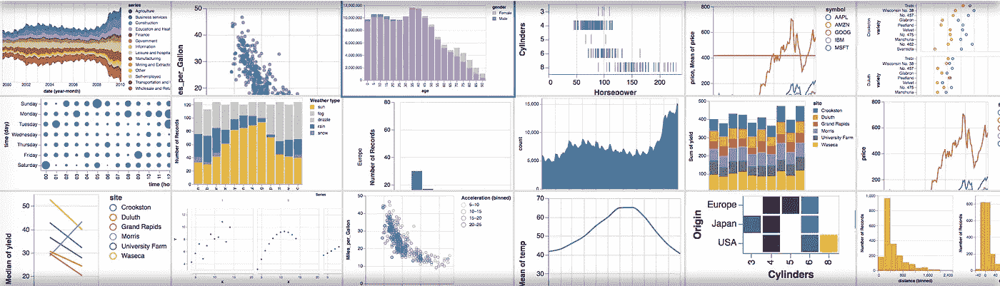
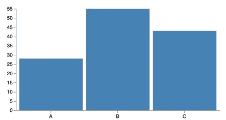
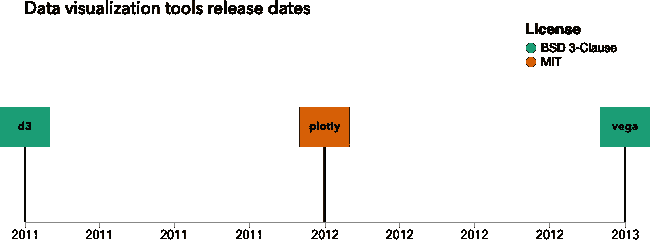
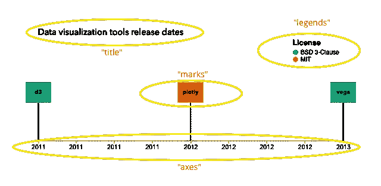
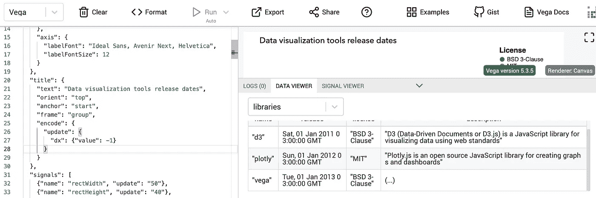

# 用 Vega 实现交互式数据可视化

> 原文：<https://towardsdatascience.com/interactive-data-visualization-with-vega-ab09e2843d54?source=collection_archive---------9----------------------->

## 什么是 Vega 以及如何使用它来构建 web 可视化



我一直在学习新的可视化工具，因为这有助于我为手头的任务找到合适的工具。谈到数据可视化，d3 通常是首选，但最近我一直在玩 [**织女星**](https://vega.github.io/vega/) ，我很喜欢它。

Vega 引入了一个**可视化语法**。语法基本上是一套规定如何使用语言的规则，因此我们可以将 Vega 视为一种工具，它定义了一套如何构建和操作视觉元素的规则。

随着我在数据可视化方面的经验增长，我越来越发现**约束是一件好事**。通过引入可视化语法，Vega 为我们提供了一些约束条件。最棒的是，这些约束可以让用户在构建数据可视化时感到非常有效率。

还有 **Vega-Lite** ，一种专注于快速创建[通用统计图形](https://vega.github.io/vega-lite/)的高级语法，但今天我们将坚持使用 **Vega** ，它是一种更通用的工具。

好了，介绍够了，让我们来了解一下织女星是如何工作的。

# Vega 概述

我们可以[在 web 上部署 Vega](https://vega.github.io/vega/usage/)，但是在本教程中，我们将简单地使用 [Vega 编辑器](https://vega.github.io/editor/#/custom/vega)(这是关于 Vega 的另一件大事)。

在使用 Vega 时，我们在一个 **JSON 对象**中定义可视化。让我们开始构建一个条形图。



A bar chart built with Vega

如果我们分解这个图表，我们有:

*   🗂数据(每个数据点的类别和数量)
*   📊x 轴，表示每个类别的位置(我们需要一个*标尺*来表示每个类别应该放在哪里)
*   📊y 轴，显示每个数据点的数量(我们需要一个*刻度*来表示每个数量应该放在哪里)
*   ✍🏾长方形

这就是我们使用 Vega 定义上述内容的方式:

```
{
  "$schema": "[https://vega.github.io/schema/vega/v5.json](https://vega.github.io/schema/vega/v5.json)",
  "width": 400,
  "height": 200,
  "padding": 5,
  **"data"**: [
    {
      "name": "our_data",
      **"values"**: [
        {
          "category": "A",
          "amount": 28
        },
        {
          "category": "B",
          "amount": 55
        },
        {
          "category": "C",
          "amount": 43
        }
      ]
    }
  ],
  **"scales"**: [
    {
      "name": "xscale",
      "type": "band",
      "domain": {
        "data": "our_data",
        "field": "category"
      },
      "range": "width",
      "padding": 0.05
    },
    {
      "name": "yscale",
      "domain": {
        "data": "our_data",
        "field": "amount"
      },
      "range": "height"
    }
  ],
  **"axes"**: [
    {
      "orient": "bottom",
      "scale": "xscale"
    },
    {
      "orient": "left",
      "scale": "yscale"
    }
  ],
  **"marks"**: [
    {
      "type": "rect",
      "from": {
        "data": "our_data"
      },
      "encode": {
        "enter": {
          "x": {
            "scale": "xscale",
            "field": "category"
          },
          "width": {
            "scale": "xscale",
            "band": 1
          },
          "y": {
            "scale": "yscale",
            "field": "amount"
          },
          "y2": {
            "scale": "yscale",
            "value": 0
          },
          "fill": {
            "value": "steelblue"
          }
        }
      }
    }
  ]
}
```

这里可以现场试一下[。](https://vega.github.io/editor/#/url/vega/N4KABGBEAkDODGALApgWwIaQFxUQFzwAdYsB6UgN2QHN0A6agSz0QFcAjOxge1IRQyUa6SgFY6AK1jcAdpAA04KAHdGAExbYwAFgAMuxREgpG1fFoBM+w1ELo1axjOpbRipZDXo8mHAG0lCFAIEKgZdFRkLUgfdgAbKJtQyAp0ONZkWC0A0NDgSHhvGm4AJwBPaIBBBSgI7lYZPEsADgBfJNz8wrxi8uiAIRrIOoamnFFRdsDOgqLqUoqcSABhIZHGrW0AZlbpiABdad2D9yMENMzs6eDcyHDI6IAPc4SFPag8MsIopfZ0GTUb1yUDU3AwTi0+S8PmisVe8igADNGMg4oClt1ehUpsDICV-tQfip1JoOkY7A4nC4cLo6LpREcOjdkvciZAyi9Eu9PGD0BCcFDvL4Puh4okkSi0dF1k0cbd8c42SYzE0jkp9qdao9Lv5rlBSiiNr9uAQwUNOU8LWA5UF9SVDWMoAlEU0EZALUsOYVXtb1ZrIBgSgBrLK6vLcz7faIlZDwV3cxElM0CzxC7AxUWvG0hSDIGTwbhqInM255nolSHvZKPSHu71s571obI1HoqCY+Z9bO41QaRC1j1QRsXIZ-AFaACM3duizA+UH7ItbpbUqWMsg0+SZQsA6bnqXUFS6SJuk3OeRcTitaPGWisB6qPit+OwN9wJfEBfh1aQA)

让我们来看一下这些定义。我将在这里简要地解释它们，但是我们可以使用更多的属性来定制东西(在使用它们的时候检查一下[文档](https://vega.github.io/vega/docs/)是一个好主意)。

## 🗂“数据”:[]

我们可以直接在规范中定义数据(就像我们使用`"values"`属性一样),或者使用`"url"`属性从外部文件(例如 *json* 或 *csv* )加载数据。

## 📈"秤":[]

织女星音阶由 *d3 音阶*库提供。我们用`"type"`关键字指定缩放的类型(默认为线性)。可以通过多种方式指定比例域:

*   一个[数据引用](https://vega.github.io/vega/docs/scales/#dataref)对象，它指定一个或多个数据集中的字段值，就像我们对`{"data": "our_data", "field": "amount"}`所做的那样。Vega 从数据集中计算出`amount`键的*【min，max】*数组
*   作为字面[数组](https://vega.github.io/vega/docs/types/#Array)的域值
*   解析为域值数组的[信号参考](https://vega.github.io/vega/docs/types/#Signal)。比如`{"signal": "myDomain"}`(别急，后面我再讲信号)

## 📊"轴":[]

这里，我们需要指定用于创建轴的方向和*比例*。我们可以使用许多[属性](https://vega.github.io/vega/docs/axes/)来定制它们。

## ✍🏾"标记":[]

我们使用标记通过几何图元(矩形、圆形、直线等)对数据进行编码。在这个条形图中，我们使用了矩形标记。他们需要给定的*位置*、*宽度*和*高度*。我们还需要指定应该使用什么数据来构建标记(`"from"`属性)。

```
"from": {"data":"our_data"}
```

所有关于`"x"`、`"y"`和`"width"`的定义都将来自这个数据集。织女星[类型](https://vega.github.io/vega/docs/types/)一开始可能看起来有点混乱，所以让我们来看看我们在这里使用的类型:

```
"x": {"scale": "xscale", "field": "category"}
```

rects 的`"x"`属性将通过从`"category"`字段向`"xscale"`传递值来设置。

```
"y": {"scale": "xscale", "band": 1}
```

每个矩形的`"y"`属性将是带刻度`xscale`的范围带宽。

```
"fill": {"value": "steelblue"}
```

矩形的`"fill"`颜色将是钢蓝色。为了定义常量值，我们使用了`"value"`属性。

Vega 使用与 d3 相同的*进入、更新、退出*模式:

> 当数据第一次被处理并且一个标记实例被新添加到一个场景中时,*输入*属性被评估。对所有现有的(不存在的)标记实例评估*更新*属性。当支持标记的数据被移除时，评估*退出*属性，因此标记离开可视场景。”— [维加文档](https://vega.github.io/vega/docs/marks/)

我们在`"encode"`属性中使用该模式。在这个条形图中，我们在处理数据时放置元素:

```
**"encode"**: {
    **"enter"**: {
        "x": {"scale": "xscale", "field": "category"},
        "width": {"scale": "xscale", "band": 1},
        "y": {"scale": "yscale", "field": "amount"},
        "y2": {"scale": "yscale", "value": 0},
        "fill": {"value": "steelblue"}
     }
}
```

这就是织女星 101 之旅！为了更好地了解织女星的能力，让我们建立一个时间表。

# 用织女星构建时间线



A timeline built with Vega



Some Vega properties we'll use to build the timeline

## 1 — 🗂“数据”:[]

除了加载数据，我们还可以使用 Vega [转换](https://vega.github.io/vega/docs/transforms/)来过滤、计算新字段或导出新数据流。我们可以使用 [collect](https://vega.github.io/vega/docs/transforms/collect/) 转换按名称对项目进行排序:

```
"data": [
    {
      "name": "libraries",
      "format": {
        "type": "json",
        "parse": {
          "release": "date:'%Y'"
        }
      },
      "values": [
        {
          "name": "vega",
          "release": "2013",
          "license": "BSD 3-Clause",
          "description": "Vega is a visualization grammar, a declarative language for creating, saving, and sharing interactive visualization designs"
        },
        {
          "name": "d3",
          "release": "2011",
          "license": "BSD 3-Clause",
          "description": "D3 (Data-Driven Documents or D3.js) is a JavaScript library for visualizing data using web standards"
        },
        {
          "name": "plotly",
          "release": "2012",
          "license": "MIT",
          "description": "Plotly.js is an open source JavaScript library for creating graphs and dashboards"
        }
      ],
      **"transform": [
        {
          "type": "collect",
          "sort": {
            "field": "name"
          }
        }
      ]**
    }
  ]
```

Vega 的另一个优点是它可以检查我们用来构建可视化的所有数据的内容:



The dataset sorted by name

## 2—📈"秤":[]

我们需要一个用于 x 轴的**时间刻度**和一个**顺序刻度**来给矩形上色:

```
"scales": [
    {
      "name": "xScale",
      **"type": "time"**,
      **"domain": {
        "data": "libraries",
        "field": "release"
      }**,
      "range": "width",
      "nice": "year"
    },
    {
      "name": "colorScale",
      "**type": "ordinal",**
      **"domain": {
        "data": "libraries",
        "field": "license"
      }**,
      "range": {
        "scheme": "dark2"
      }
    }
  ]
```

## 3 —📊"轴":[]

让我们在底部放置一个轴，并在标签中显示年份:

```
"axes": [
    {
      "scale": "xScale",
      **"orient": "bottom",
      "format": "%Y"**
    }
  ]
```

## 4 — ✍🏾"标记":[]

有三个标记:矩形、矩形内的文本和从每个矩形到轴的线。我们将使用`"rect"`、`"text"`和`"rule"`标记来定义它们。

但首先让我们介绍一个重要的织女星属性:[信号](https://vega.github.io/vega/docs/signals/)。

## ❗️Signals

信号是动态变量。正如文档所说，信号值是*反应性的*:它们可以响应输入事件流、外部 API 调用或上游信号的变化而更新。这里我们将使用它们的初始值，但是它们的强大之处在于能够更新它们(我们将在下一次看到如何更新)。

```
**"signals"**: [
    {
      "name": "rectWidth",
      "value": 50
    },
    {
      "name": "rectHeight",
      "value": 40
    },
    {
      "name": "rectY",
      "value": 85
    },
    {
      "name": "rectCenter",
      "init": "[rectWidth/2,rectY+rectHeight/2]"
    }
  ]
```

现在我们有了信号，就可以用它们来做标记了。信号也可以持有织女星[表情](https://vega.github.io/vega/docs/expressions/)。一个非常常用的是[秤](https://vega.github.io/vega/docs/expressions/#scale):

> **缩放** ( *名称*，*值* [，*组*)
> 将命名的缩放变换(或投影)应用到指定的*值*。可选的*组*参数采用一个场景图组标记项来指示查找比例或投影的具体范围。

在本例中，我们将使用一个表达式将矩形放置在每年的中间，表达式如下:

```
"signal": **"scale('xScale',datum.release)**-rectWidth/2"
         //*scale*(name, value*[*,group*]*
```

正如我们前面看到的，我们需要指定应该使用什么数据来构建带有`"from"`属性的标记。织女星是如此之大，以至于我们可以指定来自**另一个标记本身的数据**！在这种情况下，我们将使用来自 rect 标记的数据，这样我们就可以获得每个矩形的中心，并将文本放在中间。为了访问数据点，我们在表达式中使用了`"datum"`。

```
"marks": [
    {
      **"type": "rect"**,
      "name": "rectangles",
      "from": {
        "data": "libraries"
      },
      "encode": {
        "enter": {
          "width": {
            **"signal": "rectWidth"**
          },
          "height": {
            **"signal": "rectHeight"**
          },
          "x": {
            **"signal": "scale('xScale',datum.release)-rectWidth/2"**
          },
          "y": {
            **"signal": "rectY"**
          },
          "fill": {
            **"signal": "scale('colorScale', datum.license)"**
          },
          "tooltip": {
            **"signal": "{'Description': datum.description}"**
          }
        },
        "update": {
          "fillOpacity": {
            "value": 1
          }
        },
        "hover": {
          "fillOpacity": {
            "value": 0.5
          }
        }
      }
    },
    {
      "type": "text",
      "name": "labels",
      **"from": {
        "data": "rectangles" // ⬅️cool
      }**,
      "encode": {
        "enter": {
          "text": {
            **"signal": "datum.datum.name"**
          },
          "x": {
            **"signal": "datum.x+rectCenter[0]"** //datum.x is from rect
          },
          "y": {
            **"signal": "rectCenter[1]"**
          },
          "align": {
            "value": "center"
          },
          "baseline": {
            "value": "middle"
          },
          "fontWeight": {
            "value": "bold"
          },
          "fill": {
            "value": "black"
          }
        }
      },
      "interactive": false
    },
    {
      "type": "rule",
      **"from": {
        "data": "labels" // ⬅️cool
      }**,
      "encode": {
        "enter": {
          "x": {
            **"signal": "datum.x"**
          },
          "x2": {
            **"signal": "datum.x"**
          },
          "y": {
            **"signal": "datum.y+rectCenter[0]-5"**
          },
          "y2": {
            **"signal": "height"**
          },
          "strokeWidth": {
            "value": 2
          }
        }
      }
    }
  ]
```

## 5 — 💬"传奇":[]

图例定义类似于标记定义。要自定义的可寻址元素有:

*   `legend`为图例[组](https://vega.github.io/vega/docs/marks/group)标记，
*   `title`为标题[正文](https://vega.github.io/vega/docs/marks/text)标注，
*   `labels`为标签[文字](https://vega.github.io/vega/docs/marks/text)标记，
*   `symbols`为图例[符号](https://vega.github.io/vega/docs/marks/symbol)标志，
*   `entries`用于符号图例[组](https://vega.github.io/vega/docs/marks/group)包含符号/标签对的标记，以及
*   `gradient`对于渐变[矩形](https://vega.github.io/vega/docs/marks/rect)标记:一个带有渐变填充的矩形用于连续渐变图例，多个带有实心填充的矩形标记用于离散渐变图例。

这里我们将只为图例(整个组)设置`"x"`位置，并为标题和标签设置字体大小。

```
"legends": [
    {
      "title": "License",
      "fill": "colorScale",
      "orient": "none",
      "encode": {
        **"title"**: {
          "update": {
            "fontSize": {
              "value": 15
            }
          }
        },
        **"labels"**: {
          "update": {
            "fontSize": {
              "value": 12
            }
          }
        },
        **"legend"**: {
          "update": {
            "x": {
              "value": 500
            }
          }
        }
      }
    }
  ]
```

## 6 — ⚙️“配置”和“标题”:[]

**config** 对象定义默认的可视化值来设置可视化的主题。这里我们为图表的文本设置字体。 **title** 指令向图表添加描述性标题。

```
**"config"**: {
    "text": {
      "font": "Ideal Sans, Avenir Next, Helvetica"
    },
    "title": {
      "font": "Ideal Sans, Avenir Next, Helvetica",
      "fontWeight": 500,
      "fontSize": 17,
      "limit": -1
    },
    "axis": {
      "labelFont": "Ideal Sans, Avenir Next, Helvetica",
      "labelFontSize": 12
    }
  },
**"title"**: {
    "text": "Data visualization tools release dates",
    "orient": "top",
    "anchor": "start",
    "frame": "group",
    "encode": {
      "update": {
        "dx": {
          "value": -1
        }
      }
    }
  }
```

我们完了。你可以在这里看到代码。

还有一些我们在本教程中没有看到的其他很酷的 Vega 特性:

*   [触发](https://vega.github.io/vega/docs/triggers):根据信号值修改数据集或标记属性
*   [投影](https://vega.github.io/vega/docs/projections):地图(经度、纬度)数据的制图投影
*   [事件流](https://vega.github.io/vega/docs/event-streams):定义输入事件流来指定交互
*   [布局](https://vega.github.io/vega/docs/layout):对一组标记进行网格布局

# 结束语

今天，我在工作流程中使用 Vega 来构建原型，并测试关于数据可视化选择的假设。如果在那之后，我发现我需要一些更加定制的东西，那么我会改变方式，使用 d3。

你可以在这里查看更多织女星的例子:[https://vega.github.io/vega/examples/](https://vega.github.io/vega/examples/)。我们可以在在线 Vega 编辑器中查看所有示例，这太棒了。

就是这样！感谢阅读！😄