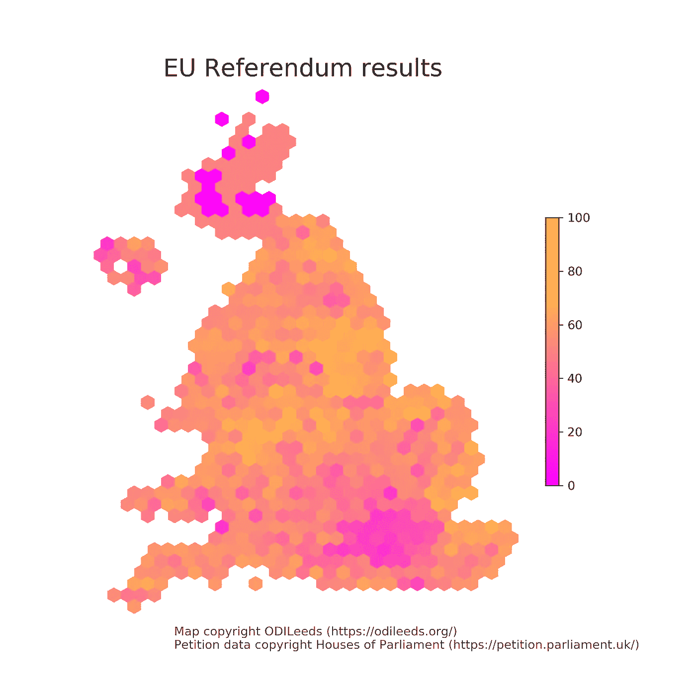
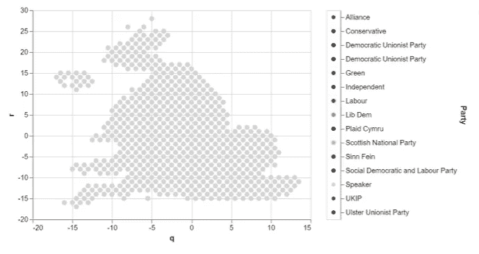
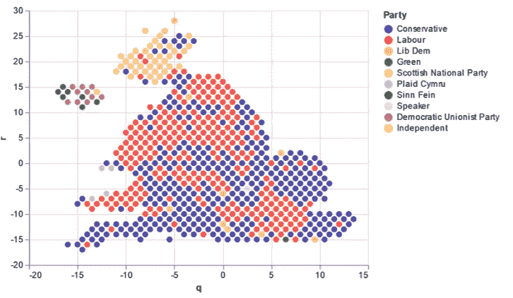
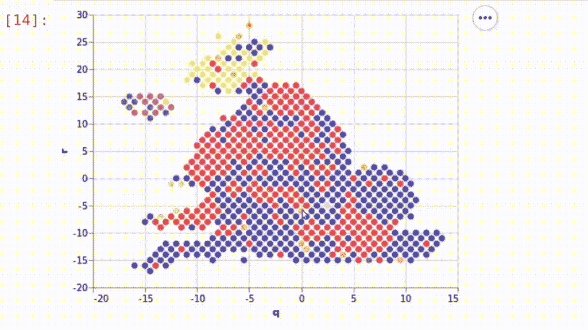
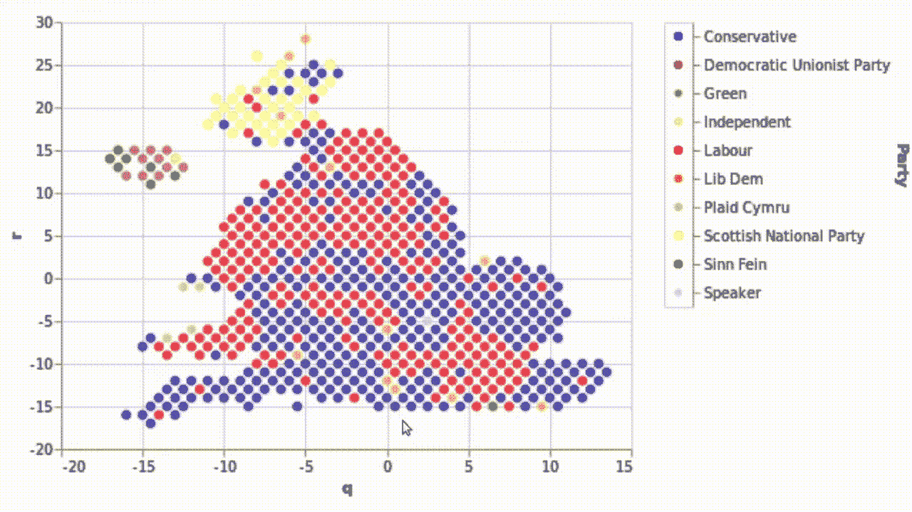
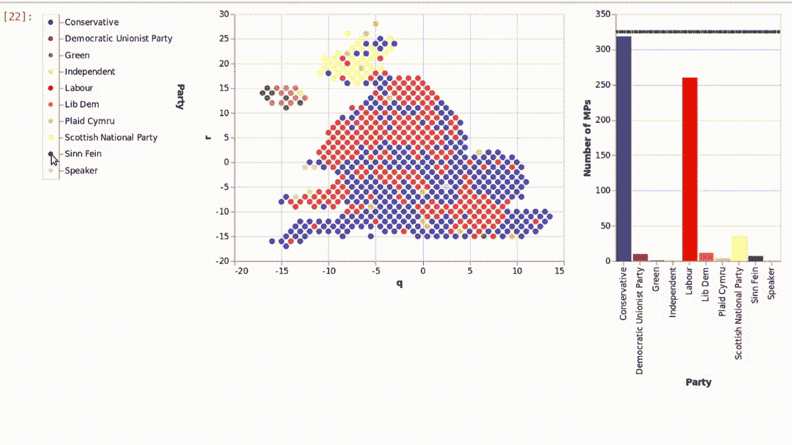

# 用 Python 和 Altair 实现交互式选举可视化

> 原文：<https://towardsdatascience.com/interactive-election-visualisations-with-altair-85c4c3a306f9?source=collection_archive---------16----------------------->

在[最近的一篇文章](/visualising-elections-with-python-4973c0c60bbe)中，我展示了我们如何用 matplotlib 生成 hexmaps 来可视化选举。虽然这些地图很好地展示了如何传达地理信息，但它们并非没有缺陷。例如，可能很难从静态图像中识别出哪个选区是哪个选区，因为要对选区进行操作以使它们大小相等。

在这篇文章中，我们将使用 [Altair](https://altair-viz.github.io/) ，一个声明性的 Python 绘图库，来交付 hexmaps 的改进的交互式版本。你可以用我的 [GitHub](https://github.com/TTitcombe) 上的笔记本来关注这篇文章[。](https://github.com/TTitcombe/ConstituencyMap/blob/master/examples/altair_examples.ipynb)

首先，让我们提醒自己，在上一篇文章之后，我们还剩下什么。



# 阿尔泰尔

> Altair 是一个用于 Python 的声明性统计可视化库

本质上，这意味着我们定义我们的数据和输出(图表看起来像什么), Altair 将做所有的操作，把我们从输入带到输出。

与 Python 可视化的主食 matplotlib 相比:对于 hexmap，我们必须明确指定每个六边形的坐标、旋转、大小和颜色*。*

虽然 matplotlib 对图形的最终状态提供了更多的控制，但实现基本的定制通常比 Altair 花费更多的时间、知识和精力(当然也比人们愿意付出的多)。

Altair 是基于 [Vega，](https://vega.github.io/vega/)一个 JavaScript 绘图库构建的。要渲染交互式图形，您需要一个前端应用程序，如 Jupyter lab。

Altair 可以通过 pip ( `pip install -U altair vega_datasets jupyterlab`)或 conda ( `conda install -c conda-forge altair vega_datasets jupyterlab`)安装。

# 数据

在本帖中，我们将展示 2017 年大选后英国议会的构成。这些数据可以从 [gov.uk 网站](https://data.gov.uk/dataset/b77fcedb-4792-4de4-935f-4f344ed4c2c6/general-election-results-2017)免费获得。该数据具有选区名称，*选区*，以及获胜政党的名称，*政党*。

我们已经使用 [ODILeeds 的神奇 hexmap](https://odileeds.org/projects/hexmaps/constituencies/) 为选区分配了十六进制坐标 *p* 和 *q* 。

# 基本地图

由于 Altair 的声明式风格，在其中生成基本的十六进制地图应该很简单。让我们来测试一下。

```
import altair as altalt.Chart(data)
    .mark_circle()
    .encode(
        x="q",
        y="r",
        color=alt.value("lightgray"),
        size=alt.value(50),
)
```



让基本的 matplotlib 地图工作起来需要很多行代码(和很多小时的堆栈溢出);对于牛郎星，是七行。

在 Altair 中，我们首先创建一个包含我们希望使用的数据的`Chart`对象。我们用`mark_circle()`指定在图表上做什么类型的标记。然后我们*用它们应该表示的数据方面对标记的特征进行编码*，在这种情况下，我们设置来自数据列 **q** 的 **x** 值和来自数据列 **r** 的 **y** 值。此外，我们已经使用`size=alt.value(50)`将每个圆的大小设置为一个常量。

定义了这几个简单的规则后，Altair 做了所有的脏活，产生了一个精彩的剧情。

诚然，目前这种颜色没有任何意义，也很暗淡。为了解决这个问题，我们需要向 Altair 提供一个将政党名称与特定颜色联系起来的方法。

```
parties = ["Conservative", "Labour", "Lib Dem", "Green", ...]
party_colours = ["darkblue", "red", "orange", "green", ...]  #etc.colours_obj = alt.Color(
    "Party:N", 
    scale=alt.Scale(domain=parties, 
                    range=party_colours)
)alt.Chart(data)
    .mark_circle()
    .encode(
        x="q",
        y="r",
        color=colours_obj,
        size=alt.value(50),
)
```

`alt.Color`对象告诉 Altair 从数据中的**方**列获取颜色。然而，当事人是字符串，因此不能被解释为颜色；`alt.Scale`将*域*参数中的所有方翻译成*范围*参数中相应的颜色。这与 matplotlib 形成鲜明对比，matplotlib 必须为每个对象定义一种颜色*。*

matplotlib 图的一个负面特性是它没有图例:我不知道如何产生一个图例，将迭代绘制的六边形的颜色与一个政党名称联系起来。了解 matplotlib，即使可以给每个六边形添加一个标签，得到的图例也会为每个六边形添加一个条目*，而不会注意到重复。*

也许并不奇怪，传说在 Altair 中是一件小事——`Color`对象会自动生成一个。



# 基本交互性

至此，我们已经生成了一个取代 matplotlib 版本的地图。然而，它仍然遭受难以识别扭曲的地理边界的问题。除非你在寻找沿海选区，否则你很可能找不到。

我们可以在每个六边形上添加文本来表示选区名称，但这要么太难阅读，要么使情节太大而无法欣赏。我们需要的是把静态图变成交互式的。幸运的是，对于这篇博文来说，Altair 擅长于交互性。

```
alt.Chart(data)
    .mark_circle()
    .encode(
        x="q",
        y="r",
        color=colours_obj,
        size=alt.value(50),
        tooltip=["Constituency:N"],
)
```

Altair 在一行代码中集成了对工具提示的支持。这是一个强大的特性，可以立即提高图形的可用性。



Oxford: definitely not north of Twickenham

# 更多互动

当然， [Altair 比工具提示提供了更多的交互性。我们将通过鼠标点击获得图表来突出显示某个政党的所有选区，从而对这些额外的产品进行取样。这种行为有助于识别一个团队在整个土地上的分布，否则可能会显示大量的颜色。](https://altair-viz.github.io/gallery/index.html#interactive-charts)

我们首先创建一个选择对象，并告诉它我们关心的重要信息是选择的**方**。我们用`add_selection`将这个交互选择元素添加到图表中。

为了改变行为，我们需要用条件参数替换静态标记参数。`alt.condition`接受一个条件，一个满足条件时显示的值，一个不满足条件时显示的值。请注意，这种情况下的条件是选择对象。当选择对象的**方**参数与标记牛郎星试图显示的**方**参数相同时，满足条件。

```
selector = alt.selection_single(empty='all', fields=['Party'])colours_condition = alt.condition(selector, 
                                  colours_obj,       
                                  alt.value("lightgray")alt.Chart(data)
    .mark_circle()
    .encode(
        x="q",
        y="r",
        color=colours_condition,
        size=alt.value(50),
        tooltip=["Constituency:N"],
).add_selection(selector)
```

这个例子突出了 Altair 从复杂的绘图中摆脱了多少痛苦。我们甚至不必使用条件代码来获得条件行为。



# 组合图表

我们通过展示如何一起显示多个图表来结束这篇文章。我们将添加一个条形图，显示每个政党的议员总数，这一信息很难从我们目前拥有的大量圆圈和颜色中提取出来。

首先，我们创建酒吧。这是一个与之前类似的过程，除了我们使用`mark_bars`向 Altair 发出信号，令人震惊的是，我们希望在图表对象上标记条形。还要注意，我们将这个对象赋给了一个变量；我们将对我们的地图图表做同样的事情。

条形的`y`值是每一方出现的次数。在其他绘图库中，我们需要在绘图前计算这些；牛郎星会用`count()` [*聚合*](https://altair-viz.github.io/user_guide/transform.html#user-guide-aggregate-transform) 帮你做到这一点。

我们还将在图表中添加一条水平线，以显示一个政党拥有多数席位的点。不幸的是，这是 Altair 容易出错的地方:简单地给该行赋予 y 值`alt.value(325)` *不会产生正确的结果。相反，我们必须将阈值添加到我们的数据对象中，并告诉 Altair 使用它。

**非技术方面——注:325 票技术上是下议院多数席位的门槛，但由于我们民主制度的“特点”，比如议长和新芬党，实际要求略低。*

```
df["threshold"] = 325

bars = base.mark_bar().encode(
    x="Party:N",
    y=alt.Y("count()", title="Number of MPs"),
    color=colours_condition
)

majority = base.mark_rule(color="black", strokeDash=[1, 1]).encode(
    y="threshold:Q",
    size=alt.value(3)
)map | (bars + majority)
```

牛郎星图表对象可以很容易地组合，堆叠或连接。`|` 操作符水平堆叠图表对象，`&`垂直堆叠它们，`+`将对象添加到同一个图表中。



# 后续步骤

在这次对牛郎星的快速浏览中，我们创造了强大的可视化效果，这在其他库中可能要花更多的时间才能完成。

尽管 Altair 可以轻松处理定制和复杂的情节，但它是一个利用率极低的软件包。它的交互性和无需干预的绘图方法可以而且应该使它成为 Python 用户的首选绘图库。

在以后的文章中，我们将详细阐述这些情节，来想象在不同的投票制度下，英国的政治地理会如何演变。

你可以在我的 [GitHub](https://github.com/TTitcombe/ConstituencyMap) 上找到这篇文章中使用的代码。