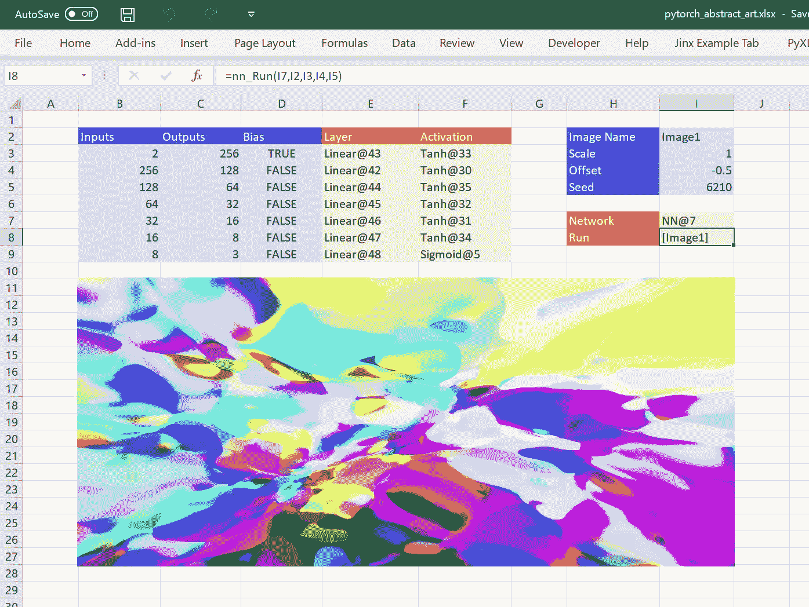
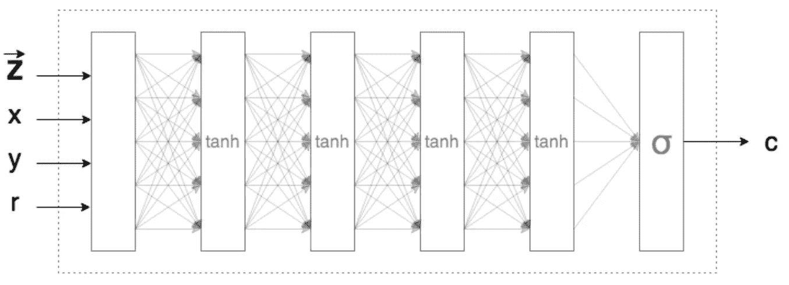
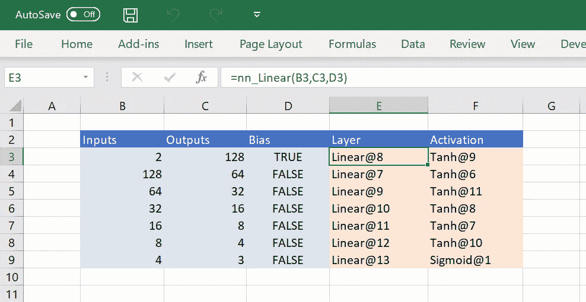
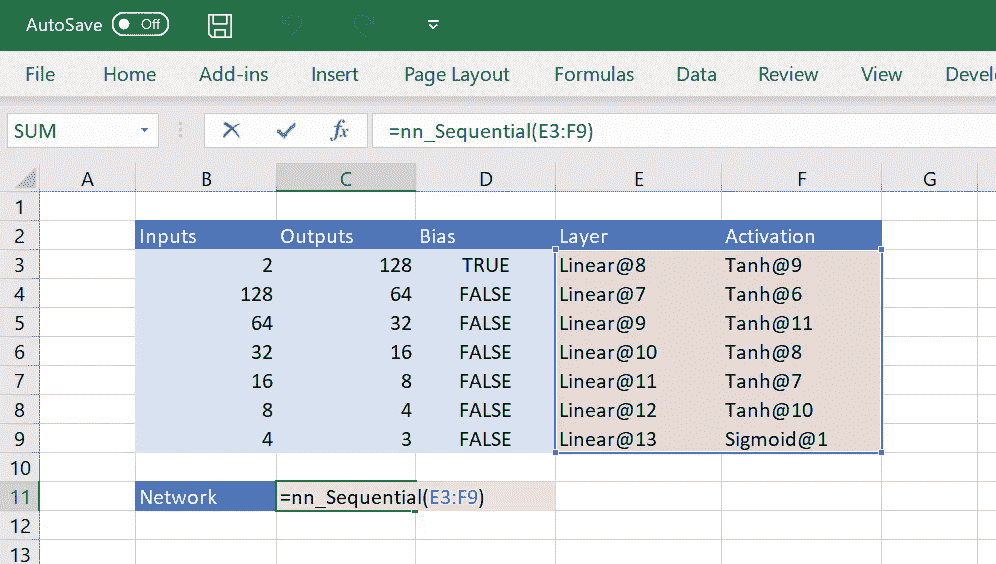

# Excel 中的交互式神经网络乐趣

> 原文：<https://towardsdatascience.com/interactive-neural-network-fun-in-excel-8bad2b3a5d9d?source=collection_archive---------14----------------------->



Constructing CPPNs in Excel with PyTorch and PyXLL

在阅读了 T2 的《让深度神经网络绘画以理解它们如何工作》之后，我受到了启发，开始钻研自己的一些实验。产生的图像很有趣，我想玩一玩，感受一下它们是如何随着神经网络结构的变化而变化的。

我鼓励你回去阅读原文，但作为一个简短的总结，它涉及到使用[合成模式产生网络](https://en.wikipedia.org/wiki/Compositional_pattern-producing_network) (CPPN)和随机权重来产生抽象图像。基本思想是，我们构造一个函数 c = *f(x，y)* ，它获取像素 *x，y* 的输入坐标，并使用 CPPN 返回该像素的颜色 *c* 。



Image via [Generating Abstract Patterns with TensorFlow](http://blog.otoro.net/2016/03/25/generating-abstract-patterns-with-tensorflow/)

正如在最初的文章中一样，我们将使用 PyTorch 创建一个 CPPN。下面的代码是大量工作的结果，也是我们的起点。

在 512x512 输入数组上运行上述神经网络会产生如下所示的输出图像。用随机权重初始化神经网络，并且缩放输入数组，使得每个输入在+0.5 和-0.5 之间。


Created using a CPPN with random weights

有很多变量会影响最终的图像。从输入的缩放、每个阶段的神经元数量以及神经网络本身的结构。我们可以把这个代码放在一个 Jupyter 的笔记本里，然后在那里修改输入，但是我们所做的每一个修改都是对代码本身的修改，不知何故感觉不太像一个真正的交互体验。

最初，对于这种类型的任务，Microsoft Excel 似乎是一个奇怪的交互式选择。请原谅我……我们想要做的是输入一些信息，比如重量的数量和层数，然后有一个新的图像呈现给我们。本质上，Excel 只是在输入改变时运行函数——这些函数可以做任何事情，甚至在 Excel 中向我们显示图像！如果我们可以在 Excel 中有一个包含我们想要更改的参数的工作表，并且一旦我们做出更改，就会有图像更新，这将是一个很好的体验输入如何影响输出的场所。

# 在 Excel 中使用 Python

Excel 中的神经网络听起来可能是一项艰巨的任务，但我们不是在谈论在 VBA 实现它！事实上，我们不需要去 VBA 附近的任何地方，因为我们可以继续使用 Python。

[PyXLL](https://www.pyxll.com?utm_source=medium) 是一个 Excel 插件，将 Python 运行时嵌入到 Microsoft Excel 中。它允许我们完全用 Python 编写 Excel 函数，因此我们仍然可以将 PyTorch 用于我们的神经网络，但都是在 Excel 中。拥有所有 Python 工具的访问权限真正开启了 Excel 的潜能。用 Python 编写的软件并没有用 VBA 编码复杂的逻辑，而是简单地暴露给 Excel。Excel 成为我们的前端用户界面工具，Python 负责复杂的计算。

PyXLL 是完全用 Python 编写 Excel 函数的最高性能和最简单的方法，非常适合复杂的工作负载。你可以从 https://www.pyxll.com/download.html 的[下载 30 天免费试用版。](https://www.pyxll.com/download.html?utm_source=medium)

# 在 Excel 中构建神经网络

我们的目标是能够在 Excel 中构建我们的神经网络，并完全控制输入。我们将从编写一些 Python 函数并向 Excel 公开它们开始。大致来说，我们需要的函数是:

1.  创建层(nn。线性，nn。Tanh 和 nn。乙状结肠)
2.  从一组层创建神经网络(nn。顺序)
3.  对一组输入运行神经网络并显示输出

在这个阶段，你可能想知道我们如何在 Excel 中表示这些项目。PyXLL 允许我们在工作簿中的 Excel 函数之间传递 Python 对象，因此拥有一个返回 nn 的 Python 实例的函数。Linear 或另一个接受变换层列表的 Python 函数实际上非常简单。当 Python 对象返回 Excel 时，我们在 Excel 中看到的只是 Python 对象的句柄，当该句柄传递给另一个 Python 函数时，PyXLL 会自动获取该句柄的对象。PyXLL 还管理这些对象的生命周期，因此当不再需要它们时，它们会被自动清理。

为了向 Excel 公开 Python 函数，我们使用 pyxll 模块中的@xl_func 装饰器。下面是我们创建图层需要的第一个函数:

Exposing PyTorch functions to Excel

@xl_func decorator 就是将这些函数暴露给 Excel 所需要的全部！nn_Linear 函数具有类型注释，PyXLL 使用这些注释来确保从 Excel 传递到该函数的类型是正确的，否则从 Excel 传递的数字可能会以浮点数的形式出现。

所需要做的就是将这个模块添加到 PyXLL 配置文件 pyxll.cfg 中。例如，如果您的代码被写入到文件夹“C:\ my code \ py torch-Abstract-Art \ Modules”中名为“pytorch_abstract_art.py”的 Python 模块中，您将使用以下设置更新您的 pyxll.cfg 文件:

```
[PYTHON]
pythonpath =
    C:\MyCode\PyTorch-Abstract-Art\Modules[PYXLL]
modules =
    pytorch_abstract_art
```

我们现在可以从 Excel 中调用这些函数来构建神经网络所需的所有层。所有的输入都输入到 Excel 中，我们甚至可以交互地改变层的数量和顺序。



要构建神经网络，我们只需要另一个函数，它接受这些层并使用 nn.Sequential 返回神经网络。PyXLL 可以接受参数数组以及单个值，因此我们可以将整个层集作为单个参数传递。@xl_func decorator 采用一个可选函数*签名*来告诉 PyXLL 更多关于参数和预期返回类型的信息。

为了告诉 PyXLL 将传递给它的单元格范围转换成一维对象列表，我们使用了 *object[]* 类型。如果我们想把一个范围作为一个 2d 的对象列表来传递，我们可以使用 *object[][]* 类型。当从 2d 范围的单元格展平到 1d 值列表时，PyXLL 从左到右取单元格，因此上图中我们的层的排序将导致正确的排列。

现在，我们可以将新函数 *nn_Sequential* 添加到 Excel 工作表中，并传入之前创建的层。



# 创建输出图像

现在剩下的事情就是创建一个输入集，初始化权重，并显示结果图像。

为此，我们将使用 Excel 的对象模型来操作 Excel 中的图像。如果你曾经编写过任何 VBA，Excel 的对象模型正是你可能使用过的，但是你可能没有意识到从 Python 中调用它就像从 VBA 中调用一样容易！指南 [Python 作为 VBA 的替代品](https://www.pyxll.com/docs/userguide/vba.html?utm_source=medium)解释了如何从 Python 中调用 Excel，还涵盖了 VBA 语法和 Python 之间的一些差异。

最后一个函数需要:

1.  神经网络对象
2.  Excel 中图像对象的名称
3.  输入的比例和偏移参数
4.  随机的种子

要添加显示我们结果的图像，在 Excel 中点击*开发者* → *插入* →I *图像(活动 X 控件)*。在公式栏的左侧，您会看到图像对象的名称。这将默认为*图像 1* ，但是您可以将其编辑为您喜欢的任何名称。

下面的代码从 Excel 获取图像，构造输入，计算输出并更新图像。

完成这最后一个功能后，我们现在可以将它们整合在一起了。构建神经网络的所有输入都显示在工作表上，控制输入数据创建方式的参数也是如此。

我们可以添加或删除层，编辑每个阶段的特征数量，甚至切换激活功能。真正有趣的是，一切都是实时的。只要我们做出改变，图像就会更新。


为了便于阅读，上面的代码中省略了几个函数。您可以在下面找到它们，或者您也可以从 pytorch 文件夹中的 GitHub repo[https://github.com/pyxll/pyxll-examples](https://github.com/pyxll/pyxll-examples)获得所有代码。

# 最后的想法

以这种方式在 Excel 中摆弄神经网络真的很有趣。更重要的是，它展示了如何将复杂的 Python 任务无缝集成到 Excel 中。

Excel 的优势在于它是一种用户界面工具，在我看来，它不应该用来存储数据、算法或业务逻辑，因为这些东西可以在其他地方更好地管理。任何使用过 Excel 一段时间或与依赖 Excel 的团队合作过的人都知道 VBA 宏的痛苦，这些宏不能被测试，不能被版本控制，甚至不能在不同用户的工作簿之间保持一致。通过将代码移出 Excel，您不仅可以获得 Python 等现代语言的巨大优势，还可以将现代开发实践应用于电子表格背后的代码。

虽然没有多少人想在 Excel 中实际构建和训练神经网络，但是能够从 Excel 中*访问*神经网络仍然是有价值的。机器学习之所以有用，很大一部分是因为能够用它来辅助决策。如果决策者已经在使用 Excel，我们可以通过在 Excel 中*向他们展示经过培训和测试的机器学习解决方案，让他们轻松使用。这可能是一个大大改进的工作流程，他们使用 Excel 进行一些基本计算，然后使用定制工具或 web 应用程序(或者更糟，给数据科学组的人发电子表格！)，然后将这些结果放回 Excel 中——不管您认为您的定制工具有多好，他们都会想这么做；)*

您可以从 pytorch 文件夹中的 GitHub repo[https://github.com/pyxll/pyxll-examples](https://github.com/pyxll/pyxll-examples)下载代码和示例工作簿。你还需要 PyXLL，你可以从[https://www.pyxll.com/download.html](https://www.pyxll.com/download.html?utm_source=medium)下载，免费试用 30 天。