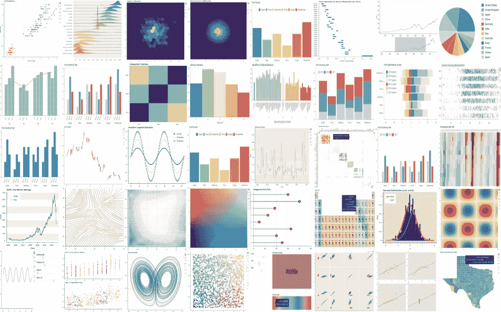

# 使用散景进行交互式绘图

> 原文：<https://towardsdatascience.com/interactive-plotting-with-bokeh-ea40ab10870?source=collection_archive---------20----------------------->

## 只有几行代码的交互式绘图



Bokeh plot gallery

作为一个 JupyterLab 超级用户，我喜欢使用散景来绘图，因为它的交互式绘图。JupyterLab 还为交互式 matplotlib 提供了一个[扩展，但是它速度很慢，而且在处理更大的数据集时会崩溃。](https://github.com/matplotlib/jupyter-matplotlib)

我不喜欢散景的一点是它铺天盖地的文档和复杂的例子。有时，我想做一个简单的线图，但我会纠结于 Bohek 特定代码的 10 行或更多行。但是散景代码可以非常简洁，我将在下面展示。这也是主要目标，用尽可能少的代码展示一些有用的数据可视化。

**这里有几个你可能会感兴趣的链接:**

```
- [Labeling and Data Engineering for Conversational AI and Analytics](https://www.humanfirst.ai/)- [Data Science for Business Leaders](https://imp.i115008.net/c/2402645/880006/11298) [Course]- [Intro to Machine Learning with PyTorch](https://imp.i115008.net/c/2402645/788201/11298) [Course]- [Become a Growth Product Manager](https://imp.i115008.net/c/2402645/803127/11298) [Course]- [Deep Learning (Adaptive Computation and ML series)](https://amzn.to/3ncTG7D) [Ebook]- [Free skill tests for Data Scientists & Machine Learning Engineers](https://aigents.co/skills)
```

上面的一些链接是附属链接，如果你通过它们进行购买，我会赚取佣金。请记住，我链接课程是因为它们的质量，而不是因为我从你的购买中获得的佣金。

# 没听说过散景？

其网站上的描述很好地总结了这一点:

*Bokeh 是一个交互式可视化库，面向现代 web 浏览器进行演示。它的目标是提供优雅、简洁的通用图形结构，并通过超大型或流式数据集的高性能交互来扩展这种能力。散景可以帮助任何人快速轻松地创建交互式绘图、仪表盘和数据应用程序。*

你可以通过下载这个 [Jupyter 笔记本](https://romanorac.github.io/assets/notebooks/2019-02-11-interactive-plotting-with-bokeh.ipynb)来运行这段代码。

# 要求

```
import bokeh
import numpy **as** np
from bokeh.models import Circle, ColumnDataSource, Line, LinearAxis, Range1d
from bokeh.plotting import figure, output_notebook, show
from bokeh.core.properties import value

output_notebook()  *# output bokeh plots to jupyter notebook*
np**.**random**.**seed(42)
```

# 生成数据

让我们使用 numpy 生成一些随机数据。Bokeh 有自己的数据结构(ColumnDataSource)用于数据表示。我不知道他们为什么开发自己的数据结构，因为 pandas 和 numpy 是 Python 分析世界中事实上的标准(如果你知道，请在下面的评论中启发我)。但幸运的是，它也适用于熊猫。对于这篇博文，我决定用 Bokeh way 的数据结构来写例子。

```
N **=** 100
data_source **=** ColumnDataSource(
    data**=**dict(
        x0**=**np**.**arange(N),
        x1**=**np**.**random**.**standard_normal(size**=**N),
        x2**=**np**.**arange(10, N **+** 10),
        x3**=**np**.**random**.**standard_normal(size**=**N),
    )
)
```

# 简单线图

要在 Bohek 中制作一个简单的线图，我们需要 3 行代码。那还不算太糟。请注意，该图是交互式的，我们可以放大和移动，这对于较大的数据集非常有用。

```
p **=** figure()
p**.**line("x0", "x1", source**=**data_source)
show(p)
```


A simple line plot with Bohek

# 双轴折线图

为了在图上显示两个具有不同范围的数据列，我们可以使用两个独立的 y 轴。我们可以设置 y 轴范围，但这不是必需的。我使用数据列的最小值和最大值作为 y 轴限制。为了直观地分隔数据列，我们可以添加图例并设置颜色。

```
p **=** figure()
column1 **=** "x1"
column2 **=** "x2"*# FIRST AXIS*
p**.**line("x0", column1, legend**=**value(column1), color**=**"blue", source**=**data_source)
p**.**y_range **=** Range1d(data_source**.**data[column1]**.**min(), data_source**.**data[column1]**.**max())*# SECOND AXIS*
column2_range **=** column2 **+** "_range"
p**.**extra_y_ranges **=** {
    column2_range: Range1d(
        data_source**.**data[column2]**.**min(), data_source**.**data[column2]**.**max()
    )
}
p**.**add_layout(LinearAxis(y_range_name**=**column2_range), "right")p**.**line("x0", column2, legend**=**value(column2), y_range_name**=**column2_range, color**=**"green",source**=**data_source)show(p)
```


A line plot with two axes

# 组合折线图和散点图

这才是散景真正出彩的地方。您可以简单地定义多个元素，并在图上渲染它们。

```
p **=** figure()
p**.**line(x**=**"x0", y**=**"x1",color**=**"blue", source**=**data_source )
p**.**circle(x**=**"x0", y**=**"x3",color**=**'green', source**=**data_source)
show(p)
```


A line plot and scatter plot

# 最后的想法

散景是非常可定制的。你可以调整所有你期望从绘图库中得到的东西，比如线宽、颜色、网格上的多个绘图等等。它提供了特殊的绘图，如用于金融数据的烛台，Burtin 可视化，你甚至可以制作一个周期表。Bokeh 独有的(至少据我所知)选项是将情节导出到 javascript 代码，这使您可以直接将情节嵌入到具有所有交互功能的网页中。

# 在你走之前

在 [Twitter](https://twitter.com/romanorac) 上关注我，在那里我定期[发布关于数据科学和机器学习的](https://twitter.com/romanorac/status/1328952374447267843)。

您可能会对以下几个链接感兴趣:

```
- [Data Science Nanodegree Program](https://imp.i115008.net/c/2402645/788185/11298)- [AI for Healthcare](https://imp.i115008.net/c/2402645/824078/11298)- [School of Autonomous Systems](https://imp.i115008.net/c/2402645/829912/11298)- [Your First Machine Learning Model in the Cloud](https://gumroad.com/l/mjyDQ)- [5 lesser-known pandas tricks](https://gumroad.com/l/YaaJn)- [How NOT to write pandas code](https://gumroad.com/l/vxxiV)- [Parallels Desktop 50% off](https://www.dpbolvw.net/click-100126493-14105294)
```