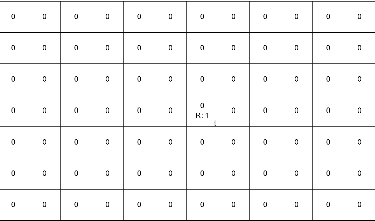
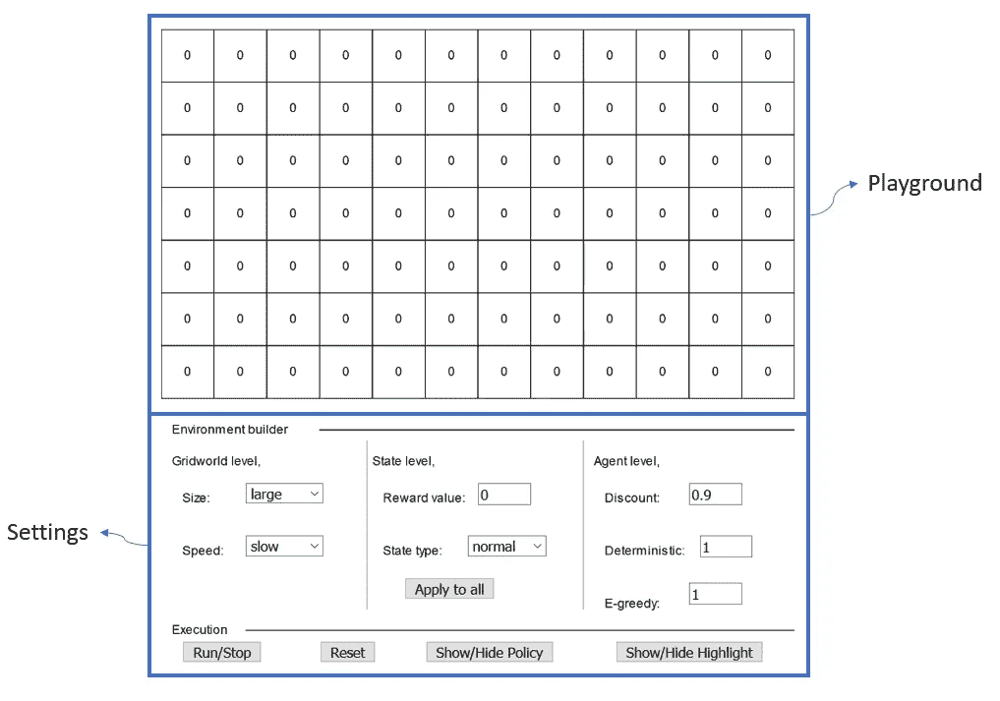
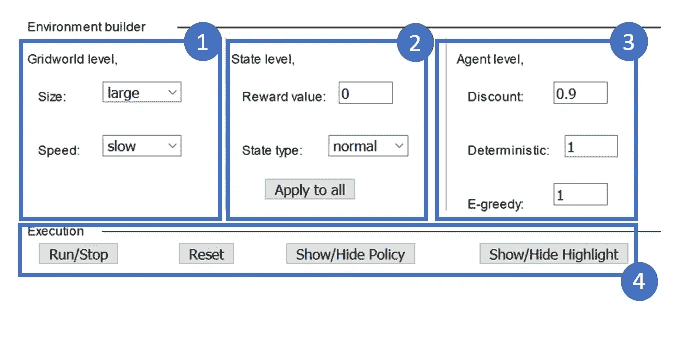
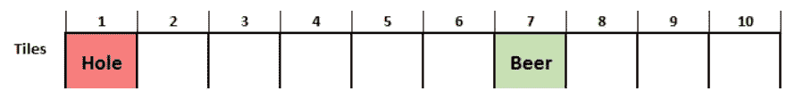
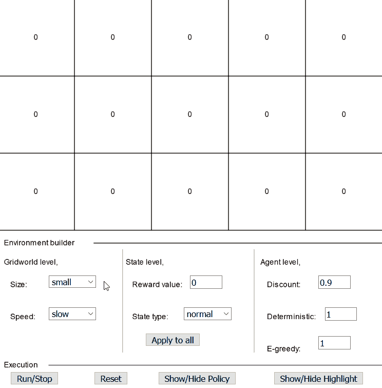
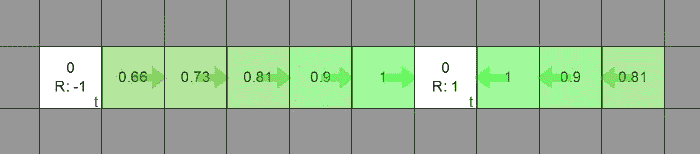
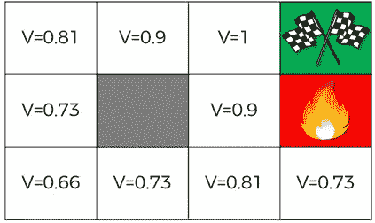
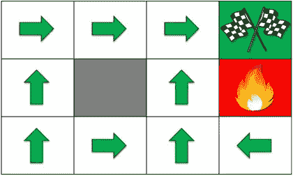
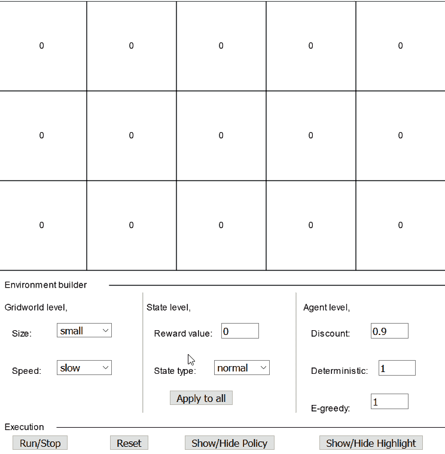
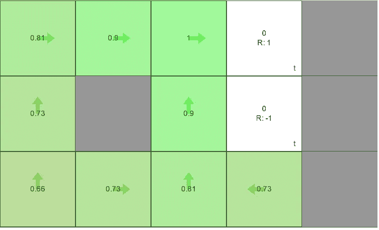

# 交互式 Q 学习

> 原文：<https://towardsdatascience.com/interactive-q-learning-9d9203fdad70?source=collection_archive---------24----------------------->

## 了解 Q 表的最佳方式…

Give me maximum reward :)

**去玩** @ [互动 Q 学习](http://mohitmayank.com/interactive_q_learning)

**代号** @ [莫希特的 Github](https://github.com/imohitmayank/interactive_q_learning)

## 介绍

在经历了解 Q 学习的过程中，我总是对网格世界(由盒子组成的 2D 世界，代理从一个盒子移动到另一个盒子并收集奖励)着迷。几乎所有强化学习的课程都从 Q 表的基本介绍开始，最直观的 Q 表例子是网格世界。也就是说，很多球场只是画出了它们的静态世界，并没有给观众提供任何游戏素材。为了解决这个问题，我想到了创建一个交互式网格世界，用户可以定义世界、状态和代理。这将有助于用户复制课程的网格世界，理解它实际上是如何工作的，甚至会问——当你改变固定变量时会发生什么？我们开始吧！

## 交互式网格世界

Interactive grid world

交互式网格世界分为两个主要区域，

1.  **游乐场**:由盒子或状态组成，动作发生在那里。
2.  **设置:**由多级设置组成，您可以通过这些设置来设计和控制游乐场。

让我们通过浏览可用的设置来理解网格世界的动态。设置区域可以进一步分为:

The 4 subsections of settings.

*   **Gridworld 级别设置:**由改变整体世界格式的设置组成，包含-

**—大小**:选择世界的大小。“大”意味着更多的州。

**—速度**:选择加工速度。当我们想快速得到最终结果时，“快”是好的，但是“慢”是直观形象化的最佳选择。

*   **状态级别设置:**帮助设计单个状态及其行为，包含-

**—奖励值**:分配给点击状态的奖励。

**—状态类型**:状态的类型。“终结”——基本上是游戏结束状态，代理在进入终结状态时完成当前剧集。‘墙’——一个没有奖励的固定状态，一个代理人不能跨越。‘正常’—默认状态类型。

**—应用于所有**:将当前奖励值和状态类型应用于网格世界中所有盒子的快捷按钮。

*   **代理级别设置:**定义了代理的学习行为，包含-

— **折扣**:适用于未来奖励的折扣。默认值为 0.9。

— **确定性**:定义代理人动作的确定性概率。1 表示从一个盒子的“右”将总是导致右边的盒子。而 0.7 意味着只有 70%的机会发生这种情况，10%的机会去任何相邻的州。(对于数学爱好者来说，还有 3 个相邻的状态，因此 10 * 3 = 30 %完成了 100%)

— **E-greedy** :定义代理的利用/探索性质。0 表示代理是完全贪婪的，并且总是选择可用的最佳动作。1 表示代理是完全随机的，可以从任何可用的操作中进行选择。为了了解更多关于ε贪婪的信息，我建议浏览一下我之前的帖子，[用多臂强盗](http://mohitmayank.com/reinforcement-learning-with-multi-arm-bandit/)进行强化学习。

*   **执行类型设置:**控制世界的流动，包含-

— **运行/停止**:让代理在 gridworld 里面玩。切换开关。

— **复位**:回到初始设置和动态。

— **显示/隐藏策略**:切换策略方向箭头的可见性。

— **显示/隐藏高亮显示**:切换当前状态高亮显示的可见性。

## 怎么玩？

让我们举一些例子来更好地理解这一点。

**示例 1:** 第一个示例可以是我之前关于用 Q 表进行强化学习的帖子中的“啤酒游戏”。我建议通读这篇文章，对 Q 表有一个基本的了解。世界看起来是这样的，

The beer game

我们希望代理人学会总是带着啤酒去那个州，而不是带着洞去那个州。让我们在交互式网格世界中重现这一场景，

Solving example 1 on interactive grid world

最后，网格世界看起来像这样，

Agent’s expected rewards and policy after convergence for example 1.

**例子 2** :我们从 [Udemy 的人工智能课程](https://www.udemy.com/artificial-intelligence-az/)中举一个例子。世界看起来是这样的，

Green flags have reward of 1 and the state with fire has negative reward, say -1.

The policy learned after convergence.

上图中的预期状态奖励(V)以及方向(政策)是在经过多次迭代训练后获得的。让我们试着复制这个世界，

Solving example 2 on interactive grid world

最后，网格世界看起来像这样，

Agent’s expected rewards and policy after convergence

将这个与课程幻灯片中显示的进行比较，它是完全相同的！

## 结论

这个项目还远没有结束！有很多东西我想补充，但我想它们会随着时间的推移而出现。当前版本可能有一些错误，因此如果出现任何不想要的行为，请求助于最后的选项——刷新页面并在 [GitHub](https://github.com/imohitmayank/interactive_q_learning) :)报告问题。除此之外，请继续尝试。

## 参考

[1] [Udemy 的人工智能 A-Z:学习如何构建人工智能](https://www.udemy.com/artificial-intelligence-az/)

[2] [加州大学柏克莱分校 CS188 人工智能简介](http://ai.berkeley.edu/reinforcement.html)

[3] [由](https://cs.stanford.edu/people/karpathy/reinforcejs/gridworld_dp.html) [**安德烈·卡帕西**](https://twitter.com/karpathy) 加固. js

干杯！