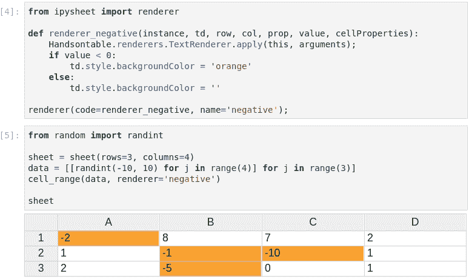

# Jupyter 中的交互式电子表格

> 原文：<https://towardsdatascience.com/interactive-spreadsheets-in-jupyter-32ab6ec0f4ff?source=collection_archive---------1----------------------->

[**ipywidgets**](https://github.com/jupyter-widgets/ipywidgets) 在 Jupyter 生态系统中起着至关重要的作用；它带来了用户和数据之间的交互性。

小部件是多事件的 Python 对象，通常在 Jupyter 记事本或 JupyterLab 中有一个可视化的表示:一个按钮、一个滑块、一个文本输入、一个复选框…

不仅仅是一个交互式小部件库，[**ipywidgets**](https://github.com/jupyter-widgets/ipywidgets)**是一个强大的框架，在这个框架上[可以直接创建新的定制小部件](https://blog.jupyter.org/authoring-custom-jupyter-widgets-2884a462e724)。开发人员可以使用[**widget-cookiecutter**](https://github.com/jupyter-widgets/widget-cookiecutter/)**项目，利用代码结构和打包的最佳实践，快速启动自己的 widgets 库。****

****你可以在博客文章中找到非常好的小部件库的例子:[***Jupyter 笔记本中的视频流***](/video-streaming-in-the-jupyter-notebook-635bc5809e85) ***。*******

****电子表格是一种以表格形式进行数据分析的交互式工具。它由单元格和单元格区域组成。它支持数值相关的单元格格式/样式，可以对单元格应用数学函数并执行链式计算。它是统计和财务操作的完美用户界面。****

****Jupyter 笔记本缺少一个电子表格库，这就是 [**ipysheet**](https://github.com/QuantStack/ipysheet) 发挥作用的时候。****

# ****ipysheet****

****ipysheet 是一个新的交互式部件库，旨在实现一个好的电子表格应用程序的核心特性等等。****

****[**ipysheet**](https://github.com/QuantStack/ipysheet) 中有两个主要的小部件，分别是*单元格*小部件和*工作表*小部件。我们提供了创建行、列和单元格区域的辅助函数。****

****单元格值可以是布尔值、数值、字符串、日期，当然还有另一个小部件！****

****[**ipysheet**](https://github.com/QuantStack/ipysheet) 使用类似 Matplotlib 的 API 创建工作表:****

********

****用户可以创建整行、整列甚至单元格区域:****

********

****当然，单元格中的值是动态的，单元格值可以从 Python 中动态更新，新值将在工作表中可见。****

****可以将单元格值链接到小部件(在下面的屏幕截图中，FloatSlider 小部件链接到单元格“a”)，并根据其他单元格将特定单元格定义为自定义计算的结果:****

********

****可以使用自定义样式，使用我们称之为*的渲染器* s:****

********

****添加对 NumPy 数组和 Pandas 数据帧加载和导出的支持是我们想要的一个重要特性。[**ipy sheet**](https://github.com/QuantStack/ipysheet)**为此提供了 *from_array、to_array、from_dataframe 和 to_dataframe* 函数:******

************************

******另一个致命的特性是单元格值可以是任何交互式小部件。这意味着用户可以在单元格中放置一个按钮或滑块小部件:******

************

******但这也意味着可以在单元格中放置更高级别的小部件。无论小工具是来自 [bqplot](https://github.com/bloomberg/bqplot) 的绘图、来自 [ipyleaflet](https://github.com/jupyter-widgets/ipyleaflet/) 的地图还是来自 [ipyvolume](https://github.com/maartenbreddels/ipyvolume/) 的多体渲染:******

************

******你现在可以用[活页夹](https://mybinder.org/)来试试，不需要在你的电脑上安装任何东西，只需点击这个按钮:******

************

******源代码托管在 Github:[https://github.com/QuantStack/ipysheet/](https://github.com/QuantStack/ipysheet/)******

# ******类似项目******

*   ******[ipyaggrid](https://gitlab.com/DGothrek/ipyaggrid/) 是一个小部件库，用于导入/编辑/导出熊猫数据帧: [***利用 Jupyter***](https://medium.com/@olivier.borderies/harnessing-the-power-of-ag-grid-in-jupyter-3ae27fb21012) 中 ag-Grid 的力量******
*   ****qgrid 是一个交互式网格，用于分类、过滤和编辑 Jupyter 笔记本中的熊猫数据框。****

# ****感谢****

****[**ipysheet**](https://github.com/QuantStack/ipysheet) 的开发由 [QuantStack](https://twitter.com/QuantStack) 牵头。****

********

****这项开发由**法国兴业银行**和 [**彭博**](https://www.techatbloomberg.com/) 赞助。****

# ****关于作者****

****[*Maarten Breddels*](https://twitter.com/maartenbreddels)*是一名企业家和自由职业开发人员/顾问/数据科学家，主要在 Jupyter 生态系统中使用 Python、C++和 Javascript。* [*的创始人 vaex.io*](https://vaex.io/) *。他的专业领域从快速数值计算、API 设计到 3d 可视化。他拥有 ICT 学士学位，天文学硕士和博士学位，喜欢编码和解决问题。*****

****[*马丁·雷诺*](https://twitter.com/martinRenou) *是科学软件工程师*[*quant stack*](http://quantstack.net/)*。在加入*[*quant stack*](http://quantstack.net/)*之前，他就读于法国航空航天工程学校*[*SUPAERO*](https://www.isae-supaero.fr/en)*。他还在巴黎的 Logilab 和剑桥的 Enthought 工作。作为一名在*[*quant stack*](http://quantstack.net/)*工作的开源开发者，Martin 参与过各种项目，从*[*xsimd*](https://github.com/QuantStack/xsimd)*，*[*xtensor*](https://github.com/QuantStack/xtensor)*，*[*x frame*](https://github.com/QuantStack/xframe)*，* [*xeus*](https://github.com/QuantStack/xeus)****