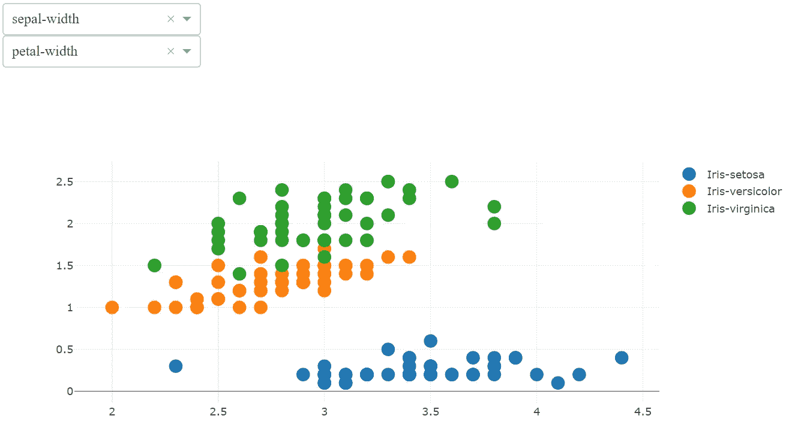
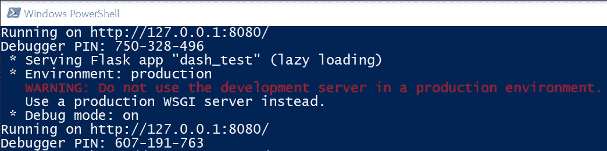
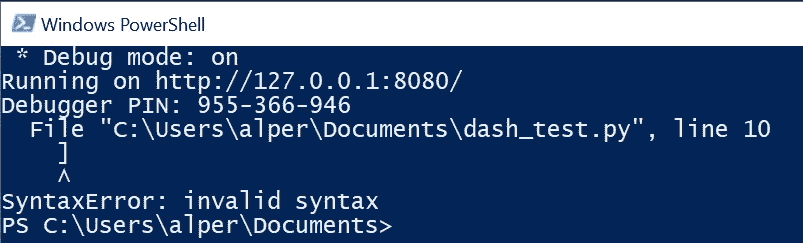
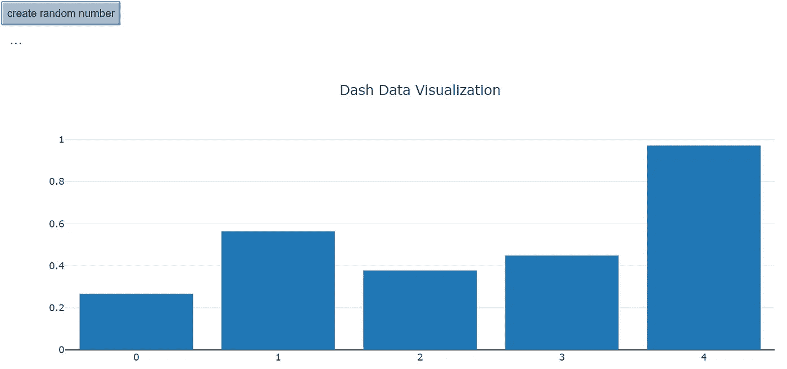

# 使用 Dash 和 Plotly 进行交互式可视化

> 原文：<https://towardsdatascience.com/interactive-visualization-with-dash-and-plotly-29eaccc90104?source=collection_archive---------9----------------------->



交互式数据可视化对探索性数据分析有着重要的影响。在对数据集应用任何描述性或预测性算法之前，我们必须首先了解各要素之间的相互关系以及它们在内部的分布情况。很明显，许多可视化库提供了许多类型的图表来满足这一需求。但另一个显而易见的事情是，为每个特性做同样的绘图工作并滚动每个图表来比较每个特性的结果是一件困难的工作。

在过去的几周里，我不得不做这么多的工作，以至于我不得不为此寻找一条捷径。是的，我是一个懒惰的人，是的，懒惰是创造力的关键。这就是我如何遇到 dash 和 plotly 作为我的问题的解决方案。在这篇文章中，你会发现这对夫妇如何成为探索性数据分析的良好解决方案。

让我先解释一下 dash 和 plotly 是给以前没听过的人的。Plotly 是一家数据分析和可视化公司。在本文中，我们对该公司的两个 python 库感兴趣；plotly.py 和 dash。 [Plotly.py](https://plot.ly/python/) 库为 python 应用提供了交互式可视化。正如他们网站上所说，你可以[用 Python 创建交互式、D3 和 WebGL 图表。所有的图表类型 *matplotlib* 等等](https://plot.ly/d3-js-for-python-and-pandas-charts/)

Dash 也是该公司的另一个产品，它为构建基于 web 的 Python 应用程序提供了一个框架。如果你正在和一个团队一起工作，或者只是想和其他人分享你的工作，web 应用程序是最简单的方法，消除了库版本或接口问题。在接下来的写作中，我们将会看到在网络上分享我们的发现是多么的方便。

所以，让我们开始编码吧…

# 简单的 Dash 应用程序

下面是一个简单的 dash web 应用程序，由六行代码组成。只要把它写在一个. py 文件中，然后调用这个文件，你的应用就启动并运行了，就这样。

```
#this is the dash_test.py fileimport dash
import dash_html_components as htmlapp = dash.Dash(__name__)app.layout = html.H1('hello dash')if __name__ == '__main__':
    app.run_server(debug=True, port=8080)
```

使用文件的确切路径，从命令提示符调用该文件，如下所示。您将看到一个控制台窗口，告知服务器正在运行。

```
python "c:\users\alper\documents\dash_test.py"
```



我们现在可以打开一个 web 浏览器，导航到带有给定端口号 127.0.0.1:8080 的本地主机 url。

在前两行代码中，我们简单地导入所需的 dash 库。第三行初始化 dash 应用程序，第四行用我们将在页面上显示的 header 标记准备页面布局，最后两行用调试和端口选项运行服务器。(参见 stackoverflow 上“if __name__ …”行的[详细解释](https://stackoverflow.com/questions/419163/what-does-if-name-main-do))

是的，我们离交互性和可视性都还很远，但是请耐心等待，我们正在前进。首先，我们放置所需的元素。为此，我们将修改 app.layout 并在 div 中插入一个按钮和一个 label 元素。注意，这两个元素作为 div 元素的子元素放在一个列表中。Dash 在 dash_html_components 库中存储 html 元素，你可以在他们的[网站](https://dash.plot.ly/dash-core-components)和 [github repo](https://github.com/plotly/dash-html-components/tree/master/src/components) 上找到完整的列表。

```
app.layout = html.Div(
 [
  html.Button('create random number', id='button1'),
  html.Label('...', id='label1')
 ]
)
```

当我们保存文件时，我们将在控制台窗口上看到一个新的行，带有一个新的调试器 pin。如果代码中有问题，我们将会看到错误消息。在这种情况下，我们需要再次调用文件并刷新浏览器。



现在，让我们给已经插入的元素添加一些样式。我不能说我擅长造型，但我相信你可以做得更好。我们可以用 style 属性向元素添加样式，接受 css 标签的字典。

```
 html.Button('create random number', 
   id='button1',
   style={'display':'block', 'background-color':'#aabbcc'}
  ),
  html.Label('...', 
   id='label1', 
   style={'display':'inline-block', 'margin':'10'} 
  )
```

现在是时候更进一步，增加一些响应能力了。首先，我们导入所需的库

```
from dash.dependencies import Input, Output
import random
```

然后我们添加回调装饰器和我们希望在回调时执行的函数。

```
[@app](http://twitter.com/app).callback(
 Output(component_id=’label1', component_property=’children’),
 [Input(component_id=’button1', component_property=’n_clicks’)]
)
def update_output(input_value):
 return random.random()
```

update_output 函数只是生成一个随机数并将其作为结果返回。

@app.callback decorator 将按钮 click 事件绑定到 update_output 函数，将函数的结果绑定到 label1 元素。这是响应性的核心部分。关于回调和状态参数将会有另一篇文章。

# 添加简单图表

既然我们已经介绍了足够多的交互性，现在是时候添加一些图表了。首先，我们将保持它的简单性，并在每个按钮点击上放一个随机值的条形图。因此，我们需要在布局中添加一个图形对象:

```
app.layout = html.Div(
    [
        html.Button(‘create random number’, 
            id=’button1',
            style={‘display’:’block’, ‘padding’:’5', ‘background-color’:’#aabbcc’}),
        html.Label(‘…’, 
            id=’label1', 
            style={‘display’:’inline-block’, ‘margin’:’10'} ),
        dcc.Graph(id=’graph1') # this is the graph we add
    ]
)
```

我们需要修改回调函数来生成图表:

```
[@app](http://twitter.com/app).callback(
    Output(component_id='graph1', component_property='figure'),
    [Input(component_id='button1', component_property='n_clicks')]
)
def update_output(input_value):
    random_x = [i for i in range(5)]
    random_y = [random.random() for _ in range(5)]
    figure = {
        'data': [
            {'x':random_x, 'y':random_y, 'type':'bar', 'name': 'Series1'}
        ],
        'layout': {
            'title': 'Dash Data Visualization'
        }
    }
    return figure
```

在回调装饰器中，我们首先用最近添加到布局中的 graph 对象替换输出语句中的标签。然后在函数内部，我们为图表和图形对象创建 x 和 y 值。仅此而已。结果是在你的浏览器中出现一个交互式的条形图。



# 更复杂一些

如果上面的图表对你来说不够花哨，不要担心，这里有另一个例子给你。让我们再深入一些。


是不是太快了？好的，让我们看看代码。

```
# coding=utf8import random
import pandas as pd
import dash
from dash.dependencies import Input, Output
import dash_html_components as html
import dash_core_components as dcc
import plotly.graph_objs as go
app = dash.Dash(__name__)
names = ['sepal-length', 'sepal-width', 'petal-length', 'petal-width', 'class']
data = pd.read_csv('[https://archive.ics.uci.edu/ml/machine-learning-databases/iris/iris.data'](https://archive.ics.uci.edu/ml/machine-learning-databases/iris/iris.data'), names=names)
app.layout = html.Div(
    [
        html.Div([
            dcc.Dropdown(
                id='ddl_x',
                options=[{'label': i, 'value': i} for i in names],
                value='sepal-width',
                style={'width':'50%'}
            ),
            dcc.Dropdown(
                id='ddl_y',
                options=[{'label': i, 'value': i} for i in names],
                value='petal-width',
                style={'width':'50%'}
            ),
        ],style={'width':'100%','display':'inline-block'}),
        html.Div([
            dcc.Graph(id='graph1') 
        ],style={'width':'100%','display':'inline-block'})
    ]
)
[@app](http://twitter.com/app).callback(
    Output(component_id='graph1', component_property='figure'),
    [
        Input(component_id='ddl_x', component_property='value'),
        Input(component_id='ddl_y', component_property='value')
    ]
)
def update_output(ddl_x_value, ddl_y_value):
    figure={
        'data': [
            go.Scatter(
                x=data[data['class'] == cls][ddl_x_value],
                y=data[data['class'] == cls][ddl_y_value],
                mode='markers',
                marker={ 'size': 15 },
                name=cls
            ) for cls in data['class'].unique()
        ],
        'layout': 
            go.Layout(
                height= 350,
                hovermode= 'closest',
                title=go.layout.Title(text='Dash Interactive Data Visualization',xref='paper', x=0)
            )

    }
    return figure
if __name__ == '__main__':
    app.run_server(debug=True, port=8080)
```

代码结构和前面的完全一样。初始化应用程序后，

*   我们增加了两行数据读取。
*   在 app.layout 部分，我们添加了两个下拉列表，并用数据列循环填充选项。
*   在@app.callback 装饰器中，我们添加了这两个下拉菜单作为输入组件
*   在 update_output 函数中，我们用下拉列表选择的数据和列绘制了一个散点图。这里，有一个棘手的部分。我们为每个类绘制散点图。你看，go 的末尾有一个 for 循环。Scatter()函数和“数据”列表中。这个 for 循环也称为 list comprehension，它返回 Scatter()对象 n 次，其中 n 是数据的“class”列中唯一记录的数量。下面一行是图表的布局属性。

代码准备好运行了。就；

*   将其保存到一个文件中。py 扩展名，--> " c:\…\ dash _ test . py "
*   使用 python-> python " c:\…\ dash _ test . py "通过命令提示符调用它
*   打开浏览器，导航至应用-> [http://localhost:8080](http://localhost:8080)

您的交互式数据可视化应用程序只需 60 行代码即可完成。

这是我第一次在媒介上写作。我会继续写我所学到的东西。请分享你的感受，这样我可能会提高自己。

## 资源:

*   https://dash.plot.ly/

**编辑**:

*   走吧。布局值在 update_output 函数下的 figure 对象的数组内传递。这导致了一些版本的 javascript 错误。移除数组并通过 go。布局对象直接解决了问题。2019/06/20