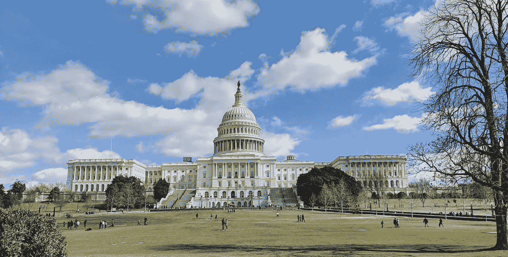

# 对 AI 政策感兴趣？开始写作

> 原文：<https://towardsdatascience.com/interested-in-ai-policy-start-writing-bc70b08c8c22?source=collection_archive---------30----------------------->

Photo by [Glenn Carstens-Peters](https://unsplash.com/@glenncarstenspeters?utm_source=unsplash&utm_medium=referral&utm_content=creditCopyText) on [Unsplash](https://unsplash.com/search/photos/typing?utm_source=unsplash&utm_medium=referral&utm_content=creditCopyText)

最近，OpenAI 的 Amanda Askell，Miles Brundage 和 Jack Clark 加入了 Rob Wiblin 的 [8 万小时播客](https://80000hours.org/podcast/episodes/openai-askell-brundage-clark-latest-in-ai-policy-and-strategy/)讨论了与人工智能哲学相关的广泛话题。政策和出版规范。

在交谈中，他们还讨论了如果你试图理解人工智能和人工智能政策，应该从哪里开始。这是一个直接与我对话的话题，因为我对这个领域感兴趣，但完全被可用的资源(或缺乏资源)所淹没。

他们回答中的一个共同主题是，对于试图理解人工智能的人来说，最大的机会是围绕该领域内的特定新闻和主题，创建对外行人、政府工作人员和研究人员有用的内容。

在这篇文章中，我总结并详述了他们推荐这条道路的原因，以及自己着手去做的方法。

我仍然强烈推荐给[整个播客](https://80000hours.org/podcast/episodes/openai-askell-brundage-clark-latest-in-ai-policy-and-strategy/)一听。他们讨论了非技术人员进入该领域的途径(不需要获得博士学位)，以及你需要具备的一些特质和软技能。整个播客非常出色，但围绕“进入领域”的讨论在 1:51:00 左右开始。

# 决策者和研究人员需要更多的内容

Photo by [Jacob Stone](https://unsplash.com/@thejacobstone?utm_source=unsplash&utm_medium=referral&utm_content=creditCopyText) on [Unsplash](https://unsplash.com/?utm_source=unsplash&utm_medium=referral&utm_content=creditCopyText)

杰克·克拉克(Jack Clark)是 OpenAI 的政策主管，他经常往返于旧金山和华盛顿特区(他称之为“地球上最幸福的地方”)。).

他也是 [Import AI](https://jack-clark.net/) 时事通讯的作者，这是一封总结人工智能社区新闻的每周电子邮件，并以非专家可读和有用的方式解释为什么它很重要。

一只脚在研究，另一只脚在政策，克拉克和任何人一样有资格从经验中谈论人工智能政策世界需要什么。

而根据克拉克的说法，它需要的是内容。

“我去过的任何国家的任何政治家的任何工作人员都提到需要更多的材料来阅读，以了解人工智能和人工智能政策，”克拉克说。具体来说，是“人工智能及其在特定的、严格限定范围的领域内与政策的相关性”的总结

具有讽刺意味的是，他推荐的媒介与人工智能正在创造的开创性媒介和信息相去甚远。

“在辉煌的人工智能未来，最前沿是基于文本的电子邮件，其中没有图像。”

他没有错。根据《大西洋月刊》(The Atlantic)对 273 名希尔员工进行的一项调查，涉及“与(他们的)老板积极关注的问题相关的”主题的简讯会被阅读，“不管它来自哪里”，员工“通常会立即阅读纯文本的简讯。”

没错——明文电子邮件是新的响应 HTML。

但不仅仅是国会山的工作人员和决策者。随着人工智能领域的发展，人们将有更多的机会向外行人传播人工智能的新闻和进展。

阿曼达·阿斯克尔认为，对人工智能政策感兴趣的人缺乏一套课程是该领域发展的一个关键问题。“我越来越希望，随着这个领域的发展，会有更多的材料提供给对这个领域感兴趣的人。”

阿斯克尔说:“如果你觉得你的技能组合是你真的擅长向公众传达和综合最新的创新，这可能会是一个非常有用的技能组合。”

底线；显然需要与人工智能政策相关的更复杂、写得更清楚的内容，从普通公众到国会工作人员到人工智能机构的每个人都希望让聪明、感兴趣的个人更容易加入该领域。

对于任何希望涉足人工智能和人工智能政策的人来说，创造内容是最有效、门槛最低的起点，而不是实际进行研究或直接与政策制定者合作。

# 写信去发现你的想法

写关于人工智能政策的文章实际上仍然是一种有益的尝试，即使没人读它。仅仅是写下你的想法就可以帮助你形成自己的想法，更好地理解一个主题。

最广泛地说，写作迫使你:

*   选择一个明确的主题
*   充分研究这个主题，以决定它的重要性
*   充分理解它，以便对它有一个看法，或者用一种有用和清晰的方式对它进行总结

在人工智能政策的范围内，写作需要你以一种外行人能够理解的方式综合复杂的主题，因为假设你自己是从那个主题的外行人开始的。

如果你把写作看作一种教学形式(你是老师，读者是学生)，写作对你的知识的影响就变得更清楚了。[许多研究表明，教授一个话题是学习话题本身最有效的方法之一。](https://digest.bps.org.uk/2018/05/04/learning-by-teaching-others-is-extremely-effective-a-new-study-tested-a-key-reason-why/)

但是应该从哪里开始呢？阿斯克尔分享了一些建议:“从找到一个有趣且相关的问题开始，然后写点东西并形成对它的看法。”

为了说明，就拿我写这篇文章的经历来说吧。作为一个有内容营销背景的人，杰克关于创办时事通讯的建议切中要害。由于“写简讯”是人工智能政策中一个我可以联系到的话题，它成为了我可以解开的一个很好的微观话题。

经历这个过程帮助我脚踏实地，建立了一些信心。如果我能和人工智能研究人员说同样的语言，即使是在一个根本没有实质性进入人工智能或人工智能政策的话题上，我也有了一个锚定自己并继续前进的地方。

# 提高可信度

撰写人工智能政策的另一个主要优势是，它提供了你在该领域知识的证明，并为你提供了建立可信度的资产。

克拉克的进口 AI 通讯就是证据。据克拉克说，这是他建立人际网络的最佳工具之一。

我已经认识了相当多的政策制定者，不是通过我的 OpenAI 成员，而是通过他们订阅我的时事通讯。”克拉克说这也增加了我的信念，即仅仅制作对你的目标受众有用的东西是一个非常好的行动，让你获得关于如何见面和见谁的证据。"

创建内容以多种方式建立可信度。

# 综合复杂的话题

Photo by [Jacob Stone](https://unsplash.com/@thejacobstone?utm_source=unsplash&utm_medium=referral&utm_content=creditCopyText) on [Unsplash](https://unsplash.com/?utm_source=unsplash&utm_medium=referral&utm_content=creditCopyText)

最重要的是，写作证明你有能力思考一个复杂的话题，并把点点滴滴联系起来，产生有用的东西。人工智能是一个具有挑战性的课题；阿斯克尔将其比作“获得 7 个不同学科的博士学位”，因为其影响涉及从技术编程到经济学到哲学的所有领域。

克拉克同意；“如果你喜欢查看来自多个领域的多种信息，并将所有信息整合到一些世界理论或变化理论中，我认为你会在人工智能领域做得更好。”

以一种彻底和准确的方式写一些关于特定主题的东西需要你理解这些不同的学科是如何相互作用和重叠的。以一种清晰简洁的方式做到这一点是一项重要的技能，你需要为你可能感兴趣的许多角色展示这一点。

# 开始富有成效的对话

通过创建一个可共享的资产(在这种情况下，是一篇基于文本的文章)，你现在可以用它来开始与该领域的知识渊博的人进行富有成效的对话，你可能希望以后为他们工作并与之合作。这是从头开始建立网络的最简单的方法。

阿斯克尔推荐该方法；一旦你写了一些东西，“伸出手来真的会很有收获，因为你已经表现出了兴趣，以及在你从事的研究方面你能做些什么。”

不过，在你的拓展活动中，做好充分准备和过于规避风险之间有一个平衡。布伦戴奇解释说，“我认为，一般来说，人们不应该害怕伸出手，获得反馈和传播想法。”

很明显，你应该熟悉你要联系的人的工作，因为这与你要联系的事情有关，但是与其晚联系不如早联系。

# 形成一个观点，并有深思熟虑的问题

根据克拉克的说法，你可以展示你对材料的理解的最简单的方法之一是参与人工智能组织的研究，并找到你不同意或对结论有疑问的地方。

克拉克扩张；“这可能是阅读微软呼吁联邦监管机构关注面部识别的一些博客，也可能是谷歌对人工智能论文的治理……然后对此做出回应。因为那些东西没有一个是完全正确的文档或者博客。他们的观点你可以不同意。”

根据克拉克的说法，能够在一个主题上形成自己的观点并“识别人工智能组织共享的材料中的逻辑不一致”是一个晴雨表，他通过它来衡量某人对该主题的理解程度。

原因？有自己的观点会给别人提供一个你思考方式的例子，而且“人们低估了提供一个你思考方式的例子的价值。”

形成观点的一个自然分支是能够提出深思熟虑的问题。

“我一直发现，判断我是否理解某件事情的一个好方法是，我是否能找到该领域的专家，问他们一个相关且复杂的问题。”克拉克说。

利用您创建的内容，您可以与该领域的人员开始的最有成效、最有益的对话是您提出一个相关的问题。

# 参与在线社区

长篇文章并不是人工智能领域的人们回应的唯一内容形式。“非常多的主要技术研究人员使用 Twitter 来宣布结果、相互交流和交换想法，”克拉克说。

关注他们的对话会让你对他们讨论的话题和他们讨论的方式有更深入的了解。你接触这些对话越多，你的天线就能越好地捕捉到什么是重要的，以及如何以一种映射到你试图联系的人的方式谈论它。

# 表达真正的兴趣

考虑到这个领域是如此的多面化，任何想“进入人工智能”的人的先决条件是对这个领域有真正的、自我激励的兴趣。

“在这个领域和正在做的工作中拥有激情是很重要的”，阿斯克尔说。“我们所有人都在业余时间自学这方面的知识，并不断尝试构建我们自己的东西，尽管我们不是技术研究人员。”

除非你已经在这个领域，否则大多数对人工智能和人工智能政策感兴趣的人将不得不从自学开始。创作内容是展示这些努力的一种简单方式。

# 包扎

在一天结束的时候，如果你真的想涉足人工智能和人工智能政策的世界，你需要有所作为。

书面内容是您工具箱中最容易使用的工具，它为您提供:

*   组织你自己对这个问题的想法的机会
*   您可以用来获得反馈并与专家展开对话的资产
*   对自己在广阔的主题领域走出黑暗的能力充满信心

所以开始写吧。