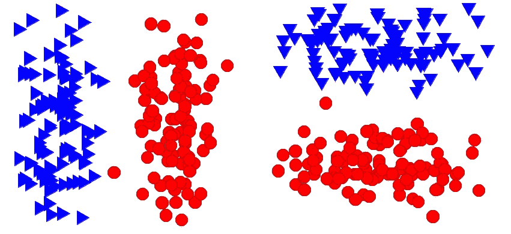
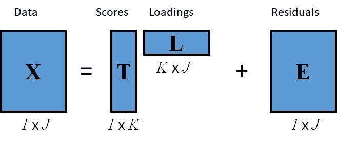
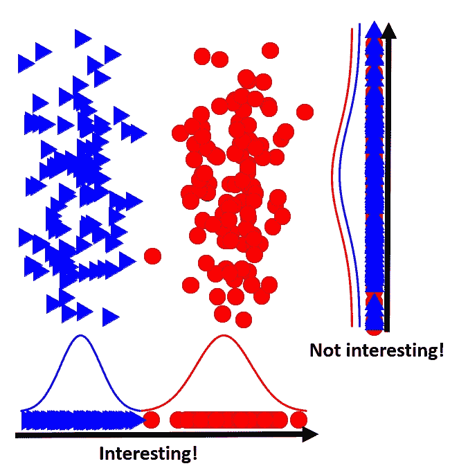
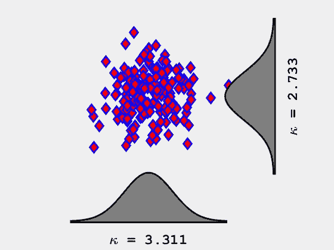
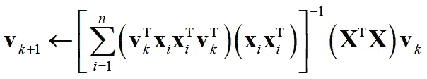
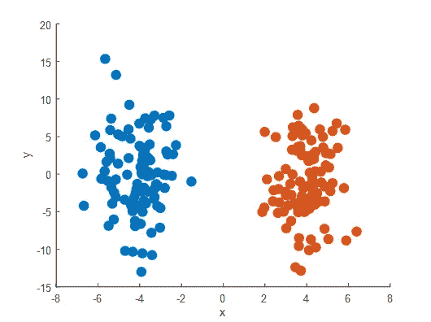
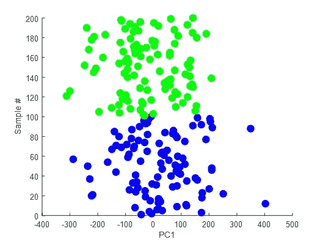
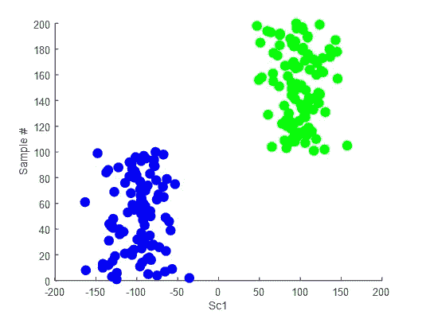
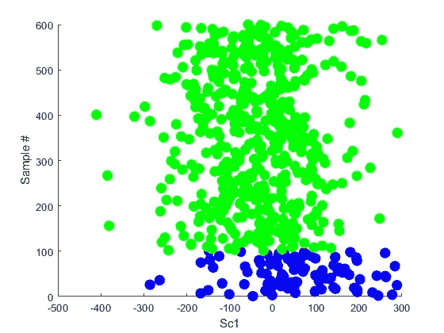

# “有趣”的预测 PCA 失败的地方。

> 原文：<https://towardsdatascience.com/interesting-projections-where-pca-fails-fe64ddca73e6?source=collection_archive---------9----------------------->

## 探索性数据分析的一种有吸引力的替代方法。

大多数数据科学家都熟悉作为探索性数据分析工具的主成分分析(PCA)。外行人回顾一下:研究人员经常使用 PCA 进行降维，希望揭示他们数据中的有用信息(例如，疾病与非疾病类别分离)。PCA 通过寻找正交投影向量来实现这一点，正交投影向量解释了数据中**方差**的**最大**量。在实践中，这通常是通过使用奇异值分解(SVD)来找到主成分(特征向量),根据它们对数据中总方差的贡献(特征值)进行加权。毫无疑问，PCA 是我的领域(化学)和许多其他领域中使用最多的数据分析工具，但当它不起作用时会发生什么呢？是不是说明采样实验不好？没有。这是否意味着数据中没有有用的信息？不。我们在达尔豪西大学的团队致力于开发新的化学数据分析工具。今天，我要告诉你一种替代主成分分析的方法，叫做投影寻踪分析(PPA)。

General factor analysis model

## PCA 对方差进行操作

PCA 失败在哪里？如前所述，PCA 通过寻找数据中最大方差的方向来工作。如果那个方向上的投影没有用呢？下图由模拟数据(200 个样本)组成，这些数据形成了两个独立的聚类，这两个聚类沿 *y-* 轴的方差大于沿 *x-* 轴的方差。如果我们对这个二维数据进行 PCA，我们获得的投影向量， ***v*** ，将是 2 *x* 1 列向量([0；1]).原始数据，***X***(200*X*2)，投影到这个向量上就给了我们分数***T***=***Xv***。可视化这些分数显示两个集群之间没有明显的分离。相反，如果我们投影到 x 轴上(***v***=【1；0])，那么就很容易看到集群中的分离。我们如何在高维数据中找到这个向量？

“Interesting” projections are projections that reveal, for example, class information.

## 投影寻踪

投影寻踪，最初由 Friedman 和 Tukey (1974)提出，试图通过最大化或最小化投影指数在数据中找到“感兴趣的”投影。通过扩展，在 PCA 框架中，投影指数(方差)被最大化。现在的问题是，“什么是好的预测指数？”。在定义新的投影指数方面已经做了大量的研究，但我今天将重点关注的一个已被证明对探索化学数据有用的指数是峰度。

## 基于峰度的投影寻踪

第四个统计矩峰度已被证明是有用的预测指标([https://www . science direct . com/science/article/pii/s 0003267011010804](https://www.sciencedirect.com/science/article/pii/S0003267011010804))。

Univariate kurtosis

当峰度最大化时，它往往会揭示数据中的异常值。有些有用，但不是我们真正想要揭示的类或集群信息。然而，当峰度最小化时，它将数据分成一维的两组(二维的 4 组和三维的 8 组)。

Kurtosis minimization

最大的问题是如何使用峰度来搜索这些投影向量？准幂学习算法。见[https://www . science direct . com/science/article/pii/s 0003267011010804](https://www.sciencedirect.com/science/article/pii/S0003267011010804)。在本文中，Hou 和 Wentzell 表明，可以使用以下学习算法找到使峰度最小化的投影向量:

Finding the projection vector that minimizes kurtosis

## 示例模拟

让我们模拟一些数据，并应用主成分分析和 PPA。类似于开始的图形，我们的数据将有 2 个类(每个类中有 100 个样本)，并且只需要 1 个维度来揭示类分离。第一类将以 x 轴上的-4 为中心，标准差为 5，第二类以+4 为中心，标准差为 5。

Original data

为了更真实，让我们通过乘以 2 *x* 600 随机旋转矩阵，将这个 200 *x* 2 矩阵旋转成 600 维。这就是我们现在需要利用我们的探索性工具来发现我们的数据的一些有趣的预测的地方。首先，让列均值集中我们的数据，并应用主成分分析，将第一个分量可视化为样本数的函数。

First component from PCA

我们看到，将数据投影到第一台*PC 上不会显示任何类别信息。让我们现在申请 PPA。*

First scores from PPA

PPA 能够找到对我们有用的投影(即提供类分离的投影)。

## PPA 有麻烦的地方

尽管在大多数情况下，PPA 的表现优于主成分分析，但当 PPA 不起作用时，还是有一些重要的注意事项。当班级规模不相等时，PPA 不能很好地工作，例如，如果我在上面的示例中设定 5:1 的班级比例，并应用 PPA，我们会得到:

由于分离的几何关系，当类的数量不是 2 的幂时，PPA 很难理解。PPA 也与过度拟合作斗争，通常需要进行数据压缩(大约需要 10:1 的样本与变量比率)。否则，算法会人为地将样本推到角落里。我们小组目前的工作集中在开发缓解这些问题的方法上,(好消息)我们应该会在未来几个月内发表一些这方面的论文！我一定会让你们了解最新情况。

2020 年 2 月编辑:我们最近发布了一个稀疏的 PPA 实现，它规避了在 PPA 之前对 PCA 压缩的需求。参见 [SPPA 库](https://github.com/S-Driscoll/SparseProjectionPursuit)或 [t](https://pubs.acs.org/doi/abs/10.1021/acs.analchem.9b03166) 何在[分析化学](https://pubs.acs.org/doi/abs/10.1021/acs.analchem.9b03166)中的论文。

史蒂夫(男子名)