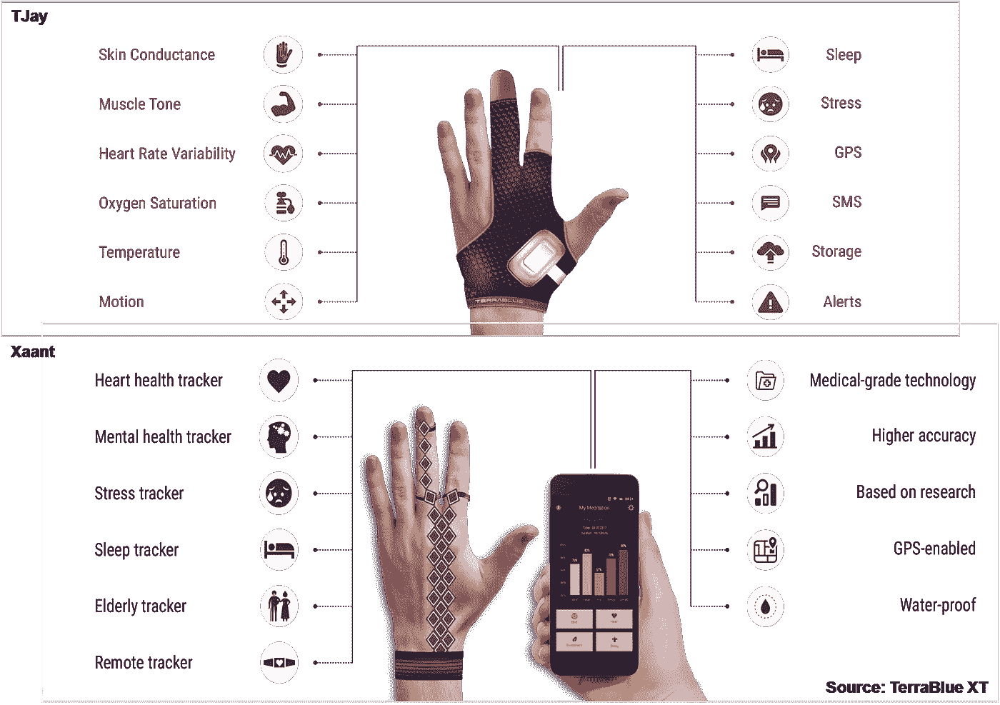

# 物联网——迈向超互联世界

> 原文：<https://towardsdatascience.com/internet-of-things-leap-towards-a-hyper-connected-world-6b6a90960a06?source=collection_archive---------11----------------------->

推特:@swatisubodh

# 连接智能

想象一个场景。当你去上班时，你的车会访问你的手机日历来确定你要去的目的地，并且已经知道最短最快的路线。万一你遇到交通拥挤，汽车会自动通知你的办公室你要迟到了！虽然这看起来像是未来电影中的一个片段，但这样的场景已经成形了。进入物联网的世界，俗称物联网。

迄今为止，互联网主要是将人与信息、人与人、人与企业联系起来。现在，物联网正在创建开放的全球网络，将人、数据和机器相互连接起来。根据最近的报告，截至 2017 年底，全球共有 84 亿个互联实体(“物”)，比地球上的总人口还多！到 2020 年，不同的调查预测这一数字将达到惊人的 260-1000 亿台联网设备。过去几年，围绕大数据以及最近的人工智能(AI)的势头和讨论越来越多。这两者都是由错综复杂的互联设备网络驱动的，这些设备在后端收集和处理信息，并将其与社会、工业和科学实践联系起来，同时共同改变当前生产和消费数据、知识和创新的方式。简单地说，物联网是所有可以连接到互联网并相互“交谈”的设备的集合！

Source: Black box paradox

1999 年，英国技术先驱凯文·阿什顿(Kevin Ashton)创造了“物联网”一词，他将计算机从典型的条形码或预定脚本的执行中区分出来，成为可以收集比人工可能收集的更多信息并理解这些信息的原型。这个过程反过来让他们更聪明！

虚拟世界和现实世界之间的界面不亚于一个数字神经系统，其中的传感器和执行器收集各种类型的数据，并将其输入网络。

**物联网结构**

通常，物联网结构包括硬件、云、后端分析以及这三个组件之间的双向交互。它是建立在以下基础上的超连接计算环境:(1)宽带无线互联网连接；(2)嵌入日常物品的微型传感器；以及(3)由人工智能和机器学习支持的协作机器人(Cobots)，解释传感器收集的大数据。

由称为传感器的简单终端设备连接而成的网格接收或传输少量数据。这些传感器与传播器通信，传播器是协议智能的站点。传播方决定如何管理数据，同时收集、整理、捆绑数据并将其传输到互联网，在互联网上，集成商对数据进行分析并采取行动。集成器功能可以托管在各种通用或广泛部署的设备或计算机上，如大数据服务器、智能手机甚至机顶盒。

传感器、传播器和积分器的网格可以自主地或在人工引导下工作。当理解的复杂性超过某个阈值或需要策略上下文信息时，数据可以被发送给人类智能进行分析。在必要的情境化之后，分析可以被发送回 cobots。

**完美风暴！**

考虑到这一点，今天宽带互联网变得更加广泛，4G 很快过渡到 5G 和 6G；连接的成本正在降低，越来越多的设备具有 wi-fi 功能和内置传感器；技术开发成本大幅下降，智能手机普及率达到历史最高水平。

Bala Pesala 博士，CSIR 首席科学家，AcSIR 副教授；CSIR 大学高级科学家兼 AcSIR 助理教授马丹·拉克什马南博士解释说，最近，不同领域的进步，如低价传感器和计算设备的可用性、连接和数据收集的便利性，以及商业/商业参与者和决策者越来越依赖数据分析和分析的世界，为物联网和基于物联网的应用创造了一个利基。简而言之，物联网革命再好不过了！

**直到一切都与其他一切相连**

据估计，我们与互联事物的互动更多地是在我们家外面，而不是在家里；从无处不在的自动柜员机(ATM)支付现金，到基于 GPS 的位置感应，帮助我们的日常导航。从极小的颗粒大小的机器人到智能城市的巨型设备，物联网已经渗透到日常生活中，并继续在我们周围扩展。突然间，智能城市的想法，或者更进一步，智能世界的想法，物联网创造了一个并行的虚拟生态系统，似乎不再遥远。

可能性实际上是无限的；物联网解决方案广泛部署在许多领域，包括汽车、交通、智能家居、能源、公用事业、安全、监控、公共安全、金融服务、零售、医疗保健、工业、仓储和配送。这不仅仅是提高现在的能力，也是决定如何改善日常生活。

Pesala 博士和 Lakshmanan 博士解释说，物联网正在物流、农业(“从种子到货架”)、能源和医疗保健领域产生巨大影响。与“无法测量的东西无法控制”的想法相呼应，他们进一步补充说，物联网系统可以持续测量事物，通过这些系统可以“当场”做出数据驱动的决策。

**积聚势头**

尽管我们目前处于设计和实施物联网能力的初级阶段，但一些轰动的故事已经成为头条新闻，并再次表明这项技术的巨大潜力。

对伦敦受欢迎的地铁网络的制动系统的审计和评估需要昂贵且笨重的设备来测试，并且还需要保持列车不流通，这是代价高昂的网络中断。一个由 iPAD 控制的小型物联网设备——减速器——被制成原型，并被证明不仅与传统的制动评估技术一样有效，而且预计在服务中断最少或没有中断的情况下每年节省 50 万美元。

佩萨拉博士和拉克什马南博士的实验室一方面一直在研究用于持续医疗监控和预警系统的物联网设备，另一方面是用于分散发电、分布式传感和监控应用的物联网太阳能树，他们指出了另外两个例子 Waymo 的自动驾驶电动汽车和 Flybird Innovations 的自动精确灌溉和施肥系统。前者自 2009 年以来一直在运营，无人驾驶汽车在城市道路上行驶了近 800 万公里。这是基于他们仅在 2017 年模拟驾驶的 43 亿公里。该项目旨在开发未来舒适、安全的无人驾驶汽车。另一方面，Flybird Innovations 正在开发物联网设备，这些设备可以通过编程来调节水和肥料、土壤湿度/温度/湿度。这将防止作物/植物灌溉不足和灌溉过量，从而提高作物产量和农民的生产力。

能源和医疗保健行业是大规模设计和部署基于物联网的解决方案的两个主要行业。让我们放大这些来更好地理解这一点。

**瓦特网络:智能电网解决新时代的能源需求**

预计到 2020 年，能源需求将翻一番，这将需要额外的电流选项和附加基础设施来补充现有的遗留基础设施。此外，许多国家和欧盟(EU)已经发布了减少碳排放和转向可再生能源的指令，至少“到 2020 年减少 20%”，同时提高能源效率。这凸显了建立利用可再生绿色能源的创新框架的必要性。正是在这里，物联网集成可以通过建立智能电网来改变这一等式，智能电网是一种通过数字控制、监控和电信功能增强的能源生成、传输和分配网络。它可以通过(I)增加弹性——通过增加来自传感器的数据；㈡使能——利用数据管理资源；以及(iii)优化——使利益相关者能够就电力使用和发电做出明智的决策。这为提高能力创造了一个信息价值循环(IVL)。

智能电网不仅提供实时、双向的电力流动，还支持自动化、双向的信息流动；这意味着在整个基础设施中分布计算智能。这可能包括在风力涡轮机叶片中嵌入传感器，根据不断变化的风力条件实时控制其俯仰、旋转和功能；涉及最小化与网络干扰相关的生产停工时间的变电站控制系统。这些数据被输入高级分析系统，该系统可以根据天气状况预测电网状态。

电力行业物联网的两个例子是 SCADA(监控和数据采集)和 AMI(高级计量基础设施)。前者包括由中央主单元控制的传感器和致动器，而后者是电表公用事业侧和用户侧智能设备的双向通信系统。许多公司都是这一领域的先行者。全球最大的空调、供暖、通风和制冷公司大金应用(Daikin Applied)正利用物联网专注于为其客户快速实施差异化增值服务，如实时单元性能、远程诊断、监控和控制、高级能源管理和第三方内容集成。

**工作中的智能电网**

智能电网的预测分析提供了将运营从被动转变为主动的机会。它使电力公司和电网系统运营商能够:

*   减少资本支出
*   通过了解消费模式来管理需求
*   通过了解高峰消费模式和周期来增加可再生能源的能力
*   通过实现远程故障诊断和预测性维护降低维护成本
*   通过将可再生能源用于传输、分配和高效消费来减少碳排放，从而遵守法规
*   通过绘制客户的消费模式来开发量身定制的服务和产品，从而提高客户参与度。

部署这些解决方案的公司越来越多。总部位于佛罗里达州的杜克能源公司声称，当出现问题时，其电力系统有能力自动检测、隔离和重新路由电力。这确保了通过自动检测和自动配置在一分钟内为尽可能多的人不间断供电。太平洋天然气和电力公司(PG&E)正在测试无人机，以提高其电力和天然气服务的安全性和可靠性，特别是在其 70，000 平方英里(1，81299 平方公里)的服务区域内难以到达的地区。它正在与美国宇航局合作测试甲烷传感器，以检测管道中的甲烷泄漏。

在印度，目前有 971 家物联网初创企业，其中大多数正在与印度政府合作开发智能城市(来源:2017 年物联网初创企业目录)。例如，印度初创企业 FluxGen Technologies 的旗舰项目“能源和水资源管理器”( EWM)生成状态报告和消耗账单，甚至使用电子邮件通知用户实际消耗量和实际需求，以确保资源的最佳利用。随着这一领域的机会激增，更多的物联网解决方案和许多这样的初创企业有望进一步增加能源生态系统的动力。

Source: Medium

**医疗保健**

可负担得起的传感器(嵌入式、可穿戴式、移动、环境等)的可用性。)与物联网的巨大通信和计算能力结合在一起，为参与式和精准医疗的创新提供了可能性。以患者为中心的数据可以方便地收集，而不仅仅是随机对照试验。这将有助于理解更广泛的因果关系、精确治疗结果、介入接触点等。物联网的开放和分布式特性还将使个人能够以盲法和无偏见的方式为试验和医学研究做出贡献，这对于进一步微调医疗保健中的物联网能力至关重要。

概括地说，医疗保健中的物联网目前正在探索用于(1)个人健身和健康跟踪；(2)疾病监测和诊断；(3)治疗监测和坚持；(4)为医学研究收集数据；和(5)保健管理。

2017 年 11 月，美国美国食品药品监督管理局(FDA)批准了一种“数字药物”，即一种内置传感器的药丸，它可以数字跟踪患者是否摄入了药物。当传感器与胃中的液体接触时会发出电信号，并将该信号中继到患者身体上的可穿戴贴片，然后将该信号进一步传输到患者的智能手机。医生和最多四个其他授权人员可以查看该输出。该药物被批准用于治疗某些精神健康疾病，如精神分裂症。

2017 年，FDA 还批准了 AliveCor Kardia band，这是一种安装在表带中的实时心电图(ECG/EKG)。它可以连续检测正常的窦性心律和房颤(最常见的心律失常)，而不是在离散的时间点进行检测。这对患者更好的医疗保健和整体降低医疗保健成本大有帮助。基于传感器的生物流体中生物分子和生物溶液的测试正迅速成为流行的非侵入性和优选的诊断工具。它不仅能够全天候无障碍地监测生物参数，还能让患者或其护理人员与医疗保健提供者实时共享结果。这进一步转化为更好的疾病管理或治疗，在某些情况下可以挽救生命。从通过嵌入生物传感器的隐形眼镜测试眼泪到尿液评估，研究人员正在绘制整个光谱。其中一种产品是 UroSense，这是 Future Path 公司的一种医疗设备，可以自动测量导管插入患者的尿量和核心体温(CBT)。这些生命体征对于及早发现和治疗心力衰竭、肾损伤、传染病、前列腺肿瘤、糖尿病、败血症和烧伤非常重要。测量 CBT 也可以表明感染或体温过低。在医院，来自 UroSense 的数据可以直接无线发送到监视器或护理站。

总部位于孟加拉国的初创企业 TerraBlue XT 开发了两款创新产品 TJay 和 Xaant。而 TJay 是用于预测和管理癫痫的解决方案；Xaant 是一种治疗性的可穿戴设备，可以追踪思维路径，生成实时数据。TJay 是一种带有传感器附件和基于 ML/ AI 的软件解决方案的手套，可在癫痫发作前提供预测。其目的是使患者能够过上更安全和高质量的生活，也使医生能够提供及时的护理和干预。该公司将自己的第二款产品 Xaant(在梵语中读作“Shaant ”,意思是平静)描述为“一种可以培养你生活平静的可穿戴设备”,因为它可以识别什么让你焦虑，什么引发你的愤怒或什么导致你的压力。这些信息反过来可以用来训练自己在面对逆境时变得更加坚强。Xaant 作为智能表带或智能珠宝佩戴，可跟踪个人的精神健康状况，并监控压力原因、睡眠质量、心脏健康以及镇静技术在保持头脑冷静方面的效果。

在难以到达的地区和农村地区提供远程医疗和医疗保健是物联网用于个人和社区医疗保健的另一个方面。

物联网无处不在！设备制造商正在将设备连接到物联网，使用增材制造(3D 打印)，生产可穿戴电子产品(“智能”服装，贴在皮肤上的传感器)，使远程和持续监测患者的健康成为可能。随着世界人口老龄化，慢性病及其治疗费用的增加，以及长期护理医务人员的短缺，医疗护理可能会部分地从医院转移到家庭护理。物联网与这种转变产生了很好的共鸣，并将成为未来医疗保健的前沿。

**数据爆炸！**

来自设备的数据呈指数级增长，在转化为其他人可以使用的信息之前，这本身没有任何意义。除非转化为有价值的可操作见解，否则转化为知识的数据也将用途有限。这些在特定领域具有巨大价值的见解需要进一步适应多领域、跨职能的智慧，以改变游戏策略和保持竞争优势。大数据是近年来互联事物数量空前激增的产物。核心是数据科学，通过算法设计、人工智能、机器学习、统计学、建模等来分析数据。，以使它在现实世界中一致地工作，跨不同的域，跨不同的基础设施，并为多个用户服务。

**介意差距！**

新技术在变得普遍之前，通常会面临现实世界的运营挑战。物联网也不例外。为了加快物联网的采用，需要立即解决的关键问题如下:

a)安全性:去年，FDA 史无前例地召回了 4，50000 个易受网络威胁的起搏器。强生公司去年就其胰岛素泵的一个安全漏洞警告了顾客。这意味着黑客可能会给用户注射致命剂量的药物！植入设备也有被黑客攻击和被别人控制的风险！

在一个高度互联的世界里，数据的安全性仍然是人们最关心的问题。这种情绪反映在全球范围内物联网安全年度支出的不断攀升上。高度集成系统的高度自动化带来了系统性风险的脆弱性，例如，如果其中一个部分发生故障，例如黑客或互联网病毒可以完全入侵集成系统，整个网络就会崩溃。

为了解决这些不对称问题，需要考虑在物联网网络的一部分因暴露于恶意软件/病毒或其他可在开放网络中快速传播的非数字威胁而崩溃时的安全退出或遏制策略。已经提出了各种级别的安全结构，许多正在开发中。它们被授权在不损害创新生态系统及其组成部分的长期安全性和可持续性的情况下构建复杂的数字网络。以下是在未来应用中带来对称性的三个措施:(a)考虑数字网络的内置安全出口；(b)认识到加速/减速的必要性；以及技术政策的全球治理创新。

一些公司已经在这一领域处于领先地位。英特尔提供了来自英特尔、Wind River 和 McAfee 的技术组合，将安全层整合到硬件、嵌入式操作系统和安全软件中，以确保智能电网中的端到端安全性。这些功能无法被流氓软件更改，并在安全的分区中运行应用程序，同时保护重要的平台数据并防止恶意软件启动。

b)互操作性:随着多家公司在不同领域提供各种支持物联网的服务和产品，信息碎片化导致不同格式数据的访问和使用受限的风险可能会成为采用和最大化物联网潜力的瓶颈。因此，平台和网络无缝集成的需求变得至关重要。

为了在平台之间实现更好的通信，这意味着将广泛的协议结合在一起，包括 2G、3G、LTE、LTN、wan，以及专业电信服务提供商、硬件和软件公司的参与。如果未连接的基础设施中存在的数据得到最佳实现，物联网将提供巨大的机会。开放的互操作性标准和通用架构对于将传统设备连接到数据中心和云基础设施至关重要，这将实现端到端分析，进而实现其优势。这绝不是一件容易的事；然而，已经朝着这个方向迈出了初步的步伐。

美国电话电报公司、思科、通用电气、IBM 和英特尔已经成立了工业互联网联盟(IIC)，这是一个开放成员的非营利组织，将率先在各种工业环境中建立互操作性。人们希望这将转化为一个更加互联的世界。

c)隐私:当数据被收集和上传到云服务器时，无论是私有的还是公共的，数据隐私都是一个大问题。HIPAA(健康保险便携性和责任法案)为保护以电子方式创建、接收、维护或传输的患者数据制定了标准。由于现在有传感器自动收集和存储医疗数据，个人数据的安全性变得更加重要。这使得许多医院无法采用网络容量来存储患者数据和其他医疗信息。

2017 年底，北美、西欧和大中华区占全球物联网的 67%。这导致了第二个更具社会性而非技术性的担忧——极端的连通性创造了新的社会和政治权力结构。这可能导致少数人的独裁或支配性治理，这些人直接或通过其有联系的代理人间接完全控制着网络。在所谓的工业 4.0 Plus 或工业 5.0 中，已经提出了有效利用数字能力和治理的新模式。其伦理、法律和社会影响(ELSI)也在学术辩论中。

Pesala 博士和 Lakshmanan 博士强调了与物联网在大规模实施中的有效使用有关的其他几个问题，即标准化和数据互操作性，以及部署物联网系统的相对较高的成本。物联网边缘设备的认证和授权缺乏标准，此外，平台配置的安全标准也不成熟。许多物联网系统的设计很差，并且使用各种协议和技术实施，有时会产生复杂和冲突的配置。许多物联网运营商的额外网络安全措施不足仍然是一个主要问题。

已经在努力实现平台之间的无缝数据交换和分析。随着越来越多的行业采用物联网系统，这些系统的成本也在下降。几年后，随着更多利益相关方的参与，这一数字有望进一步下降。

到目前为止，我们所目睹的只是开始，本质上只是冰山一角。正如我们今天所知，随着物联网缓慢而稳定地创建几乎所有行业的后端，无论是当前行业还是新兴行业，不久的将来都会有巨大的前景。

(*这篇文章作为封面故事发表在 2018 年 5 月至 6 月发行的《发明情报》杂志上，这是印度政府国家研究发展公司的出版物*)。