# 可解释性:打开黑匣子——第一部分

> 原文：<https://towardsdatascience.com/interpretability-cracking-open-the-black-box-part-i-4bb0359853bd?source=collection_archive---------41----------------------->

我们怎样才能给 ML 中使用的黑盒带来可解释性？


> 可解释性是人类能够理解决策原因的程度 *—米勒、蒂姆*[*【1】*](https://arxiv.org/abs/1706.07269)

付费墙是否困扰着你？ [*点击这里*](/interpretability-cracking-open-the-black-box-part-i-4bb0359853bd?source=friends_link&sk=bb8e40eb7df582350d4769ccdf761356) *绕过去。*

可解释的人工智能(XAI)是人工智能的一个子领域，在最近的过去已经取得了进展。作为一名日复一日与客户打交道的机器学习实践者，我明白为什么。我已经做了 5 年多的分析从业者，我发誓，机器学习项目最困难的部分不是创建一个击败所有基准的完美模型。这是你说服客户为什么和如何工作的部分。

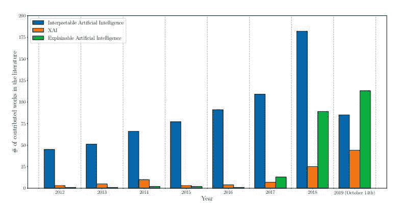

面对未知事物，人类总是一分为二。我们中的一些人用信仰来对待它并崇拜它，就像我们崇拜火、天空等的祖先一样。我们中的一些人变得不信任。同样，在机器学习中，有人对模型的严格测试(即模型的性能)感到满意，有人想知道模型为什么以及如何做它正在做的事情。这里没有对错之分。

图灵奖获得者、脸书首席人工智能科学家 Yann LeCun 和谷歌首席决策智能工程师 Cassie Kozyrkov 都是这种思想的强烈支持者，即你可以通过观察模型的行动(即在监督学习框架中的预测)来推断模型的推理。另一方面，微软研究院的 Rich Caruana 和其他几个人坚持认为，模型天生具有可解释性，而不仅仅是通过模型的性能得出的。

我们可以花数年时间来辩论这个话题，但对于人工智能的广泛采用，可解释的人工智能是必不可少的，并且越来越多地来自行业的需求。因此，在这里我试图解释和演示一些可解释性技术，这些技术对我向客户解释模型以及研究模型并使其更加可靠都很有用。

# 什么是可解释性？

可解释性是人类能够理解决策原因的程度。在人工智能领域，它意味着一个人能够理解算法及其预测的方式和原因的程度。有两种主要的方式来看待这个问题——*和 ***事后解释*** 。*

## *透明度*

*透明度解决了模型可以被理解的程度。这是我们使用的模型所固有的。*

*这种透明性的一个关键方面是可模拟性。**可模拟性**表示模型被人类严格模拟或思考的能力[3]。模型的复杂性在定义这一特征时起了很大的作用。虽然简单的线性模型或单层感知器很容易考虑，但考虑深度为 5 的决策树变得越来越困难。考虑一个有很多特性的模型也变得更加困难。因此，稀疏线性模型(正则化线性模型)比密集线性模型更容易解释。*

***可分解性**是透明的另一个主要原则。它代表解释模型的每个部分(输入、参数和计算)的能力[3]。它需要解释从输入(没有复杂的特性)到输出的一切，而不需要另一个工具。*

*透明的第三个原则是**算法透明**。这涉及算法固有的简单性。它涉及人类完全理解算法将输入转换为输出的过程的能力。*

## *事后口译*

*当模型本身不透明时，事后解释是有用的。因此，在不清楚模型如何工作的情况下，我们求助于用多种方式解释模型及其预测。Arrieta、Alejandro Barredo 等人将它们汇编并分类为 6 个主要类别。我们将在这里讨论其中的一些。*

*   *可视化解释——这些方法试图将模型行为可视化，并试图解释它们。属于这一类别的大多数技术使用降维等技术，以人类可理解的格式可视化模型。*
*   *特性相关性解释——这些方法试图通过计算特性相关性或重要性来揭示模型的内部工作原理。这些被认为是解释模型的间接方式。*
*   *通过简化来解释——这套方法试图在原始模型的基础上训练全新的系统来提供解释。*

*由于这是一个广泛的话题，涵盖所有内容将是一个庞大的博客帖子，我把它分成多个部分。我们将在当前部分讨论可解释的模型和其中的“陷阱”,并将事后分析留给下一部分。*

# *可解释的模型*

*奥卡姆剃刀理论认为简单的解决方案比复杂的更有可能是正确的。在数据科学中，奥卡姆剃刀通常与过度拟合联系在一起。但是我相信它同样适用于可解释性。如果您可以通过透明模型获得想要的性能，那么就不要再寻找完美的算法了。*

*Arrieta、Alejandro Barredo 等人总结了 ML 模型，并在一个漂亮的表格中对它们进行了分类。*

*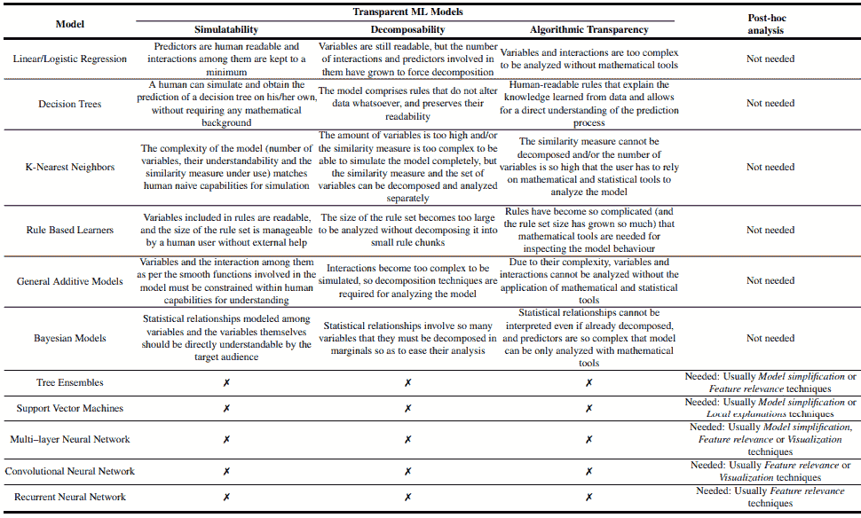*

## *线性/逻辑回归*

*由于 Logistic 回归在某种程度上也是线性回归，所以我们只重点研究线性回归。我们拿一个小数据集( [auto-mpg](https://www.kaggle.com/uciml/autompg-dataset) )来考察一下模型。数据涉及城市循环油耗，单位为每加仑英里数，以及汽车的不同属性，如:*

*   *圆柱体:多值离散*
*   *位移:连续*
*   *马力:连续*
*   *重量:连续*
*   *加速度:连续*
*   *年款:多值离散型*
*   *起源:多值离散*
*   *汽车名称:字符串(对于每个实例是唯一的)*

*加载数据后，第一步是运行 [pandas_profiling](https://github.com/pandas-profiling/pandas-profiling) 。*

```
*import pandas as pd 
import numpy as np 
import pandas_profiling 
import pathlib 
import cufflinks as cf 
#We set the all charts as public cf.set_config_file(sharing='public',theme='pearl',offline=False) cf.go_offline() 
cwd = pathlib.Path.cwd() 
data = pd.read_csv(cwd/'mpg_dataset'/'auto-mpg.csv') 
report = data.profile_report() report.to_file(output_file="auto-mpg.html")*
```

*只需一行代码，这个出色的库就可以为您完成初步的 EDA。*

**

*Snapshot from the Pandas Profiling Report. [Click here](http://htmlpreview.github.io/?https://github.com/manujosephv/interpretability_blog/blob/master/auto-mpg.html) to view the full report.*

***数据预处理***

*   *马上，我们看到*汽车名称*在 396 行中有 305 个不同的值。所以我们放弃这个变量。*
*   **马力*被解释为分类变量。经过调查，它有一些行带有“？”。将它们替换为列的平均值，并将其转换为浮点型。*
*   *它还显示了*位移*、*气缸*和*重量*之间的多重共线性。让我们暂时把它留在那里。*

*在 python 世界中，线性回归在 Sci-kit Learn 和 Statsmodels 中可用。它们给出了相同的结果，但是 Statsmodels 更倾向于统计学家，Sci-kit Learn 更倾向于 ML 从业者。让我们使用 statsmodels，因为它提供了开箱即用的漂亮摘要。*

```
*X = data.drop(['mpg'], axis=1) 
y = data['mpg'] 
## let's add an intercept (beta_0) to our model 
# Statsmodels does not do that by default 
X = sm.add_constant(X) 
model = sm.OLS(y, X).fit() 
predictions = model.predict(X) 
# Print out the statistics 
model.summary() 
# Plot the coefficients (except intercept) model.params[1:].iplot(kind='bar')*
```

*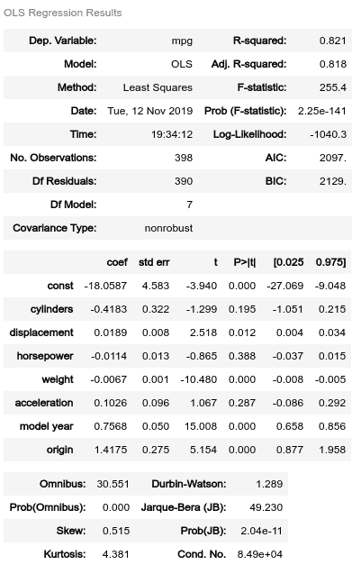**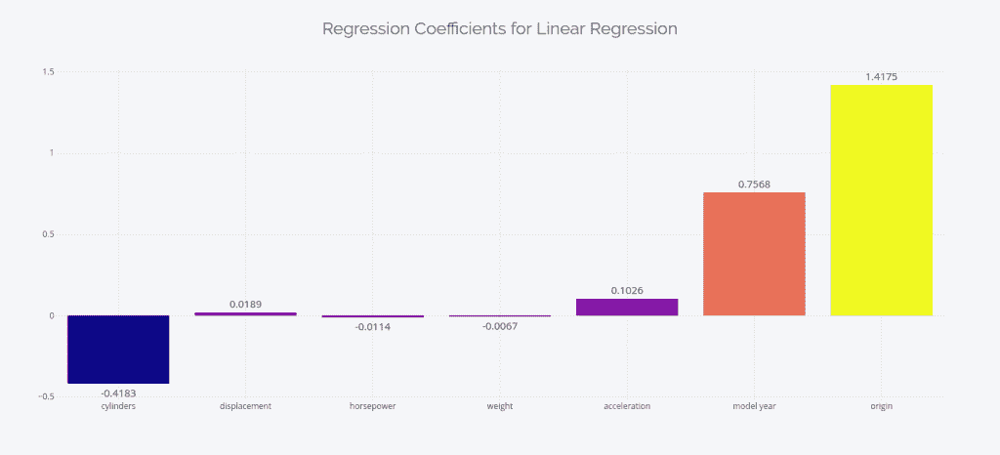*

*这里的解释非常简单。*

*   *截距可以解释为在所有自变量都为零的情况下你所预测的里程。这里的“问题”是，如果独立变量可以为零是不合理的，或者如果在线性回归训练的数据中没有这种情况，那么截距是没有意义的。它只是将回归锚定在正确的位置。*
*   *这些系数可以被解释为因变量的变化，它将驱动自变量的单位变化。例如，如果我们增加 1 的重量，里程将减少 0.0067*
*   *一些特征，如气缸、年款等，本质上是明确的。这些系数需要解释为不同类别之间的平均里程差异。这里还有一点需要注意的是，所有的分类特征在本质上都是有序的(圆柱体越多意味着里程越少，或者模型年份越高，里程越多)，因此可以让它们保持原样并运行回归。但如果情况不是这样，哑元或一次性编码分类变量是可行的。*

*现在来看特征重要性，看起来*产地*和*车型年份*是驱动该车型的主要特征，对吗？*

*没有。我们来详细看一下。为了阐明我的观点，让我们看几行数据。*

*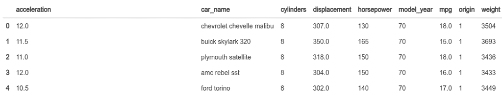*

**原点*有 1、2 等值。， *model_year* 的值类似于 70、80 等。重量的值有 3504、3449 等。，mpg(我们的因变量)有 15，16 等值。你看到这里的问题了吗？要建立一个输出 15 或 16 的方程，该方程需要一个小的权重系数和一个大的原点系数。*

*那么，我们该怎么办？*

***回车，标准化回归系数。***

*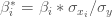*

*我们将每个系数乘以自变量的标准偏差与因变量的标准偏差之比。标准化系数是指预测变量每增加一个标准差，因变量将改变多少个标准差。*

```
*#Standardizing the Regression coefficients std_coeff = model.params for col in X.columns: std_coeff[col] = (std_coeff[col]* np.std(X[col]))/ np.std(y) std_coeff[1:].round(4).iplot(kind='bar')*
```

*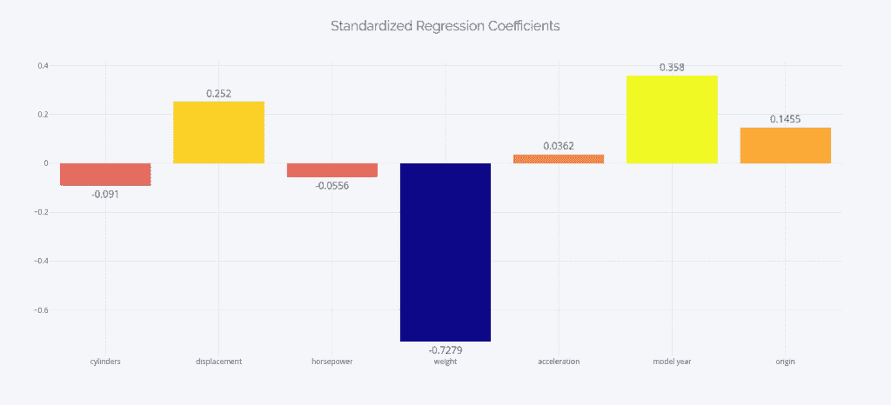*

*画面真的变了，不是吗？汽车的重量是决定行驶里程的最大因素，其系数几乎为零。如果你想获得标准化背后更多的直觉/数学，建议你看看[这个 StackOverflow 答案](https://stats.stackexchange.com/a/269455)。*

*获得类似结果的另一种方法是在拟合线性回归之前标准化输入变量，然后检查系数。*

```
*from sklearn.preprocessing import StandardScaler 
scaler = StandardScaler() 
X_std = scaler.fit_transform(X) 
lm = LinearRegression() 
lm.fit(X_std,y) 
r2 = lm.score(X_std,y) 
adj_r2 = 1-(1-r2)*(len(X)-1)/(len(X)-len(X.columns)-1) 
print ("R2 Score: {:.2f}% | Adj R2 Score: {:.2f}%".format(r2*100,adj_r2*100)) 
params = pd.Series({'const': lm.intercept_}) 
for i,col in enumerate(X.columns): 
    params[col] = lm.coef_[i] 
params[1:].round(4).iplot(kind='bar')*
```

*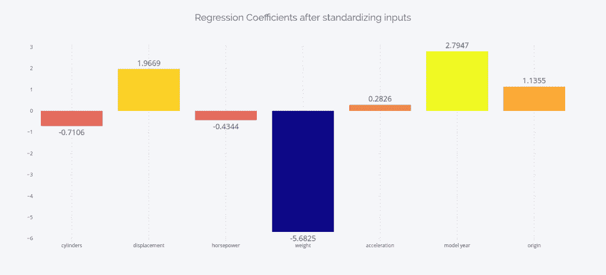*

*即使实际系数不同，特征之间的相对重要性保持不变。*

*线性回归中的最后一个“陷阱”通常是多重共线性和 OLS。线性回归是解决使用 OLS，这是一个无偏估计。即使听起来是好事，其实也不一定。这里的“无偏”是指求解过程不考虑哪个自变量比其他变量更重要；即，它对独立变量是无偏的，并且努力获得最小化残差平方和的系数。但是我们真的想要一个最小化 RSS 的模型吗？提示:RSS 是在训练集中计算的。*

*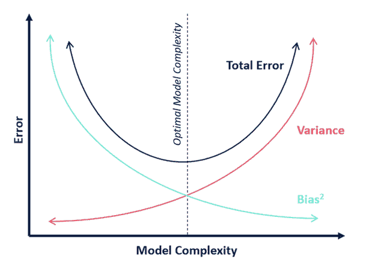*

*在偏差与方差的权衡中，存在一个最佳点，在这个点上你可以获得平衡过度拟合的最佳模型复杂度。通常，因为很难估计偏差和方差来进行分析推理并达到最佳点，所以我们采用基于交叉验证的策略来达到同样的目的。但是，如果你想一想，在线性回归中没有真正的超参数可以调整。*

*而且，由于估计量是无偏的，它会将一部分贡献分配给它可用的每个特征。当存在多重共线性时，这就成了一个更大的问题。虽然这不会对模型的预测能力产生太大影响，但会影响模型的可解释性。当一个特征与另一个特征或特征组合高度相关时，该特征的边际贡献受到其他特征的影响。因此，如果数据集中存在强烈的多重共线性，回归系数将会产生误导。*

***进入正规化**。*

*几乎任何机器学习算法的核心都是最小化成本函数的优化问题。在线性回归的情况下，成本函数是残差平方和，它只不过是由系数参数化的预测值和实际值之间的平方误差。*

*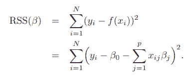*

*Source: [https://web.stanford.edu/~hastie/ElemStatLearn/](https://web.stanford.edu/~hastie/ElemStatLearn/)*

*为了增加正则化，我们在优化的成本函数中引入了一个附加项。成本函数现在变成:*

*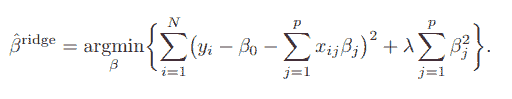**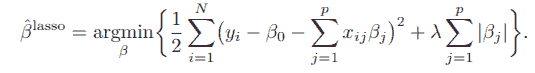*

*在岭回归中，我们将所有平方系数之和添加到成本函数中，在 Lasso 回归中，我们添加了绝对系数之和。除此之外，我们还引入了一个参数*λ*，这是一个超参数，我们可以调整它来达到最佳的模型复杂度。并且由于 L1 和 L2 正则化的数学性质，对系数的影响略有不同。*

*   *岭回归将它认为不太重要的独立变量的系数缩小到接近零。*
*   *套索回归将它认为不太重要的独立变量的系数缩小到零。*
*   *如果存在多重共线性，Lasso 会选择其中一个并将另一个缩小到零，而 Ridge 会将另一个缩小到接近零。*

*由 Hastie，Tibshirani，Friedman 撰写的《统计学习的要素》给出了以下指导方针:当你有许多中小型效果时，你应该使用 Ridge。如果你只有几个中/大效果的变量，用套索。你可以看看这个[媒体博客](/regularization-in-machine-learning-connecting-the-dots-c6e030bfaddd)，它相当详细地解释了正规化。作者也给出了一个简洁的总结，我在这里借用一下。*

*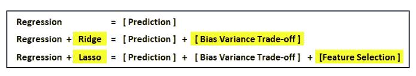*

```
*lm = RidgeCV() 
lm.fit(X,y) 
r2 = lm.score(X,y) 
adj_r2 = 1-(1-r2)*(len(X)-1)/(len(X)-len(X.columns)-1) 
print ("R2 Score: {:.2f}% | Adj R2 Score: {:.2f}%".format(r2*100,adj_r2*100)) 
params = pd.Series({'const': lm.intercept_}) 
for i,col in enumerate(X.columns): 
    params[col] = lm.coef_[i] 
ridge_params = params.copy() lm = LassoCV() 
lm.fit(X,y) 
r2 = lm.score(X,y) 
adj_r2 = 1-(1-r2)*(len(X)-1)/(len(X)-len(X.columns)-1) 
print ("R2 Score: {:.2f}% | Adj R2 Score: {:.2f}%".format(r2*100,adj_r2*100)) 
params = pd.Series({'const': lm.intercept_}) 
for i,col in enumerate(X.columns): 
    params[col] = lm.coef_[i] 
lasso_params = params.copy()ridge_params.to_frame().join(lasso_params.to_frame(), lsuffix='_ridge', rsuffix='_lasso')*
```

*我们只是对相同的数据进行了岭和套索回归。岭回归给出了与原始回归完全相同的 R2 和调整后的 R2 分数(分别为 82.08%和 81.72%)，但系数略有缩小。Lasso 给出了较低的 R2 和调整后的 R2 得分(分别为 76.67%和 76.19%)，并有相当大的收缩。*

*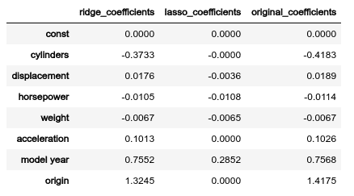*

*如果你仔细观察这些系数，你会发现岭回归并没有减少多少系数。唯一真正缩水的地方是*位移*和*原点*。这可能有两个原因:*

1.  *位移与圆柱体(0.95)有很强的相关性，因此它被缩小了*
2.  *原始问题中的大部分系数已经接近于零，因此收缩非常小。*

*但是如果你看看 Lasso 是如何缩小系数的，你会发现它相当有侵略性。*

*作为一个经验法则，我建议总是使用某种正规化。*

## *决策树*

*让我们为这个练习选择另一个数据集——世界著名的虹膜数据集。对于那些一直生活在岩石下的人来说，Iris 数据集是对三种花卉进行测量的数据集。一种花与另外两种花是线性可分的，但是另外两种花彼此不是线性可分的。*

*该数据集中的列是:*

*   *身份*
*   *SepalLengthCm*
*   *SepalWidthCm*
*   *PetalLengthCm*
*   *PetalWidthCm*
*   *种类*

*我们删除了“Id”列，对物种目标进行了编码，使其成为目标，并在其上训练了一个决策树分类器。*

*让我们看看决策树中的“*特征重要性*”(我们将在博客系列的下一部分详细讨论特征重要性及其解释)。*

```
*clf = DecisionTreeClassifier(min_samples_split = 4) clf.fit(X,y) feat_imp = pd.DataFrame({'features': X.columns.tolist(), "mean_decrease_impurity": clf.feature_importances_}).sort_values('mean_decrease_impurity', ascending=False) feat_imp = feat_imp.head(25) feat_imp.iplot(kind='bar', y='mean_decrease_impurity', x='features', yTitle='Mean Decrease Impurity', xTitle='Features', title='Mean Decrease Impurity', )*
```

*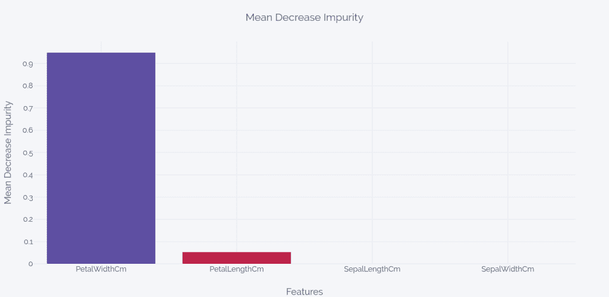*

*在这四个特征中，分类器仅使用花瓣长度和花瓣宽度来区分这三类。*

*让我们使用出色的库 [dtreeviz](https://github.com/parrt/dtreeviz) 来可视化决策树，看看模型是如何学习规则的。*

```
*from dtreeviz.trees import * viz = dtreeviz(clf, X, y, target_name='Species', class_names=["setosa", "versicolor", "virginica"], feature_names=X.columns) viz*
```

*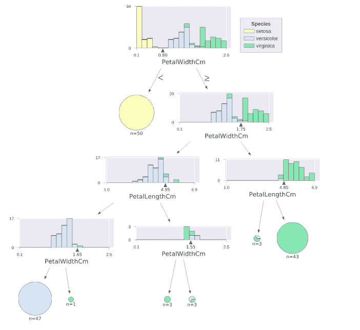*

*模型如何做它正在做的事情是非常清楚的。让我们向前一步，想象一个特定的预测是如何做出的。*

```
*# random sample from training x = X.iloc[np.random.randint(0, len(X)),:] viz = dtreeviz(clf, X, y, target_name='Species', class_names=["setosa", "versicolor", "virginica"], feature_names=X.columns, X=x) viz*
```

*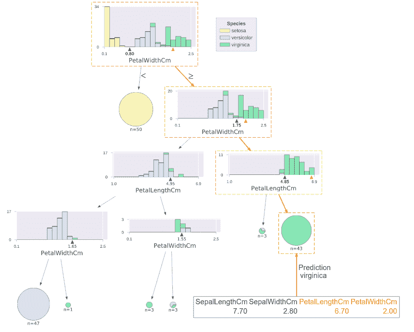*

*如果我们只使用决策树选择的两个特征重新运行分类，它会给出相同的预测。但是线性回归这样的算法就不一样了。如果我们移除不满足 p 值临界值的变量，模型的性能也可能会下降一些。*

*解释决策树要比线性回归简单得多，尽管它有很多奇怪的地方和假设。[统计建模:Leo Breiman](https://projecteuclid.org/euclid.ss/1009213726) 的《两种文化》是理解解释线性回归中的问题的必读之作，它还从性能和可解释性两方面论证了决策树甚至随机森林优于线性回归的情况。*(免责声明:如果你还没有想到，利奥·布雷曼是《随机森林》的创始人之一)**

***这就是我们博客系列的第一部分。请继续关注下一部分，我们将探索诸如排列重要性、Shapely 值、PDP 等事后解释技术。***

*我的 [Github](https://github.com/manujosephv/interpretability_blog) 中有完整的代码*

***参考文献***

1.  *米勒蒂姆。"人工智能中的解释:来自社会科学的见解."arXiv 预印本 arXiv:1706.07269。(2017)*
2.  *可解释的人工智能(XAI):面向负责任的人工智能的概念、分类学、机遇和挑战。艾]*
3.  *Guidotti，Ricardo 等，“解释黑盒模型的方法综述”arXiv:1802.01933 [cs .CY]*

**原载于 2019 年 11 月 12 日*[*【http://deep-and-shallow.com】*](https://deep-and-shallow.com/2019/11/13/interpretability-cracking-open-the-black-box-part-i/)*。**