# 可解释的人工智能或我如何学会停止担心和信任人工智能

> 原文：<https://towardsdatascience.com/interpretable-ai-or-how-i-learned-to-stop-worrying-and-trust-ai-e61f9e8ee2c2?source=collection_archive---------11----------------------->

## [内部 AI](https://medium.com/towards-data-science/inside-ai/home)

## 构建健壮、公正的人工智能应用的技术

> 公众信任是人工智能被有效使用的重要条件。— [马克·沃尔波特爵士](https://assets.publishing.service.gov.uk/government/uploads/system/uploads/attachment_data/file/566075/gs-16-19-artificial-intelligence-ai-report.pdf)


[[source](https://pixabay.com/photos/hands-together-handshake-give-1947915/)]

仅在过去五年中，人工智能研究人员就在诸如[图像识别](https://arxiv.org/abs/1512.03385)、[自然语言理解](https://www.microsoft.com/en-us/research/uploads/prod/2018/04/08049322.pdf)和[棋盘游戏](https://www.nature.com/articles/nature16961)等领域取得了重大突破！随着公司考虑将医疗保健和金融等行业的关键决策交给人工智能，缺乏对复杂机器学习模型的理解将带来巨大问题。这种缺乏理解可能会导致模型传播偏见，我们已经在[刑事司法](https://www.propublica.org/article/machine-bias-risk-assessments-in-criminal-sentencing)、[政治](https://thenextweb.com/artificial-intelligence/2018/03/21/killer-robots-cambridge-analytica-and-facebook-show-us-the-real-danger-of-ai/)、[零售](https://www.bloomberg.com/graphics/2016-amazon-same-day/?cmpid=google)、[面部识别](https://www.ted.com/talks/joy_buolamwini_how_i_m_fighting_bias_in_algorithms)和[语言理解](https://arxiv.org/pdf/1607.06520.pdf)中看到了不少这样的例子。

Kate Crawford on the Trouble with Bias at NeurIPS 2017

所有这些都对信任产生不利影响，从我的经验来看，这是公司抵制在整个企业中部署人工智能的主要原因之一。解释或诠释人工智能是一个热门的研究话题，因为现代机器学习算法是黑箱[没有人真正理解它们是如何工作的](https://www.technologyreview.com/s/604087/the-dark-secret-at-the-heart-of-ai/)。此外，现在有欧盟的规定来解释人工智能在 [GDPR 的“解释权”](https://arxiv.org/pdf/1606.08813.pdf)。在这篇博文中，我将介绍一些技术，您可以将这些技术添加到您的数据科学武库中，以提高对模型的理解。

# 团队数据科学流程

但是首先，你按照什么过程来构建和部署一个人工智能应用程序？在微软，我们遵循一种称为[团队数据科学过程](https://docs.microsoft.com/en-us/azure/machine-learning/team-data-science-process/overview) (TDSP)的敏捷迭代方法，这种方法从像 [CRISP-DM](https://en.wikipedia.org/wiki/Cross-industry_standard_process_for_data_mining) 和 [KDD](https://en.wikipedia.org/wiki/Data_mining#Process) 这样的过程中获得灵感。在这篇文章中，我将详细介绍这个过程的建模和部署阶段。

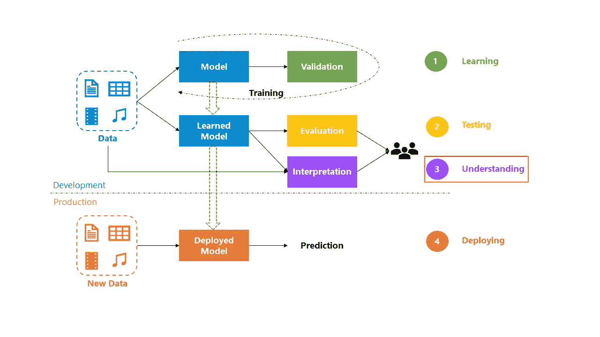

Zooming into Modeling and Deployment in TDSP

开发模型时，第一步是**学习**。您训练一个模型来从历史数据中检测模式，这需要经历多次迭代的训练和验证来挑选最佳模型。一旦你有了一个学习过的模型，下一步就是**测试**。这意味着在模型之前没有见过的盲数据集上评估模型。我写了一篇关于[度量模型良好性](/measuring-model-goodness-part-1-a24ed4d62f71)的博文，你可以应用这些技术来量化商业价值，并与商业利益相关者分享。在证明商业价值之后，下一个逻辑步骤通常是**将模型部署**到生产中。部署后，一个非常常见的问题是模型不能按预期执行。这有两个主要原因:

*   ***数据/概念漂移*** :当数据的分布随时间发生变化，或者用于训练模型的历史数据有偏差且不代表实际生产数据时，就会发生这种情况。

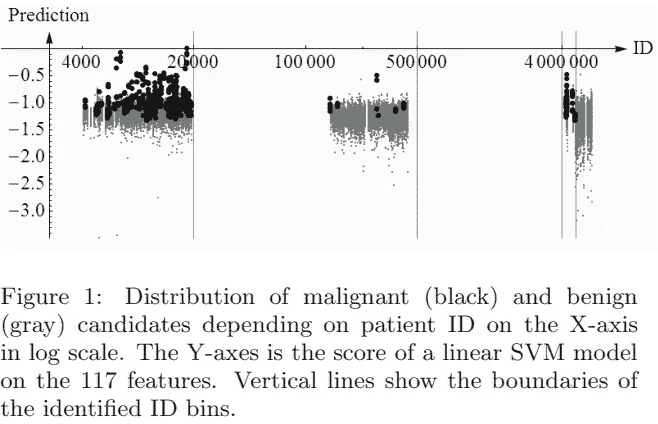

Data Leakage Example — KDD Cup 2008 [[source](https://www.kdd.org/exploration_files/KDDCup08-P1.pdf)]

*   ***数据泄露*** :当训练和验证数据中的特征或属性无意中泄露了在推理时不会出现的信息时，就会发生这种情况。这方面的一个经典例子是 2008 年的 [KDD 竞赛](https://www.kdd.org/kdd-cup/view/kdd-cup-2008)，关于早期乳腺癌检测，其中一个特征(患者 ID)被发现与目标类别高度相关。

在野外部署模型之前，我们可以通过引入一个额外的步骤让模型**理解**来规避这些问题。通过解释该模型，我们可以获得更深入的理解，并解决偏差、泄漏和信任等问题。

# 但是，什么是可解释性？

可解释性是人类可以持续估计模型将预测什么的程度，人类可以理解和遵循模型预测的程度，以及人类可以检测模型何时犯了错误的程度。

尽管可解释性对不同的人有不同的含义:

1.  对于一个**数据科学家**，这意味着更好地理解模型，看到模型做得好或不好的案例以及原因。这种理解有助于数据科学家构建更可靠的模型。
2.  对于一个**商业利益相关者**来说，这意味着更深入地理解为什么一个人工智能系统会做出一个特定的决定，以确保公平并保护其用户和品牌。
3.  对于一个**用户**，这意味着理解为什么一个模型做出一个决定，并且如果模型犯了一个错误，允许有意义的挑战。
4.  对于一个**专家**或**监管者**来说，这意味着审计人工智能系统并遵循决策轨迹，尤其是当事情出错时。

当你谈论可解释性和模型理解时，留意这些不同的人物角色是很重要的。

# 模型透明度

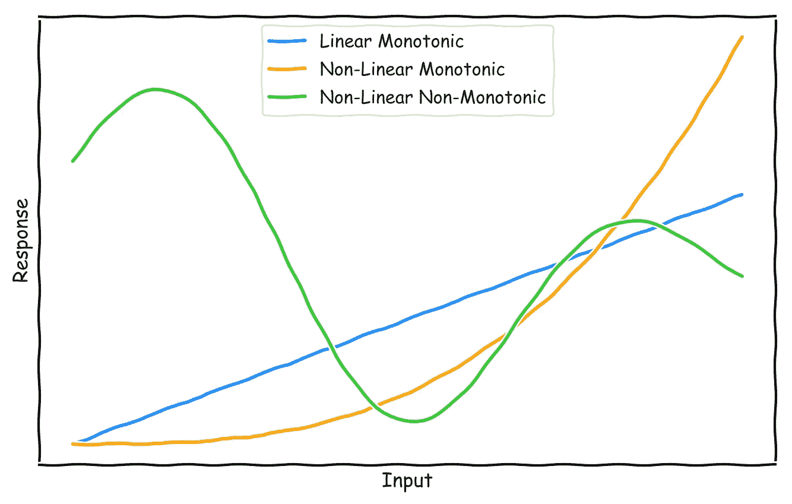

Model Complexity

模型的可解释性可通过学习的响应函数对输入特征的复杂程度来表征。上图显示了三种不同类型的响应函数:

1.  **线性、单调**:这些是最容易解释的函数，因为输入特征的变化会导致目标变量在单一方向上成比例的变化(正或负)。这允许我们计算相对特征重要性度量和原因代码。原因代码有助于理解学习模型预测特定输入的高值或低值的原因。它为我们提供了输入特征的预测影响的定性度量，即它是强的、弱的、积极的还是消极的。
2.  **非线性，单调**:机器学习算法学习到的大多数响应函数都是非线性的。单调性确保输入特征的相对变化导致目标变量在单一方向上的变化。非线性单调函数也是可解释的，因为它允许我们计算相对特征重要性度量和原因代码。
3.  **非线性、非单调**:这些是现代机器学习算法学习到的最常见的函数，也是最难解释的。这是因为输入变量的变化会导致目标变量在任何方向上以不同的速率变化。对于这样的函数，我们可以计算的唯一可解释的度量是相对特征重要性。解释这些函数是本文的重点。

# 超越特性重要性

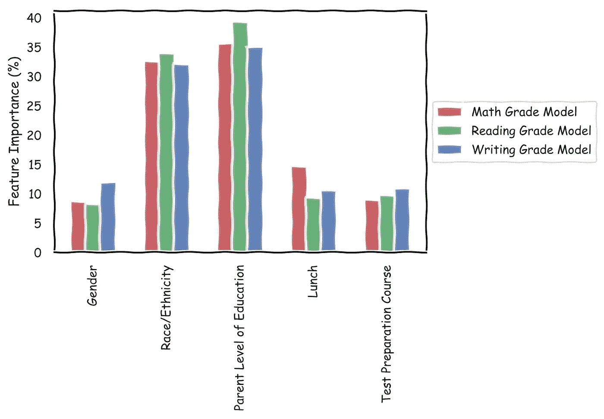

Feature Importance

现在让我们看一个具体的例子。问题是预测美国高中生的数学、阅读和写作成绩。我们得到了[的历史数据](https://www.kaggle.com/spscientist/students-performance-in-exams)，其中包括性别、种族/民族(匿名)、父母教育水平、学生是否吃了标准/免费/补贴午餐以及考试准备程度等特征。给定这些数据，我训练了一个多类随机森林模型[ [源代码](https://github.com/thampiman/interpretability/blob/master/Features.ipynb) ]。

为了解释模型学到了什么，最简单的方法之一是查看相对的特性重要性。特征重要性衡量给定特征对预测结果的影响有多大。从上面的图表中，看起来两个最重要的特征是——父母的教育水平和种族/民族。这是有用的信息，但它没有告诉我们任何关于不同教育水平如何影响成绩以及种族和教育如何相互作用的信息。

回车，**部分依赖图**(PDP)！

PDP 向我们展示了特性对预测结果的边际效应。在 Python 中，您可以使用 [scikit-learn](https://scikit-learn.org/stable/auto_examples/ensemble/plot_partial_dependence.html) 中的实现，它将您限制在梯度推进回归器/分类器。更好的实现是由[江春·李](https://github.com/SauceCat)开发的 [PDPBox](https://github.com/SauceCat/PDPbox/) 。该库受 ICEBox 的启发，ice box 是 R 的 PDP 实现，支持所有 scikit-learn 机器学习模型。您可以按如下方式安装该库。

```
pip install pdpbox
```

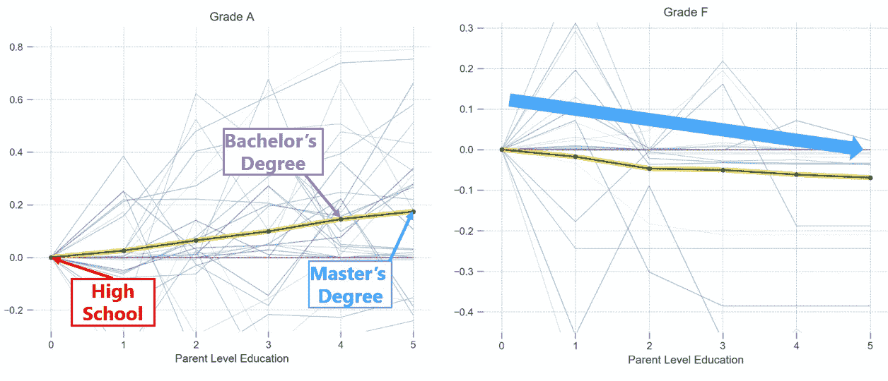

Partial Dependency Plots for Parent Level of Education in predicting Math Grades A and F

现在让我们来看看 PDP 的运行情况。上图显示了不同教育水平对数学成绩 A 和 F 的影响。当你在 x 轴上从左到右，父母的教育水平增加，从高中一直到硕士学位。你会注意到，随着父母教育水平的提高，对预测 A 级的影响也在增加。F 级也有类似的下降趋势，即父母受教育程度越高，对 F 级的预测影响越小。该分析表明，父母受教育程度是一个有效特征。您可以使用下面的代码片段在 Python 中生成上面的图。

```
from pdpbox import pdppdp_parent = pdp.pdp_isolate(model=math_model, dataset=df, model_feature=features, feature='parent')
```

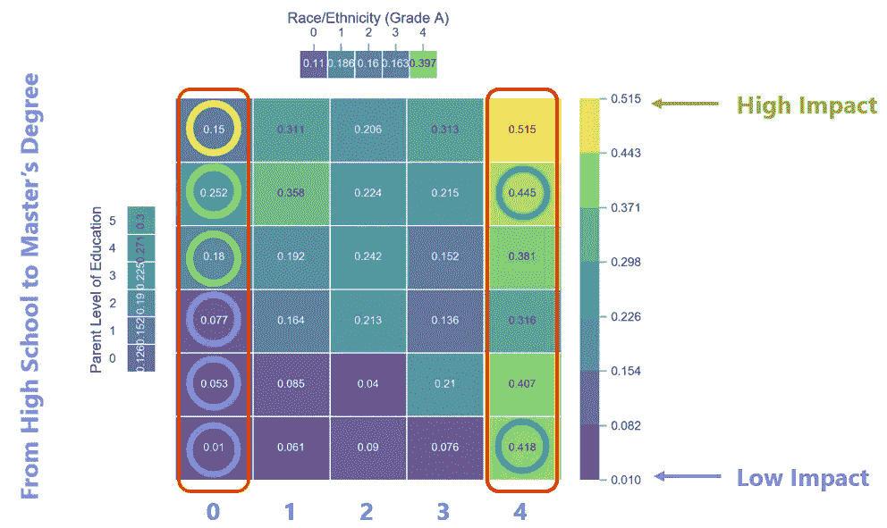

Interaction between Parent Level of Education and Ethnicity in predicting Math Grade A

现在让我们看看预测数学 A 级的特征交互。我在这里挑选了两个最重要的特征。父母的教育水平在 y 轴上，从下到上，教育水平会增加。学生的匿名种族或民族显示在 x 轴上，其中不同的点代表不同的种族-在这项研究中有 5 个不同的群体。请注意热图中的颜色，紫色/蓝色代表预测 A 级的低影响，绿色/黄色代表高影响。

在 0 组上边缘化，你可以看到随着父母教育水平的提高，对预测 A 级的影响也增加。这是有道理的，因为它表明教育水平比种族对成绩的影响更大。因此，该模型很好地学习了这种相关性。但是第五组是怎么回事呢？看起来不管教育水平如何，如果学生属于第 5 组，那么这对于预测 a 级有很大的影响。这在我看来很可疑，它暴露了—

*   可能存在采样偏差的数据问题，
*   模型有问题，和/或
*   社会中的系统性问题

事实证明，这里使用的 Kaggle 数据集是人为的，第 5 组没有得到正确的表示。不管怎样，主要的一点是，仅仅从特性的重要性来看，这些见解都是不可能的。上面的交互图可以用 Python 生成，如下所示。

```
from pdpbox import pdppdp_race_parent = pdp.pdp_interact(model=math_model, dataset=df, model_features=features, features=['race', 'parent'])
```

# 决策树侧边栏


Simple Decision Tree

我想揭穿一个关于决策树的常见误解——它们非常容易解释。让我们再来看一个具体的例子——鸢尾花数据集。问题是基于 4 个特征来预测给定的鸢尾花是刚毛鸢尾、杂色鸢尾还是海滨鸢尾——花瓣长度和宽度，以及萼片长度和宽度。我已经为这个分类任务训练了一个简单的决策树[ [源代码](https://github.com/thampiman/interpretability/blob/master/DecisionTrees.ipynb)，你可以很容易地在 scikit-learn 中可视化训练好的模型，如上所示。当你沿着树的不同分支往下走时，你可以看到特征是如何影响模型的决策的，这对于一个外行来说是非常容易理解的。

现在让我们来看一个稍微有挑战性的问题。一家医院希望使用人工智能系统来早期检测乳腺癌。这是一个模型理解至关重要的例子，因为这是一个生死攸关的情况。在[数据集](https://scikit-learn.org/stable/modules/generated/sklearn.datasets.load_breast_cancer.html)中，我们被赋予了 30 种不同的特征。我再次为这个二元分类任务训练了一个简单的决策树[ [源代码](https://github.com/thampiman/interpretability/blob/master/DecisionTrees.ipynb)。从下面的可视化图中，您可以看到随着特征数量的增加，决策树的复杂性也在增加，并且变得更加难以解释。

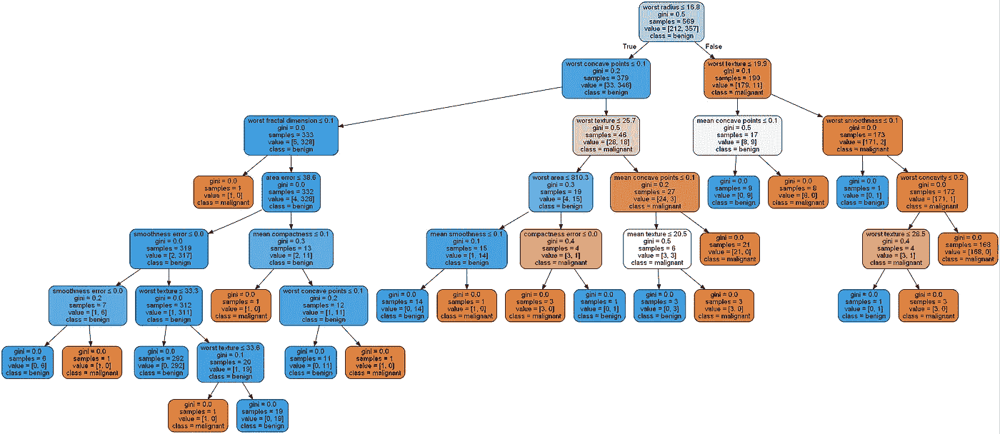

Complex Decision Tree

你可能会说，我们可以通过降维来减少特征空间的大小，这是完全正确的。但是你必须明白，你在这里是有所取舍的——你是在用准确性换取简单性。这可能不是正确的策略，尤其是对于这样一个关键的决定。因此，决策树不是解决可解释性问题的灵丹妙药。

# 事后解释

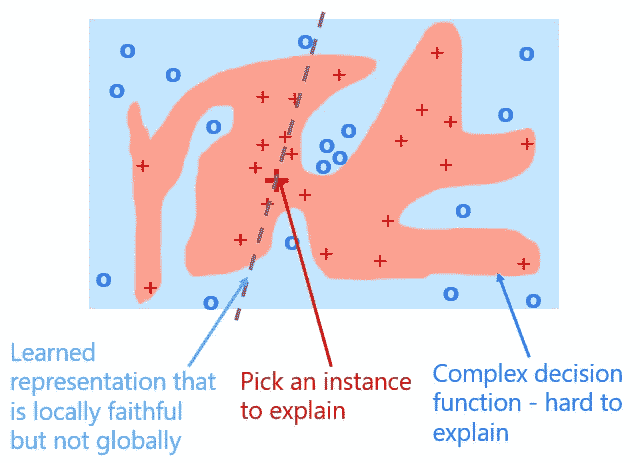

LIME: Local Interpretable Model-agnostic Explanations

让我们回到乳腺癌检测问题。由于准确性对于这样一个关键任务非常重要，如果我们训练一个更复杂的树集合(如随机森林或梯度增强树)甚至一个黑盒神经网络会怎么样？我们如何解释如此复杂的模型？

假设您训练的复杂模型学习了如上所示的决策函数，以将恶性细胞(红色)与良性细胞(蓝色)分开。解释这个复杂模型的一种方法是选择一个您想要解释的实例。然后训练一个简单的线性模型，该模型近似于该实例周围的复杂模型。这意味着我们用更简单的模型来解释一个实例，通过观察它周围的相似案例。因此，习得的表征是局部忠实的，而不是全局忠实的。这种事后解释技术被称为 LIME，它代表局部可解释的模型不可知解释。它是在 2016 年被[提出的，此后获得了大量的人气(截至 2019 年 3 月 5 日，](https://arxiv.org/pdf/1602.04938.pdf) [Github](https://github.com/marcotcr/lime) 上有 5343 位明星)。


Illustration of Surrogate Models

现在让我们换个角度来看一下。我们已经获得了想要分类的不同乳腺癌细胞的数据，在框图中表示为 **x** 。我们正在训练一个模型，它学习一个复杂的函数 **f** 来区分良性病例和恶性病例。然后，我们训练一个简单的线性代理模型 **g** ，它通过近似该点周围的复杂函数来解释一个实例**x’**。由那个更简单的模型学习到的参数就是解释。这在数学上显示如下。

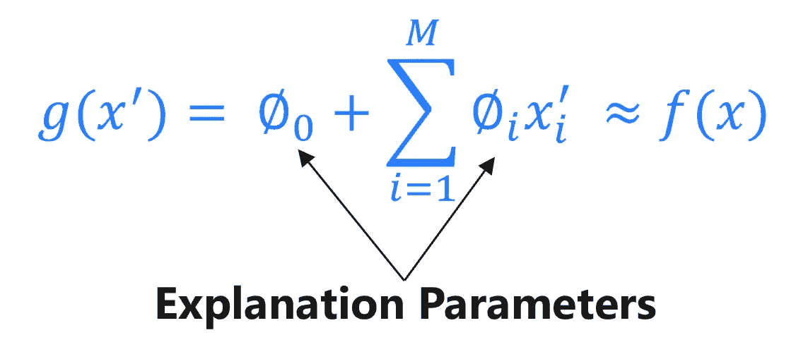

Additive Feature Attribution Method

在上面的等式中，x'_i 是一个二元变量，用于对所选实例周围的实例进行采样，M 表示简化输入要素的数量。因此，LIME 是一种附加的特征归属方法。

Scott M. Lundberg 等人在 NeurIPS 2017 上提出了一个框架[,该框架统一了包括 LIME 在内的各种附加特征归属方法。在本文中，SHAP(代表 SHapley 加法解释)值被用作特征重要性的统一度量。2017 年发布了 SHAP 的 Python 实现，统一了 LIME 和其他技术，如 DeepLIFT 和树解释器。该库自发布以来也越来越受欢迎(截至 2019 年 3 月 3 日，](http://papers.nips.cc/paper/7062-a-unified-approach-to-interpreting-model-predictions) [Github](https://github.com/slundberg/shap/) 上有 3909 颗星星)。您可以按如下方式安装 SHAP。

```
pip install shap
```

现在，对于乳腺癌检测问题，我已经训练了一个随机森林分类器[ [源代码](https://github.com/thampiman/interpretability/blob/master/SHAP_TreeEnsembles.ipynb) ]，在坚持测试集上获得了 100%的平均精度——参见下面的 PR 曲线。

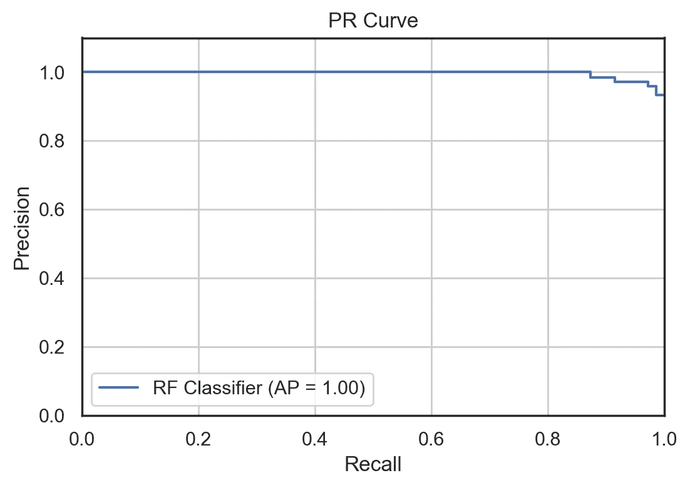

Precision-Recall Curve for Random Forest Breast Cancer Classifier

为了解释这个模型，我选择了一个恶性案例来运行 SHAP 树解释器。该模型预测该病例为恶性的概率为 0.9。该数据集中恶性肿瘤的基本比率为 0.6251。SHAP 提供的解释如下所示——红色代表积极影响，蓝色代表消极影响。您可以看到不同的特征值如何将基本预测推高到 90%的确定性。正面影响最大的要素是-最差面积、最差凹点和平均凹点。

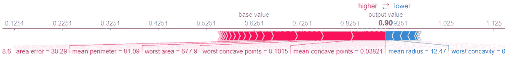

SHAP Explanation for Malignant Case

对于良性情况也可以得到类似的解释。我挑选了一个良性细胞，该模型以 100%的确定性预测了该细胞，即它是恶性的可能性为 0%。从下面的解释可以看出，各种特征值是如何将恶性肿瘤的基本概率从 0.6251 降低到 0 的。负面影响最大的要素是-最差凹点、平均周长和最差半径。这个解释很棒，因为它让我们对模型如何得出最终预测有了更深刻的理解。


SHAP Explanation for Benign Case

上面的解释可以使用下面的代码片段生成——完整的源代码可以在[这里](https://github.com/thampiman/interpretability/blob/master/SHAP_TreeEnsembles.ipynb)找到。

```
import shapshap.initjson();explainer = shap.TreeExplainer(rf_model)
shap_values = explainer.shap_values(X_test)# Explanation for malignant case
shap.force_plot(explainer.expected_value[1], shap_values[1][0,:], X_test.iloc[0,:])# Explanation for benign case
shap.force_plot(explainer.expected_value[1], shap_values[1][1,:], X_test.iloc[1,:])
```

您还可以使用 SHAP 来显示每个要素在预测目标类时的平均影响。这由下面左边的图显示。你可以看到两个最重要的特征是——最差凹点和平均凹点。右边的图显示了这两个特征在预测恶性分类中的相互作用。

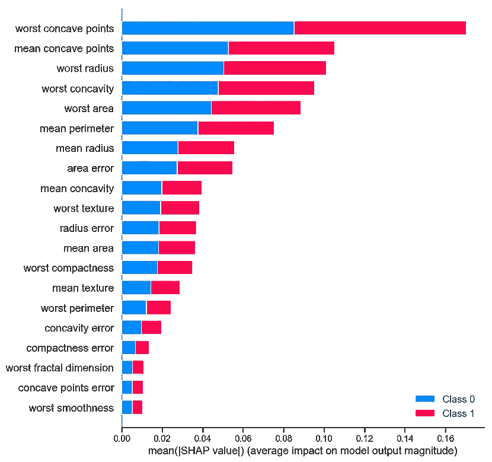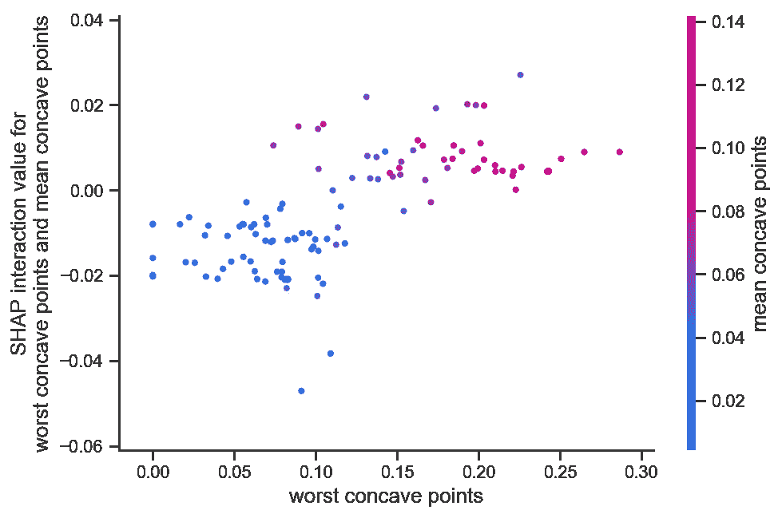

**Left**: SHAP Value Summary Plot for all Features | **Right**: SHAP interaction between the two most important features

SHAP 也可以用来解释黑盒深度学习模型。下面是 SHAP 解释在 MNIST 数据集上训练的卷积神经网络的例子。SHAP 的 DeepLIFT 实现被用来解释这些预测。红色像素表示对预测数字有很大影响。有趣的是，DeepExplainer 模型发现了一些很好的解释——例如，数字 0 的中间是空白的，数字 4 的两条垂直线之间没有连接。在 [SHAP 资料馆](https://github.com/slundberg/shap/tree/master/notebooks)还有更多很酷的例子。

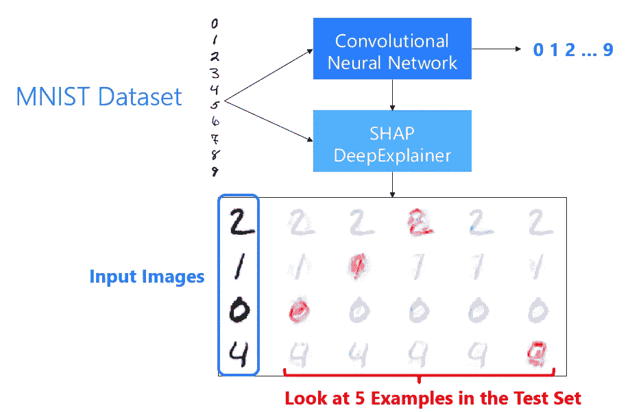

SHAP DeepLift Explainer for Convolutional Neural Networks

# MOAR 工具！

在本文中，我仅仅触及了皮毛，您还可以应用更多的可解释性技术，例如:

*   使用 RNN 语言模型生成文本解释
*   使用显著图来解释模型关注的是什么
*   使用表征学习和定性可视化技术，如 t-SNE

我在这个 [Github 页面](https://github.com/thampiman/interpretability/blob/master/Resources.md)上添加了很多资源供进一步阅读。

# 透明度挑战

我想以一个警告作为结束。在由[艾德里安·韦勒](https://www.turing.ac.uk/people/programme-directors/adrian-weller)撰写的一篇有趣的[论文](https://arxiv.org/pdf/1708.01870.pdf)中，他认为人工智能的透明性应该是达到目标的一种手段，而不是目标本身。韦勒博士利用多智能体博弈论来表明，更高的透明度可能导致对所有人不利的全球结果，并可能使人工智能受到恶意行为者的滥用。不言而喻，人工智能系统必须是安全的，能够抵御恶意攻击。这也是另一个活跃的研究领域，值得单独发表一篇博文！

*感谢您花时间阅读本文。希望你喜欢。*

更新[2020 年 11 月 4 日]:我和 [Manning Publications](https://medium.com/u/bd9671589b55?source=post_page-----e61f9e8ee2c2--------------------------------) 写了一本关于[可解释人工智能](https://www.manning.com/books/interpretable-ai)的书，里面有更多的可解释技术，你可以把它们添加到你的武器库中。