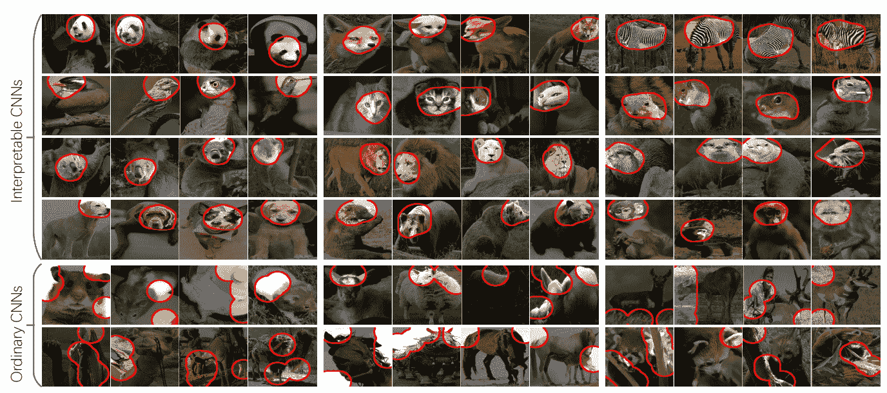

# 可解释卷积神经网络

> 原文：<https://towardsdatascience.com/interpretable-convolutional-neural-network-3f7ef6c9b7ae?source=collection_archive---------13----------------------->

[**这篇论文**](https://arxiv.org/abs/1710.00935) **由美国加州大学洛杉机分校的张全世、吴英年和宋提出了一种将传统的卷积神经网络(CNN)修改为可解释的 CNN 的方法，以阐明 CNN 的高 conv 层中的知识表示。**

Figure 1: Comparison of a filter’s feature maps in an interpretable CNN and those in a traditional CNN

问题:在没有任何额外的人工监督的情况下，我们能修改 CNN 以在其 conv 层获得可解释的知识表示吗？

Bau et al .[【1】](https://arxiv.org/abs/1704.05796)在 CNN 中定义了六种语义，即物体、零件、场景、纹理、材质、颜色。

实际上，我们可以大致将前两种语义认为是**具有特定形状的对象-部分模式**，将后四种语义概括为**没有清晰轮廓的纹理模式。**低 conv 层中的过滤器通常描述简单的纹理，而高 conv 层中的过滤器更可能表示对象部分。

他们的方法是在一个高 conv 层中训练每个滤波器来表示一个对象部分。在传统的 CNN 中，高层过滤器可以描述一个**混合模式**，即过滤器可以被猫的头部和腿部激活(图 1)。高 conv 层中的这种复杂表示大大降低了网络的可解释性。因此，他们的方法 ***迫使*** 可解释 CNN 中的滤波器被某个部分激活。

# 学习更好的表达方式

本文发明了一种通用损失来正则化滤波器的表示，以提高其可解释性。

该损失促使**类别间激活的低熵**和**神经激活的空间分布的低熵**，这意味着迫使 CNN 中层的特征图不被对象的不同区域随机激活，并且具有一致的激活分布。

滤镜必须由对象的单个部分激活，而不是重复出现在不同的对象区域。

他们假设不同区域上的重复形状更倾向于描述低级纹理(例如颜色和边缘)，而不是高级部分。

# 如何做到这一点？

Figure 3

Figure 4

1.  设 I 表示一组训练图像，其中 *I_c ⊂ I* 表示属于类别 *c* 的子集，( *c* = 1，2，.。。，C)。
2.  在 ReLU 操作后，给滤波器 *f* 的特征图 *x* 增加一个损耗
3.  特征图 *x* 是一个 *n × n* 矩阵， *x_ij* ≥ 0。
4.  *f* 对应的对象部分可能出现在不同图像的不同位置，为 *f {T_* *1，…，T_* *n }* 设计 *n* 模板
5.  每个模板 *T_ i* 也是一个 *n × n* 矩阵，它描述了当目标零件主要触发 *x* 中的 *i-th* 单元时，特征图 *x* 的激活的理想分布
6.  *= argmax_[i，j] x_ij*
7.  *x^masked = max{x .* T_，0}*

在他们的代码实现中，实际上他们在特征图中寻找最大值(有 2 种方法，但最简单的是最大值)，然后创建一个类似高斯形状的掩码(如图 3)与特征图具有相同的形状(例如，特征图的大小为 6x6，然后模板掩码的大小为 6x6)，然后与掩码执行元素乘法，并产生一个新的掩码特征图(图 4)。如果特征映射中的最大值为 0，则该模板被视为负模板，这意味着该过滤器不会为该对象激活。

## **注释**

1.要素地图=图层中的过滤器。
2。本文中的训练数据每幅图像只包含一个零件/对象，如果有两个相同的对象，训练可能会失败？或者两个相同的对象可能有一点不同，因此被两个滤波器激活。

# 损失函数

我太年轻了，无法解释这个，只能说说我对损失函数的理解。请阅读原文，了解这些方程的更多细节。

Equation 1: the loss for f as the mutual information between X and T. The prior probability of a template is given as p(Tµ) = α n2 , p(T −) = 1 − α, where α is a constant prior likelihood.

Equation 2: The fitness between a feature map x and a template T is measured as the conditional likelihood p(x|T).

Equation 3: each filter in an interpretable conv-layer receives gradients w.r.t. its feature map x from both the final task loss L(ˆyk, y∗ k) and the local filter loss Lossf

Equation 4: compute gradients of Lossf w.r.t. each element xij of feature map x as follows

Equation 5: rewrite Equation 1, H(T) = − P T ∈T p(T) log p(T) is a constant, which denotes the prior entropy of part templates.

Equation 6: Low inter-category entropy

Equation 7: Low spatial entropy

**TLDR:** 所有这些方程对我来说仍然是清晰的，就我的理解而言，损失函数推动过滤器 *f* 来表示类别 c 的特定对象部分，并对 CNN 中的其他类别的图像和层的特征图保持沉默，以不被对象的不同区域随机激活，并具有一致的激活分布。

# 实验设置

为了简单起见，VGG

**三个基准数据集:**因为他们需要物体地标(部分)的地面实况注释来评估每个过滤器的语义清晰度，所以他们选择了三个带有地标/部分注释的基准数据集来进行训练和测试，包括 ILSVRC 2013 DET 动物部分数据集、cub 200–2011 数据集和 Pascal VOC 部分数据库。

# 实验结果

他们在**零件可解释性**和**位置稳定性**上取得了较好的成绩。普通 CNN 在单类别分类中表现更好。然而，对于多类别分类，**可解释 CNN 表现出比普通 CNN**更好的性能。在多类别分类中的良好表现可能是因为早期阶段的过滤器语义的澄清降低了后期阶段过滤器学习的难度。更多结果，请阅读原文。

The top four rows visualize filters in interpretable CNNs, and the bottom two rows correspond to filters in ordinary CNNs. They found that interpretable CNNs usually encoded head patterns of animals in its top conv-layer for classification.

与普通 CNN 相比，可解释 CNN 具有更一致和更容易理解的激活。我们可以**确认**顶部 conv 层中的特定滤镜代表特定动物的头部图案。

# 结论

*   提出了一种通用的方法来修改传统的细胞神经网络，以增强其可解释性
*   损失被设计成将高 conv 层中的过滤器推向对象部分的表示，而没有用于监督的附加注释
*   与传统的 CNN 相比，可解释的 CNN 在高 conv 层编码了更多语义上有意义的知识。

**参考**

代号:[https://github.com/zqs1022/interpretableCNN](https://github.com/zqs1022/interpretableCNN)

论文:[张全世，吴英年，宋，“可解释卷积神经网络”，2018](https://arxiv.org/abs/1710.00935)