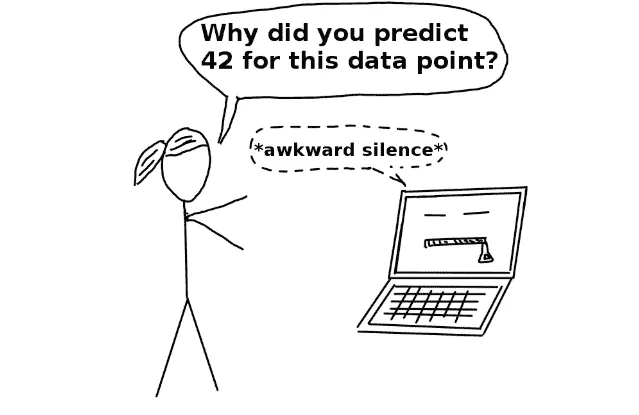
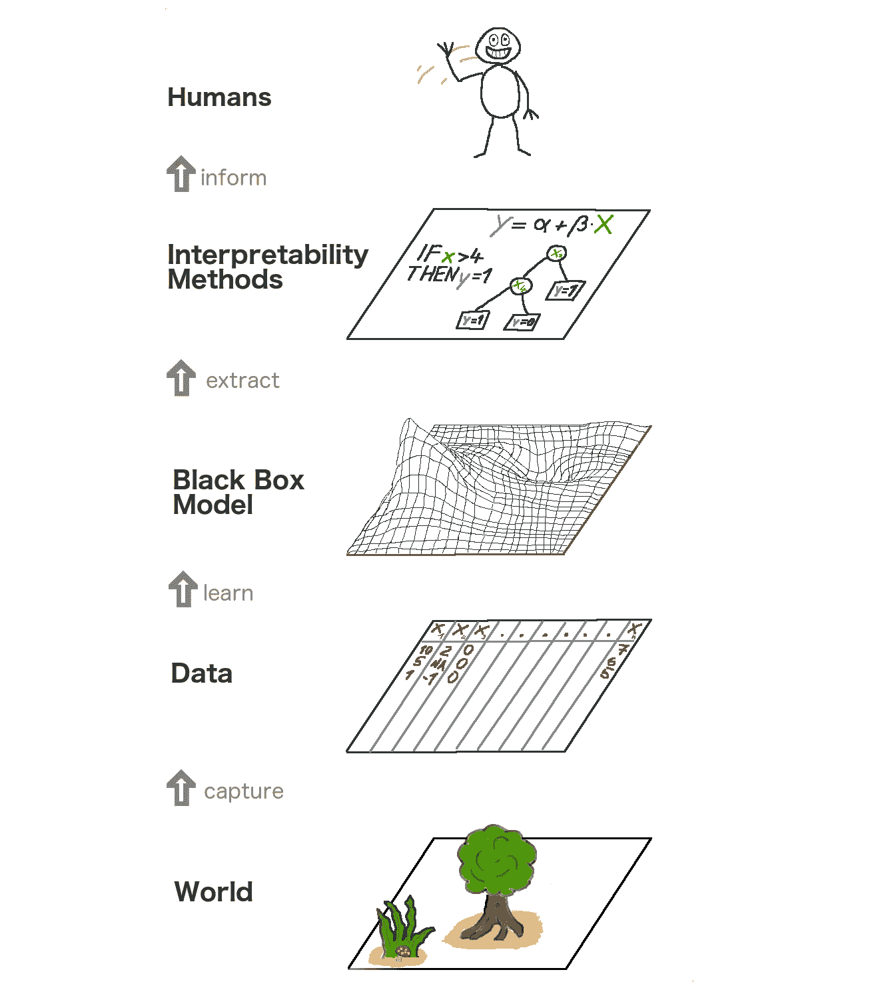
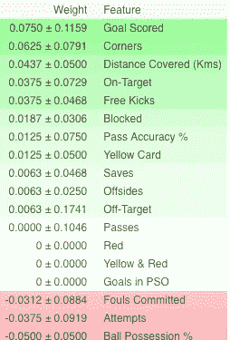
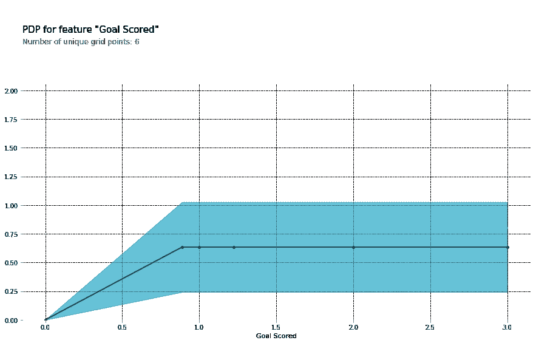
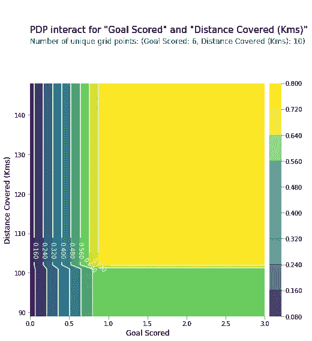
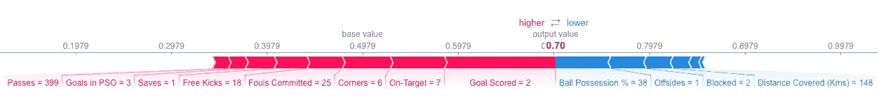
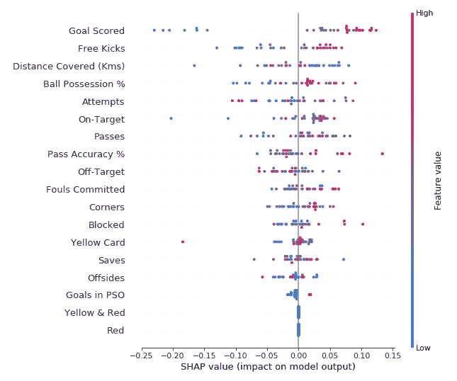
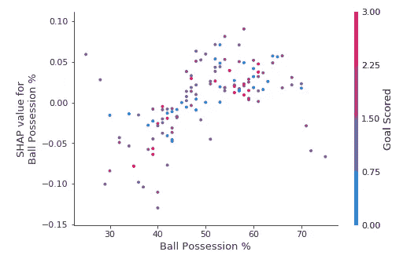
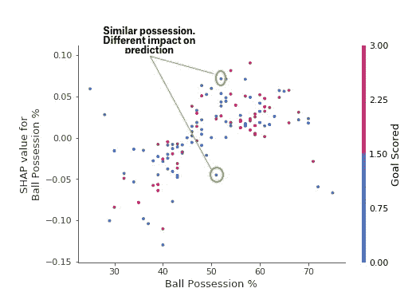
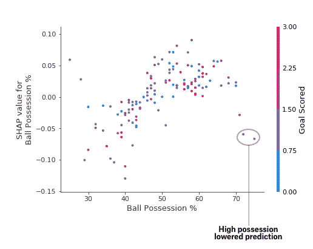

# 可解释的机器学习

> 原文：<https://towardsdatascience.com/interpretable-machine-learning-1dec0f2f3e6b?source=collection_archive---------1----------------------->

## 从任何机器学习模型中提取人类可理解的见解


Photo by [Pixabay](https://www.pexels.com/@pixabay?utm_content=attributionCopyText&utm_medium=referral&utm_source=pexels) from [Pexels](https://www.pexels.com/photo/arrows-box-business-chalk-533189/?utm_content=attributionCopyText&utm_medium=referral&utm_source=pexels)

> 是时候摆脱黑箱，培养对机器学习的信任了

在他的书' [*可解释的机器学习*](https://christophm.github.io/interpretable-ml-book/) '中， *Christoph Molnar* 通过这个例子很好地概括了 ML 可解释性的本质:假设你是一名数据科学家，在你的空闲时间里，你试图根据你的脸书和推特数据预测你的朋友夏天会去哪里度假。现在，如果预言被证明是准确的，你的朋友可能会留下深刻印象，并认为你是一个能预见未来的魔术师。如果预测是错误的，它仍然不会给任何人带来伤害，除了你作为“数据科学家”的名声。现在，让我们说这不是一个有趣的项目，有投资参与。比方说，你想投资你的朋友可能去度假的房产。如果模型的预测出错，会发生什么？你会赔钱的。只要模型没有重大影响，它的可解释性就没那么重要，但当基于模型的预测有影响时，无论是金融还是社会影响，可解释性就变得重要了。

# 可解释的机器学习

解释的意思是用可理解的术语解释或陈述。在人工智能系统的背景下，可解释性是用可理解的术语解释或呈现给人类的能力



[Source: interpretable-ml-book](https://christophm.github.io/interpretable-ml-book/terminology.html)

机器学习模型被许多人贴上了“黑箱”的标签。这意味着，尽管我们可以从中获得准确的预测，但我们无法清楚地解释或识别这些预测背后的逻辑。但是我们如何从模型中提取重要的见解呢？要记住什么，我们需要什么特性或工具来实现它？当提出**模型可解释性**的问题时，这些是浮现在脑海中的重要问题。

## 可解释性的重要性

一些人经常问的问题是，为什么我们不仅仅满足于模型的结果，为什么我们如此执着于了解为什么会做出一个特定的决定？这很大程度上与模型在现实世界中可能产生的影响有关。因为仅仅是用来推荐电影的模型远不如那些用来预测药物效果的模型有影响力。

> 问题在于，单一指标(如分类准确率)无法完整描述大多数现实任务([多希-维勒兹和金 2017](https://arxiv.org/abs/1702.08608) )

这是一个可解释的机器学习的大图。在某种程度上，我们通过收集原始数据来捕捉世界，并使用这些数据来进行进一步的预测。本质上，可解释性只是模型的另一层，帮助人类理解过程。



[The big picture of explainable machine learning.](https://christophm.github.io/interpretable-ml-book/agnostic.html)

可解释性带来的一些[好处是:](https://www.kaggle.com/dansbecker/use-cases-for-model-insights)

*   **可靠性**
*   **调试**
*   **通知特征工程**
*   **指导未来的数据收集**
*   **通知人类决策**
*   **建立信任**

# 模型解释技术

理论只有在我们能付诸实践时才有意义。如果你想真正掌握这个话题，你可以试试 Kaggle 的**机器学习可解释性速成班。它有适当数量的理论和代码来将概念放入透视图中，并帮助将模型可解释性概念应用到实际的、真实世界的问题中。**

点击下方截图，直接进入课程页面。如果你想先对内容有一个简要的概述，你可以继续往下读。

[](https://www.kaggle.com/learn/machine-learning-explainability)

## 可以从模型中提取的见解

为了解释模型，我们需要以下见解:

*   模型中的特性是最重要的。
*   对于模型中的任何单个预测，数据中的每个特征对该特定预测的影响。
*   每个特征对大量可能预测的影响

让我们讨论一些有助于从模型中提取上述见解的技术:

## 1.排列重要性

一个模特认为什么特征是重要的？哪些功能可能比其他功能对模型预测的影响更大？这个概念被称为特征重要性，而**排列重要性**是一种广泛用于计算特征重要性的技术。这有助于我们看到我们的模型何时产生违反直觉的结果，也有助于向其他人展示我们的模型何时如我们所愿地工作。

排列重要性适用于许多 scikit-learn 估计器。这个想法很简单:随机置换或打乱验证数据集中的单个列，而保持所有其他列不变。如果模型的精度下降很多并导致误差增加，则特征被认为是“重要的”。另一方面，如果改变一个特征的值不会影响模型的准确性，那么这个特征就被认为是“不重要的”。

**工作**

考虑一个基于某些参数预测足球队是否会有“**足球先生**”赢家的模型。表现最好的玩家被授予这个称号。

排列重要性是在模型拟合后计算的。因此，让我们在训练数据上训练并拟合一个 **RandomForestClassifier** 模型，表示为 **my_model** 。

> 使用 **ELI5 库**计算排列重要性。 [**ELI5**](https://github.com/TeamHG-Memex/eli5) 是一个 Python 库，允许使用统一的 API 可视化和调试各种机器学习模型。它内置了对几种 ML 框架的支持，并提供了一种解释黑盒模型的方法。

**使用 eli5 库计算和显示重要性:**

(此处`val_X,val_y`分别表示验证集)

```
import eli5
from eli5.sklearn import PermutationImportanceperm = PermutationImportance(my_model, random_state=1).fit(val_X, val_y)
eli5.show_weights(perm, feature_names = val_X.columns.tolist())
```



**释义**

*   顶部的特性最重要，底部的最不重要。对于这个例子，进球得分是最重要的特征。
*   后面的数字表示从一次重组到下一次重组的绩效变化。
*   有些权重是负数。这是因为在那些情况下，对混洗数据的预测被发现比真实数据更准确。

**练习**

现在，为了获得完整的示例并测试您的理解，请点击下面的链接进入 Kaggle 页面:

[](https://www.kaggle.com/dansbecker/permutation-importance)

## 2.[部分相关图](https://www.kaggle.com/dansbecker/partial-plots)

部分相关性图(短 PDP 或 PD 图)显示了一个或两个特征对机器学习模型的预测结果的边际效应( [J. H. Friedman 2001](https://statweb.stanford.edu/~jhf/ftp/trebst.pdf) )。PDP 显示一个特性如何影响预测。PDP 可以通过 1D 或 2D 图显示目标和所选特征之间的关系。

**工作**

PDPs 也是在模型拟合后计算的。在我们上面讨论的足球问题中，有许多特征，如传球、射门、进球等。我们从考虑单行开始。假设这一行代表一支 50%时间有球、传球 100 次、射门 10 次、进球 1 次的球队。

我们继续拟合我们的模型，并计算一个球队有一名球员赢得“最佳球员”的概率，这是我们的目标变量。接下来，我们将选择一个变量并不断改变它的值。例如，如果球队进了 1 个球、2 个球、3 个球等等，我们将计算结果。所有这些值都被绘制出来，我们得到了一个预测结果与得分的图表。

> 用于绘制 PDP 的库被称为 **python 部分依赖绘图工具箱**或简称为 [**PDPbox** 。](https://pdpbox.readthedocs.io/en/latest/)

```
from matplotlib import pyplot as plt
from pdpbox import pdp, get_dataset, info_plots*# Create the data that we will plot*
pdp_goals = pdp.pdp_isolate(model=my_model, dataset=val_X, model_features=feature_names, feature='Goal Scored')*# plot it*
pdp.pdp_plot(pdp_goals, 'Goal Scored')
plt.show()
```



**解读**

*   Y 轴表示预测值相对于基线值或最左侧值的变化。
*   蓝色区域表示置信区间
*   对于“进球得分”图表，我们观察到进球得分增加了获得“本场最佳”奖的可能性，但过了一会儿就饱和了。

我们也可以使用 2D 部分图同时显示两个特征的部分相关性。



**练习**

[](https://www.kaggle.com/dansbecker/partial-plots)

## 3.SHAP 价值观

SHAP 代表着**Shapley****A**additive ex**P**解释有助于分解预测，以显示每个特征的影响。它基于 Shapley 值，这是一种在博弈论中使用的技术，用于确定合作游戏中的每个玩家对其成功做出了多少贡献。通常情况下，在准确性和可解释性之间取得平衡可能是一个困难的平衡行为，但 SHAP 价值观可以同时实现这两者。

**工作**

再一次，以足球为例，我们想要预测一个球队有一名球员赢得“比赛最佳球员”的概率。SHAP 值解释了给定特征具有某个值与如果该特征具有某个基线值时我们所做的预测相比的影响。

> SHAP 值是使用 [Shap](https://github.com/slundberg/shap) 库计算的，该库可以很容易地从 PyPI 或 conda 安装。

Shap 值显示给定特征改变我们预测的程度(与我们在该特征的某个基线值进行预测相比)。假设我们想知道当球队进了 3 个球而不是某个固定的基线数字时，预测是什么。如果我们能够回答这个问题，我们可以对其他特征执行相同的步骤，如下所示:

```
sum(SHAP values for all features) = pred_for_team - pred_for_baseline_values
```

因此，预测可以分解成如下图:



*Here is a* [*link*](https://i.imgur.com/JVD2U7k.png) *for a larger view*

**释义**

上面的解释显示了将模型输出从基础值(我们传递的训练数据集的平均模型输出)推送到模型输出的每个功能。将预测值推高的要素显示为红色，将预测值推低的要素显示为蓝色

*   这里的 base_value 是 0.4979，而我们的预测值是 0.7。
*   `Goal Scored` = 2 对增加预测的影响最大，而
*   `ball possession`该特征在降低预测方面具有最大的效果。

**练习**

SHAP 价值观有比我在这里解释的更深层次的理论。请务必通过下面的链接获得完整的理解。

[](https://www.kaggle.com/dansbecker/shap-values)

## 4.SHAP 价值观的高级应用

聚合许多 SHAP 值可以提供对模型更详细的了解。

*   **SHAP 概要剧情**

为了了解哪些特征对模型最重要，我们可以绘制每个样本的每个特征的 SHAP 值。汇总图显示了哪些要素最重要，以及它们对数据集的影响范围。



Summary Plot

对于每个点:

*   垂直位置显示了它所描绘的特征
*   颜色显示该特征对于数据集的该行是高还是低
*   水平位置显示该值的影响是否会导致更高或更低的预测。

左上角的点是一支进球很少的球队，将预测值降低了 0.25。

*   **SHAP 依赖贡献图**

SHAP 汇总图给出了每个特征的总体概述，而 SHAP 依赖图显示了模型输出如何随特征值而变化。SHAP 依赖贡献图为 PDP 提供了类似的见解，但它们添加了更多的细节。



Dependence Contribution plots

上面的依赖贡献图表明，有球增加了球队让他们的球员赢得奖项的机会。但是如果他们只进了一个球，这种趋势就会逆转，裁判可能会因为他们得了那么多球而处罚他们。

## 实践

[](https://www.kaggle.com/dansbecker/advanced-uses-of-shap-values)

# 结论

机器学习不必再是黑匣子了。如果我们不能向他人解释结果，那么好的模型有什么用呢？可解释性和创建模型一样重要。为了在人群中获得更广泛的接受，机器学习系统能够为他们的决定提供令人满意的解释是至关重要的。正如阿尔伯特·爱因斯坦所说，“**如果你不能简单地解释**它，**你就**理解得不够好”。

## 参考资料:

[*可解释的机器学习:使黑盒模型可解释的指南。克里斯托夫·莫尔纳尔*](http://Christoph Molnar)

*机器学习可解释性微课:Kaggle*