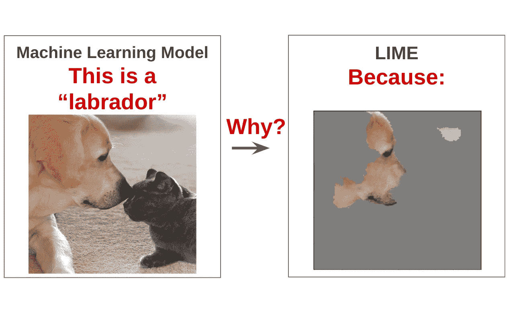
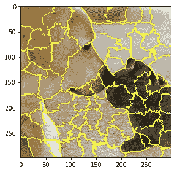
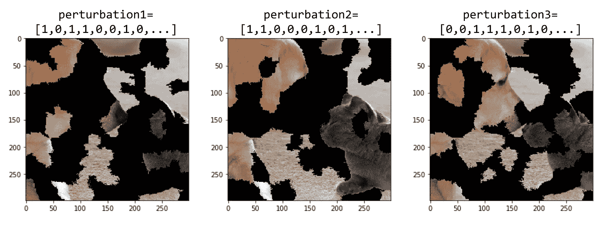
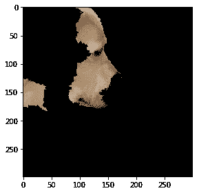

# 基于石灰的可解释机器学习图像分类

> 原文：<https://towardsdatascience.com/interpretable-machine-learning-for-image-classification-with-lime-ea947e82ca13?source=collection_archive---------9----------------------->

## 通过理解机器学习模型的预测来增强对它的信心。

在自动驾驶汽车和医疗诊断等关键应用中使用机器学习的趋势日益增长，这表明迫切需要有助于理解和评估机器学习模型预测的方法。局部可解释模型不可知解释(LIME)[1]是一种解释机器学习模型的输入特征如何影响其预测的技术。例如，对于图像分类任务，LIME 找到与预测标签关联最强的图像区域(超像素集)。这篇文章用 Python 代码一步一步地介绍了 LIME 在图像分类中的内部工作原理。

让我们首先读取一个图像，并使用 Keras 中可用的预训练的 InceptionV3 模型来预测此类图像的类别。

该脚本将输入图像加载到变量`Xi`中，并打印图像的前 5 个类别(和概率),如下所示:

*   拉布拉多寻回犬(82.2%)
*   金毛寻回犬(1.5%)
*   美国斯塔福德郡梗(0.9%)
*   公牛獒(0.8%)
*   大丹犬(0.7%)

有了这些信息、输入图像和预训练的 InceptionV3 模型，我们可以继续用 LIME 生成解释。在这个例子中，我们将为类**拉布拉多猎犬**生成解释。

# 石灰解释

LIME 通过围绕被解释的实例生成新的随机扰动数据集(及其各自的预测),然后拟合加权局部代理模型来创建解释。该局部模型通常是具有内在可解释性的更简单的模型，例如线性回归模型。关于石灰背后的基础知识的更多细节，我推荐你查看[这篇简短的教程](https://nbviewer.jupyter.org/urls/arteagac.github.io/blog/lime.ipynb)。对于图像分类的情况，LIME 通过以下步骤生成解释:

# 步骤 1:为输入图像生成随机扰动

对于图像，LIME 通过打开和关闭图像中的一些超像素来产生扰动。以下脚本使用快速移动分割算法来计算图像中的超像素。此外，它生成 150 个扰动的阵列，其中每个扰动是具有 0 和 1 的向量，表示超像素是开还是关。

计算完图像中的超像素后，我们得到:

以下是扰动向量和扰动图像的示例:

# 步骤 2:预测扰动的类别

下面的脚本使用`inceptionV3_model`来预测每个扰动图像的类别。`predictions`的形状是`(150,1000)`，这意味着对于 150 幅图像中的每一幅，我们得到属于 InceptionV3 中的 1000 个类别的概率。在这 1000 个类中，我们将在后续步骤中仅使用 Labrador 类，因为它是我们想要解释的预测。在这个例子中，使用了 150 次扰动。然而，对于实际应用，更多的扰动将产生更可靠的解释。

现在我们有了一切来拟合一个线性模型，使用`perturbations`作为输入特征`X`，拉布拉多的预测`predictions[labrador]`作为输出`y`。然而，在我们拟合线性模型之前，LIME 需要给与被解释图像更接近的图像更多的权重(重要性)。

# 步骤 3:计算扰动的权重(重要性)

我们使用距离度量来评估每个扰动离原始图像有多远。原始图像只是所有超像素活动(所有元素合二为一)的扰动。假设扰动是多维向量，余弦距离是可用于此目的的度量。计算余弦距离后，使用核函数将该距离转换为 0 和 1 之间的值(权重)。在这个过程的最后，我们对数据集中的每个扰动都有一个权重(重要性)。

# 第四步:使用`perturbations`、`predictions`和`weights`拟合一个可解释的线性模型

我们使用前面步骤中获得的信息拟合加权线性模型。我们为图像中的每个超像素获得一个系数，该系数表示超像素在拉布拉多预测中的影响有多强。

我们只需要对这些系数进行排序，就可以确定对于拉布拉多的预测，哪些是最重要的超像素(`top_features`)。尽管这里我们使用了系数的大小来确定最重要的特征，但是诸如向前或向后消除之类的其他选择也可以用于特征重要性选择。计算顶部超像素后，我们得到:

这是石灰返回的解释。与“拉布拉多猎犬”的预测有更强关联的图像区域(超像素)。这种解释表明，预训练的 InceptionV3 模型在预测给定图像的拉布拉多类方面做得很好。这个例子显示了 LIME 如何通过理解它为什么返回某些预测来帮助增加机器学习模型的信心。

一个 **Jupyter 笔记本**里面有本帖**使用的所有 Python 代码可以在这里****找到。你可以通过在 Google Colab 中打开笔记本[来轻松测试对你自己图像的解释。](https://colab.research.google.com/github/arteagac/arteagac.github.io/blob/master/blog/lime_image.ipynb)**

****参考文献****

**[1]里贝罗、马尔科·图利奥、萨梅尔·辛格和卡洛斯·盖斯特林。[“我为什么要相信你？:解释任何分类器的预测。](https://dl.acm.org/citation.cfm?Id=2939778) (2016)第 22 届美国计算机学会会议录。ACM。**