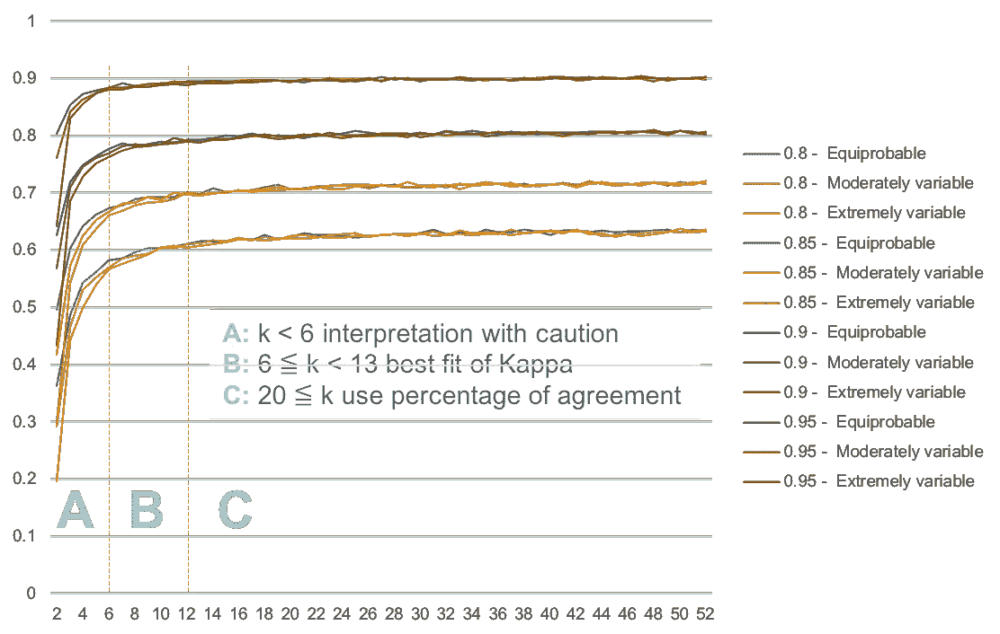

# Kappa 值的解释

> 原文：<https://towardsdatascience.com/interpretation-of-kappa-values-2acd1ca7b18f?source=collection_archive---------3----------------------->

## 评估与条件的一致程度

kappa 统计经常被用来检验评分者之间的可靠性。评分者可靠性的重要性在于它代表了研究中收集的数据在多大程度上正确地代表了被测变量。衡量数据收集者(评分者)对同一变量赋予相同分数的程度称为评分者间信度。1960 年，雅各布·科恩批评了百分比协议的使用，因为它无法解释偶然协议。他介绍了科恩的 kappa，这是为了说明评级者由于不确定性而实际上猜测至少一些变量的可能性而开发的。卡伯值解释的范围如下:

> 卡帕值解读兰迪斯&科赫(1977):
> < 0 无协议
> 0 — .20 轻微
> .21 — .40 一般
> .41 — .60 中等
> .61 — .80 实质
> . 81—1.0 完美

然而，过去的研究表明，多种因素对 Kappa 值有影响:观察者的准确性，代码在集合中的数量，特定代码的流行程度，观察者的偏见，观察者的独立性(Bakeman & Quera，2011)。因此，对 kappa 的解释，包括什么是好的 Kappa 的定义，应该考虑到具体情况。

# 模拟

为了更好地理解 Cohen Kappa 系数的条件解释，我采用了 Bakeman 等人(1997)提出的 Cohen Kappa 系数的计算方法。这些计算作出了简化的假设，即两个观察者都是同样准确和无偏见的，代码以同样的准确性被检测到，不一致是同样可能的，并且当患病率变化时，它以均匀分级的概率变化(Bakeman & Quera，2011)。

## 设置

最大编码数:52
观测器数:2
观测器精度范围:0.8、0.85、0.9、0.95
编码流行度:等概率、中等变化、高度变化

Settings of parameters in the simulation

# 调查的结果

在 612 个模拟结果中，245 个(40%)达到了完美水平，336 个(55%)达到了基本水平，27 个(4%)达到了中等水平，3 个(1%)达到了一般水平，1 个(0%)达到了轻微水平。对于每个观察者准确度(. 80，. 85，. 90，. 95)，每个流行水平有 51 个模拟。

## 观察者准确度

**观测者准确度越高，总体一致性水平越好。**在各种观察者准确度下，各患病率水平的一致水平的比率。一致性水平主要取决于观察者的准确性，其次是代码的流行程度。“完美”的一致只出现在观察者准确度为 0.90 和 0.95 时，而所有类别都达到大多数的基本一致或以上。

Kappa and Agreement Level of Cohen’s Kappa Coefficient

**观测者精度影响最大 Kappa 值。**如仿真结果所示，从 12 个代码开始以及向前，Kappa 值似乎分别达到大约 0.60%、0.70%、0.80%和 0.90%的准确度。

Cohen’s Kappa Coefficient vs Number of codes

## 观察中的代码数

**增加编码数导致 Kappa 增量逐渐变小。**当编码数小于 5 时，特别是当 K = 2 时，较低的 Kappa 值是可以接受的，但也需要考虑患病率的可变性。仅对于两个代码，来自准确度为. 95 的观察者的最高 kappa 值为. 80，来自准确度为. 80 的观察者的最低 kappa 值为. 02。

**编码的数量越大，复原力 Kappa 值就越趋向于观察者的准确度差异。**当观测者精度之间的差距变大时，Kappa 值减小

## 个人代码的流行程度

**患病率越高，总体一致程度越低。**患病率越高，认同水平越低。在观察者精度水平为 0 . 90 时，对于等概率、中等变化和极端变化，分别有 33、32 和 29 个完全一致。

Standard Deviation of Kappa Value vs Number of codes

随着代码数量的增加，代码流行度的影响不大。当编码数为 6 或更高时，患病率可变性无关紧要，从精确度为. 80、. 85、. 90 和. 85 的观察者获得的 kappa 值的标准偏差小于 0.01。

# 建议

Recommendation of interpreting Kappa along with the number of codes

影响 kappa 值的因素包括观察者准确性和编码数量，以及编码的个体人群流行率和观察者偏差。只有当观察者平均分配代码时，Kappa 才能等于 1。kappa 没有一个价值观可以被视为普遍接受；这取决于观察者的准确度和代码的数量。

对于较少数量的代码(K < 5)，特别是在二进制分类中，Kappa 值需要格外小心地解释。在二元分类中，患病率变异性对 Kappa 值的影响最大，并导致不同观察者准确性与患病率变异性组合的 Kappa 值相同。

另一方面，当多于 12 个代码时，预期 Kappa 值的增量变得平坦。因此，简单地计算同意的百分比可能已经达到了衡量同意程度的目的。此外，性能度量单元的值从灵敏度的增量也从多于 12 个码达到渐近线。

如果 Kappa 值被用作观察者训练的参考，使用 6 到 12 之间的代码数将有助于更准确的性能评估。因为 Kappa 值和性能度量对性能改进足够敏感，并且受代码流行的影响较小。

# 参考

阿尤布和埃尔加马尔(2018)。利用 Twitter 数据识别和解决运行时业务流程中断。在*计算机科学讲义(包括人工智能子系列讲义和生物信息学讲义)*中。https://doi.org/10.1007/978-3-030-02610-3_11

Bakeman，r .，& Quera，V. (2011 年)。*行为科学的顺序分析和观察方法*。*行为科学的顺序分析和观察方法*。[https://doi.org/10.1017/CBO9781139017343](https://doi.org/10.1017/CBO9781139017343)

麦克休博士(2012 年)。评分者间可靠性:测量评分者间可靠性的 kappa 统计重要性。*生化医学*， *22* (3)，276–282。

Nichols，T. R .，Wisner，P. M .，Cripe，g .，& Gulabchand，L. (2011 年)。将卡帕统计数据用于托马斯。*质量保证期刊*，57–61。[https://doi.org/10.1002/qaj](https://doi.org/10.1002/qaj)

W.朱，倪正和倪伟(2010)。灵敏度，特异性，准确性，相关的置信区间和 ROC 分析与实际 SAS。*NESUG 保健和生命科学会议录*，1–9。