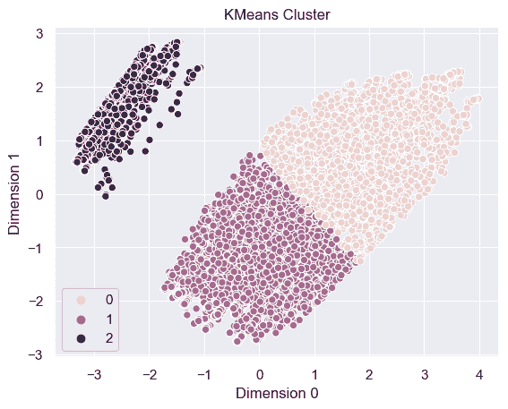
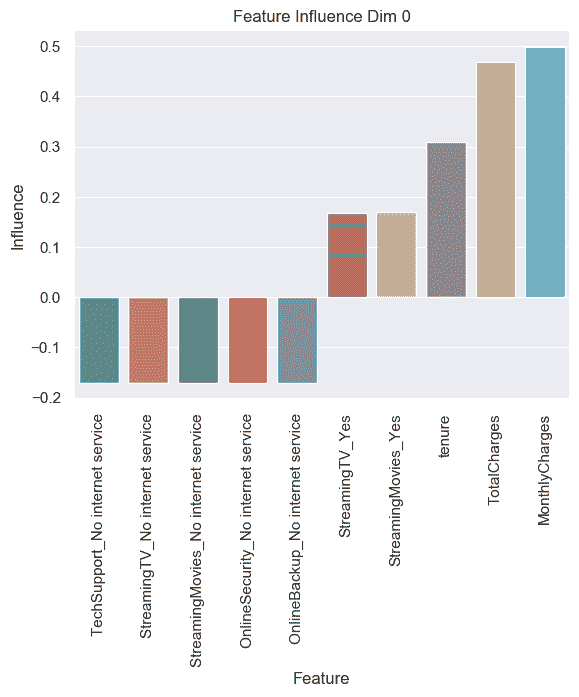
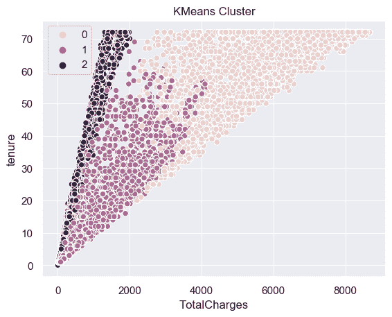
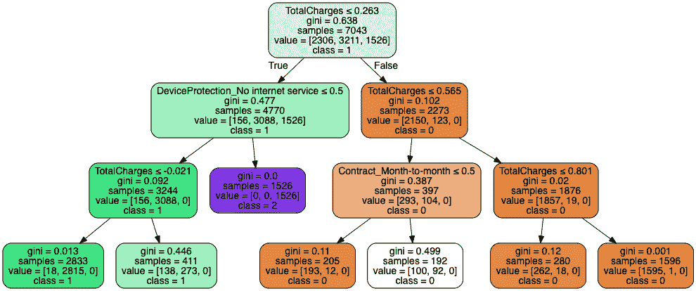
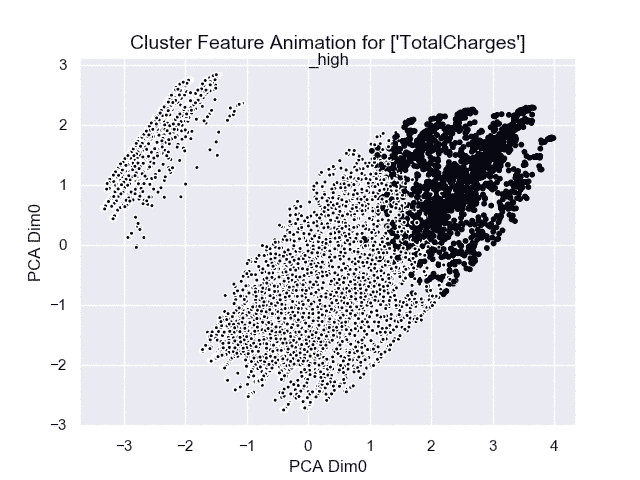
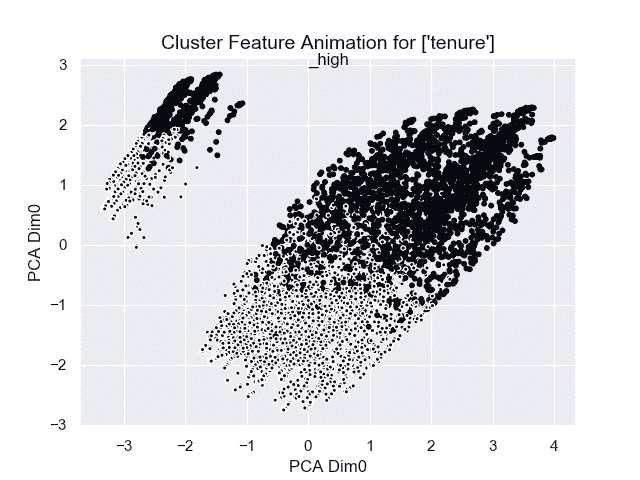
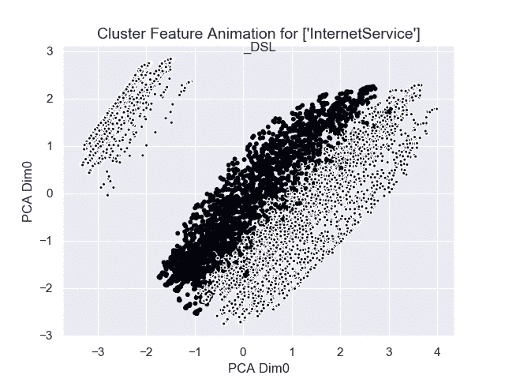
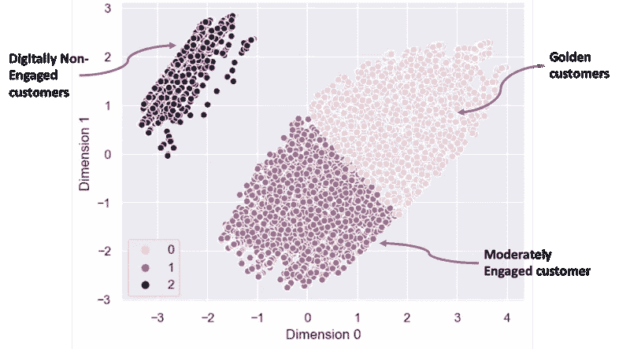

# 解读集群——数据科学和直觉的结合

> 原文：<https://towardsdatascience.com/interpreting-clusters-29975099eea1?source=collection_archive---------9----------------------->

## 形成集群是容易的，解释是困难的

这样你就有了漂亮的集群。现在怎么办？这些集群意味着什么？理解集群的意义可能比创建集群更重要。制造聚类的过程更多地是面向数学的，然而解释聚类是数学和直觉的混合。让我们在这里探索理解和解释集群的不同方式

让我们看一个电信数据集，它显示了关于客户的各种数据，例如

*   客户人口统计数据，如性别、年龄、是否为老年人、合作伙伴、受抚养人、位置等..
*   账单和合同数据，如月费、总费用、无纸化账单、合同期限等..
*   服务使用数据，如电话服务、互联网服务、在线安全等。

这里显示了数据的快照

Snapshot of telecommunication data

让我们假设聚类的目标是更好地了解客户。有了这个目标，我们可以说我们已经完成了三组工作。

三个集群的可视化如下所示。可视化的二维表示 PCA(主成分分析)的输出。电信数据集大约有 30 列。然而，为了可视化的目的，这 30 个维度已经被压缩为 2 个维度，而没有失去使用 PCA 的数据的本质

散点图上的每个点代表一个客户，颜色显示它属于哪个分类

Nice looking clusters

正如你将观察到的那样，这些集群结构良好。它们看起来漂亮整洁。但是它们是什么意思呢？除非我们提取这三组的意义，否则美丽的观想仍然只是观想练习。这里有一些方法来提取聚类的含义

# 1.在最多变的维度上观想——与众不同，脱颖而出！

这里的直觉是，为了给一个集群赋予意义，你必须看到它与其他集群有多么不同。了解一个集群与其邻居有何不同的有效方法是关注变化最大的维度或列。获得变化最大的列的一种方法是获取 PCA 的结果。PCA 有效地保留变化最大的维度，并压缩变化最小的维度。

PCA 的输出之一，称为特征影响，给出变化最大的列(或也称为特征)。该输出如下图所示。如您所见，总费用和任期在顶部变化的列中。

PCA Feature influence

因此，总费用和任期可用于区分不同的集群。总费用与任期的散点图如下所示。点的颜色表示聚类。我们看到这些集群可以相互区分，并且没有太多的重叠。这意味着总电荷和任期可以帮助区分集群和提取集群的意义。

Cluster visualisation based on tenure and TotalCharges

有了这种形象化，我们可以如下描述集群

第 0 类—总费用高、任期长的客户

第 1 类—总费用低到中等、租期低到中等的客户。

第 2 类—总费用较低的客户(以及所有租赁期)。

# 2 —机器学习来确定聚类的意义—让机器去做

现在让我们超越降维，进入另一个维度。(双关语)…。机器学习。这里的直觉是将聚类(0，1，2)视为目标类，将列视为输入要素。这有效地将确定聚类的含义的问题转化为分类问题。然后，我们可以尝试使用机器学习算法进行分类，以便“机器学习”输入(数据列或特征)和输出(聚类)之间的关系。然后解释输入和输出之间的这种机器学习的关系将使我们深入了解聚类的意义

我们可以使用多种机器学习算法。然而，因为我们的目的是解释机器学习的输入和输出之间的关系，所以最好选择可解释的算法。决策树是高度可解释性的机器学习算法之一。所以让我们在这里使用它。这里显示了决策树

Decision tree to understand meaning of cluster

从决策树中，我们看到区分集群的最重要的特征是总费用和无 *_* 互联网服务。基于决策树，我们可以将集群解释如下

集群 0 —总费用高的客户

第 1 类—总费用低到中等，但有互联网服务的客户

第 2 类—总费用低到中等，但没有互联网服务的客户

# 3 —动画—解释集群的创新方式

上述两种方法告诉我们，聚类有多种解释。有多个“顶部”列是定义集群的良好候选。其中一些列是总费用，任期，互联网服务。因此，如何选择最佳的列来帮助我们更好地了解集群。为了回答这个问题，让我们拿出几把大枪——动画

当眼前发生变化时，人类会更好地理解。原因是任何发生在人类眼前的变化都会激活大脑神经元。

对于数据，动画可以帮助更好地理解数据中发生的任何变化。这比静态观想更有效。在我们的例子中，让我们看看动画是如何帮助我们更好地理解集群的含义的。

在下面的动画中，您将看到如前所示的散点图。然而，我们现在根据不同的列来制作动画。

第一部基于 TotalCharges 的动画。当动画开始时，所有总费用高的客户都以黑色突出显示。随着动画的进行，这些点会根据总电荷的低值高亮显示

Cluster Animation based on Total Charges

下面的第二个动画是基于任期。

Cluster Animation for Tenure

第三部动画基于 InternetService。这部动画很有趣。如您所见，左侧的群集(群集 2)完全突出显示，表示没有互联网服务。

Cluster Animation based on Internet Service

这些动画帮助我们更好地理解集群的含义。我们观察到没有互联网服务的客户清楚地定义了集群 2

我们现在可以根据所有的方法得出结论，一个好的解释可能是遵循聚类意义

第 0 类—总费用高的客户(互联网服务总是如此)

第 1 类—总费用低到中等，但有互联网服务的客户

第 2 类—没有互联网服务的客户

除了描述之外，给集群起一个简短而有意义的名字也是有用的。例如，我们可以有以下简称

集群 0 —黄金客户

群组 1 —适度参与的客户

第 2 类—数字化非参与型客户

起这样的名字也有助于有效地制定营销策略。其中一个策略是将适度参与的客户转化为黄金客户

朋友们，这就是我们所看到的，群集解释的结果，如下图所示

Result of cluster interpretation

在这个故事中，你已经看到了如何解释一个集群。掌握这些方法将有助于您更好地理解聚类的结果。这将使你能够采取更好的行动，例如瞄准客户，设计营销活动，或者只是与利益相关者进行有效的沟通

# 额外资源

# 网站(全球资讯网的主机站)

你可以访问我的网站进行零编码分析。[https://experiencedatascience.com](https://experiencedatascience.com)

请**订阅**每当我发布一个新的故事时，请及时通知我。

 [## 每当 Pranay Dave 发表文章时，您都会收到电子邮件。

### 每当 Pranay Dave 发表文章时，您都会收到电子邮件。通过注册，您将创建一个中型帐户，如果您还没有…

pranay-dave9.medium.com](https://pranay-dave9.medium.com/subscribe) 

你也可以通过我的推荐链接加入 Medium。

 [## 通过我的推荐链接加入 Medium—Pranay Dave

### 作为一个媒体会员，你的会员费的一部分会给你阅读的作家，你可以完全接触到每一个故事…

pranay-dave9.medium.com](https://pranay-dave9.medium.com/membership) 

https://www.youtube.com/c/DataScienceDemonstrated 的 YouTube 频道
这里是我的 Youtube 频道
[的链接](https://www.youtube.com/c/DataScienceDemonstrated)