# 使用 Python Matplotlib 通过可视化解释数据

> 原文：<https://towardsdatascience.com/interpreting-data-through-visualization-with-python-matplotlib-ef795b411900?source=collection_archive---------9----------------------->

## IBM 数据可视化课程教会了我什么？

Matplotlib 虽然已经老化，但仍然是数据可视化最重要的工具之一，这篇文章是关于有效地使用 matplotlib，从数据集中获取知识。大约一个月前，我开始参加 [IBM 数据科学专业证书](https://www.coursera.org/specializations/ibm-data-science-professional-certificate)课程，我发现[数据可视化](https://www.coursera.org/learn/python-for-data-visualization)课程是 9 门课程的一部分，这篇文章是我在课程中学到的一些强有力的技术的预演，以更好地阐明数据。这里展示了一些有用的绘图技术和从数据中得出的新推论，这些在本课程中并没有用到。你会在我的 GitHub 上找到详细的代码，我在那里分享了 Jupyter 笔记本。比起代码，我会更关注情节，有时会分享一些代码片段。

[数据集](https://ibm.box.com/shared/static/lw190pt9zpy5bd1ptyg2aw15awomz9pu.xlsx)处理 1980 年至 2013 年间来自不同国家的加拿大移民。

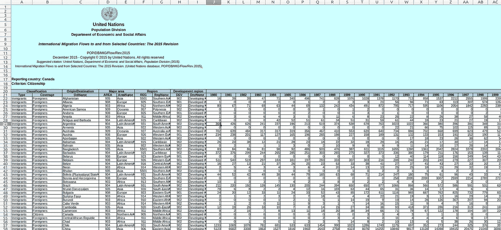

Canada Immigration Data in .xlsx format.

因为数据集是在。xlsx 格式，文件中有 3 张纸，下面是笔记本的一部分，指导您如何将此文件读入数据框

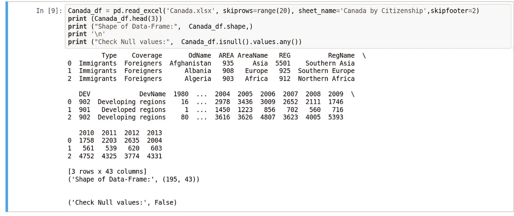

`skiprows`用于处理 excel 表中最初无用的行。为了更好地理解，最好将该列(使用`[pandas.DataFrame.rename](https://pandas.pydata.org/pandas-docs/stable/reference/api/pandas.DataFrame.rename.html)`)‘OdName’和‘AreaName’分别重命名为‘Country _ Name’和‘continentals’，`inplace=True`确保更改保存在数据框中。如果您不想在原始数据帧中进行这种更改，您应该使用`inplace=False`。

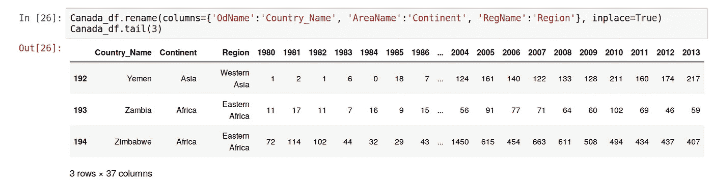

## 条形图:DataFrame.plot(kind='bar ')

一旦我们设置好并做了一些调整，让我们使用 [pandas DataFrame.plot](https://pandas.pydata.org/pandas-docs/stable/reference/api/pandas.DataFrame.plot.html) 绘图，首先我们将尝试一些条形图。如果我们绘制这些年来自海地的移民数量，我们可以看到在 2009 年，2010 年，2011 年移民数量惊人的增长趋势。

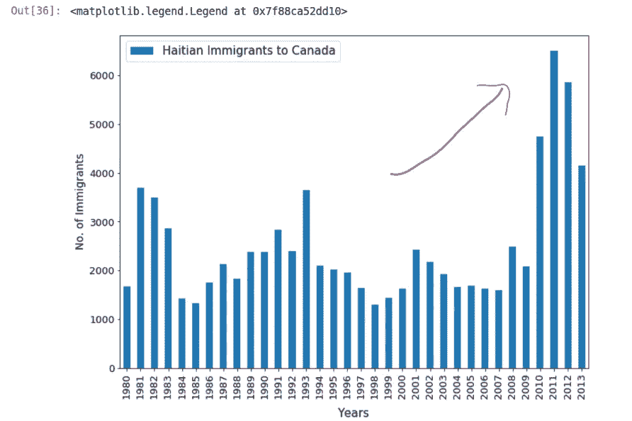

Figure 1: Rising number of Haitian Immigrants near 2011.

有些人可能已经猜对了，由于 2010 年灾难性的海地地震，2011 年移民数量急剧增加。让我们用牛逼的注解来做一个清晰的表示

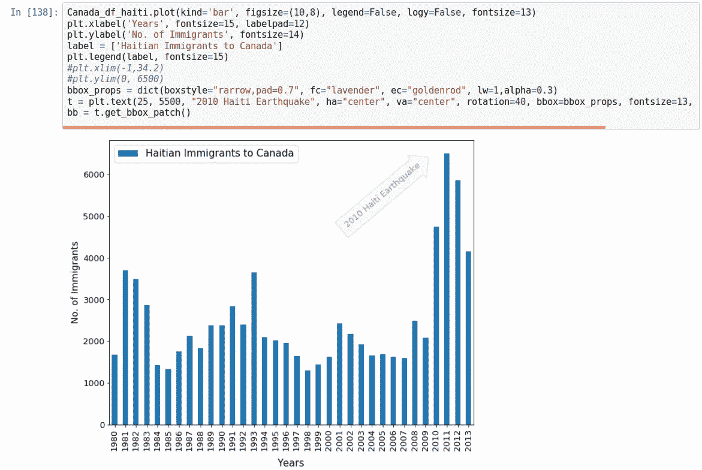

Figure 2: Cool annotation added to Figure 1 to have a more purposeful plot.

随着[冰岛金融危机](https://en.wikipedia.org/wiki/2008%E2%80%932011_Icelandic_financial_crisis) (2008 年至 2011 年)导致严重的经济衰退，来自冰岛的移民数量也呈现出非常相似的趋势。

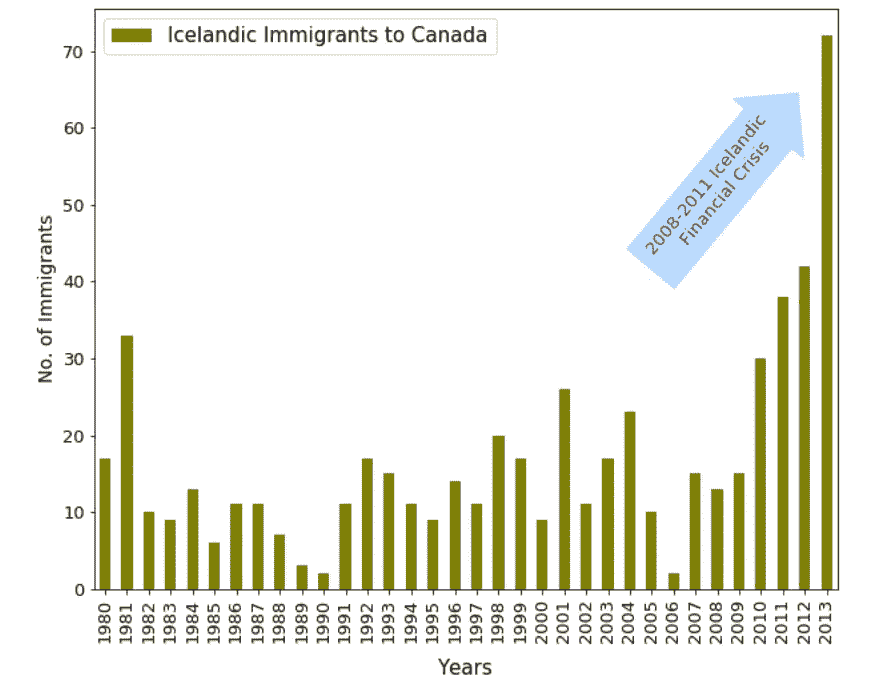

Figure 3: Economic crisis in Iceland caused a severe increase in number of immigrants to Canada.

我们可以使用条形图继续查看不同国家的趋势，但是，让我们探索另一种可视化数据的方法，使用饼图。

## 饼图:DataFrame.plot(kind='pie ')

饼图是一种圆形图形，圆形图中的切片代表数字比例。在这里，我们可以使用饼图看到来自不同大陆的移民的数字比例在 20 年(1985 年和 2005 年)内如何变化。然而，有效的代表性是一个问题。让我们看看下面的代码和相应的情节

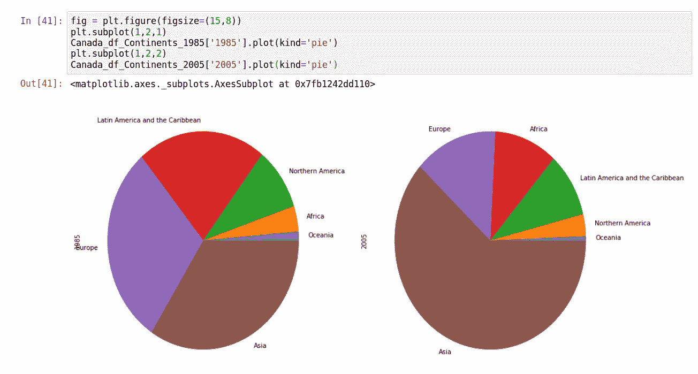

Figure 4: Pie plots of Immigrants from different continents in the year 1985 and 2005 are shown in left and right panel respectively.

正如你所看到的，这些饼状图在视觉上并不令人满意，即使我们对 20 年间来自不同大洲的移民的百分比变化有了一个粗略的了解，但这仍然不是很清楚。不过，使用正确的关键字可以让饼状图变得更好。

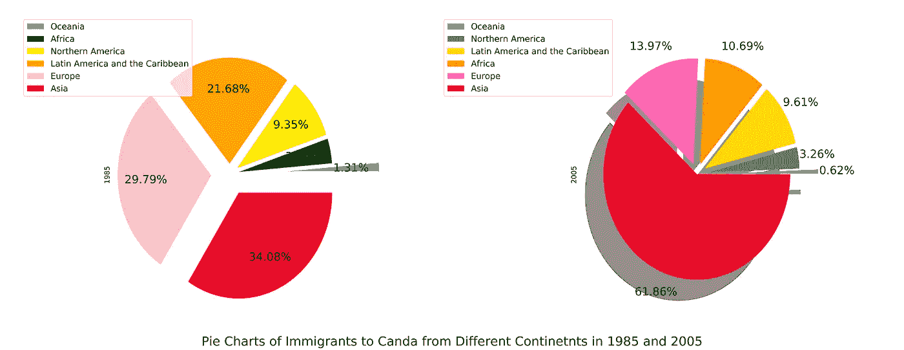

Figure 5: Same as figure 4 but this one is just too visually esthetic compared to the previous one. In right panel `shadow is added.`

下面给出了用于绘制上述饼状图的代码片段

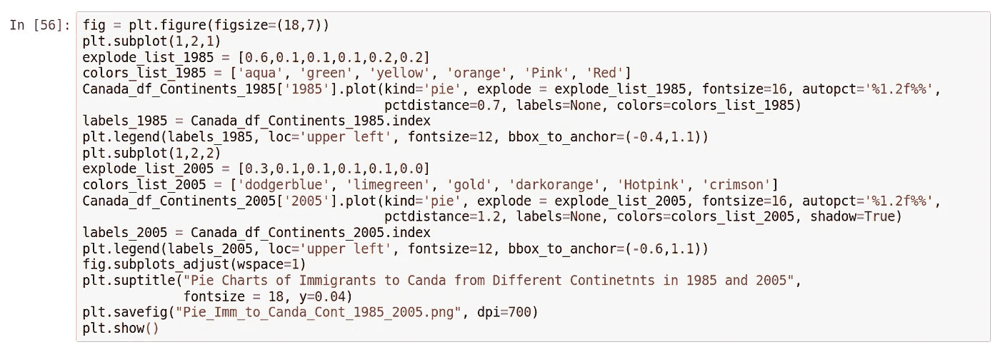

我学到的几个重要关键字是`autopct`和`pctdistance`，它们确保百分比显示到小数点后两位(1.3f 将显示最多小数点后三位的浮点数)，并固定文本与圆心的距离。为了制作一个包含子情节的标题，我使用了`[matplotlib.pyplot.suptitle](https://matplotlib.org/api/pyplot_api.html#matplotlib.pyplot.suptitle)`。

从上面的图表中你可以看到，1985 年很大一部分移民来自欧洲，相比之下，20 年后的 2005 年则完全由亚洲人主导。实际上，早期的移民大多来自不列颠群岛，后来印度和中国接管了这个地方。

## 气泡图:

*气泡图*基本上是美化的散点图，其中*三维数据可以显示在 2D 图*中。除了通常的 X 和 Y，气泡(或任何其他标记)的大小代表另一个维度(读取特征)。

为了查看此类图表的示例，我选择了 1980 年至 2013 年间印度和中国的移民信息。我们看到在 1997-1998 年间，这一数字有所上升，这可能是由于亚洲金融危机。下面来看看

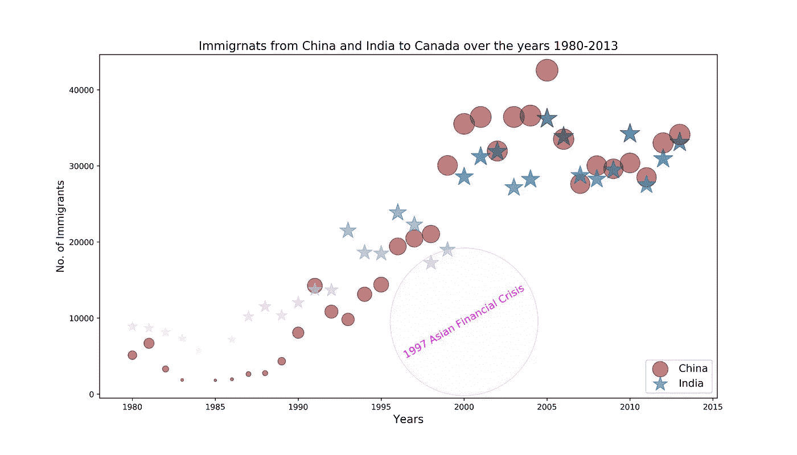

Figure 6: Bubble plots of Immigrants from China and India to Canada over the years 1980 to 2013.

如果你注意到星形标记(代表来自印度的移民),它们会变大，颜色会随着时间从紫色变成蓝色。让我们看看下面的代码片段，以了解标记的大小和颜色到底代表了什么

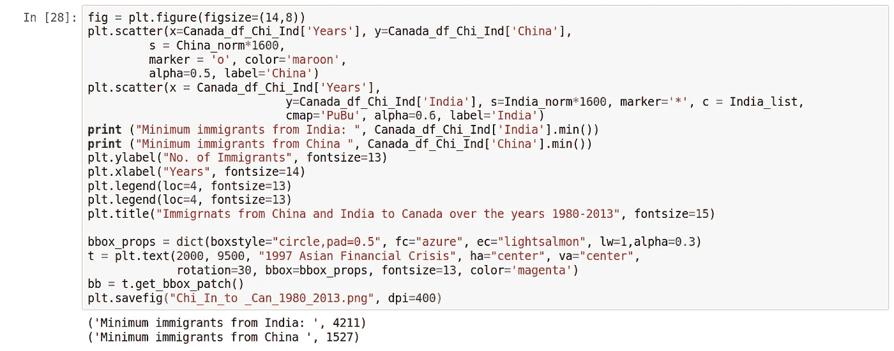

在`plt.scatter` *中，s* 和 *c* 代表标记的大小和颜色。特别是对于这个代表印度移民的图，我利用了这两个参数。这里 *s* 是这些年来移民的标准化值(乘以 2000，以便标记大小足够大),而 *c、cmap* 仅代表移民的原始数量。因此，蓝色代表移民人数较多，而紫色则相反。

## 世界地图:叶子。地图()

课程中一个非常吸引人的部分是使用[叶子](https://pypi.org/project/folium/)库，它有助于创建几种类型的交互式传单地图。我们将看到使用相同的移民数据集，如何在世界地图上很好地表现一些关键信息。首先，我们开始安装叶。

```
pip install Folium 
print folium.__version__ # check the version >> 0.7.0
```

我们感兴趣的一种特殊的地图叫做 [Choropleth](https://en.wikipedia.org/wiki/Choropleth_map) 。这是一种专题地图，其中地图的一部分根据所使用的统计变量的比例进行着色/图案化。在这里，我将画出从 1985 年到 2005 年世界各地移民数量的变化。我们以前见过的大陆饼状图，可以用来补充这张 Choropleth 图。

现在，要创建 Choropleth 地图，我们需要一个. json 文件，其中包含所有国家的边界坐标，这个文件是由 IBM 提供的，您可以从我的 GitHub 中获得。据此，我使用下面的代码片段绘制了一张 1985 年全世界移民的 choropleth 地图。这张地图是交互式的，所以你可以放大或缩小，但这里我只展示一张截图

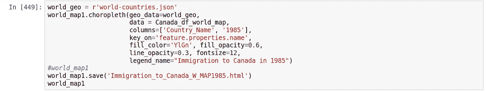

在上面的代码中，`key_on`与。json 文件，对于`data`，我们感兴趣的数据帧被传递。

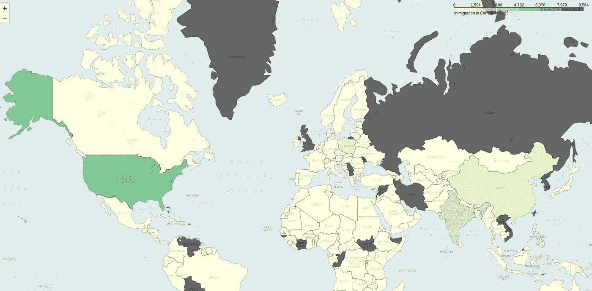

Figure 7: Immigration to Canada in the year 1985 from all over the world

按照同样的程序，我们创建了另一个 Choropleth 地图，代表 2005 年来自世界各地的加拿大移民，你可以清楚地看到不同之处。

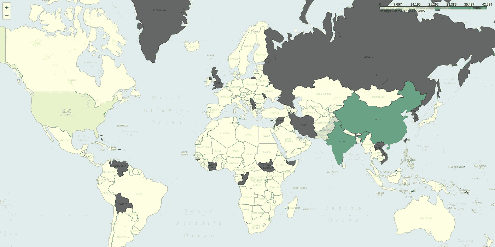

Figure 8: Same as Figure 7 but now data from year 2005 is used to plot immigration to Canada.

你可以在上面的图表中看到的一个大的缺点是，英国的颜色从 1985 年到 2005 年没有变化，即使我们从数据框中知道在 20 世纪 80 年代移民的数量相当高。问题是，在数据框中，国名是“大不列颠及北爱尔兰联合王国”，而在。json 文件它只是英国。因此，您可以使用“国家/地区名称”列中熊猫数据框内的替换选项—

```
Canada_df_world_map.Country_Name = Canada_df_world_map.Country_Name.replace({"United Kingdom of Great Britain and Northern Ireland": "United Kingdom"})
Canada_df_world_map.tail(20)
```

这是一个粗略的替换，因为“英国”和“GRB +北爱尔兰”是不一样的，但我们可以用图来验证我们的理解，让我们看看下面。

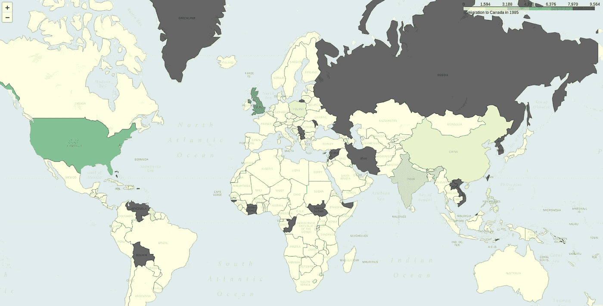

Figure 9: Same as figure 7 but now the United Kingdom part is corrected.

好了，终于到了结束这篇文章的时候了，因为它越来越长，但我希望你对有效的数据可视化有一个很好的了解，即*如何用一个漂亮的演示来讲述故事。*这篇文章涵盖了我在 IBM Coursera 提供的数据可视化课程中学到的大部分基本技术。仅仅回顾一下它有多好，我不得不说实验室是课程中最有效和最有成果的部分，在那里人们可以直接使用课程中教授的所有技术。有时，课程材料包含一些印刷错误，但这些错误会慢慢得到解决。学习绘制华夫饼图表也很棒，但是，我把它留给专门学习这门课程的学生。总的来说，这次经历很有趣，特别是对于在一周内复习一些基础知识来说，这是一个很棒的课程！

通过我的 [GitHub](https://github.com/suvoooo/Data_Visualization_IBM_Practice_Coursera/tree/Description) 中的完整 Jupyter 笔记本，包括此处使用的数据集，了解更多信息。

在 [LinkedIn](https://www.linkedin.com/in/saptashwa/) 上找到我，有时我会在[国家地理](https://yourshot.nationalgeographic.com/profile/166014/)上发布很酷的照片。