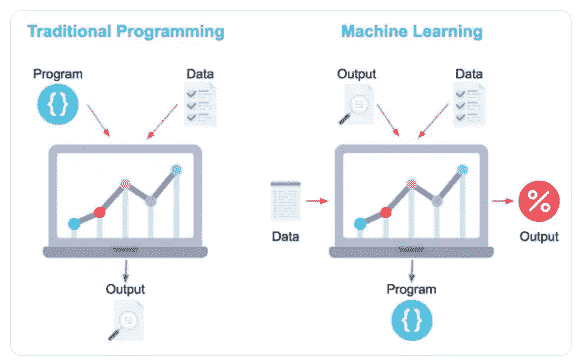
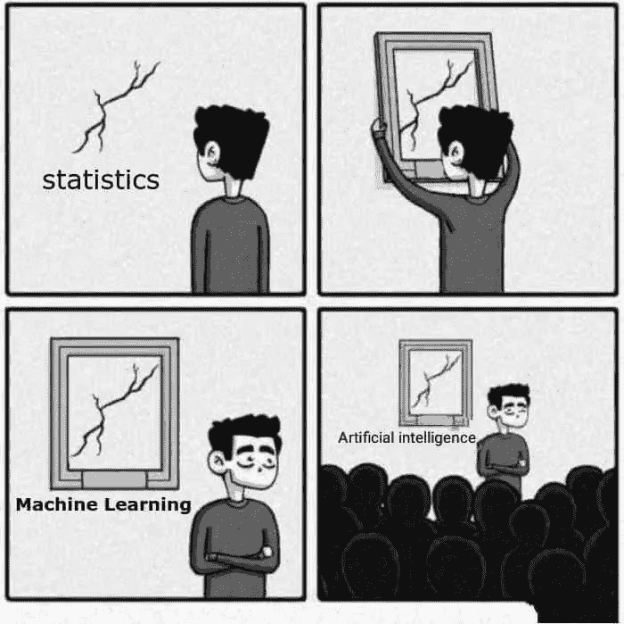
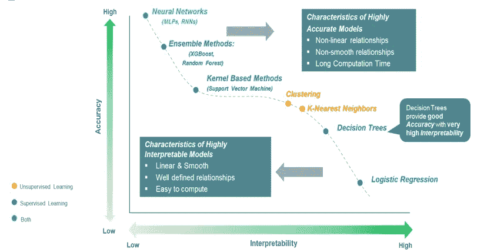
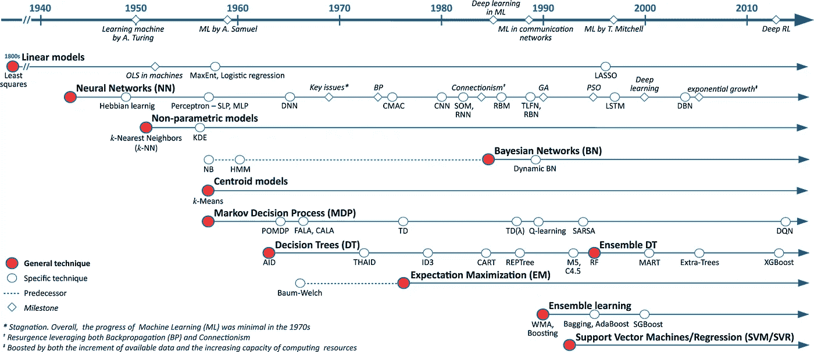
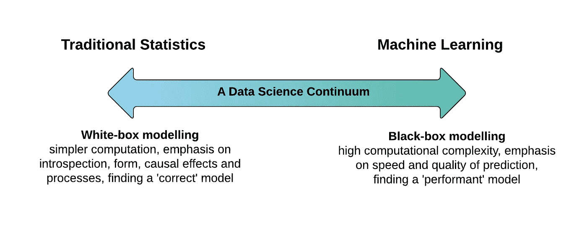

# 解释机器学习模型

> 原文：<https://towardsdatascience.com/interpreting-machine-learning-model-70fa49d20af1?source=collection_archive---------24----------------------->

## 第 1 部分—简介

在这一系列的 6 篇文章中，我们将把预测的基础放在一边，看看数据科学和机器学习的更手工的方面，例如解释、获得洞察力和理解算法中发生的事情。这不是一件小事，还远远没有穷尽。在这一系列的帖子中，我们将从最简单的统计模型开始，以及我们如何模拟最复杂的集成和深度学习模型，试图找出预测的原因。

对这一系列内容的初步建议如下:

[Part 0—什么是数据科学的范围](https://medium.com/swlh/data-science-and-the-data-scientist-db200aac4ea0) **Part 1 —解读 ML 简介(本帖)** [Part 2 —解读高偏倚低方差模型。](/statistical-modeling-the-full-pragmatic-guide-7aeb56e38b36) 第 3 部分——解读低偏差和高方差模型。
第 4 部分——有可能解决偏倚和方差之间的权衡吗？
第 5 部分——可解释性的本地方法。
[第 6 部分——可解释性的全局方法。](https://medium.com/@marcos.silva0/the-ultimate-guide-using-game-theory-to-interpret-machine-learning-c384cbb6929?sk=8817fb3b75f2da2030cee7a699c8854b)

# 我们在说什么？

要理解如何解读机器学习算法，我们先来理解什么是机器学习算法。

一般来说，对于我们来说，机器学习算法(以下简称 ML)是从“传统编程”到新概念的范式转变，在传统编程中，我们需要显式地传递所有启发，而不是编写算法必须执行的每个动作，我们只是通过几个例子，让 ML 学习什么是“最佳”(最低成本)决策。



Figure 1 — Paradigm shift from traditional programming to Machine Learning

也就是说，对于我们来说，接收输入并可以转换输出而无需显式编程的算法将是 ML 算法。解释 ML 算法就是理解它们如何将输入转化为输出。

# 理解预测有多重要？

如果 ML 只是一种以(有时)非常聪明的方式将输入映射到输出的方式，那么理解它是如何做到这一点似乎是一个好主意，对吗？

一个例子:银行欺诈检测算法。
我们绘制一个行为，收集数据，训练一个模型，你就大功告成了！我们有一个非常聪明的方法来检测未来的欺诈行为。现在呢？这个算法在做什么？如果仅仅出于好奇去理解它不再有意义，这里有一些更实际的原因:


Figure 2 — Nature -> Data -> ML -> Predictions

*   这位客户做了什么会被认为是欺诈者？
*   他犯了什么样的欺诈罪？
*   我的算法有偏差吗？
*   我的算法有没有漏洞？
*   如果客户想知道为什么他们的购买被拒绝，我会说是我不懂的算法吗？
*   经理是否想了解模型欺诈者的行为是如何随着时间的推移而变化的？
*   如果我们不是简单地预测，而是对修复安全漏洞以防范未来的欺诈感兴趣，我如何知道哪个杠杆是正确的？

即使在这个非常简单的例子中，我们已经确定了几个理解算法内部工作的好理由。

如果你仍然不相信它的重要性，从欧洲开始有一个非常强大的趋势，公司已经被迫解释做出决定的原因，如拒绝信贷、保险、职位空缺等。很有道理，所以用不了多久，这就会成为使用预测模型时的日常问题。

# 重要概念:偏差和方差。

有数百个帖子在讨论偏差和方差之间的权衡，这里的目标不是重新解释所有的概念，只是将它们作为下一篇帖子的语言。因此，在没有理论形式的情况下，我们可以将任何模型的预测误差(y-yhat)分成 3 个不同的部分。


Figure 3 — Trade-off between bias and Variance.

```
y_real - y_hat = Error = Random Part + Bias + Variance
```

1.  **随机部分**:我们生活在一个随机的世界，而不是十九世纪后期实证主义者所认为的确定性世界。因此，即使是最简单、最明显的模型也仍然具有随机性。即使你的模型是完美的，也不会达到 Error = 0，除非是纯确定性问题。有些问题比其他问题“更随机”。例如，预测行星轨道的模型比预测欺诈的模型具有更小的随机成分。随机部分可以视为上图中的水平线，因为它不依赖于复杂性。
2.  **方差:**对方差的解释，对我们来说，将是一种“波动性”的预测。X 的小变化引起 y 的大变化？- >方差。通常方差误差范围被认为是预测的训练和测试结果之间的差异，但这是一个结果而不是原因。方差随着模型复杂性的增加而增加。
3.  **偏见**:这是我们最重要的一种错误。偏见在不同的上下文中有几种解释。在这里，偏差意味着我们的模型的简化，我们必须为模型的工作做出假设。根据定义，更简单的模型是更扭曲的模型，具有更强的先决条件。偏差随着复杂性的增加而减小。

# 方法:统计与机器学习

我们在[之前的帖子](https://medium.com/swlh/data-science-and-the-data-scientist-db200aac4ea0)中讨论过，机器学习可能不同于统计学，因为前者涉及推理、因果关系、外生性等。而后者几乎只关心改进预测。因此，我们可以采用相同的功能，例如逻辑回归和统计分析，这将解释 betas 是否显著，浪费是否具有正态分布或机器学习分析，精确度和召回之间的关系如何，模型的 AUC 是多少，等等。



Figure 4 — Funny meme. But wrong.

所以，因为统计学对理解数据感兴趣，你为它创建模型，这些模型需要高度可解释！为了使它们具有可解释性，模型必须简单！但是，如果模型很简单，正如我们所看到的，它们是高度倾斜的。



Figure 5 — Trade-off between prediction quality and model interpretability

ML 模型正好相反，因为我们最初并不关心对它们的解释，它们非常有偏见，在我们的概念中，它们几乎没有先决条件，其代价是缺乏可解释性，这一系列的帖子试图将这两个世界结合在一起。具有高度可解释性的高指标。



Figure 6 — Evolution from Statistical algorithms to Machine Learning algorithms.

一个简单的例子是线性回归，这是最古老和最简单的算法之一，可解释性强，方差非常低(我们在测试训练中几乎不需要分离数据)，但有很大的偏差。由于此处的偏差是为使模型工作良好而进行的简化，低于使用此方法的一些
前要求:

1.  输入变量需要是外生的，所以不理解变量之间的交互作用；
2.  X 和 y 之间的影响需要是恒定的(因此**线性**名称)；
3.  y 分布需要“表现良好”。

我们将在下一篇文章中探讨这些和其他先决条件，以及如何解释它们。

# 一种新的算法分类方法。

综合起来，让我们用一个新的术语来描述这种分离/分类 ML 算法的新方式。一方面，我们有最传统的算法，诞生于统计学和计量经济学，有一些工作的先决条件和高度可解释性，没有它们就没有现代科学，它们的解释是数据科学的科学特征，是“白盒”算法。

在另一个极端，我们有那些我们知道工作得很好的 ML 算法，因为它们的度量很好，它们可以同时处理数百万个变量，它们可以在更小的维度上表示复杂的向量空间，只有很少的先决条件(低偏差)，
甚至可以生成图像和文本，代价是我们无法控制他在里面做什么，我们将这些算法称为“黑盒”。



Figure 7 — Representing the different data scientist tools, more interpretable or more predictive, depending on the purpose.

在接下来的文章中，我们的目标将是结合这两个极端的优点，高解释能力和高预测能力。

下一篇文章:[第二部分——解读高偏差和低方差模型。](/statistical-modeling-the-full-pragmatic-guide-7aeb56e38b36)

[LinkedIn](https://www.linkedin.com/in/marcosviniciusenator/)；[GitHub](https://github.com/sn3fru/datascience_course)；[播放列表](https://www.youtube.com/watch?v=0sUPqxN46dg&list=PLWnpyRSGtS9V333v2OA8vRQSB_zNw4l7z)；[版本 pt-br](https://medium.com/@marcos.silva0/interpretando-modelos-de-machine-learning-96db60781354)；