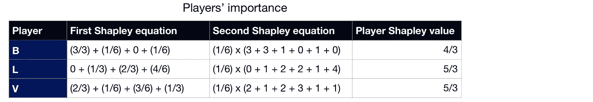
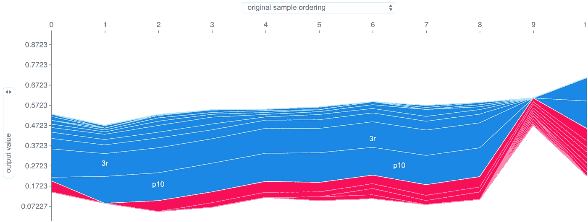
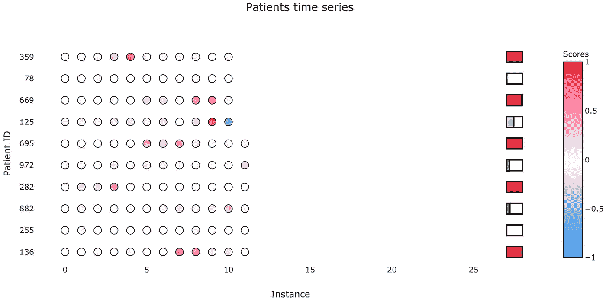

# 解释多元时间序列上的递归神经网络

> 原文：<https://towardsdatascience.com/interpreting-recurrent-neural-networks-on-multivariate-time-series-ebec0edb8f5a?source=collection_archive---------4----------------------->

## 如何从多元时间序列上训练的复杂深度学习模型中获得理论上合理的解释

Photo by [João Silas](https://unsplash.com/@joaosilas?utm_source=medium&utm_medium=referral) on [Unsplash](https://unsplash.com?utm_source=medium&utm_medium=referral)

# 什么

在本文中，我们将探索一种最先进的机器学习可解释性方法，并使其适应多元时间序列数据，这是一种以前没有准备好的用例。你会发现对核心概念的解释，它们是什么，它们是如何工作的，以及后面的例子。我们还将讨论提议的解决方案背后的主要思想，以及实例重要性的可视化建议。

# 为什么

这不再只是炒作，机器学习正在成为我们生活中重要的一部分。当然，那里没有任何有感知能力的机器，也没有斯嘉丽·约翰逊的爱耳者(对她的大声喊出来)，但是这些算法的进化是不可否认的。他们可以开车，帮助医疗预测，预测股票，玩专业水平的视频游戏，甚至产生旋律或图像！但是这些机器学习模型不是完美无缺的，也不是万无一失的。它们甚至会产生误导，在与训练数据非常不同的样本中显示不正确的概率(我建议看看[克里斯蒂安·佩罗尼关于不确定性的演讲](http://blog.christianperone.com/2019/07/uncertainty-estimation-in-deep-learning-pydata-lisbon-july-2019/) [1】)。因此，特别是在诊断病人或决定公司战略等关键应用中，至少对模型如何得到其输出值有一些了解是很重要的，这样用户就可以确认它是否可信。此外，在高性能模型与适当解释相结合的情况下，它可能会导致令人惊讶的发现，如疾病诊断中的基因或一年中某个时间对销售的影响。

We are not quite there yet in AI. GIF by the awesome [Simone Giertz](https://www.youtube.com/channel/UC3KEoMzNz8eYnwBC34RaKCQ).

因此，将可解释性技术应用于所有机器学习是显而易见的，对吗？差不多吧。虽然线性回归和决策树等更简单的模型易于分析，但神经网络等更复杂的模型却无法自圆其说，尤其是在数据和参数维数较高的情况下。有人建议改变一些架构，使神经网络更容易解释，例如注意力权重。然而，这些方法不仅需要增加参数的数量和改变模型的行为(这可能会恶化其性能)，它们可能不会给我们完整的画面(注意力权重仅指示每个特征的相对重要性，而不是它是否积极或消极地影响了输出)。因此，在性能和可解释性之间有一个权衡，为了能够解释模型，它必须足够简单或以某种方式特别适应，这限制了它的潜力。

幸运的是，基于扰动的方法的研究一直在增长，这是一种可解释性技术，应用输入数据的变化(即扰动)来计算重要性分数，通常不需要特定的模型架构。这意味着这些方法可以是模型不可知的，使得每一个可能的模型都是可解释的，从而消除了性能/可解释性的权衡(尽管有一些警告，我们将在后面讨论)。所以，让我们来看看现代基于扰动的可解释性技术背后的一些主要概念。

# 沙普利值

## 它们是什么？

Shapley values 是一个来自博弈论的概念，由 Lloyd Shapley 于 1953 年首先提出(我知道我说的是“现代”，但在这里请原谅我)，它定义了**一种计算合作博弈**中每个玩家贡献的方法。这一切都归结为一个等式。考虑总共有 *N 个*玩家， *i* 我们正在计算其贡献的玩家，**φI 玩家 *i* 的贡献**， *S* 不包括 *i* 的玩家子集(其中 *|S|* 表示子集 *S* 中的玩家数量)以及 *v* 输出总数的函数为了计算玩家 *i* 的贡献，我们计算以下等式:

Shapley values equation.

换句话说，**每个玩家的贡献由该玩家在所有可能的玩家组合**上的边际贡献的加权平均值决定。注意，我说的组合是指博弈中的一部分参与者，不考虑他们的顺序，边际贡献是指在当前的组合中，当特定的参与者加入时，收益是如何变化的。既然我们已经理解了边际贡献部分，那么左边还有一些乱七八糟的东西。这些看似复杂的权重实际上可以产生 Shapley 值方程的简单等效版本:

Equivalent Shapley values equation.

在这个等式中，我们遍历所有可能的排列( *R* )玩家的完整列表，而不是仅仅使用唯一的边际贡献。注意，我说的排列是指玩家加入的顺序(例如，玩家 1 开始游戏，然后玩家 2 加入，接着玩家 3 加入，等等)。在这种情况下，它现在有了符号 *PiR* (不好意思，真的不能用中等文本的方程式形式来写)，代表所有出现在 *i* 之前的选手，按当前顺序 *R* 。这种等价意味着权重的设置要考虑到一个独特的边际贡献在所有可能的玩家顺序中出现的次数。此外，这些权重的定义方式允许 Shapley 值满足一组属性，这些属性确保公平、真实地分配球员的贡献。为了保持这篇文章的合理简短，我不打算在这里列出它们，但是如果你想知道更多，你可以查看 Christoph Molnar 的可解释机器学习书籍。

## 例子

为了说明这一点，作为一个足球迷，想象以下场景:

假设我们有三名前锋(即在场上踢前锋的球员，主要目标是尽可能多地进球或助攻)。姑且称之为 *B* 、 *L* 、 *V* 。设 *G* 是这样一个函数，对于比赛中的一组前锋，输出该队进了多少球。记住这一点，想象当每组球员都在场上时，我们有以下得分目标:

我认为在这场比赛中，所有球员最终都会上场，这只是每个人何时上场的问题(从首发阵容开始，或者加入第一或第二替补)。因此，我们有 6 种他们参与游戏的可能场景，我们需要计算边际贡献:

作为实现 Shapley 值的最后一步，我们只需要对每个玩家应用 Shapley 值等式之一(唯一边际贡献的加权平均值或所有订单边际贡献的平均值):

请注意，我是如何通过我之前展示的两个方程来计算 Shapley 值的，两个方程导致了相同的结果。此外，由于该方法的一个性质(效率)，所有 Shapley 值的总和等于大联盟的收益，即当所有参与者都在游戏中时的收益， *G(B，L，V)* 。

## 那又怎样？

现在，我不是想通过解释一个不相关的 50 年代的理论来和你玩游戏。你看，如果我们用“特征值”代替“参与者”，用“模型输出”代替“收益”，我们就有了一个可解释性的方法。要让这在机器学习的可解释性中有用，我们只需要解决两个问题:

*   我们如何使这种方法**更快**(记住，在它的原始形式中，它需要在我们想要解释的每个样本上迭代**所有**可能的特征组合)。
*   我们如何**表现一个缺失的特性**(在游戏理论中，消除一个特性的影响比忽略一个玩家更复杂；在大多数机器学习模型中，所有的特征必须总是有一些值，所以我们需要找到一种方法来降低一个特征的影响，同时仍然通过模型传递它)。

# SHAP

## 这是什么？

2017 年，Scott Lundberg 和 Su-In Lee 发表了论文[“解释模型预测的统一方法”](https://arxiv.org/abs/1705.07874)【3】。顾名思义，他们提出了**一种新的方法来解释机器学习模型，统一了以前的模型**。他们发现，其他 7 种流行的可解释性方法(LIME、Shapley 采样值、DeepLIFT、QII、逐层相关性传播、Shapley 回归值和树解释器)都遵循相同的核心逻辑:**通过局部线性模型**从原始模型学习更简单的解释模型。正因为如此，作者称之为加性特征归因法。

这个局部线性模型魔术是什么？本质上，对于我们想要解释的每个样本 *x* ，使用模型 *f* 的输出，我们训练一个线性模型 *g* ，它在样本 *x* 上局部逼近 *f* 。然而，线性模型 *g* 并不直接使用 *x* 作为输入数据。相反，它将其转换为 *x'* ，表示哪些功能被激活(例如， *x'i = 1* 表示我们正在使用功能 *i* ，而 *x'i = 0* 表示我们正在“移除”功能 *i* )，这与选择玩家组合的情况非常相似。这样，考虑到我们有 *M* 个特征和 *M+1* 个模型系数(名为 *φ* ，我们得到解释器模型的如下等式:

Additive feature attribution methods’ general equation.

并且，由于具有将*x’*转换为 *x* 的映射函数 *hx* ，所以每当我们接近*x’*(即*z’≈x’)*时，解释器模型应该通过遵守以下规则来局部逼近模型 *f* :

Local approximation of the interpreter model, in additive feature attribution methods.

知道我们想要自然解释的样本 *x* 具有所有可用的特征(换句话说，*x’*是所有 1 的向量)，这种局部近似规定所有 *φ* 的总和应该等于样本 *x* 的模型输出:

The sum of the linear interpreter model’s coefficients should equal the original model’s output on the current sample.

这些方程都很有趣，但现在呢？诀窍在于这些 *φ* 系数代表什么以及它们是如何计算的。每个系数 *φ* ，这是一个线性模型，与模型上每个特征的重要性相关。例如， *φi* 的绝对值越大，特征 I 在模型上的重要性就越大。自然地， *φ* 的符号也是相关的，因为正的 *φ* 对应于对模型输出的积极影响(输出值增加)，而负的 *φ* 则相反。这里的一个例外是 *φ0* 。没有功能 0，因此它不与任何特定的功能相关联。事实上，如果我们有一个全零向量*z’*作为输入，解释器模型的输出将是 *g(0) = φ0* 。理论上，它应该对应于不存在特征时模型的输出。实际上，SHAP 所做的是 *φ0* 假设所有数据的平均模型输出，因此在添加每个特征的影响之前，它代表模型的一种起点形式。因此，我们可以将每个剩余系数视为每个特征将基本输出值( *φ* 0)推至更大或更小的输出(取决于系数的符号)，所有这些特征相关系数的总和导致当前样本的输出与平均输出值之间的差异。这个特性允许我们用 SHAP 软件包创建有趣的力图，正如你在下面的例子中看到的，一个模型预测一个足球队是否有一名球员赢得*最佳球员*奖。要了解这个例子的更多信息，请查看卡格尔关于 SHAP 价值观的教程。

Example of a force plot made with SHAP, on a model that predicts if a football team has a player win the *Man of the Match* award. The base value represents the model’s average output on all the data while each bar corresponds to a feature’s importance value. The color of the bar indicates its effect on the output (red is positive and blue is negative) and its size relates to the magnitude of that effect.

## 理想的性能

*φ* 系数还有一个有趣的方面。对于除了 *φ0* 之外的所有人，这同样不对应于任何单个特征的重要性，作者认为只有一个公式可以同时实现三个期望的属性:

1:本地精度

> *当对特定输入* x *近似原始模型* f *时，局部精度要求解释模型至少与原始输入* x *的* f *的输出相匹配。*

SHAP’s local accuracy property.

2:思念

> *如果简化输入(*x’*)表示特征存在，那么遗漏要求原始输入中遗漏的特征没有影响。*

SHAP’s missingness property.

3:一致性

> *设*FX(z ')= f(hx(z ')】*和* z' \ i *表示设置* z'i = 0 *。对于任意两个型号* f *和*f’*，如果*

SHAP’s consistency property.

> *对于所有输入* z' ∈ {0，1}^M *，则* φ(f '，x) ≥ φ(f，x) *。*

满足这三个特性的公式是……做好准备，迎接似曾相识的感觉……

Drumroll please.

Defended by the SHAP paper authors as the only formula for coefficients *φ which obeys to the desirable properties of local accuracy, missingness, and consistency.*

看着眼熟？本质上，它是 Shapley 值公式，适用于这个二进制值的世界。以前我们有由 *S* 代表的玩家组合，现在我们有由*z’*代表的激活特征组合。权重和边际贡献仍然存在。这不是巧合，这些系数被称为 SHAP 值，其中 SHAP 代表沙普利加法解释。

## 效率

从 SHAP 值的定义出发，我们仍然有同样的两个问题要解决:效率和如何表示缺失的值。这两个问题都是通过对缺失特征的采样和期望来解决的。也就是说，我们固定正在使用的特征的值(那些具有 *z' = 1* 的特征，其值对应于 *zs* 的特征)，然后在固定次数的迭代中，通过样本值对剩余的、移除的特征(那些具有 *z' = 0* ，其值对应于*zs‖*的特征)进行积分。通过检查停用特征的几个不同值并获得它们的平均值，我们正在减少这些特征对输出的影响。我们也加快了过程，因为我们不需要经历每一个可能的迭代。

Expectation done in SHAP. It assumes feature independence and model linearity locally.

知道了这种对随机样本整合的需求，我们需要在每次运行 SHAP 时定义两组数据:

*   **背景数据:**SHAP 从中抽取随机样本来填充缺失特征的集合。
*   **测试数据:**包含我们要解释其预测的样本的集合。

SHAP 还通过对重要性值应用正则化来加速该过程。换句话说，一些低重要性要素将假定 SHAP 值为 0。此外，考虑到与其他可解释性技术的统一，SHAP 实现了具有特定模型优化的各种版本，如用于深度神经网络的深度解释器，以及用于决策树和随机森林的树解释器。

除了这种方法和优化的统一，SHAP 还准备使用可视化，如之前显示的力图、依赖贡献图和汇总图，如以下相同的足球示例所示。

SHAP summary plot for the example of prediction of whether a football team has a player win the *Man of the Match* award. Features are ranked from descending average SHAP value from top to bottom and different samples are shown, with how the feature’s value (represented by the color) impacted the output (X axis).

## 我们到了吗？

我知道你现在的感受:

When you find out about SHAP.

考虑到 SHAP 有充分根据的理论及其 python 实现的实用性，你有理由这么做。但是，不幸的是，仍然存在一些问题:

*   SHAP 的开发重点是张量流。因此，在撰写本文时，**与 PyTorch 的完全兼容性尚未得到保证**，尤其是在深度解释器和梯度解释器的深度学习优化变体中。
*   在撰写本文时，SHAP**还不能很好地适应多元时间序列数据**。例如，如果您现在使用 SHAP 的任何解释器模型对这种类型的数据进行测试，您将会看到要素的 SHAP 值加起来是奇怪的数字，不符合局部精度属性。

但是不要绝望。我已经找到了一个解决这个问题的方法，接下来我们将讨论这个方法。

# 内核解释器来解释它们

## 它是如何工作的

正如我提到的，SHAP 有多个版本的解释器模型，基于它统一的其他可解释性方法。其中一个是内核解释器，它基于流行的[石灰](https://arxiv.org/abs/1602.04938)【6】。它有一些明显的相似之处，例如使用局部近似原始模型的线性模型作为解释器，并使用简化的输入*x’*，其中值 1 对应于正在使用的特性的原始值，值 0 表示特性缺失。此外，LIME 和它的 SHAP 对应物(内核解释器)不假设任何特定的模型组件或特征，例如决策树或梯度的反向传播，这使它们完全与模型无关。主要区别在于线性模型的损失函数。虽然 LIME 启发式地定义了损失函数、其相关的加权核和正则化项，但 SHAP 论文的作者认为这破坏了局部精度和/或一致性属性，SHAP 的核解释器使用以下固定参数目标函数:

Objective function minimized by the SHAP Kernel Explainer to train its linear regression model.

这里平方损失是足够的，因为我们希望 *g* 尽可能接近 *f* 。关于加权核，查看这些参数有效性的一种方式是，当:

*   *|z'| = 0* ，强制*φ0 = f(φ*)
*   *|z'| = M* ，迫使*∈φI[I = 0，…，M] = f(x* )

这些参数不仅通过保证符合三个期望的性质而提供了优于石灰的优势，而且通过线性回归的所有 SHAP 值的联合估计给出了比经典 Shapley 方程更好的样本效率。

由于我们正在训练一个线性回归模型，除了设置要解释的数据和 SHAP 从中获取随机样本的背景数据之外，唯一需要定义的主要参数是解释每个预测时重新评估模型的次数(在 python 代码中称为`nsamples`)。与其他机器学习模型一样，重要的是要有足够多的训练迭代次数，以便通过不同的训练会话获得拟合良好且方差较低的模型。请记住，在这种情况下，我们不需要担心过度拟合，因为我们真的只是想解释特定样本上的模型，而不是事后对其他数据使用结果解释器，所以我们真的希望大量的模型重新评估。

An example animation illustrating how SHAP Kernel Explainer works, in a simplified way. The interpreter *g(z’)* updates its coefficients, the SHAP values, along the combinations of z’, being reset when the sample x changes. Note that, in real life, more reevaluations (i.e. training iterations) should be done on each interpreter model.

这个内核解释器方法自然有一个缺点。由于我们需要对我们想要解释的每个预测训练一个线性回归模型，使用几次迭代来训练每个模型，并且没有特定的模型类型优化(例如 Deep Explainer 和 Tree explainer)，内核解释器运行起来可能非常慢。这完全取决于您想要解释多少数据、从多少背景数据中采样、迭代次数(`nsamples`)和您的计算设置，但是计算 SHAP 值可能需要几个小时。

简而言之，如果内核解释器是一个迷因，它应该是这样的:

Hey, just because sloths are slow doesn’t mean they aren’t awesome. Meme by my procrastinating self.

## 多元时间序列修正(又名时间旅行树懒)

由于内核解释器应该在所有模型上工作，只需要一个预测函数来进行解释，我们可以尝试用一个在多变量时间序列数据上训练的递归神经网络(RNN)来进行解释。你也可以通过我做的【7】的[简易笔记本自己试试。在那里，我创建了以下虚拟数据集:](https://github.com/AndreCNF/shap-variable-sequence-pytorch-debug)

Dummy multivariate time series dataset used in the [example notebook](https://github.com/AndreCNF/shap-variable-sequence-pytorch-debug) [7].

本质上，你可以把它想象成一个健康数据集，病人由`subject_id`识别，他们的临床访问由 *ts* 识别。标签可能表明他们是否患有某种疾病，从 0 到 3 的变量可能是症状。注意`Var3`和`Var2`是如何被设计成特别有影响力的，因为当它们低于一定水平时，标签通常会被激活。`Var0`紧随其后，但影响较小，最后`Var1`基本上是随机的。我还包含了一个“输出”列，它指示了被训练的 RNN 模型标记为 1 的预测概率。如您所见，一般来说，它在预测标签方面做得很好，在训练(3 名患者)和测试(1 名患者)集上的 AUC 分别为 0.96 和 1。

对于 SHAP 内核解释器将使用的预测函数，我只需要确保数据是浮点型 PyTorch 张量，并设置模型的前馈方法:

Model’s prediction method used in the current SHAP Kernel Explainer example.

由于它是一个小数据集，我将背景和测试集都定义为整个数据集。对于较大的数据集，这是不推荐的，因为由于内核解释器的缓慢，您将希望使用一小部分数据作为您想要解释的样本，并且避免在后台和测试集中有相同的数据。

然而，当我们将 SHAP 系数的结果总和与输出进行比较时，它们并不完全匹配，违反了局部精度公理:

Example of subject 0’s real model output and the sum of SHAP coefficients, in the original SHAP code.

为什么会这样？这个版本的 SHAP 不是应该可以演绎各种模型吗？嗯，问题的一部分是，看代码，你会看到 SHAP 期望表格数据。文档中甚至有一条注释提到了对 2D 数据的需求:

> *X : numpy.array 或者熊猫。DataFrame 或任何 scipy.sparse 矩阵
> 一个样本矩阵(# samples x # features)，用于解释模型的
> 输出。*

在我们的例子中，数据是三维的(#样本 x #时间戳 x #特征)。如果我们使用一个更简单的模型，一个仅使用单个实例来预测标签的模型，这仍然是好的。但是，当我们使用 RNN 时，它会在隐藏状态下从以前的实例中积累内存，它会将样本视为单个实例的单独序列，从而消除了模型内存的使用。为了解决这个问题，我不得不修改 SHAP 内核解释器代码，使其包含解释多元序列递归模型的选项。还需要更微妙的变化，但核心的增加是代码的这一部分:

Core addition to the SHAP Kernel Explainer to make it compatible with multivariate time series data and RNNs.

正如你所看到的，只有当我们之前检测到模型是一个递归神经网络时，才会执行该代码，它会单独循环通过每个主题/序列，并通过模型的隐藏状态，即当前序列中之前实例的内存。

经过这些改变后，我们现在可以进入同一个例子，看到 SHAP 系数的总和正确匹配实际输出！

Example of subject 0’s real model output and the sum of SHAP coefficients, in the modified SHAP code.

现在，如果我们查看摘要条形图，我们可以看到功能重要性的总体排名:

Average SHAP values (feature importance) on the dummy dataset, using all the data as background data.

看起来不错！`Var2`和`Var3`被正确识别为最重要的特征，其次是不太相关的`Var0`和不太重要的`Var1`。让我们来看一个病人 0 的时间序列的例子，以确认它是否，事实上，很好地解释了个人预测:

Feature importance along the dummy dataset subject 0’s time series. The border between the red shade (output increasing features) and the blue shade (output decreasing features) represents the model’s output for each timestamp.

我们的数据集验证了这一点，因为最初，当`Var2`和`Var3`具有高值时，它会降低输出，而在最后阶段，随着`Var2`和`Var3`降低，输出会增加。我们可以通过获得时间戳 3 的力图来进一步确认这一点，其中输出概率上升到 50%以上:

Force plot of the feature importance, for the same dummy dataset subject 0, on timestamp 3\. The size of each feature value’s block corresponds to its contribution.

## 我们真的需要所有的背景数据吗？

由于 SHAP 内核解释器并不是真的快(不要逃避自己，如果你运行前一个笔记本，它的速度很快，因为数据集非常非常小)，我们应该考虑每一个机会使它更快。自然地，当训练解释器模型时，该过程的计算量大的部分是通过来自背景数据的样本的多个组合的迭代。因此，如果我们能减少样本数量，我们就能得到加速。现在想一想:我们可以用一个参考值来表示缺失的特性吗？如果有，会是什么？

Thinking about that reference value.

我想说，甚至 SHAP 论文中给出的一个公式也给了我们一个提示(这篇文章“SHAP”部分前面“效率”小节中的那个)。如果我们对样本进行积分以获得缺失特征的期望值，为什么不直接使用这些特征的平均值作为参考值呢？如果在预处理阶段，我们将数据标准化为 z 分数，这就更容易做到了。这样，我们只需要使用全零向量作为唯一的背景样本，因为零代表每个特征的平均值。

z-scores equation, where data *x* is subtracted by its mean μ and then divided by the standard deviation σ.

仅用零参考值而不是所有以前的背景数据重新运行内核解释器，我们得到下面的摘要条形图:

Average SHAP values (feature importance) on the dummy dataset, using just an all zeroes sample as background data.

我们得到了与使用所有数据集作为背景数据的情况相似的结果！功能重要性的排名略有不同，`Var3`略微超过`Var2`成为最相关的功能，而`Var1`的重要性更高，尽管它仍然是最不相关的。除了这些差异之外，它实际上很有趣，因为我打算将`Var3`作为最重要的特性。你也可以在笔记本中查看更详细的时间序列和力图，但它们也接近我们之前得到的。

## 规模，规模，规模

当然，前面的例子使用了一个不切实际的小玩具数据集，只是因为实验很快，我们确切地知道会发生什么。我还在研究一个真实的健康数据集，涉及 1000 多名 ALS 确诊患者的体检。不幸的是，由于这个数据集不是公开的，我不能分享它，也不能将它合并到一个打开的笔记本中以使结果可重复。但是我可以和你分享一些初步的结果。

为了给出一些背景，我训练了一个 LSTM 模型(一种递归神经网络)，以预测患者在未来 3 个月内是否需要无创通气，这是一种常见的程序，主要在呼吸系统症状恶化时进行。

在这个模型上运行修改后的 SHAP 内核解释器会给我们带来以下可视化效果:

Average feature importance for the ALS dataset.

Feature importance along an ALS patient’s time series. The border between the red shade (output increasing features) and the blue shade (output decreasing features) represents the model’s output for each timestamp.

Force plot of the feature importance, for the same ALS patient, on timestamp 9\. The size of each feature value’s block corresponds to its contribution.

这里有一些有趣的注释:

*   7 个最重要的特征，按重要性排序，都与呼吸系统症状有关，尤其是来自医生进行的呼吸系统评估的`3r`和`p10`。
*   疾病持续时间、性别和年龄也是最重要的特征，这似乎是有意义的。
*   我们现在看到一个更详细的时间序列可视化，显示了更多的功能。同样相关的是，由于正则化，我们只看到了数据集中总共 47 个要素中最有影响力的 20 个要素。

这种解释是对 183 名患者的时间序列进行的，最大序列长度为 20，使用 0 作为参考值。我在 C7 机器(12 个 CPU 内核，30GB 内存)上运行了[paper space](https://www.paperspace.com/)【8】中的代码。**完成**大约花了 5 个小时，而使用 50 个背景样本的替代方案估计需要 27 个小时。现在你相信我说的慢了吧？至少我们的参考值技巧仍然能够提高运行时间。

## 好了，现在我们需要的都有了。对吗？

虽然看起来我们得到了快乐的结局，但这里仍然有一些东西。这篇文章是关于解释多元时间序列数据的模型，但是我们只讨论了特征重要性分数。我们如何知道哪些实例/时间戳最相关？换句话说，我们如何知道实例重要性分数？不幸的是，目前 SHAP 还没有内置的多元序列数据。为此，我们需要想出自己的解决方案。

# 错误 404:找不到实例重要性

正如我们所讨论的，SHAP 主要是为处理 2D 数据而设计的(#样本 x #特性)。我向您展示了代码中的一个变化，它允许单独考虑不同序列的特性，但这是一个变通办法，只能导致特性的重要性，而不能从整体上解释实例的相关性。人们仍然会想，是否有可能再次应用 SHAP，愚弄它，让它把实例当作特征。然而，这可行吗，甚至有意义吗？首先，我们已经有了使用 SHAP 来确定特征重要性的缓慢过程，因此再次应用它来获得实例重要性可能会使整个解释管道变得不切实际地缓慢。然后，考虑到 SHAP 是如何通过遍历功能子集的组合，删除剩余的功能(在这种情况下，删除实例)，这似乎是不现实的。在时间动态相关的真实世界数据中，我认为考虑时间事件之间存在多个间隙的合成样本没有意义。考虑到所有这些，在我看来，我们应该寻求一个更简单的解决方案。

最初的方法是相当自然的:删除我们想要获得重要性分数的实例，然后看看它如何影响最终的输出。为此，我们用没有相应实例的序列的输出减去原始输出，从而得到一个分数，该分数的符号指示该实例向哪个方向推动输出(如果新的输出具有较低的值，则意味着该实例具有积极的影响；对于较高的值反之亦然)。我们可以称之为**遮挡分数**，因为我们正在遮挡序列中的一个实例。

Occlusion score determined by the effect of instance i on the final output. N is the index of the last instance of the sequence and S is the set of instances in the sequence.

虽然有道理，但可能还不够。当随着时间的推移跟踪某事时，例如患者的疾病进展，往往会有某些时刻发生一些新的事情，这些事情可能会产生影响或在随后的事件中重复。例如，如果我们预测症状恶化的概率，我们可以有一个病人，开始时病得很重，但在成功治疗后，完全治愈，再次生病的概率几乎为零。如果我们只应用前面的实例封闭方法，那么治疗后患者的所有实例都可以得到相似的分数，尽管很明显，他接受治疗的时刻实际上是关键时刻。为了解决这个问题，我们可以考虑实例带来的输出中的**变化。也就是说，我们将正在分析的实例的输出与其之前的实例进行比较，就像我们在计算导数一样。**

Output variation score calculated through the derivative in the output caused by instance i. S is the set of instances in the sequence.

当然，遮挡分数在许多场景中可能仍然是相关的，所以理想的解决方案是**将两个分数组合成一个加权和**。考虑到遮挡的更直接的方法和一些经验分析，我选择遮挡的权重为 0.7，输出变化的权重为 0.3。由于输出中的这些变化可能有些小，通常不超过输出中 25 个百分点的变化，我认为我们还应该对结果应用非线性函数，以便放大高分。为此，我选择了 *tanh* 函数，因为它将所有内容保持在-1 到 1 的范围内，并在内部添加了乘数 4，因此输出中 25 个百分点的变化非常接近最大值 1。

Instance importance score, calculated through a tanh activation on a weighted sum of the occlusion score and the output variation score.

尽管结合了两个分数和非线性函数的应用，解决方案仍然简单而快速。作为比较，将这种方法应用于相同的 183 个患者数据和与前面的特征重要性示例相同的计算设置，这种**需要大约 1 分钟来运行**，而特征重要性需要 5 个小时。

有了这个实例重要性公式，我们可以可视化分数，即使是同时在多个序列中。受 Bum Chul Kwon 等人的论文“retain vis:Visual Analytics with interpretatable and Interactive Recurrent Neural Networks on Electronic Medical Records”[9】的启发，我一直在研究您在下面看到的时间序列图，其中每一行都对应于一个序列(在我的例子中，是一个患者的时间序列)，实例由圆圈表示，圆圈的颜色表示其重要性(强度表示分数大小，颜色表示符号)，我们还可以添加简单的预测表，这让我们了解最终的输出值。

Example of visualizing instance importance on multiple sequences, along with their final probability.

请注意，患者 125 与 ALS 示例中的特征重要性相同。它充分表明时间戳 9 是一个相关的、输出增加的实例，而时间戳 10 减少了该输出值。

即使我希望你喜欢我提出的逻辑和情节，例如重要性，我还没有准备好与你分享这段代码，因为它仍然需要微调。作为我硕士论文的一部分，我正在创建一个名为 Model Interpreter 的 API，它包含了我们在这里讨论过的现成实现(多元时间序列的 SHAP、实例重要性分数和绘图)等等。我希望能够在 GitHub 上公开到 10 月份。同时，请随意探索这些主题，并做自己的实验！还记得我的 SHAP[修改版](https://github.com/AndreCNF/shap)【10】是公开的，所以你已经可以使用它了。

# 最后的想法

如果有什么你应该从这篇文章中学到的，即使你只是浏览了图片和迷因，那就是这个:

> 虽然它仍然很慢，但提出的修改后的 SHAP 可以解释任何模型，即使是在多元时间序列数据上训练的模型，也具有确保公平解释和实现直观理解的可视化的理想属性；尽管软件包中仍然缺少实例重要性计算和绘图。

在机器学习可解释性方面还有工作要做。效率和易用性需要解决，总有改进的空间，以及替代方案的建议。例如，SHAP 仍然有一些假设，像模型的特征独立性和局部线性化，这可能并不总是正确的。然而，我认为我们已经从 SHAP 强有力的理论原则及其实施中有了一个良好的起点。我们终于到达了一个时代，我们不仅可以从复杂的算法中得到结果，还可以问他们为什么，并得到一个现实的，完整的回答。

No more black box models refusing to give answers.

# 参考

[1] C .佩罗尼，[深度学习中的不确定性估计](http://blog.christianperone.com/2019/07/uncertainty-estimation-in-deep-learning-pydata-lisbon-july-2019/) (2019)，PyData Lisbon 2019 年 7 月

[2] C .莫尔纳尔，[可解释机器学习](https://christophm.github.io/interpretable-ml-book/shapley.html) (2019)，克里斯托夫·莫尔纳尔的网页

[3] S. Lundberg 和 S. Lee，(2017)，NIPS 2017

[4] S. Lundberg， [SHAP python 包](https://github.com/slundberg/shap) (2019)，GitHub

[5] D. Becker， [Kaggle 的 SHAP 价值观教程](https://www.kaggle.com/dansbecker/shap-values) (2019)，Kaggle

[6] M. Ribeiro 等人，[“我为什么要相信你？”:解释任何分类器的预测](https://arxiv.org/abs/1602.04938) (2016)，CoRR

[7] A. Ferreira， [GitHub 知识库，简单演示了 SHAP 在虚拟多元时间序列数据集上的表现](https://github.com/AndreCNF/shap-variable-sequence-pytorch-debug) (2019)，GitHub

[8] [Paperspace 云计算服务](https://www.paperspace.com/)

[9] B. Chul Kwon 等人， [RetainVis:在电子病历上使用可解释和交互式递归神经网络的视觉分析](https://arxiv.org/abs/1805.10724) (2018)，IEEE VIS 2018

[10] A .费雷拉，[修正的 SHAP，兼容多元时间序列数据](https://github.com/AndreCNF/shap) (2019)，GitHub

[11] R .阿斯特利，[革命性的新人工智能区块链物联网技术](https://www.youtube.com/watch?v=dQw4w9WgXcQ) (2009)，YouTube