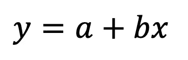
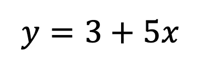
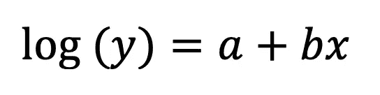
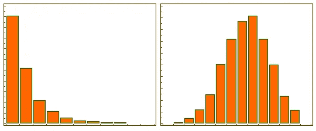
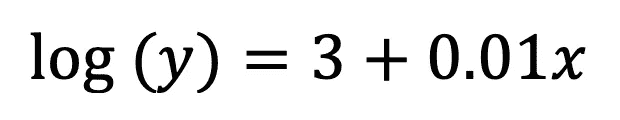
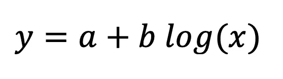
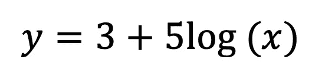
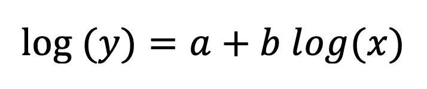
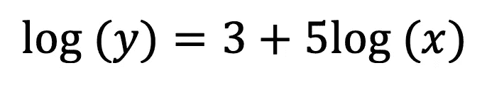
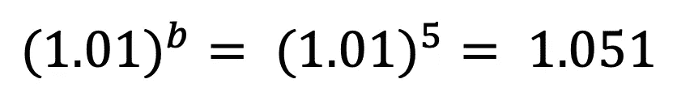

# 解释线性回归的系数

> 原文：<https://towardsdatascience.com/interpreting-the-coefficients-of-linear-regression-cc31d4c6f235?source=collection_archive---------9----------------------->

Source: [Unsplash](https://unsplash.com/photos/Wpnoqo2plFA)

## 学习如何正确解释线性回归的结果——包括变量转换的情况

如今，有太多的机器学习算法可供我们尝试，以找到最适合我们特定问题的算法。一些算法有明确的解释，其他的作为黑盒工作，我们可以使用诸如[石灰](https://github.com/marcotcr/lime)或 [SHAP](https://github.com/slundberg/shap) 的方法来导出一些解释。

在本文中，我将重点解释最基本的回归模型的系数，即 [**线性回归**](https://en.wikipedia.org/wiki/Linear_regression) ，包括因变量/自变量被转换的情况(这里我说的是对数转换)。

# 1.水平水平模型

The basic form of linear regression (without the residuals)

我假设读者熟悉线性回归(如果不熟悉的话，有很多好文章和中等帖子)，所以我将只关注系数的解释。

线性回归的基本公式可以在上面看到(为了简单明了，我故意省略了残差)。公式中， *y* 为因变量， *x* 为自变量。为了简单起见，让我们假设它是单变量回归，但这些原则显然也适用于多变量情况。

为了客观地看待这个问题，假设在拟合我们收到的模型之后:

**拦截(一)**

我将把截取的解释分成两种情况:

*   *x* 连续且居中(从每次观察中减去 *x* 的平均值，变换后的 *x* 的平均值为 0) —当 *x* 等于样本平均值时，平均值 *y* 为 3
*   *x* 连续，但不居中——当 *x* = 0 时，平均值 *y* 为 3
*   *x* 是分类的——当 *x* = 0 时，平均值 *y* 是 3(这一次表示一个类别，下面将详细介绍)

**系数(b)**

*   *x* 是一个连续变量

解释: *x* 增加一个单位导致平均 *y* 增加 5 个单位，所有其他变量保持不变。

*   *x* 是一个分类变量

这需要更多的解释。假设 *x* 描述性别，可以取值('男性'，'女性')。现在让我们把它转换成一个虚拟变量，男性取值 0，女性取值 1。

解释:在所有其他变量保持不变的情况下，女性平均比男性高 5 个单位。

# 2.日志级模型

Log denotes the natural logarithm

通常，我们使用对数变换将正偏态分布中的外围数据拉至更接近大部分数据的位置，以使变量呈正态分布。对于线性回归，使用对数变换的另一个好处是可解释性。

Example of log transformation: right — before, left — after. [Source](https://www.medcalc.org/manual/_help/images/logtransformation.png)

和以前一样，假设下面的公式表示拟合模型的系数。

**拦截(一)**

解释与普通(级别-级别)情况类似，但是，我们需要取解释 exp(3) = 20.09 的截距指数。不同的是，这个值代表 *y* 的[几何](https://en.wikipedia.org/wiki/Geometric_mean)平均值(与 level-level 模型的算术平均值相反)。

**系数(b)**

当涉及到解释分类/数字变量时，原则再次类似于水平-水平模型。类比截距，我们需要取系数的指数:exp(*b*)= exp(0.01)= 1.01。这意味着在所有其他变量保持不变的情况下， *x* 的单位增长导致平均(几何) *y* 的 1%增长。

这里有两件事值得一提:

*   在解释这种模型的系数时，有一条经验法则。如果 abs(b) < 0.15 it is quite safe to say that when b = 0.1 we will observe a 10% increase in *y* 在 *x* 中为单位变化。对于绝对值较大的系数，建议计算指数。
*   当处理[0，1]范围内的变量(如百分比)时，解释起来更方便，首先将变量乘以 100，然后拟合模型。这样解释更直观，因为我们将变量增加 1 个百分点，而不是 100 个百分点(立即从 0 到 1)。

# 3.水平对数模型

让我们假设在拟合我们收到的模型之后:

截距的解释与水平-水平模型的情况相同。

对于系数*b—*,*x*增加 1%会导致平均 *y* 增加 *b* /100(本例中为 0.05)，所有其他变量保持不变*。为了得到准确的数量，我们需要取 *b* × log(1.01)，在这种情况下得到 0.0498。*

# 4.双对数模型

让我们假设在拟合我们收到的模型之后:

我再次关注对 *b.* 的解释，在所有其他变量保持不变的情况下， *x* 增加 1%会导致平均(几何) *y* 增加 5%。为了获得准确的数量，我们需要取

大约是 5.1%。

# 结论

我希望这篇文章已经向您概述了如何解释线性回归系数，包括一些变量经过对数变换的情况。一如既往，我们欢迎任何建设性的反馈。可以在 [Twitter](https://twitter.com/erykml1?source=post_page---------------------------) 或者评论里联系我。

喜欢这篇文章吗？成为一个媒介成员，通过无限制的阅读继续学习。如果你使用[这个链接](https://eryk-lewinson.medium.com/membership)成为会员，你将支持我，不需要你额外付费。提前感谢，再见！

# 参考

*   [https://stats . idre . UCLA . edu/SAS/FAQ/how-can-I-interpret-log-transformed-variables-in-terms-of-percent-change-in-linear-regression/](https://stats.idre.ucla.edu/sas/faq/how-can-i-interpret-log-transformed-variables-in-terms-of-percent-change-in-linear-regression/)
*   [https://stats . idre . UCLA . edu/other/mult-pkg/FAQ/general/FAQ how-do-I-interpret-a-regression-model-when-some-variables-is-log-transformed/](https://stats.idre.ucla.edu/other/mult-pkg/faq/general/faqhow-do-i-interpret-a-regression-model-when-some-variables-are-log-transformed/)