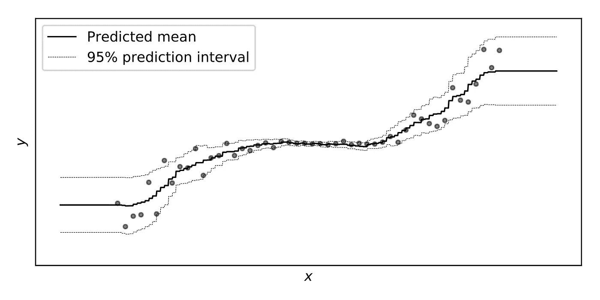

# NGBoost 和预测间隔

> 原文：<https://towardsdatascience.com/interpreting-the-probabilistic-predictions-from-ngboost-868d6f3770b2?source=collection_archive---------27----------------------->

## 什么是概率回归，你应该如何解释概率预测？

自从我们发布了[自然梯度增强](https://stanfordmlgroup.github.io/projects/ngboost/) (NGBoost)以来，我们已经从社区获得了巨大的反响，我们很高兴有这么多人在使用我们的方法。很明显，概率回归需要一种快速、灵活、易用的算法！

然而，我们也很清楚，概率回归有一点混乱。这是意料之中的——我们有点偏离传统的可用方式，所以有些混乱是自然的。这就是我写这个帖子的原因！

所以，事不宜迟，让我们开始吧。我想谈论的主要话题是*概率监督学习*和*预测区间*。阅读完本文后，您应该能够:

1.  解释监督学习和概率监督学习在回归和分类方面的区别。
2.  正确解释 NGBoost 等算法生成的预测区间。

# 概率监督学习和 NGBoost

首先，什么是*概率*监督学习，它与“普通”监督学习相比如何？

标准的监督学习问题是:对于预测器的一个观测值 *X* (比如说 *X=x* )，我们期望看到的 *Y* 的值是多少？这些方法采用值 *x* 并返回一个表示我们期望的结果或类的数字 *y* 。没有得到输出的“概率”的概念。我们有时称之为*点预测。*

为了进一步讨论，让我们将监督学习(点或概率)分为分类和回归，分类的结果只能取有限个值，回归的结果可以取连续无限个值(排列在真实线上)。

在*概率*监督学习中，我们感兴趣的是观察每个可能结果的相对概率，假设我们看到了 *X=x* 。在分类的情况下，这将是一个概率向量，每个类别一个(概率质量函数)。在回归中，我们得到每个可能结果的相对概率的“连续”向量(概率密度函数)。一般来说，我们说的是给定 *X=x* 的 *Y* 的分布。概率监督学习器取一个值 *x* ，并返回一个在 *Y* 上的分布，指示不同值 *y* 的相对可能性。

了解任何概率分类器或回归器都可以用作标准分类器或回归器也很有帮助。如果给定 *X=x* ，我们有了 *Y* 的可能性，就有可能通过寻找所有类别 *y* 中的 *P(Y=y|X=x)* 的最大值(在分类的情况下)或者通过积分(在回归的情况下)的预期结果*E【Y | X = X】*来找到最可能的类别。

在 NGBoost 之前，很难用灵活的基于树的模型进行概率回归。但是很久以前就有可能进行概率分类。这是因为大多数分类器实际上是概率分类器，它们返回每个类的概率。例如，当您运行逻辑回归时，标准做法是在输出中获取类概率。

但不是所有的分类器都输出概率。例如，普通的支持向量机通常只返回最可能的类别标签。几乎所有的回归量也是如此:你得到的只是预期的结果(单个实数，相当于单个类)。想想线性回归:当你对一个观察值 *x* 调用`predict`方法时，你只是得到一个单一的值，而不是所有可能值的分布。

前面说过，概率分类已经很普遍了。大多数众所周知的分类方法都支持概率分类。在这方面，NGBoost 并没有增加太多新的东西。它确实使概率分类更具原则性，并消除了分类中多类提升所需的一些特别选择。但是这些改进对用户来说很大程度上是不可见的，所以在进行分类时，NGBoost 不会让您相对于标准 boosting“做得更多”。

NGBoost 增加了一种进行概率回归的方法，这种方法快速、易用、灵活，就像我们已经有的概率分类算法一样。概率回归在 NGBoost 之前当然是可能的，但总是有所取舍。如果你假设同方差，线性回归可以是概率性的，但是这样你就陷入了一个简单的模型。如果你想要一个灵活的非参数方法，复杂的贝叶斯方法总是一个选择，如果你愿意弄清楚如何使用它们，并且有时间等待 MCMC 采样器。另一方面，NGBoost 运行速度很快，允许您适应各种复杂的模型，最重要的是，开箱即可运行。

# 预测间隔和 NGBoost

让我们直接进入: **NGBoost** **不返回置信区间**。

但是等等？那么 [NGBoost 网站](https://stanfordmlgroup.github.io/projects/ngboost/)上的这张图是怎么回事？概率回归的好处不就是给你一个置信区间吗？

没有。困惑在于*信心*区间和*预测*区间的不同。

在 NGBoost 中，我们得到的是结果取每个可能值的相对概率。如果我们操纵这种分布(通过整合不同的集合)，就有可能找到一组结果，根据模型，结果在 95%的情况下都落在该组中。但这不是一个置信区间——这只是一组可能的结果。这就是我们在上图中看到的。

注意，分类也很简单:假设有 4 个类( *a，b，c，d* )，它们的估计概率(给定 *X=x* )是 *P(Y=a)=5%，P(Y=b)=20%，P(Y=c)=50%，P(Y=d)=25%* 。然后集合 *{b，c，d}* 形成 95%可能性的结果集合，同样的方式，在回归设置中，给定 *X=x* ，像*【3.4，6.11】*这样的区间可能包含 *Y* 密度的 95%的质量。这些集合通常被称为“预测区间”(尽管它们本身不一定是“区间”)。

因此，基本上，在*回归*的情况下，NGBoost 返回的预测区间是你可以很容易地自己创建的，如果你使用任何标准的概率分类器来做*分类*(假设是在不同的问题上)。

*有可能为概率分类建立置信区间。例如，像 *P(Y=a|X=x)* 这样的值，我们使用一个模型来估计，它取决于我们收集的数据，所以它本身实际上是一个随机变量。如果我们对数据生成过程做出某些假设，我们可能能够利用这种理解来设计一个区间，这样我们就可以预期该区间在 95%的时间里包含*真*概率 *P(Y=a|X=x)* 。但这需要大量的数学计算。这通常很复杂，取决于你对现实世界的看法。但是，如果你这样做，你也可以计算概率回归的置信区间:只需用 *P(Y=y|X=x)代替 *P(Y=a|X=x)* 。*你会得到一个不同的置信区间来表示无限可能值 *y* 可能取值的可能性！*

在回归设置中，有时你也会看到 *E[Y|X=x]* 的置信区间(即 *y* 的预测值)。想法是一样的。将 *E[Y|X=x]* 的估计值视为一个随机变量(因为您对它的估计取决于随机的数据)，通过假设关于 *X* 和 *Y* 的分布的东西，找出关于它的采样分布的一些东西，并使用它来建立一个可能跨越 *E[Y|X=x]的真实值的区域。*

这些都和 NGBoost 给你的不一样。根据模型，NGBoost 只是告诉你观察到每个结果的相对可能性。如果你相信模型，所见即所得。如果你不这样做，你可能需要做一堆额外的假设，以便有效地限定你在多大程度上应该对它的估计“有信心”。

# 结论

希望这有助于澄清一些关于 NGBoost 做什么以及如何解释其输出的困惑。理想情况下，您现在能够清楚地区分点估计的监督学习和概率监督学习，并且您知道预测区间的含义。

NGBoosting 快乐！