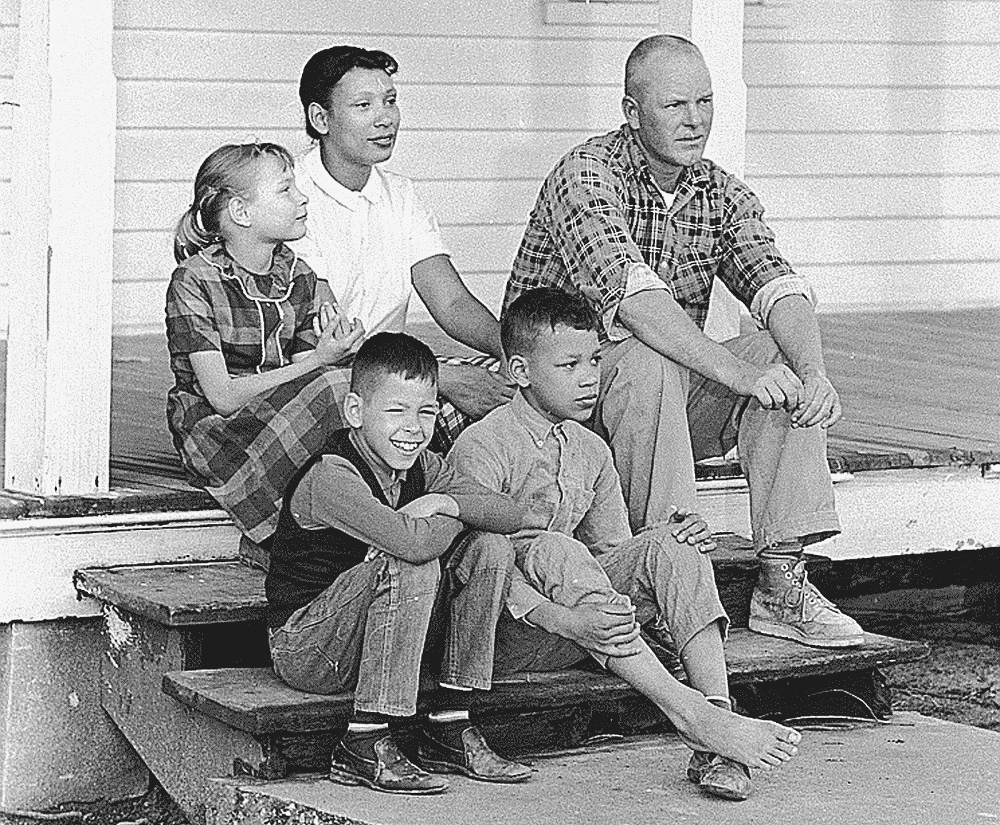
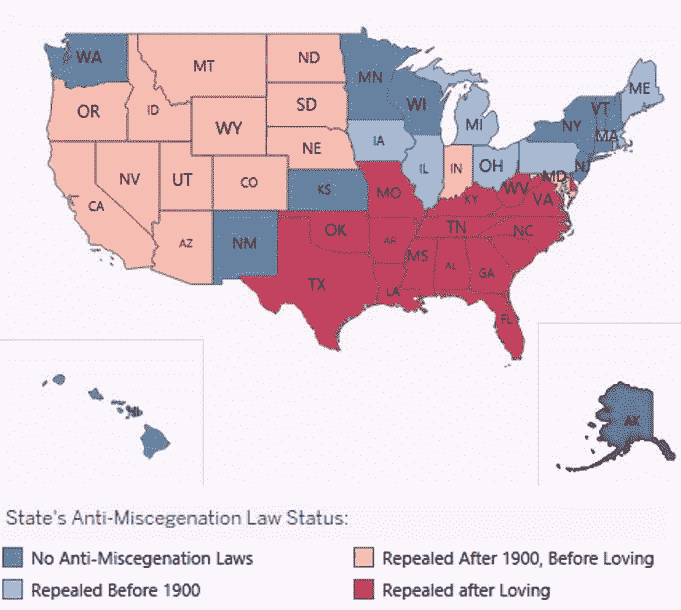
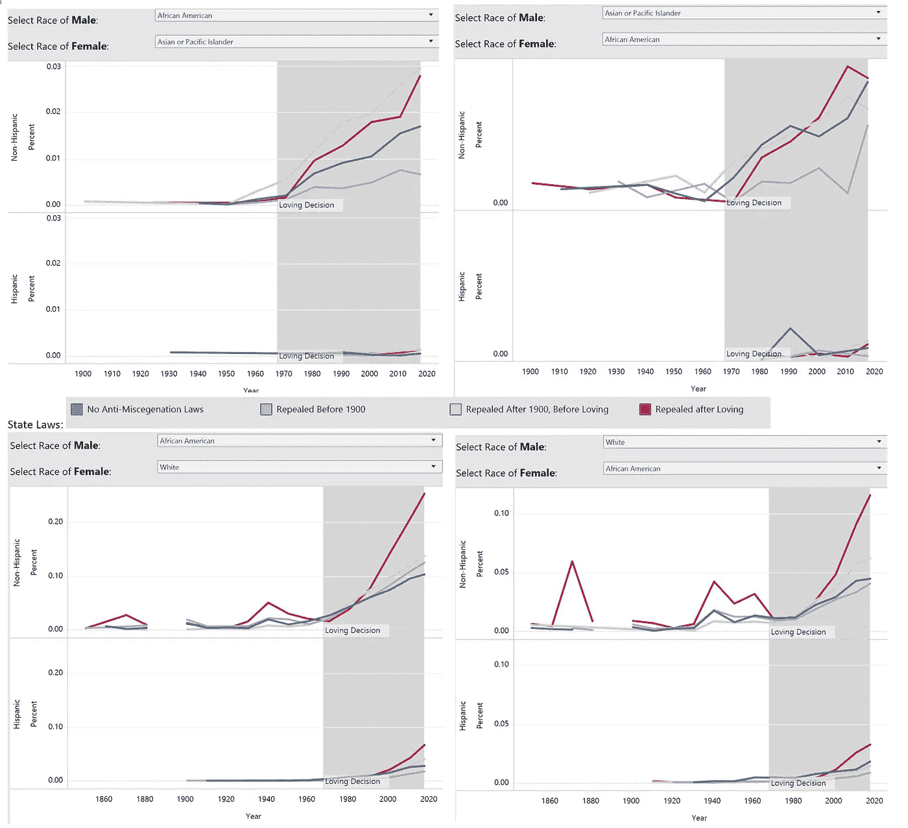

# 美国的跨种族婚姻(1850-2017)

> 原文：<https://towardsdatascience.com/interracial-marriage-in-the-united-states-1850-2017-d6dfc3678e07?source=collection_archive---------17----------------------->

## 一个家庭的爱是如何改变一切的。

[https://www.nytimes.com/2017/06/11/us/50-years-after-loving-v-virginia.html](https://www.nytimes.com/2017/06/11/us/50-years-after-loving-v-virginia.html)

律师 Philip J. Hirschkop 和 Bernie Cohen 问 Richard Loving，他希望律师们告诉法庭什么，因为他们提出了他们对 T4 Loving 诉弗吉尼亚州的案件。他回应道，

# "告诉法庭我爱我的妻子"

接下来发生的是一个可爱的决定，该决定认为存在于 16 个州的跨种族婚姻在全国范围内是非法的。

这个案子一直让我很感兴趣。除了显而易见的原因——各州不应该对种族纯度(他们以前的推理)以及谁应该和不应该结婚有任何发言权，我还欣赏作为个人的爱——两个说话相当温和的人对他们的婚姻采取了立场。正是因为他们，我才能够嫁给我在马里兰州的丈夫。

# 问题

2019 年秋季学期，我报名参加了马里兰大学帕克学院的 INST760 课程——数据可视化，老师是[Niklas Elmqvist](https://medium.com/@niklaselmqvist)博士。(请看我的精彩同学作品[这里](https://medium.com/visumd))。我们被分配了一个课程项目，我想看看随着时间的推移，跨种族婚姻的趋势，看看这些家庭住在哪里，存在什么样的种族组合。美国存在的许多法律都与白人妇女嫁给非裔美国人或美洲印第安人直接相关，但我想看看这两种结合之外的情况。例如，亚洲人和非裔美国人呢？幸运的是，我能够访问匿名的[公共使用微数据样本](https://www.census.gov/programs-surveys/acs/guidance/training-presentations/acs-intro-pums.html) (PUMS)，追溯到 1850 年。

在纪录片 [*爱情故事*](https://www.amazon.com/Loving-Story-Mildred/dp/B00D0RH6XY)*中，理查德和米尔德里德都认识住在他们附近、合法结婚、不同种族的夫妇(Buirski，2011)。这在人口普查记录中有记录吗？简而言之，是的。格利克森在论文《1850-2000 年的黑人和白人跨种族婚姻趋势》中写道，“许多混血儿夫妇未经州政府同意就像夫妻一样生活……虽然没有今天这么普遍，但[黑人和白人之间的婚姻]并不像预期的那样罕见。”(Gullickson，2006)对 1850 年以来的人口普查记录的粗略分析中就有这方面的证据，当时有 75 对跨种族夫妇生活在 23 个不同的州。*

# *初始目标*

*我最初的目标是巨大的——我想全面了解这些夫妇住在哪里，他们接受了多少教育，他们以什么为生，我没有完全考虑到最初的范围会涉及多少数据分析。然而，我知道我的主要关注点是种族的结合，他们生活的地方，以及与他们州的反种族混合法的对比。*

# *数据*

*数据摘自明尼苏达大学的 IPUMS 网站。他们的数据文档提供了在任何给定的人口普查或美国社区调查(ACS)中可用的数据。不幸的是，我无法获得所有人口普查的所有变量。这个来源有县级数据，但不是每次人口普查(1950 年和 1970 年)都有，所以我把这个可视化保存在州一级。这一发现令人失望，因为皮尤报告指出，这些夫妇中的许多人最近倾向于住在城市，我想看看我的数据是否与此一致。*

*这些数据大多是 1%加权样本。如果我说在 1940 年明尼苏达州的本顿县有 100 桩跨种族婚姻，这并不能给出全貌，因为我们不知道当时该县有多少桩婚姻，不论种族。因此，我按比例展示我的数据，以便为用户提供更多的背景信息。*

*用户可能会注意到 1890 年人口普查数据中的一个缺口。这个差距是因为 1921 年商务部大楼的一场火灾。更多信息请访问:[https://www . archives . gov/publications/prologue/1996/spring/1890-census-1 . html](https://www.archives.gov/publications/prologue/1996/spring/1890-census-1.html)*

# *文献评论*

*关于跨种族婚姻的一个更重要的著作是皮尤研究中心的研究，名为，“ [*在爱诉弗吉尼亚*](https://www.pewsocialtrends.org/2017/05/18/1-trends-and-patterns-in-intermarriage/) *之后 50 年美国的跨种族婚姻。”它概述了自恋爱以来美国跨种族婚姻的增长趋势。*诸如此类的研究激励我更深入地挖掘数据，这可以解释为什么我想获得额外的变量，如职业和教育程度。然后我意识到，因为我要追溯到 1850 年，(当这些研究通常开始于 1960 年左右)，坚持地点和种族构成可能会有一些有趣的发现。*

*对比皮尤的报告，我读了奥利弗·王的评论。他揭示了这份报告没有:*

*   *遵循约会模式，这可以更好地反映社会的变化，*
*   *给同性婚姻带来光明，或者*
*   *阐述“种族性”。*

*追踪整个国家 167 年来的约会模式会非常有趣，但这根本不可能。我主要对婚姻感兴趣。但是我*想包括同性伴侣的数据。经过一些研究和数据分析，我能够看到早在 1980 年人口普查中列出的已婚夫妇。**

**皮尤研究首先按种族列出了人们，然后是种族，当我提到种族时，只有一个——西班牙裔。如果有人认为自己是黑人和西班牙人，他们就会被归类为西班牙人。我知道这是人口普查的工作，但这不是我想做的事情。从本质上说，这是将一个人的身份的一部分吸收到另一个人身上，所以我决定将两者都包括进来——一个人可以既是非洲裔美国人*又是西班牙裔美国人*。**

**最后，我注意到我查阅的许多文献中的源数据之间存在差异。一些人集中精力在更短的时间内查看更小范围内的结婚证。在有反异族通婚法律的州，许多夫妇会去其他地方结婚，然后在他们原来的州生活。这对夫妇来说是很平常的事情。在回顾这些研究时，我注意到法院捕捉到了人们结婚时的大量细节。如果我想走这条路，这将是一个有趣的分析，但正如前面提到的，我想专注于人们居住的地方，我想保持调查的范围是整个美国。**

# **设计**

**从这个项目中得到的一个更有趣的信息是各州关于跨种族婚姻的法律分类。马里兰州是第一个宣布“自由出生的英国妇女……与黑人奴隶”通婚为非法的殖民地。从更积极的方面来看，有九个州在成为州之前从未有过反异族通婚的法律！(更多关于跨种族婚姻历史的信息，请访问 https://www.thoughtco.com/interracial-marriage-laws-721611。)**

**记住这一点，我想为我的可视化构建这张地图:**

****

**[https://public.tableau.com/profile/laura.walker#!/vizhome/InterracialMarriagesintheUS1850-2017/HeterosexualMarriages?publish=yes](https://public.tableau.com/profile/laura.walker#!/vizhome/InterracialMarriagesintheUS1850-2017/HeterosexualMarriages?publish=yes)**

**最初，我有一个想法，制作两个具有不同级别的**特异性**的仪表板。一个是更一般的——如果一个人认为自己是黑人和中国人，他们将在总仪表板上被视为“混血”，在更详细的仪表板上，他们将能够从截至 2017 年人口普查的[超过 250 个种族类别](https://usa.ipums.org/usa-action/variables/RACE#codes_section)中进行选择。我试图这样做，但它在画面上看起来太过强烈。没有“输入”*和*通配符，所以用户要么必须通读 252 个选项列表，要么知道这是中国人&非裔美国人*而不是*非裔美国人&中国人。**

**我对这个发现相当失望，因为即使它不被认为是跨种族的，我知道有些人，从研究人员到像黄阿丽这样的喜剧演员，会希望看到例如跨种族婚姻的数据。这份由数百个不同种族和种族组合组成的名单的设计不仅很困难，而且美国从 2000 年开始才收集这样的数据，鉴于我的时间框架，我只有两次人口普查和一次 2017 年的 ACS，这些“趋势”并没有显示太多。**

**现在我想给第一次尝试在 Tableau 中创建仪表板的人一些建议。对于我的数据可视化，我最初发现很难为我的仪表板构建一些我想要的特性，因为 Tableau 没有我想象的那么直观。**

****拜托各位了——使用** [**Tableau 公开**](https://public.tableau.com/en-us/search/all/) **！****

**这个网站对我来说是如此宝贵的资源，因为它提供了我想做的事情的清晰例子，即使这个话题与婚姻、美国历史或人口普查无关。如果我遇到一个带有我想要的特性的仪表板，我就下载它，并从中学习了很多关于如何构建我想要的特性的知识。(例如:下拉列表，并使可视化随着所做的选择而改变)特别有一个显示对我有帮助，这是一个关于随着时间的推移总统支持率的显示。这种可视化有许多我希望在我的仪表板中使用的特性，它的源数据特征也在我的数据中。源数据和我的数据一样有差距。这个仪表板有能力让用户比较两个不同的总统，并随着时间的推移比较评级，我想在我的仪表板类似的东西，只是我希望用户能够选择两个种族，并看到两个选定的种族之间的结婚率随着时间的推移。**

# **洞察力**

**我原本预计在*恋爱*案之后，跨种族婚姻的比例会有所上升，但我没想到会如此剧烈:**

****

**[https://public.tableau.com/profile/laura.walker#!/vizhome/InterracialMarriagesintheUS1850-2017/HeterosexualMarriages?publish=yes](https://public.tableau.com/profile/laura.walker#!/vizhome/InterracialMarriagesintheUS1850-2017/HeterosexualMarriages?publish=yes)**

**我在这项分析中看到的一个有趣的见解是，异族通婚在那些长期被禁止的地区更为普遍。**

**我很高兴我能够为我的分析跟踪同性婚姻，但是，对于可视化的这一部分，我不太强调一对夫妇是近亲结婚还是跨种族结婚，因为同性婚姻在美国合法还不到五年。各州的反通婚法律与同性婚姻的讨论无关，但我想保持分类的一致性。**

**无论是异性恋婚姻还是同性婚姻，我的研究结果显示，最有可能通婚的人群往往是亚洲人，这与皮尤的研究结果一致。**

# **版本 2.0**

**我非常喜欢研究和可视化这个主题，所以实际上会有一个 2.0 版本。在这个版本中，我会寻找更详细的比赛的方法——也许不是每个比赛都有，但我肯定会寻找更多组的方法。此外，从 2000 年到 2017 年，IPUMS 网站上每年都有美国社区调查的数据。我相信增加更多的调查将有助于展示更多的同性婚姻趋势。我还会想办法在工具提示中加入可视化来显示教育程度。**

**可视化可以在[这里](https://public.tableau.com/profile/laura.walker#!/vizhome/InterracialMarriagesintheUS1850-2017/HeterosexualMarriages?publish=yes)找到。**

# **参考**

**Buirski，n .(制片人)，和 Buirski，n .(导演)。(2011).*爱情故事*【纪录片】。美国:奥古斯塔电影公司**

**Gullickson，A. (2006)。黑人/白人跨种族婚姻趋势，1850-2000。家族史杂志，31(3)，289–312。土井:10.163863866867**

**闵佩琪和金正昌(2009 年)。土生土长的亚裔美国人通婚和跨代通婚的模式。*国际移民评论*， *43* (3)，447–470 页。doi:10.1111/j . 1747–7379.2009.00773 . x**

**皮尤研究中心。(2017).*恋爱诉弗吉尼亚案 50 年后美国的异族通婚*。检索自[http://assets . pewresearch . org/WP-content/uploads/sites/3/2017/05/1910 22 33/Intermarriage-May-2017-Full-report . pdf](http://assets.pewresearch.org/wp-content/uploads/sites/3/2017/05/19102233/Intermarriage-May-2017-Full-Report.pdf)**

**《骚动起来:种族和新婚婚姻》，奥利弗·王—[https://www . the lantic . com/national/archive/2010/08/stir-It-Up-Race-and-Newlywed-Marriages/61139/](https://www.theatlantic.com/national/archive/2010/08/stir-it-up-race-and-newlywed-marriages/61139/)**