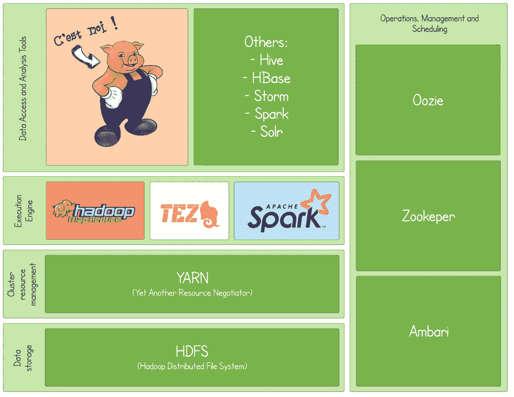
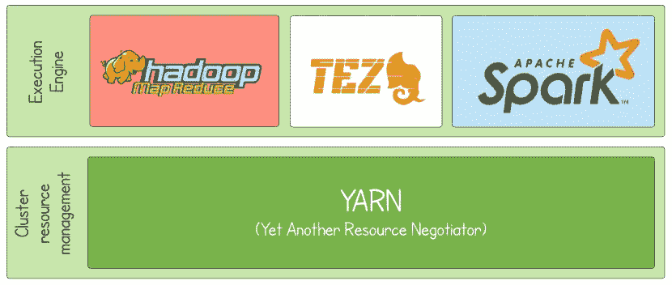
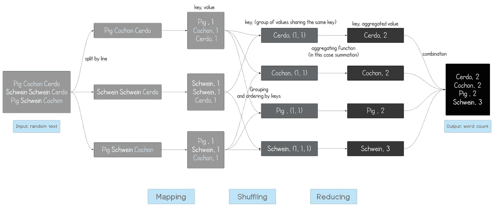
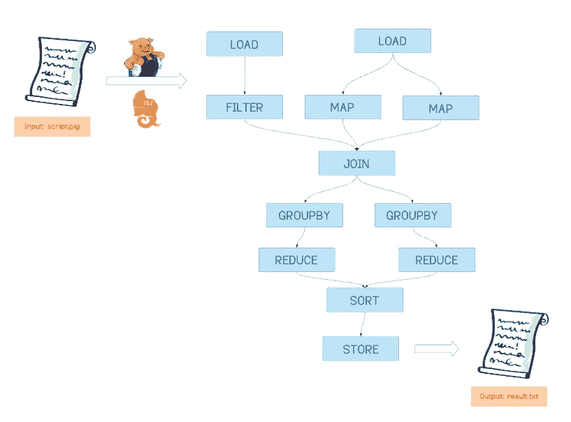
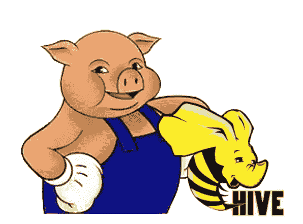
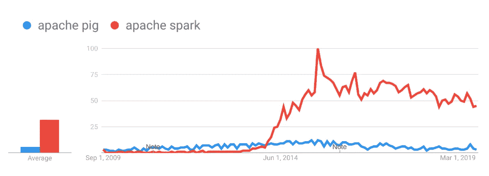
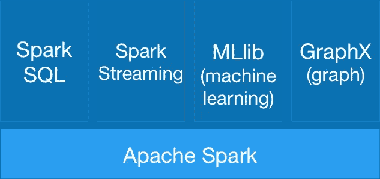
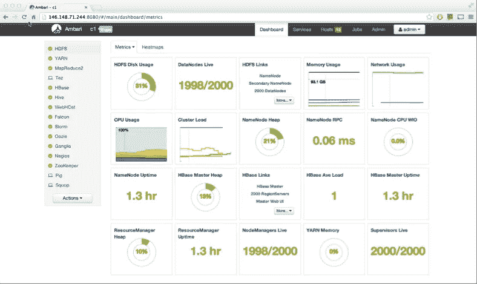
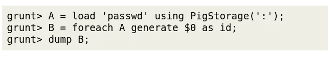
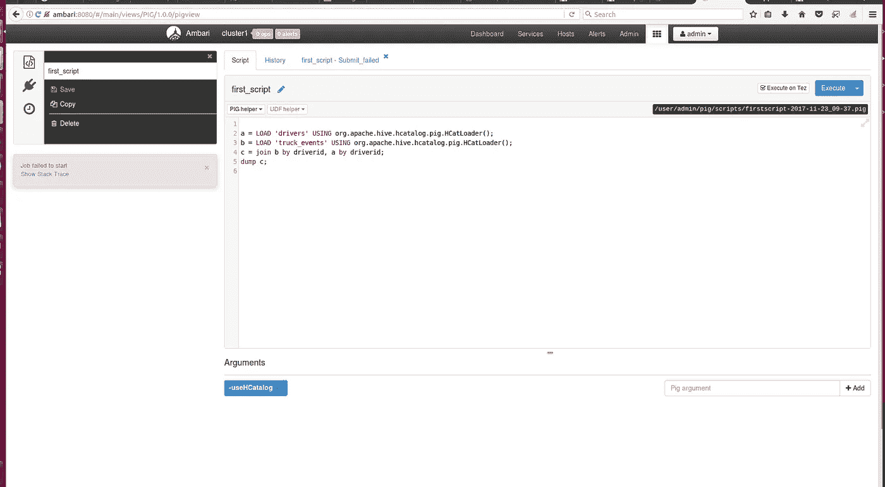

# 阿帕奇猪访谈:理论与实践指南

> 原文：<https://towardsdatascience.com/interview-with-apache-pig-theory-and-practical-guide-6c44f06a4ca9?source=collection_archive---------27----------------------->

## 在这次独家采访中，Apache Pig 谈到了他在 Hadoop 生态系统中的角色，并阐述了他的用例以及他与 Hive 和 Spark 等其他 Hadoop 组件的差异。他还就如何开始使用他提供了一些实用的指导。让我们听听小猪怎么说！


Source: Kenneth Schipper Vera from [Unsplash](https://unsplash.com/photos/6y7jACxmhP8)

*帕切猪是 Hadoop 生态系统不可或缺的一部分。自十多年前出生以来，他已经帮助世界各地成千上万的分析师理解了海量数据集。尽管他很重要，但大数据领域之外的人很少听说过他，一些熟悉他的人对他的用途只有模糊的想法。*

*几天前，我有幸坐下来与阿帕奇猪本人交谈。我们的讨论涵盖了许多话题——从他的创始哲学到写作他的语言“猪拉丁语”的实践指导。以下是这次采访的节选。*

## **嗨猪！谢谢你给我这次面试机会！**

谢谢*你*！我很高兴接受这次采访，为自己增加一些曝光率。

你知道，我厌倦了人们把我和我在 Hadoop 生态系统中的伙伴混为一谈。对许多人来说，我们只是名称丰富的工具的大杂烩，这些工具以某种方式组合在一起以促进大数据的管理。这必须改变！我们在 Hadoop 生态系统中扮演着不同的角色，熟悉我们每个人是理解大数据的关键。是时候让我澄清这个困惑，告诉世界我到底是谁了！


C’est moi — Apache Pig!

## 太好了，这正是我来这里的目的！现在，为了我们刚刚开始接触大数据世界的普通读者，您能介绍一下自己吗？

当然啦！我的名字是阿帕奇猪，但大多数人只是叫我猪。我是一个分析大型数据集的开源工具。

我是 2006 年被雅虎怀上的。我的想法是由雅虎需要转换和分析大量数据而不必编写复杂的 MapReduce 程序所驱动的。2007 年，雅虎在 Apache Software Foundation 下开源了我(这是我的名字)。从那以后，我一直在吞噬和分析世界各地价值数十亿字节的数据。

## 我喜欢你的名字！能详细说说它的来历吗？

谢谢！这是一个有趣的名字，不是吗？很多人认为我的名字源于我的创作者对弥漫在 Hadoop 世界的动物主题的坚守。这在一定程度上是真实的——我的名字的确是受到了同名动物的启发🐷。这个名字反过来又导致了与我相关的概念采用了可爱的命名法，例如*猪拉丁语* ⁠—my 编程语言——以及*咕噜声*⁠——我的交互 shell(稍后将详细介绍)。


Apache Pig's similarity to these cute fellas are more than skin deep! (Image source: [Unsplash)](https://unsplash.com/photos/6y7jACxmhP8)

然而，除了它朗朗上口之外，我的名字背后其实还有一个有趣的哲学。这种哲学在某种程度上与猪这种动物的特征有关，它由四个原则组成，指导我应该如何发展:

> ***1。猪什么都吃。*** *我是一个贪吃数据的人。我可以处理任何类型的数据，无论是关系数据、平面数据、嵌套数据、结构化数据还是非结构化数据。我还能够从多个来源读取数据，如 Hive、HBase 和 Cassandra。*
> 
> ***2。猪生活在任何地方。*** *虽然我最初是在 Hadoop 上实现的，但我并不打算被这个框架束缚住。例如，我可以在一台计算机上运行来分析本地文件。*
> 
> ***3。猪是家畜。我被设计成容易被用户理解和修改。我的编程语言，猪拉丁语，很容易理解。此外，它的功能可以通过导入各种用户定义函数(UDF)来轻松扩展。***
> 
> ***4。猪会飞。*** *这句格言说明了我处理数据的速度。它也体现了我帮助我的用户用短短几行猪拉丁代码表达复杂逻辑的能力。*

## 那很有趣。现在，您提到您是 Hadoop 生态系统的一部分。你能告诉我们你是如何融入这个生态系统的吗？

当然可以！首先，为了这个领域的新手，让我给你一个关于 Hadoop 的简单解释。

> adoop 是一个开源工具的集合，我们可以利用几台计算机的联合能力来存储和处理大量数据。

下图描述了我与生态系统中其他组件的关系。



Pig and other Hadoop components

Hadoop 的核心是 **HDFS (Hadoop 分布式文件系统)**和 **YARN(又一个资源协商者)**。我和这两个人密切合作。

HDFS 是一个分布式存储系统。它将文件分成块，制作这些块的冗余副本，并将它们分布在集群中的不同机器上。你可以把 HDFS 想象成我的数据经理。我从 HDFS 读取输入文件，将我的中间计算结果暂时存储在 HDFS，并将我的分析输出写到 HDFS。

另一方面，**你可以把 YARN 当成我的计算资源管理器。YARN 代表我协商计算资源，并调度我需要执行的任务。在此过程中，纱与 HDFS 密切合作。YARN 确保我获得的计算资源位于(根据网络拓扑)存储我必须分析的数据的机器附近。**

## 在上图中，我看到在 YARN 和你自己之间有一个执行引擎层。你能解释一下什么是执行引擎吗？

好问题！YARN 实际上是作为我的*间接*计算资源经理——我不直接与他接口。相反，这种交互通过一个*执行引擎*层进行。在 Hadoop 的上下文中，执行引擎是一个跨集群运行的软件系统或框架，它给人一种集群是一台巨型机器的错觉。大多数执行引擎运行在 YARN 之上。**到今天为止，我可以运行的执行引擎有三个:**[**MapReduce**](https://hadoop.apache.org/docs/r1.2.1/mapred_tutorial.html)**，**[**Tez**](https://tez.apache.org/)**和**[**Spark**](https://spark.apache.org/)**。**



The three execution engines that Pig can run on: Hadoop, Tez and Spark.

## 您之前提到了 MapReduce，并说您不再需要编写 MapReduce 代码。你能详细说明一下 MapReduce 是什么吗？

当然可以！正如我前面提到的，MapReduce 是我可以运行的三个执行引擎之一。它本身不是一个软件；更确切地说，它是一种简单而强大的*编程范式*(即一种设计程序的方式)。每一个 MapReduce 程序都由三个阶段组成:映射、洗牌和 Reduce。

我将首先从概念上定义这些术语。假设我们有一个巨大的文件，我们想要一个 MapReduce 程序来操作它。**在贴图阶段，程序会逐行查看这个巨型文件。对于每一行，程序将输出一个键值对。**这些键和值的确切身份将取决于程序的目标。

**在洗牌阶段，具有相同键的键值对被分组在一起。**产生的组将根据它们的键排序(例如，如果键是字符串，那么组将按照键的字母结构排序)。洗牌阶段的输出是一组有序的组。然后，这些组被分发到不同的机器上，用于后续的缩减阶段。

**在归约阶段，聚合函数被应用于在混洗阶段产生的每个组中的捆绑值。**这个过程在很多机器上并行执行。reduce 阶段将输出程序的结果。

一个例子将使这一点更加清楚。假设我有一个文本文件，我想统计文本中每个不同单词的出现次数。此任务的 MapReduce 作业如下所示:



MapReduce for word count

上面的例子看起来很简单，不是吗？不幸的是，大多数 MapReduce 程序都不是这样！任何大数据专业人士都会告诉你，编写 MapReduce 程序很麻烦，并不是所有的数据过程都可以使用 MapReduce 范式轻松编写。

这就是我进来的地方！原来我的语言猪拉丁文比 MapReduce 好写多了(有个估计指出 10 行猪拉丁文相当于 Java 的 200 行 MapReduce 代码！).当我在 MapReduce 上作为执行引擎运行时，在引擎盖下，所有这些猪拉丁代码都被转换成它们的 MapReduce 程序。很整洁，是吧？

## 酷！另外两个执行引擎 Tez 和 Spark 呢？它们和 MapReduce 相似吗？

不完全是！MapReduce 范式要求将程序分解成一系列映射和简化任务。这种需求有时会导致复杂的程序，其中包含一长串线性的映射器和缩减器。

另一方面，**当我在 Tez 或 Spark 上运行时，我将用 Pig Latin 代码表示的逻辑转换成一种称为有向无环图(DAGs)的数据结构。**DAG 中的“有向”一词是指所有的数据都流向*一个*方向，而“无环”一词是指 DAG 不能包含任何循环。以下是 DAG 的图示:



Example of DAG

在创建 DAG 时，我将确保以优化计算的方式对步骤进行排序。例如，假设我们有一个包含一个`JOIN`操作和一个`FILTER`步骤的脚本。我将调查`FILTER`步骤是否可以在`JOIN`步骤之前完成。如果是，我将在`JOIN`步骤之前执行`FILTER`步骤，从而减少要连接的数据点的数量(`JOIN`是一个计算量很大的操作！)**因为 DAGs 的强大，我在 Tez 或者 Spark 上运行总是比 MapReduce 带来更好的性能。**

## **Dope！现在我们来谈谈你的用例。你告诉我你促进大数据的分析。你能详细说明一下**吗——在什么情况下有人应该使用你？

根据我的经验，人们使用我做两件事:提取-转换-加载(ETL)管道和特别查询。

**典型的 ETL 管道从数据源加载数据，对其进行清理、转换和存储。**一个例子是处理特定网站的日志数据。使用我的`FILTER`功能，人们可以通过过滤掉来自自动机器人和内部视图的数据来清理这些日志。我还可以执行丰富原始日志数据的转换。例如，我可以根据访问者来自的国家对这些日志数据进行分组，以提供更细粒度的数据视图。

**我的另一个常见用例是研究和即席查询。**传统上，这些都是使用 SQL 完成的。但是，如果要查询的数据集是非结构化的，并且包含嵌套结构、缺失值等“复杂情况”，I 可能是一个更好的工具。我的灵活性和可扩展性非常适合这种情况。

## 这听起来很像你的朋友 Hive 能做的。你和 Hive 有什么区别？

这是一个我经常收到的问题。在我进入细节之前，让我快速地介绍一下 Hive🐝敬你。和我自己一样， **Hive 是一个数据分析工具，是 Hadoop 生态系统的一部分，可以在 MapReduce、Tez 或 Spark 上运行。**



现在让我们进入问题的实质。如果我和 Hive 都能进行数据分析，为什么还需要我们两个？换句话说，我们之间有什么不同？以下是我对此的回答:

1.  **语言。Hive 使用 HiveQL，一种我们熟悉的查询语言 SQL 的变体，而我使用 Pig Latin，一种过程语言。Pig Latin 比 SQL⁠⁠更具可扩展性——可以导入 Python 或 Java 函数来扩展 Pig Latin 的功能。猪拉丁和 SQL 还有其他的区别，我后面会详细说明。**
2.  **输入数据。** Hive 对其处理的数据施加模式，因此只能处理结构化数据。同时，正如我之前提到的，我可以处理结构化、半结构化或非结构化数据。
3.  **目标用户。**因为 Hive 使用了一种类似于标准 SQL 的语言，所以它的目标用户是已经熟悉后者的用户，即数据分析师。这些数据分析师主要使用 Hive 进行定期报告。与此同时，猪拉丁更强大，但需要更多的时间来适应。因此，我更适合程序员、数据工程师和研究人员，他们可以将我应用到我之前提到的用例中。

## **好了，我们已经谈了很多您的优势和使用案例。我不想听起来像一个毫无头绪的人力资源人员，但我有一个相当不舒服的问题，我相信我们的读者会感兴趣。你的弱点是什么？**

啊，我明白了，可怕的“弱点”问题😓。坦白说，我确实有一些限制，可能会让我在某些情况下不适合。以下是我的主要局限:

1.  我的语言，猪拉丁语，是一种描述数据转换的过程化语言。它本身并不支持循环，只对`IF/THEN`结构提供有限的支持，而这种支持有时是必要的。
2.  我只能执行基本的数据分析，只能返回文本/数字结果。如果你想进行更复杂的数据探索，比如涉及可视化的探索，或者建立机器学习模型，那么我不是合适的人选！对于这个，我的哥们 Spark 会比较合适。
3.  最后，我相当慢😓因此不适合低延迟查询。

## 这让我想到了下一个尴尬的问题。据说有些人抛弃了你而选择了火花。你怎么说？

可悲的是，这是真的。Spark 很快在行业中占据了一席之地。在快速发展的大数据领域，社区定期淘汰旧技术以支持更新、更强大的工具是很自然的事情。令我懊恼的是，感觉我才是目前被淘汰的那个😭。



Relative interest in Pig vs Spark as indicated by Google searches of these terms

让我快速的告诉你为什么 Spark 在很多方面都优于我自己。虽然我的语言 Pig Latin 提供了几个高级操作符，并且具有一定的可扩展性，但 Spark 是一种成熟的编程语言。由于与“宿主”语言(通常是 Scala 或 Python)的紧密集成，Spark 提供了完整的控制语句和无限的函数和对象定义能力。所有这些都允许您以您喜欢的任何方式转换您的数据！



Spark and its core libraries

除此之外，Spark 还有几个库，可以在大规模数据集上执行专门的过程。例如，Spark 的 MLlib 允许进行预处理、模型训练和大规模预测。凭借这些能力，Spark 成为处理和分析大数据的统一平台。这些都是我力所不及的！

## **感谢您的坦诚！嗯，虽然你现在可能有点过时，但你仍然是许多遗留系统中不可或缺的一部分……**

## **好了，现在我们来谈谈应用。假设有人有意利用你。他们从哪里开始？**

我会推荐他们下载 [Hortonworks 数据平台(HDP)沙盒。](https://www.cloudera.com/downloads/hortonworks-sandbox.html)HDP 沙盒是一个预先配置的学习环境，包含 Apache Hadoop 的最新开发成果，包括我自己！沙盒被打包在一个虚拟环境中，人们可以在他们的个人机器上运行，这使得他们可以立即找到我。



A screenshot of Ambari, the dashboard-interface of HDP.

一旦你下载了沙盒，你可以通过几种方式来运行我:

*   **您可以使用 Grunt shell 交互式地运行我。在 ssh 到您的 Hadoop 环境之后，只需在您的终端中键入`pig`来启动 Grunt。一旦 Grunt 被激活，你就可以通过一次输入一行来开始探索猪拉丁语。**



*   **可以运行猪脚本。**pig 脚本只是一个包含一系列 Pig 拉丁文命令的文本文件。要运行一个脚本，您可以简单地输入`pig`,然后输入您的 Pig 脚本的路径。
*   **猪观。**HDP 的早期版本(如 HDP 2.6.5)提供了一个名为 Pig View 的网络用户界面，用户可以在其中交互式运行 Pig Latin 命令或脚本。



Pig View in Ambari

## **爽！现在该谈谈猪拉丁语了，你的语言。你能给我们一些关于这种语言的建议吗？**

当然可以！Pig Latin 是一种相对简单的脚本语言。通过猪拉丁，用户可以命令我进行`SELECT`、`JOIN`、`FILTER`等常见的数据操作。猪拉丁也是可扩展的；用户可以开发和导入 UDF 来扩展 Pig Latin 的功能。

这里有一个猪拉丁语的例子。下面的脚本是我们之前看到的 MapReduce 程序的 Pig Latin 等价物，它计算文本文件中每个不同单词的出现次数。看一看:

```
lines = LOAD 'sourcefile.txt' AS (line:chararray);
words = FOREACH lines GENERATE FLATTEN(TOKENIZE(line)) as word;
grouped = GROUP words BY word;
wordcount = FOREACH grouped GENERATE group, COUNT(words);
STORE wordcount INTO 'result.txt';
```

## **嗯…看起来有点像 SQL…**

这似乎是我的用户中的一个普遍观点 Pig Latin 是 SQL 的过程化版本。我不一定同意这个观点。虽然有某些相似之处，但也有一些显著的差异。

**SQL 是一种描述性语言。**它让用户描述他们需要的信息(即表格),并将为他们获取这些信息。另一方面，猪拉丁语是一种程序性语言。在 Pig Latin 中，用户必须指定将他们引向所需表格的步骤(或在 Pig Latin 术语中的*关系*)。Pig Latin 的过程性质决定了一个优势:通过迫使用户以原子方式编写每个步骤，Pig Latin 降低了复杂 SQL 脚本中经常出现的概念性错误的风险。

当我们谈到语言对比的话题时，让我快速指出**猪拉丁语也被描述成与 Python 的熊猫**非常相似🐼。这样的比较源于猪拉丁和熊猫都是过程语言。在我看来，我们不应该夸大两者的相似性——Pandas 是一种更强大的语言，配备了广泛的内置函数，并且易于集成到 Numpy 和其他 Python 工具。不过，在基础层面上，猪拉丁*和熊猫*确实有些重叠。

## 我认为 Pig Latin 与 SQL 和 pandas 相似是很棒的，这两种语言大多数数据分析师都已经很熟悉了。这种重叠支持了你早先的说法，你很容易使用！有没有比较猪拉丁和两者的出处**？**

当然可以！在下表中，我列出了常见的 Pig Latin 命令以及它们在 SQL 和 Pandas 中的对等物。请注意，所有这些命令都有许许多多的变体，可以用不同的关键字和参数调用，我展示的只是其中一种可能性。


Common commands in Pig Latin and their SQL/Pandas equivalents

## **哇，太棒了！该表肯定会帮助熟悉 SQL 或熊猫的人加快写猪拉丁文的速度！**

是的，这是我编这个表时的希望😇。

## 好吧，猪，这是一个相当长的采访。结束我们的谈话，你有什么最后的信息给我们的读者吗？

当然可以！我希望我们的谈话让我了解了我是谁，以及我如何融入 Hadoop 生态系统。虽然我可能不再是市场上最性感的大数据工具，但我仍然被业界和学术界广泛使用。我希望你能花时间学会利用我🙂。然而，如果您时间紧迫，并且想要简单地掌握一个可以应用于各种大数据问题的瑞士军刀工具，Spark 可能是您的最佳选择。

*我希望你喜欢这次面试。如果你想知道，* **我** *提供了上述对话的双方。阿帕奇猪的拟人化是为了方便学习，这个角色并不代表阿帕奇猪创造者的观点。*

如果你对这篇文章有任何意见或者想联系我，请随时通过 LinkedIn 给我发一个联系方式。另外，如果你能支持我，通过[我的推荐链接](https://medium.com/@meraldo.antonio/membership)成为一名中级会员，我将非常感激。作为一名会员，你可以阅读我所有关于数据科学和个人发展的文章，并可以完全访问所有媒体上的故事。