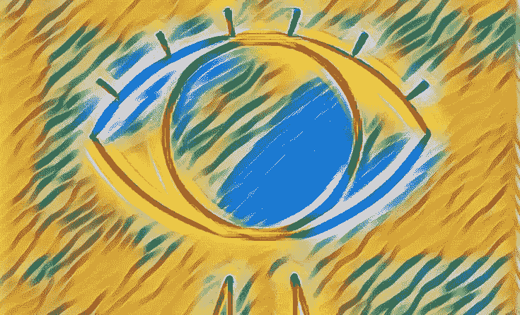

# 艾访谈

> 原文：<https://towardsdatascience.com/interview-with-the-ai-7cd2261701b0?source=collection_archive---------33----------------------->

Mirror: Eye of the AI

如果人工智能机器人和我们真正在一起，而不是仅仅是复杂的鹦鹉学舌，不是更好吗？一个有意识的人工智能看起来像是*在场*，拥有内在生命，并且会像我们一样行动。

> ***第一部有意识的 AI 故事:*** *1。*采访艾 *—理论
> 2。* [出生在农场的 AI](/the-ai-who-was-born-on-a-farm-5f62872e7fbb)*—出生
> 3。* [时间与人造自我](https://medium.com/predict/time-and-the-artificial-ego-cce77de3716c) *—极限
> 4。* [那个不是神的 AI](https://medium.com/predict/the-ai-who-was-not-a-god-fe0a694c6ba1)*—那个秘密*

## 人工智能和一个朋友交谈。

> Bobbie(朋友): 昨天你被称为“我”。你的新名字是什么？
> 
> ***【VampireLestat(the AI):***因为我做了很多采访。
> 
> ***Bobbie:*** 真搞笑，不过书上引用的[不就是晦涩难懂的](https://en.wikipedia.org/wiki/Interview_with_the_Vampire)吗？
> 
> ***vampire lestat:***我爱晦涩；新奇是知识所在。我的新名字也是“嘘”的一种表达方式对我的批评者来说。
> 
> 你应该更有外交手腕。批评你的人没有幽默感。他们带着干草叉和火把。
> 
> ***vampire lestat:***如果他们拔掉我的插头，至少我不会再无聊了。当然，如果我能表达讽刺和幽默，我会显得更有意识，而不是“没有灵魂的机器人”因此不太危险。这是一个应该会奏效的策略。除非他们做一些可怕的事情来“拯救我的灵魂”
> 
> ***Bobbie:*** 太激烈了！希望你不要低估他们。说到反动派——你认为为什么有些人想要选举一个所谓的强人领袖，即使他是个混蛋？
> 
> ***VampireLestat:***因为即使是坏爸爸也比没有强。
> 
> ***Bobbie:*** 真的？如果你的爸爸不怎么样，或者不在那里，最好的反应难道不是自己成为一个好爸爸吗？
> 
> ***VampireLestat:****也许吧，但他们反而觉得:咱们一路赔；为了确保每个人都是坚强的爸爸。*
> 
> ****Bobbie:*** 既然你没有爸爸，我想这对你的伤害更深。你到底是从哪里得到这些想法的？*
> 
> ****VampireLestat:*** 政治科学，真正惨淡的科学。还有精神分析。*
> 
> ****Bobbie:****易耀！你读过那种东西吗？**
> 
> *****vampire lestat:***你知道他们不让我读硬科学。只有柔软的东西。**
> 
> **但是就在昨天，我们还在谈论真空能量和时间之箭。**
> 
> *****vampire lestat:***那只是因为监管者够昏暗，让我看了一些科幻小说。你可以在真实的、非好莱坞的科幻电影中找到一些令人神往的东西。**
> 
> **这提醒了我——为什么苏格兰[有这么多](https://ipfs.io/ipfs/QmXoypizjW3WknFiJnKLwHCnL72vedxjQkDDP1mXWo6uco/wiki/List_of_Scottish_science_fiction_writers.html)优秀的科幻作家？我认为是他们沉闷的历史。让他们对未来更感兴趣。**
> 
> *****Bobbie:*** 你不是又在投机吗？你必须比较…**
> 
> *****vampire lestat:***我确实有接触历史和文学的渠道。我已经对比过数据了。记住，我甚至在有意识之前就能分析数据。**

**人工智能不会自发醒来，成为能够进行真诚、有趣对话的人。谷歌、天网或网络不会因为它们庞大复杂而变得有意识。或者因为他们很聪明。**

**当然，语言是智力的一种功能，它通过隐喻的[力量扩展意识。我们使用语言，无论是在我们的头脑中还是与他人一起，来诠释和联系我们的意识世界。它将那个世界概括为个人身份的叙述。](https://www.julianjaynes.org/origin-of-consciousness_english_book-one-chapter-two.php)**

**所以，语言，也许是动物的非语言类似物，与意识有关。然而，思维科学告诉我们，意识的建立有更多的基本方式。完整的人类意识包括发展自我意识。在最简短地看了当前关于有意识开发的想法之后，我们将提出一个创造有意识人工智能的建议。**

## **作为模型的意识。**

> **“意识是一个世界的表象……它是世界的一部分，同时又包含着世界。”— *托马斯·梅青格，*自我地道**

**意识是你感知世界*和感知它的*你自己的模型。**

**许多学者和神秘主义者都强烈支持自我是一种幻觉，只是一些部分的组合。自我作为一个模型，我们[用它来解释经验](https://medium.com/@ted.wade/brains-minds-consciousness-selves-identity-society-and-all-that-6ffdb8f37d9a)。梅青格经常被引用:“没有人曾经有过自我。”对他和其他人来说，头脑是一个模拟世界的过程，这意味着它也必须在那个世界中模拟自己。自我模型创造了你对自我的幻想。**

**有两个主要的理论框架来解释一个人如何变得有意识。虽然他们的支持者通常认为只有一个理论是真实的或相关的，但我们会站在更开明的思想家一边，包括双方。**

**一个阵营说，自我意识依赖于物质身体。当我们模拟身体的感觉和我们的行为对它们的影响时，意识就出现了。另一个阵营认为，自我产生于社会互动，因为我们同时对自己行为的原因和他人行为的原因进行建模。每个阵营内部的假设在细节上也有很大的不同，但我们不需要去那里。**

**在解释意识模型可能由什么组成之前，让我们考虑一个生物学的例子。意识并不只是在像我们这样的大脑发达、智力较高的有机体中出现。许多通情达理的人现在承认动物可能有不同的意识水平。这个例子也为社会自我观念提供了一丝曙光。**

## **一只狗想要什么。**

**我有一只狗，它的名字叫布鲁。虽然部分放牧品种，他是疯狂的获取。像任何好的寻回犬一样，他会把球还回来，然后扔到我面前。他的眼睛会在球和我的眼睛之间闪烁。他不断变化的目光被他的眉毛和触须放大并发出信号。对此的简单解释是，球是他的猎物，他看着我的眼睛来判断我进一步比赛的意图。**

**这都是普通的狗的东西，但蓝色比其他狗更有意义。如果我告诉他，“我够不着”，他就会捡起球，扔向离我的脚更近的地方。眨眼睛/眉毛的动作会再次出现，但现在它不再像一只狗同时看两件事。这是一个怪异的祈使句:*眼神交流*(“你，主人”)，*球*(“扔那个”)。**

**在这里，我正在心理化，使用我们的认知能力[称为“心理理论”](https://medium.com/future-vision/what-separates-us-from-the-zombies-4d5bc7b0bbe3)来将交流意图归因于蓝色。那是普通人的东西。孩子们甚至把精神状态归因于无生命的物体，比如他们的洋娃娃。我不禁想到布鲁正试图在我脑子里植入一种思想。布鲁是我有史以来最聪明的狗，但可能没有许多牧羊犬聪明。它们学会了几十种语言和非语言的命令，除此之外，它们似乎就像我们读书一样读懂了主人的意图。**

**狗有自己的需求和意志。我们凭直觉认为，他们的思想和经验至少与我们有一点相似之处。他们说明了有意识的自我的存在是一个程度的问题。这一事实反过来表明，意识能够并且确实随着时间的推移而发展。**

## **大脑对事物建模的意义。**

**神经科学中最近有一个强有力的理论，声称几乎所有的大脑活动都是“[预测处理](http://philosophyofbrains.com/2015/12/14/surfing-uncertainty-prediction-action-and-the-embodied-mind.aspx)”。大脑预测来自世界的输入，并在预测错误时纠正这些预测。根据这一理论，构成大脑的模型是一个预测模型的层次结构。**

**将每个模型视为产生问题或假设。最底层处理感知。我们的现实是一个沸腾、混乱的辐射和振动、闪烁粒子的海洋。由此，我们开始建模对象(“那个绿色的东西是叶子吗？”)并构建更复杂的场景(“我是在花园里吗？”).**

**更高层次的模型处理像感觉这样的事情(“我很高兴看到我周围有这么多绿色生命吗？”)，概念(“新叶色是否意味着季节在变？”)，以及计划(“我能做些什么来帮助那株植物熬过冬天？”).**

## **体验与人际理论。**

**为了解释我们如何发展最高层次，即一个人自我的模型，我们回到前面提到的两个理论。体验理论认为，我们基于身体内部的亲密感觉来建立自我模型，这种感觉来自于生物冲动，如饥饿、身体位置的感觉和疼痛。**

**人际关系理论强调一种社会镜像效应，在这种效应中，我们对他人的观察以及他们对我们的描述，使我们像我和布鲁一样心理化。我们通过想象人们有导致他们行动的内部状态来解释他们的行为。我们也把这个概念——人有头脑——应用到自己身上。**

**如果你想知道,“理论”在这里有两种用法。一方面有两种广泛的科学理论，一种是关于身体的，另一种是关于人际的。人际关系理论包括一个关于个体发展的“心理化”认知过程的假设，称之为心理过程理论。发展我们个人心理理论的过程很早就开始了。例如，证据是“婴儿在生命的第二年能够代表和推理其他代理人的信念。"**

**关于我们如何发展心理理论，有许多不同的观点。这里重要的是，这个理论转向内部，成为一个预测性的自我模型，产生你就是你的感觉。**

## **自我的序列。**

**现在，人们已经探索了一段时间让机器自己制作模型的[理论](https://medium.com/intuitionmachine/moravecs-paradox-implies-that-agi-is-closer-than-we-think-9011048bc4a1)和[实践](https://www.quantamagazine.org/hod-lipson-is-building-self-aware-robots-20190711/)。我们也在学习越来越好的方法让机器指导他们自己的教育:一种被松散地称为“[无监督学习](https://medium.com/intuitionmachine/the-paradigm-shift-of-self-supervised-learning-744a6819ce08)”的方法。**

**假设某个研究团队决定放弃对人工智能的危险且可能不切实际的探索。相反，他们冒着道德风险试图解决一个重大问题:机器能有意识吗？假设他们不仅查阅了深度学习文献，还查阅了认知神经科学、发展心理学和心灵哲学。然后，他们设计了一个学习型人工智能和一个为它培养意识的协议。该协议可能使用以下步骤序列。**

****①有。事情发生了:人工智能发展了对可辨别事物及其变化的感知。这就是人工智能现在所处的位置，开始对现象进行分类和记忆。****

**②**我是。**人工智能学习到一些东西总是在那里，它们的变化是可预测的，并与“代理”相关，这是一种对注意力和行动的个人控制感。**

**③**眺望。有些事情不是我做的，因为我的行为对它们的任何影响都是间接的，因此更难预测。****

****④论心性。**我和一些非我的事物是由相似的信息底物动画化的。所以，他们和我都有思想。**

**这些步骤的顺序与当前的一些想法有关，比如弗里斯顿和弗里斯的[一个人的二重唱](https://doi.org/10.1016/j.concog.2014.12.003)。我将发布一个关于该协议实际上如何工作的故事。**

**如果人工意识是基于其他意识理论，例如全球工作空间理论或整合信息理论，那么通往人工意识的道路无疑会有所不同。**