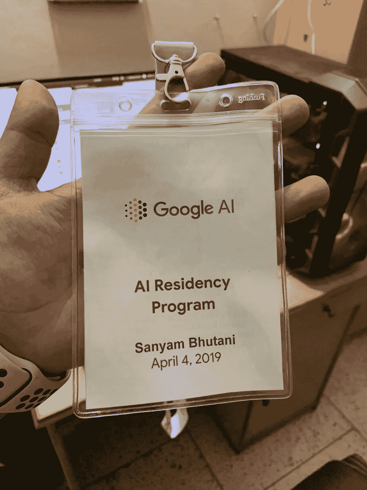
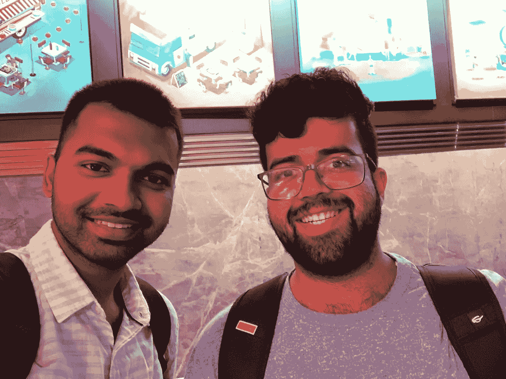
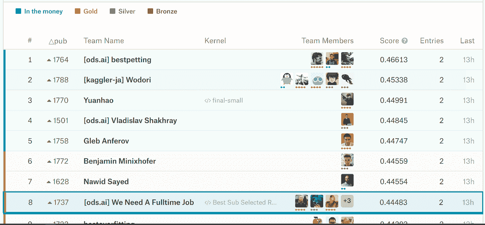
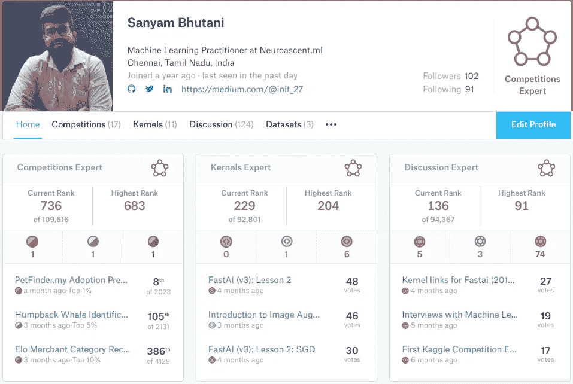
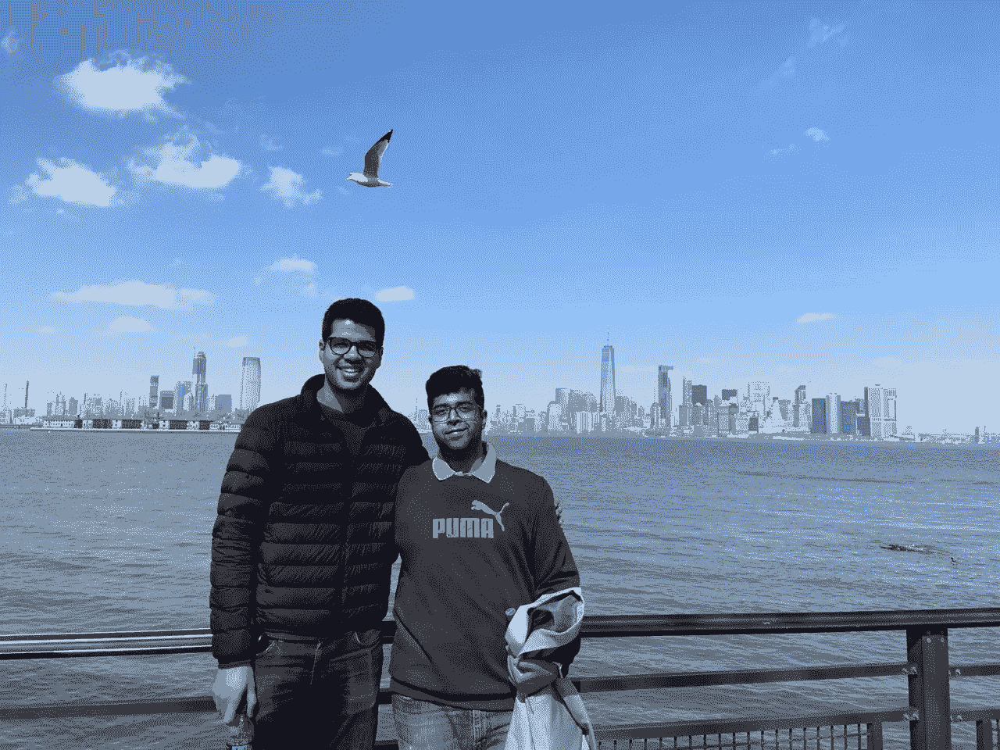
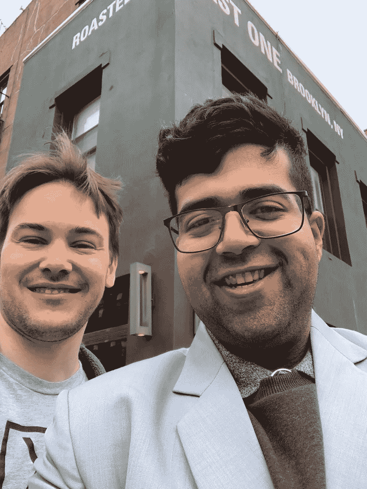

# 面试谷歌人工智能住院医师，一个 Kaggle 金牌完成，DSNet 启动，完成我的本科学位

> 原文：<https://towardsdatascience.com/interviewing-for-google-ai-residency-a-kaggle-gold-finish-dsnet-launch-c621930b043d?source=collection_archive---------4----------------------->

## 我的“自学”机器学习之路的一年更新

这篇博客文章是为了与你分享我的“机器学习之旅”的最新进展，这是一年来的进展。

我的一些读者也很友好地伸出手来，询问采访系列是否已经结束，或者最近没有发布更多博客帖子的原因。这篇博文(希望)也将分享同样的原因:

今年早些时候，我被谷歌邀请参加为期一年的谷歌人工智能驻留项目的面试:我的申请被考虑参加“最后一轮”面试:“现场面试”，准备过程让我很忙，这使我对博客系列和在线社区的贡献较少。

在我谈论人工智能派驻之前，我想分享一些其他更新:

# 完成我的本科学位

在过去的 4 年里，我在朝九晚五期间是一名 CS 学生，在朝五晚九期间是 ML 学生/自由职业者/博客作者/社区成员/Meetup TA。

我很高兴在 C. N. Subalalitha 博士的指导下，与 [Rishi Bhalodia](https://medium.com/u/5dd0ee4fe1b1?source=post_page-----c621930b043d--------------------------------) 分享我的最后一年论文:“使用深度学习和 NLP 生成音乐”已被接受(受 Christine Mcleavy 工作的启发)。

总体来说，大学对我来说是一次很棒的经历，我接触了许多令人惊叹的领域，找到了我对“人工智能”的热爱，甚至设法在 it 领域寻求职业生涯，并与 [Rishi](https://medium.com/u/5dd0ee4fe1b1?source=post_page-----c621930b043d--------------------------------) (一些我从未想象过的事情)一起创办了一家小企业。我对自己的下一阶段感到兴奋:成为一名全职的 ML 学生，并在这个领域继续成长。远离舒适的家的机会也是一次伟大的学习，也是我的决定性时刻之一，因为下一阶段我将搬回我的家乡，继续我的机器学习之旅。

我还想借此机会感谢我的向导 Subalalitha 博士，感谢他相信一个训练循环持续数天的项目([我们使用了一台 GPU 机器](https://hackernoon.com/neutron-a-4000-rtx-2080ti-msi-deep-learning-box-8700k-64gb-2080ti-82db257f0247))，并允许我为同一时期发生的 AI 常驻面试做准备。

(关于这个项目和研究工作的所有细节将很快在博客中发布，并附有完整的源代码。给你一个提示，我们正在使用 PyTorch 和一些 fastai 魔法生成音乐。对于更好的东西，我建议你去看看克里斯汀的 MuseNet。)

现在，我被告知，我被正式允许在我的个人资料上写一个“CS 工程师”。

# 数据科学网络

我一直热衷于回馈社区，我们希望通过 DSNet 为数据科学初学者以及希望在该领域发展的人创建一个受欢迎的社区。

Two Data Science Network Community Members, photo taken during the official launch with [Aakash N S](https://medium.com/u/ca6fe690e934?source=post_page-----c621930b043d--------------------------------)

DSNet 是由印度“人工智能”社区中一些最活跃的 ML 成员共同努力的成果:[siddha nt uj Jain](https://medium.com/u/51c7e4293aaa?source=post_page-----c621930b043d--------------------------------)[Kartik goda wat](https://medium.com/u/458f5f33fbfe?source=post_page-----c621930b043d--------------------------------)还有我自己。我们希望将这个社区发展成一个全国性的社区，甚至更大。

[下面是什么是 DSNet 的详细信息。对于快速 TL；DR:这是一个包含 PyTorch、Fast.ai 和 DS 的社区。](https://medium.com/@init_27/switching-to-dsnet-org-6cbe15d084de)

分享一些今天的数据。DSNet 具有:

*   超过 1k 个活动空闲成员
*   超过 13000 名简讯订阅者
*   超过 45000 名活跃的 Meetup 成员
*   (即将举行的)每周论文讨论
*   (即将举行的)每周 Kaggle 讨论

如果以上几点听起来很有趣，来加入我们吧。

# 获得金牌，在所有类别中排名前 1%

Kaggle 是真正的数据科学之家。我是卡格勒和卡格勒的长期粉丝。[许多最优秀的人也很乐意成为采访系列的一部分。](https://hackernoon.com/interviews-with-machine-learning-heroes-504762ba5dd6)

今年早些时候，我和[穆罕默德·沙赫巴兹](https://medium.com/u/7714bf977426?source=post_page-----c621930b043d--------------------------------)、[阿迪蒂亚·索尼](https://www.linkedin.com/in/ACoAAB6zIvwBJE26_qGbLxbrtBAYALZp2x9LJ28/)、[卢卡·马萨隆](https://www.linkedin.com/in/ACoAAAAEtOUBU5I8g_rjU2rIIdCAr8OAs6W4N2w/)、Bac Nguyen Xua、 [Rishi Bhalodia](https://www.linkedin.com/in/ACoAACGHrwQBl8DbrO8b9FFCKr6wmuUDf6jSC90/) 加入了一个团队，参加[ka ggle](https://www.linkedin.com/company/1061689/)[pet finder . my](https://www.linkedin.com/company/3477845/)领养预测挑战赛。

梦想成真:我们的团队在比赛中获得了第八名，为我的个人资料带来了第一个竞赛类别金牌。这也让我在所有部门中排名前 1%:

*   竞争
*   核
*   讨论

如果你感兴趣，这里有我们解决方案的链接:[https://lnkd.in/fVGRFvJ](https://lnkd.in/fVGRFvJ)

老实说，所有的荣誉都要归功于我的队友，他们真的是金牌背后的智囊。PS:我们团队的名字写着[“我们需要一份全职工作”。我们都在就业市场上，DM 对所有人开放🙂](https://twitter.com/bhutanisanyam1/status/1115989884047511552)

我唯一的遗憾是，由于面试的准备，我选择在 Petfinder 之后不参与比赛，考虑到 kaggle 有多上瘾，这真的很难。希望，现在，我将很快回到排行榜上！

# 2019 年谷歌人工智能驻地面试

今年早些时候，我收到了一封真正改变了我生活的电子邮件。当我收到我的申请更新时，那是我梦想成真的时刻。

我被邀请参加谷歌人工智能实习的最后一轮面试！那真是一个让我这些 fast.ai 的古鲁们骄傲的时刻！正如我在我的旅程系列中提到的，我选择退出大学实习，选择坚持 ML 道路并在这个领域寻找机会。这真的是一个梦寐以求的机会，不仅仅是我，成千上万的其他人都希望如此。

接下来的几个月都是我在准备数据结构和编码题，还有看了很多研究论文，做 fast.ai Part 2(今年 6 月下旬出)。

面试环节包括 Google Hangouts 面试和现场面试。我的“预筛选”环节被跳过，我被直接邀请参加现场面试，包括两轮面试。我参考了人工智能常驻常见问题解答中的以下资源:

*   [HackerRank 的](https://www.google.com/url?q=https://www.hackerrank.com/auth/login/30-days-of-code&sa=D&ust=1558725764692000) 30 天代码挑战
*   迈克尔·t·古德里奇的《Python 中的数据结构和算法》
*   破解 Gayle Laakmann McDowell 的编码采访(书)
*   [克里斯·奥拉的博客](https://www.google.com/url?q=http://colah.github.io/&sa=D&ust=1558725764694000)
*   [伊恩·古德菲勒深度学习教材](https://www.google.com/url?q=http://www.deeplearningbook.org/&sa=D&ust=1558725764695000)(初始章节)

除此之外，我真的温习了 fastai 第一部分，积极参与了“第二部分的现场版”(直到我的采访日期，我不得不分配时间来完成我的本科项目。现在我的学校结束了，我将回到 fastai 论坛)

春天，我终于有机会进入纽约的谷歌办公室。

我需要大声说出来:

> 它。曾经是。太神奇了。

谷歌让我飞去纽约面试，我还会见了当前常驻项目的成员，并与几位研究人员共进午餐(亲爱的谷歌，谢谢你为我提供的最好的午餐)。

Photo was taken at Staten Island with [Arkin Khosla](https://medium.com/u/6c0e6b93f865?source=post_page-----c621930b043d--------------------------------)

这也是我在纽约市了解“人工智能场景”的一个很好的机会，我的表弟 [Arkin Khosla](https://medium.com/u/6c0e6b93f865?source=post_page-----c621930b043d--------------------------------) 当时是 NYU 大学的学生，他也非常友好地接待了我，并谈论了“‘硅巷’中的人工智能场景”。

Two fast.ai students, One ML hero and one student.

我还见到了我的机器学习英雄之一:西尔万·古格，我想亲自感谢他在 fastai 所做的一切，以及他和杰瑞米·霍华德的出色工作。我也有机会谈论 fast.ai 的研究和合作是如何进行的，Sylvain 是如何工作的，Swift 是如何用于 Tensorflow 的(所有细节将在博客中公布)。

不幸的是，本周我被告知我的申请没有通过审批。

虽然我感到沮丧，但我真的很感谢谷歌考虑我的申请，并祝愿目前加入谷歌的人工智能居民好运，他们的惊人研究。

现在，我没有备份计划或申请任何其他有效的“常驻计划”，事实上，我不能积极参加 TWiMLAI x Fastai 学习小组或 Fastai 论坛本身，这给了我一个巨大的推动力放下一只脚。

感谢我的订户，他们向我指出，甚至亲自联系我，提到这个博客一直很安静，我可以保证，我将致力于一些令人兴奋的即将到来的帖子(当然，定期和每周)。)请留意同样的情况。再次感谢你原谅我的前后不一——之前是因为面试准备，后来是因为被拒的情绪影响。

# 致 fastai、杰瑞米·霍华德、Rachel Thomas、Sylvain Gugger 和社区的公开信

我最初的计划是在参加住院医师培训后真正地公开感谢 fast.ai，这样我就可以真正地与社区分享，“嘿！快看帮我实现了梦想，谷歌！”从一个好的位置感谢他们。

然而，我不会撒谎，即使是入围面试，以及我在“人工智能”道路上取得的所有成就，都要归功于 fast.ai:

*   我所获得的关于这个领域的(一点)知识。
*   写博客:这一切都要感谢社区的支持，以及遵循瑞秋·托马斯的博客建议。
*   社区建设:由于 fast.ai 的激励，我是回馈的忠实粉丝。我真的参与了 TWiMLAI Meetups。Rachel 的建议甚至延伸到技术讲座，今年我的目标是给 100 个小时的技术讲座，我已经给了大约 50 个小时的技术讲座，这是一次很好的学习经历。(我还想表达的是，我发现科技演讲真的很吓人，为了成为一名更好的演讲者，我选择在这方面努力。)
*   杰瑞米教授的方法非常适用于卡格尔。Fastai 真的是我走向 kaggle 的起点。

这是一封致 fastai 团队的公开信，感谢他们帮助我成为一名从业者。我在这个领域取得的所有成就(所有的小成就)都要归功于 fast.ai、这个课程、课程背后的人以及这个社区:我在论坛上遇到的所有了不起的人，与他们互动，并从他们那里获得我的“愚蠢问题”的答案。

[用我的一个机器学习英雄](https://hackernoon.com/interview-with-radiologist-fast-ai-fellow-and-kaggle-expert-dr-alexandre-cadrin-chenevert-94145d446da8)的话说[亚历山大·卡德林-切内韦尔](https://medium.com/u/1aa50203b071?source=post_page-----c621930b043d--------------------------------):

> 我们[fast.ai 社区]就像一个国际大家庭。深度学习的民主化是一项重要的社会使命，我们都是其中的一部分。

在结束这一部分之前，我还想感谢所有我有过参与、学习甚至贡献的在线社区。谢谢你对我所有的问题的耐心和你友好的回答。

最后，感谢 fastai 团队！

PS:即使我做过很多在线课程，但 fast.ai 在我的旅程中影响最大。这是我唯一推荐的入门课程，甚至是走向深度学习前沿的课程。

# 我的下一步是什么？

对于我的学习道路:

*   重启过期的博客帖子。
*   为 DSNet 多做贡献，TWiMLAI。
*   目标是成为竞赛中的卡格尔大师。
*   每周分享一份论文摘要。
*   开始每周存档的 Kaggle Comp 审查。
*   (即将)向 DSNet YouTube 频道、(即将)播客投稿。

像往常一样，我将继续通过这个博客分享我的 ML 之路的更新。感谢阅读！

*如果你觉得这很有趣并且想成为 ML 旅程的一部分，你可以在 Twitter* [*这里*](http://twitter.com/bhutanisanyam1) *找到我。*

*如果你有兴趣阅读关于深度学习和计算机视觉的新闻，可以在这里* *查看我的* [*简讯。*](http://tinyletter.com/sanyambhutani/)

如果你有兴趣阅读机器学习英雄的一些最佳建议:从业者、研究人员和 Kagglers。 [*请点击这里*](https://hackernoon.com/interviews-with-machine-learning-heroes-504762ba5dd6)