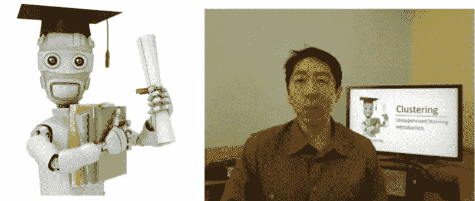
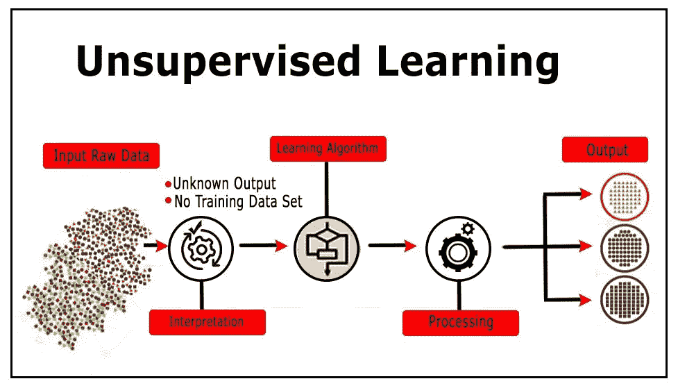

# PCA| K 均值聚类| |无监督学习算法|

> 原文：<https://towardsdatascience.com/into-to-pca-k-means-clustering-unsupervised-learning-algorithms-5cc5acea274d?source=collection_archive---------20----------------------->

## 看完这个保证你理解无监督学习的原理。

Andrew looks very young when he taught this course!

# 摘要

和往常一样，为了节省你的时间(我知道这里的文章太多了，你的时间很宝贵)，我准备先写这篇文章的摘要。

在这篇文章中，我谈到了无监督学习算法，包括 K-means 聚类，PCA。对于这些算法，我谈到了它们的应用、优缺点。这里没有代码和数学公式，如果你想学习算法的数学理论，谷歌一下就行了，维基百科上有很多；如果你想看一些真实项目中无监督学习的代码示例，只需**给我留言**，我会再贴一个。

我**确定**你看完这个就能明白什么是无监督学习了；里面有 gif 图片帮助你理解。

> *“因为我们不给它答案，所以是无监督学习”*

监督学习和非监督学习的主要区别在于，在非监督学习中，数据没有标签。

在监督学习中，系统试图从给定的样本中学习(另一方面，在无监督学习中，系统试图直接从给定的样本中找到模式)。所以如果数据集有标签，那就是监督问题。如果数据集没有标签，那就是无监督问题。

上面的左图是监督学习的一个例子:我们使用回归方法来寻找特征之间的最佳拟合线。

在无监督学习中，基于特征隔离输入，基于特征所属的聚类生成预测。

# 使聚集

## k 均值聚类

K-均值聚类的过程:

**优点**

1.  快速、健壮且易于理解。
2.  相对高效:O(tknd)，其中 n 是#个对象，k 是#个簇，d 是每个对象的#个维度，t 是#次迭代。正常情况下，k、t、d << n.
3.  Gives the best result when the data set is distinct or well separated from each other.

**缺点**

1.  学习算法需要预先指定聚类中心的数量。
2.  使用排他赋值-如果有两个高度重叠的数据，那么 k-means 将无法解析出有两个聚类。
3.  学习算法对于非线性变换不是不变的，即，对于不同的数据表示，我们得到不同的结果(以笛卡尔坐标和极坐标形式表示的数据将给出不同的结果)。
4.  欧几里德距离度量可以不相等地加权潜在的因素。5)学习算法提供平方误差函数的局部最优。
5.  随机选择聚类中心无法让我们获得丰硕的成果。
6.  仅在定义平均值时适用，即分类数据不适用。
7.  无法处理噪音数据和异常值。
8.  该算法不适用于非线性数据集。

# 主成分分析

特征降维是无监督学习的另一个应用。

有两个目的:

1.  第一，我们在实际项目中经常会遇到特征维度非常高的训练样本，往往我们无法用自己的领域知识人工构造有用的特征；
2.  第二，在数据表现上，我们无法用人眼观察到超过三个维度的特征。

因此，特征降维不仅重构了有效的低维特征向量，而且为呈现的数据提供了一种方法。

在特征降维方法中，主成分分析是最经典、最实用的特征降维技术，尤其是在图像识别领域。

参考资料:

 [## k 均值聚类

### k-means 聚类是一种矢量量化的方法，起源于信号处理，在聚类分析中很流行。

en.wikipedia.org](https://en.wikipedia.org/wiki/K-means_clustering) 

[https://www.youtube.com/watch?v=Ev8YbxPu_bQ](https://www.youtube.com/watch?v=Ev8YbxPu_bQ)

*最初发表于*[T5【https://www.linkedin.com】](https://www.linkedin.com/pulse/unsupervised-learning-summary-pengyuan-patrick-li/)*。* ***但是，*** *这是一个* ***修改后的*** ***版本。***