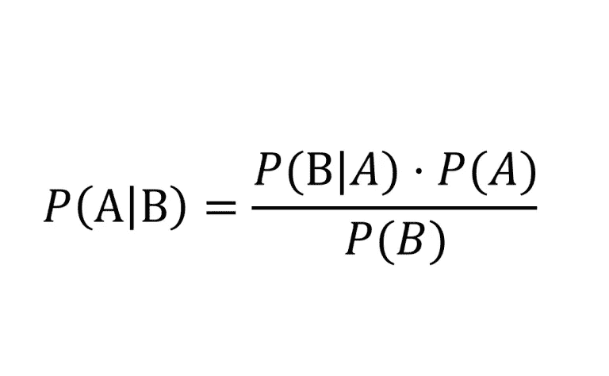
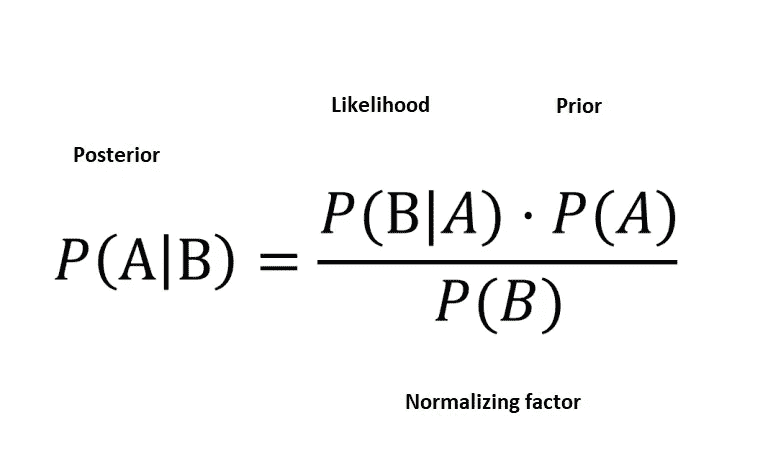

# 贝叶斯统计简介

> 原文：<https://towardsdatascience.com/intro-to-bayesian-statistics-5056b43d248d?source=collection_archive---------8----------------------->

通过贝叶斯定理快速介绍贝叶斯推理

数据科学中最常用的统计分支是频率统计。我们都在使用它的概念和思维方法，甚至不知道它或它的替代品。作为数据科学家，在我们的工具箱中拥有多种工具最符合我们的利益。在这篇文章中，我将借助我们在学校都学过的东西:贝叶斯定理，介绍另一个被称为贝叶斯统计的分支。

Bayes Theorem

以上是贝叶斯定理的表达式，我们都很熟悉。它使用条件概率和正态概率，并输出给定的 B 发生的概率。但是这些术语还有另一种解释:

Bayes Theorem

先验指的是我们持有的任何先入为主的观念或信念

可能性指的是假设我们的先验是真实的，观察到我们所做的事情的概率

后验指的是以我们所观察到的为条件的更新后的先验

归一化因子用于确保后验概率不大于 1

但是为了这篇文章，我们将只关注前三个术语，我将借助几个例子来解释更多

# **笔记本电脑充电问题:**

笔记本电脑已经成为我们生活中无处不在的一部分，用于从娱乐到工作的方方面面。想象一下这样一种情况，您已经将笔记本电脑的电池电量充到了 100%,并且正在使用它。您发现电池电量越来越低，决定给笔记本电脑插上电源。你插上电源，但看到你的笔记本电脑没有充电。

嗯，你今天才充电，所以问题一定出在插头上，而不是充电器上。在这种情况下，你的先验是你的充电器工作正常，你的可能性是假设你的充电器工作正常，笔记本电脑不充电的概率，以及假设笔记本电脑不充电，你的充电器工作正常的后验概率。

回到你的情况，你决定尝试另一个插头点，因为你相信你的充电器是好的。但是，您再次注意到您的笔记本电脑没有充电。现在你对你的充电器有一个挥之不去的疑问。在这种情况下，你的先验不再是你的充电器是好的，而是受到你之前观察到的影响。

现在，您尝试使用另一个插头，并观察到您的笔记本电脑仍然无法充电。同样，你改变或更新了你之前的信念，即你的充电器是好的，这是基于你到目前为止所经历的。最终，经过几次尝试后，你意识到问题出在你的充电器上，而不是任何插头上。

你开始时相信你的充电器很有可能是好的，后来根据你的经验，你的充电器慢慢变坏了。

让我们看另一个例子，一个我们更熟悉的例子。

# **罕见病检测试验:**

在一个人群中，有 0.1%的人有机会患上特别罕见的疾病。可以进行测试来检查其存在，该测试可以以 99%的准确度进行检测，并且具有 1%的假阳性率。在这种情况下，如果一个人检测呈阳性，他患这种疾病的可能性有多大？

P(A) —患该疾病的概率(代表他先前的知识和信念)

P(B|A) —假设他患有疾病，测试为真的概率(可能性)

P(A|B) —在测试为真的情况下患病的概率(后验或更新的先验/信念)

这种情况下的后验概率是:

(. 99 * . 001)/(. 99 * . 001+. 01 * . 999)= 0.09 或 9%

基于他的测试结果，他更新了他先前的信念。他之前的信念是从 0.1%的患病几率到 9%的患病几率。

可以肯定的是，他又进行了一次测试，但这次先验不再是 1%，而是前一次测试的后验 9%。

在这种情况下，后验概率为:

(. 99*.09)/(.99*.09+.1*.91) = 0.91 或 91%

如果第二次测试结果是肯定的，信念又会发生变化，而且这次变化很大。从 9%的人认为患有这种疾病到现在的 91%。

虽然第二种情况涉及到客观价值的使用，但并不总是如此。在第一个例子中，先验更加主观，因为你根据你的信念给它赋值。你可能 90%或 99%确定你的充电器工作正常。并且随着每次试验，该值减小，直到它开始趋向于零。

我们现在看到的是被称为贝叶斯更新或贝叶斯推理的过程。它被定义为随着更多的证据和数据变得可用而更新假设的概率的过程。贝叶斯统计下的很多技术和算法都涉及到上述步骤。它从基于用户估计的先验信念开始，并根据观察到的数据进行更新。这使得贝叶斯统计更加直观，因为它更符合人们的思维方式。

与频率统计相比，贝叶斯统计的另一个更直观的方面是它对概率的解释。在频率主义统计学中，概率被解释为某一事件在长期内或在大量人群中发生的可能性。而在贝叶斯统计中，概率被解释为人们直觉上所做的，即相信某事发生的程度。在第二个例子中，一个频繁主义者的解释是，在 1000 人中，可能有一个人患有这种疾病。然而，在贝叶斯解释中，更多的是关于一个人患这种疾病的可能性。

让我们再举一个例子来说明这一点，这次是抛硬币。频率主义者的解释是，给定一枚硬币被投掷多次，50%的情况下我们会看到正面，其他 50%的情况下我们会看到反面。贝叶斯的解释是，当我们扔硬币时，有 50%的几率看到正面，有 50%的几率看到反面。

Reverend Thomas Bayes

当情况或事件不需要时，沿着贝叶斯思路思考也会有陷阱。这方面的一个例子是赌徒谬误。在这种情况下，人们基于对某些事件的观察做出决定，即使这些事件本身可能是相互独立的。在这里，你过去的经历塑造了你的信念，导致你对未来做出错误的决定。虽然人们假设某件事发生得越频繁，它在未来发生的可能性就越小，但这有一点不同，但思维过程仍然是贝叶斯的。

总之，虽然频率统计被更广泛地使用，但这并不意味着贝叶斯统计没有自己的位置。它仍然是一个广阔的领域，历史上有许多应用。随着许多针对 R 和 Python 的开源库的发布，它的使用出现了复苏。属于这一类并且经常使用的一些技术是马尔可夫链、隐马尔可夫模型和马尔可夫链蒙特卡罗。正如我上面所写的，在你的工具箱里多一个工具总是好的。

个人注释:我只是在攻读硕士学位时才了解到贝叶斯定理的这种解释。这就像是我有了一个顿悟，我决定这无疑是一个正确的决定，在那里做我的主人的权利😆*。托马斯·贝叶斯牧师的天才之处在于，他能够将人们思考和决策的方式用数学符号表示出来。对我来说，正是这一点让贝叶斯定理变得非常神奇。*

你也可以在 [LinkedIn](https://www.linkedin.com/in/pranav-prathvikumar-0b4090a0/) 上和我联系。