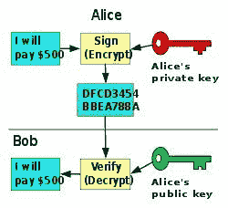
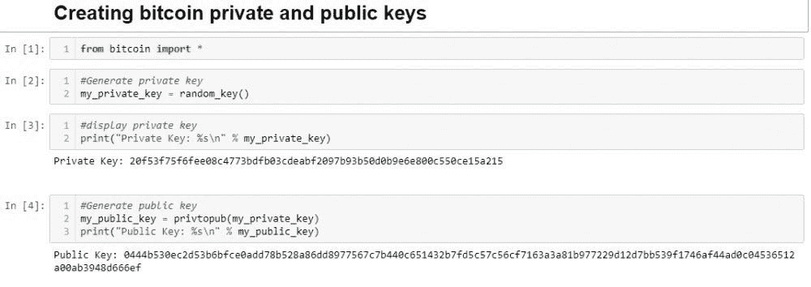

# 用 Python 介绍比特币、区块链和采矿

> 原文：<https://towardsdatascience.com/intro-to-bitcoin-blockchain-and-mining-with-some-python-ee0765b6079b?source=collection_archive---------8----------------------->

大家好，希望你们都过得很好！本文将粗略介绍比特币、区块链技术和比特币挖矿。我从未真正深入了解加密货币，但一位朋友最近想把它应用到他的工作中，并向我询问了这方面的情况。很自然，我很好奇，想和大家分享我的发现。

# 比特币

比特币是电脑化的现金。这意味着它只是以电子记录的形式存在，与实物现金不同，你无法掌握它。你可以利用比特币发送和获取现金，比如用比特币支付物品和行政费用。基本上，比特币与常规现金兼容。

有些交易所可以买卖比特币。此外，还有其他一些加密货币，但比特币是第一种也是最大的一种。比特币使用分布式账本工作，没有像银行和监管交易所那样的中央机构[1]。比特币是开源的。所以，没有人拥有或控制比特币，每个人都可以利用它。历史上没有先例，个人可以与更少的中间商交易，这意味着更有效的转移和更低的费用。

# 区块链

直截了当地说，区块链是一个先进的记录。这是比特币交易的公开记录，是按顺序请求编排的。这是一个未经许可的专用数据库，依赖于比特币惯例，保持着基于价值的信息记录的不断发展。它被传播，所以每个成员都有整个区块链的复制品。区块链由所有比特币客户共享。

它被用来检查比特币交易所的永久质量，并预测双重支出。它是安全的、不变的，而且它同样是固定的，不会被更改和修改，甚至是被信息存储中心的管理员更改和修改。

每一项区块链记录都经过加密授权，主机运行机器充当信息存储中心。区块链是由正方形组成的。一个广场是一个记录，在区块链，包含和肯定了许多举行交流。

一般来说，每隔一段时间，另一个包含交易所的广场通过采矿被并入区块链。这是一个被称为比特币区块链的记录，它存在于世界各地的大量个人电脑上，甚至可能在家里没有其他人的电脑的情况下。这份文件包含了几乎所有比特币交易的信息，也就是说，从一个记录开始，然后到下一个记录的比特币分期付款。这通常被称为记录，类似于银行记录，记录分期付款。

# 比特币和区块链的好处

对于比特币:

*   快速支付:用比特币支付非常简单快捷。比特币交易所一直都是开着的，即使是在假期。全球汇款同样简单。没有银行让任何人坚持三个工作日，没有进行全球交换的额外费用，也没有对一个人可以发送的基本或最极端金额的独特限制。
*   保护:可以利用比特币进行分期付款，而无需共享任何接近家庭的数据；人们不必加入或共享任何卡数据。事实上，甚至可以想象在不暴露一个人的个性的情况下发送分期付款，实际上就像你可以用实物现金一样。在任何情况下，观察可能需要一些努力来确保安全。
*   不相关的兑换费用:用比特币分期付款几乎没有或可以忽略不计的兑换费用。获得比特币不需要任何费用，拥有众多钱包让你能够控制消费时要支付的费用。大多数钱包都有合理的默认费用，更高的费用可以支持更快地确认你的交易。费用对于转移的金额来说是无关紧要的，所以发送 10 万个比特币的费用和发送一个比特币的费用差不多是可以想象的。
*   安全:比特币是以电子方式制造和持有的，但其中没有任何人可以拿走的签证号码，因为没有人会因为你的缘故向你收取现金。这种交换是利用军用级加密技术进行的，并且是非常机密的。比特币将让你能够完全控制你的现金，并在很大程度上防范包括某些手段在内的各种各样的虚假作品。
*   多重签名:比特币的多重签名功能允许组织完全控制自己的支出，只要一部分人同意交易，就可以使用比特币。

从上面这张取自 Stackexchange 的图片来看，比特币基本上是通过公钥保护用户的假名[3]。对于多重签名事件，公钥基本上被分解为如何组合多个密钥来批准多重签名验证。如何在 Python 中生成密钥的示例如下所示:

上面的代码和其他好东西可以从[这里](https://github.com/LesterALeong/Generating-Bitcoin-Keys)下载。

对于区块链:

*   区块链是比特币背后的创新。它就像所有比特币交易所的数据库一样工作，它保留了自绝对第一次交易所以来比特币交易所的所有记录。区块链创新的潜在和最广为人知的用途是比特币交易所的公开记录。尽管如此，无论如何，先进的货币标准并不是区块链创新的唯一用途。
*   区块链是一个基于不信任的框架，可以用来领导广泛的交流，例如，计算机化的协议标记。可以利用区块链创新来建立一个持久、开放、简单的记录框架，用于安排交易信息、通过验证版权登记来保存权利信息等。

# 比特币挖矿

比特币采矿增加了世界上更多的比特币，当发现比特币时，矿工会获得金钱奖励。每一个比特币挖掘者都通过算术计算参与到挖掘比特币的各种方式中。然而，随着时间的推移，计算变得更加复杂，开采硬币需要更长的时间。这个时间长度增加了开采硬币的成本。

任何人都可以通过运行电脑程序对比特币挖矿产生兴趣。尽管在传统的个人电脑上运行，一些组织已经计划了特殊的比特币挖掘设备，可以处理硬币，大大缩短挖掘时间[4]。由于来自其他矿商的竞争加剧，比特币变得越来越昂贵。全球众多超级计算机正在竞相挖掘下一个比特币。随着比特币挖掘者数量的扩大，开始挖掘新的比特币变得越来越棘手，也越来越被高估[5]。

# 结论

所以，我们讨论了比特币、区块链和比特币挖矿。从制造比特币的基础技术——区块链来看，比特币非常有趣。通过观看关于比特币的纪录片，我确实认为比特币的持有者有交易价值，不像其他人可能会说比特币没有增加价值。至于区块链，我真的很喜欢它运作的不信任的想法是如何做非常有趣的记录。我认为这对数据完整性非常有用，这可能是为什么你们中的一些人会在新闻中读到供应链如何应用区块链的原因。关于采矿的最后一点，就是不要去做。现在成本太高了，你只需购买比特币，希望它升值，风险就会降低。就个人而言，我现在并不积极交易加密货币，但这主要是因为我发现目前更有利可图的其他投资策略。

Github 链接为代码:
[https://github.com/LesterALeong/Generating-Bitcoin-Keys](https://github.com/LesterALeong/Generating-Bitcoin-Keys)

*免责声明:本文陈述的所有内容均为我个人观点，不代表任何雇主。投资有很大的风险。在进行任何投资之前，请咨询您的财务专家，所有信息仅供教育之用。*

[1] Garg，H. K. (2018)。*用 Python 进行比特币编程实践:用 Python 构建强大的在线支付应用*。伯明翰:包装出版公司。
【2】纽比，t . g .&拉兹马兹马，A. (2018 年 4 月 9 日)。无法追踪的货币？比特币隐私问题——金融科技周刊。检索自[https://www . fintechweekly . com/magazine/articles/an-无法追踪-货币-比特币-隐私-关注。](https://www.fintechweekly.com/magazine/articles/an-untraceable-currency-bitcoin-privacy-concerns.)T5【约阿希姆】③。(2018).从钱包里消费硬币后，私钥会公布到区块链吗？检索自[https://bit coin . stack exchange . com/questions/1819/are-private-keys-published-to-the-区块链 after-spending-coins-from-a-wallet。](https://bitcoin.stackexchange.com/questions/1819/are-private-keys-published-to-the-blockchain-after-spending-coins-from-a-wallet.)

[4]Bitcoin.com。(2019).比特币挖矿池。从 https://mining.bitcoin.com/.[取回](https://mining.bitcoin.com/.)

[5] Fortney，L. (2019 年 6 月 25 日)。比特币挖矿，解释过。从 https://www.investopedia.com/terms/b/bitcoin-mining.asp.[取回](https://www.investopedia.com/terms/b/bitcoin-mining.asp.)