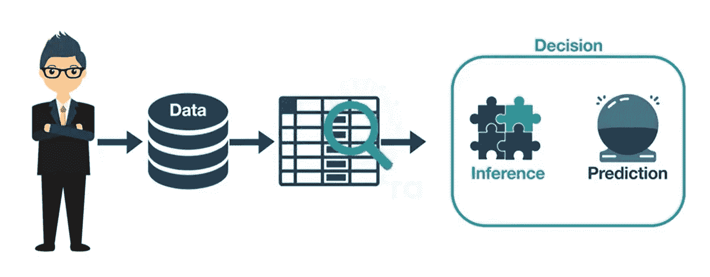
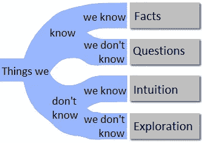
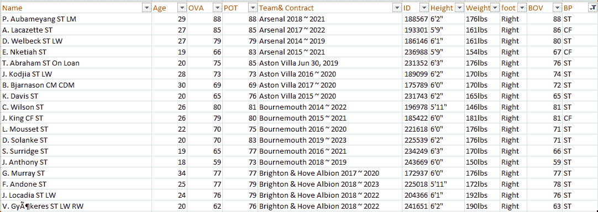
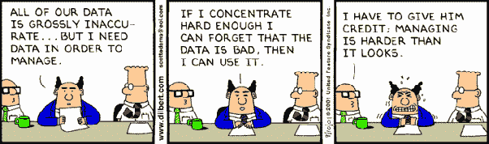
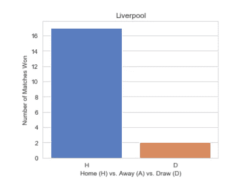
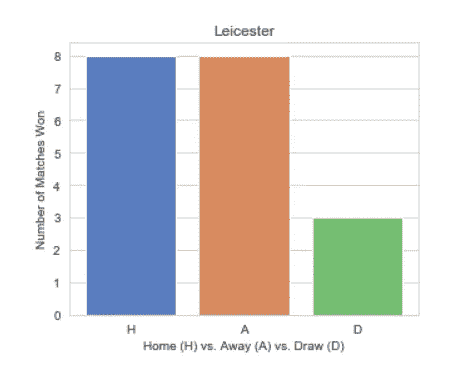
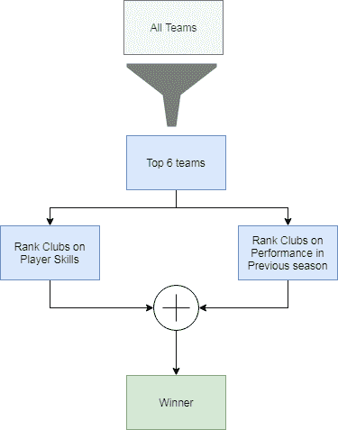
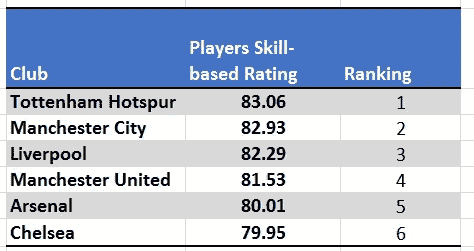
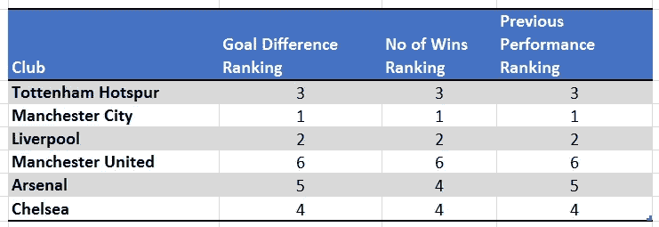
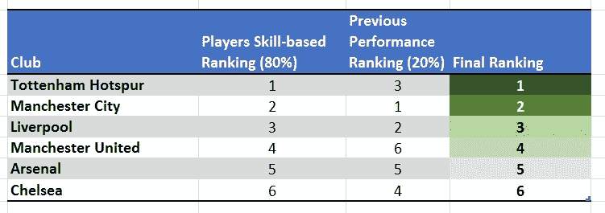

# 数据科学简介

> 原文：<https://towardsdatascience.com/intro-to-data-science-531079c38b22?source=collection_archive---------2----------------------->

## 学习数据科学的循序渐进指南

Source: Freepik

观看体育比赛总是很有趣，我们都有自己喜欢的俱乐部。我们总是和我们的朋友和同事讨论哪个俱乐部会赢得 EPL，这些讨论是基于我们的直觉，也许是基于最近的偏见。做出明智猜测的更好方法是利用数据来预测 EPL 奖得主。

# **数据科学**

但首先，让我们先来了解一下什么是[数据科学](https://quantra.quantinsti.com/course/introduction-to-data-science)？

1.  你有没有想过亚马逊、易贝是如何向你推荐商品的？
2.  Gmail 如何过滤垃圾邮件和非垃圾邮件？
3.  网飞如何预测你喜欢的节目？

他们是怎么做到的？这是我们时常思考的几个问题。实际上，如果没有数据，完成这些任务是不可能的。数据科学就是用数据来解决问题。问题可能是决策，如识别哪些电子邮件是垃圾邮件，哪些不是。或者是看哪部电影之类的产品推荐？或者预测结果，比如谁将成为下一任美国总统？因此，数据科学家的核心工作是理解数据，从中提取有用的信息，并应用这些信息解决问题。

What is Data Science?

> 一个比任何软件工程师更擅长统计，比任何统计学家更擅长软件工程的人。
> 
> —乔希·威尔斯

Video: Quick Introduction to Data Science

读完这篇文章后，你将能够

1.  *讲解* [*数据科学*](https://quantra.quantinsti.com/course/introduction-to-data-science) 中的步骤
2.  *应用这些步骤预测 EPL 获奖者*
3.  *解释数据质量的重要性*
4.  *定义数据收集方法*

# 数据科学生命周期

# **步骤 1:定义问题陈述**

创建定义良好的问题陈述是数据科学的第一步，也是关键的一步。它是对你要解决的问题的简要描述。

但是为什么我们需要一个定义良好的问题陈述呢？

> 一个定义明确的问题是一个解决了一半的问题。
> 
> —查尔斯·凯特林

还有，你在定义了问题语句之后所做的一切努力和工作，都是为了解决它。问题陈述由您的客户分享。你的客户可以是你的老板、同事，也可以是你的个人项目。他们会告诉你他们面临的问题。下面是一些例子。

1.  *我想增加收入*
2.  *我想为我的信贷部门*预测贷款违约情况
3.  我想把这份工作推荐给我的客户

大多数时候，这些最初与你分享的问题是模糊不清的。例如，问题陈述:“我想增加收入”，并没有告诉你增加多少收入如 20%或 30%，为哪些产品增加收入，增加收入的时间框架是什么。你必须把问题陈述清楚，目标明确，可衡量。这可以通过问一系列正确的问题来实现。

> “获得正确的问题是获得正确答案的关键。”
> 
> 杰夫·贝索斯

如何提出更好或正确的问题来创建一个定义良好的问题陈述？你应该问开放式问题，而不是封闭式问题。开放式问题有助于发现未知的未知。未知的未知是你不知道你不知道的事情。

Source: USJournal

我们将研究一个问题陈述“哪个俱乐部会赢得 EPL 奖？”

# **第二步:数据收集**

你需要收集有助于解决问题的数据。数据收集是从各种来源收集相关信息的系统方法。根据问题陈述的不同，数据收集方法大致分为两类。

首先，当你有一些独特的问题，而没有相关的研究做这个主题。然后，你需要收集新的数据。这种方法被称为原始数据收集。例如，您想要跨公司员工在自助餐厅花费的平均时间的信息。没有这方面的公开数据。但你可以通过各种方法收集数据，如调查、采访员工以及监控员工在自助餐厅的时间。这种方法很费时间。

另一种方法是使用现成的或由他人收集的数据。这些数据可以在互联网、新闻文章、政府人口普查、杂志等等上找到。这种方法被称为二次数据收集。这种方法比主要方法耗时少。

*为我们的 EPL 问题陈述。您可以从各种开源网站(如 Github、Kaggle 和 datahub)收集和汇总数据。*

Table 1: Snapshot of data collected from web sources

# **第三步:数据质量检查和修复**

数据科学家最重要但经常忽略的一个方面是确保用于分析和解释的数据质量良好。

收集完数据后，大多数人开始对其进行分析。通常，他们会忘记对数据进行完整性检查。如果数据质量不好，它会给出误导性的信息。简单的说:“垃圾进，垃圾出”。

例如，如果您在没有确保数据质量的情况下开始分析。那么你可能会得到意想不到的结果，如水晶宫俱乐部将赢得下一届 EPL。然而，你对 EPL 的领域知识表明，这个结果看起来并不准确，因为水晶宫甚至从未进入前 4 名。

# **第四步:探索性数据分析**

在你模拟出解决方案的步骤之前，分析数据是很重要的。这是最令人兴奋的一步，因为它有助于您熟悉数据并获得有用的见解。如果您跳过这一步，那么您可能会最终生成不准确的模型，并在您的模型中选择无关紧要的变量。

> 正如探索性数据分析的开发者约翰·图基所说，
> 
> 在你学会衡量你做得有多好之前，了解你能做什么是很重要的

但是这可能会很费力和困难。有没有工具或技术可以有意义地探索数据？

是的，您可以使用描述性统计，如中心值度量和可变性度量。此外，可视化方法，如图表和绘图，可用于分析。

例如，你可以计算每场比赛的平均进球数。还可以查一下主场优势是不是真的？

下面的柱状图展示了利物浦的主场优势。它显示，在利物浦的所有主场比赛中，他们赢了 17 场，平了 2 场。但从未输过任何一场主场比赛。

Chart 1: Home Advantage for Liverpool [1]

但是，没有莱斯特的主场优势。显示莱斯特所有主场比赛，他们 8 胜 8 负 3 平。

Chart 2: No home Advantage for Leicester [1]

*资料来源:Quantra 的《数据科学导论》*

数据分析是一个迭代过程，可以帮助您更接近解决方案。每次迭代都有相关的成本。因此，作为一名数据科学家，建议您进行适当的规划，以减少迭代次数。你可以玩数据，创建自己的图表，并学习推导推论。您执行的所有这些分析通常被称为探索性数据分析(EDA)。

# **第五步:数据建模**

建模意味着制定每一个步骤，并收集实现解决方案所需的技术。你需要列出计算的流程，这只是解决方案的建模步骤。重要的因素是如何进行计算。统计和机器学习下有各种技术，你可以根据需求选择。

对于 EPL 的数据，我们选择使用统计技术来预测当前赛季的冠军。

Figure 1: Data Modelling Steps [1]

**前 6 名团队**

根据过去三个赛季的数据，我们知道 EPL 的冠军在变，但是前六名的俱乐部保持不变。这些俱乐部是阿森纳、切尔西、利物浦、曼城、曼联和热刺。下赛季的冠军极有可能来自这 6 强球队。

**根据球员技能对俱乐部进行排名**

众所周知，在足球中，一名球员可以是进攻者、防守者、中场或守门员。这些职位中的每一个都需要不同的身体技能。一名球员根据他的身体技能和他所踢的位置来得分。分数以 0-100 分制给出。每项技能都有一个权重。

Table 3: Player skills by Club. [1] and [2]

**根据过去的表现对俱乐部进行排名**

我们根据上个赛季的胜场数和进球数对球队的表现进行排名。

Table 4: Club last season performance.

**结合排名预测赢家**

考虑到 80%的权重给球员的技术，20%的权重给俱乐部过去的表现，我们得到了前 6 名俱乐部的最终排名。
根据这些计算，托特纳姆热刺队很可能赢得本届 EPL。

Table 5: Combining Player skills and Past Performance

# **步骤 6:数据通信**

Source: Freepik

这是最后一步，在这一步中，您将向风险承担者展示您的分析结果。你向他们解释你是如何得出一个具体的结论和你的重要发现的。

大多数情况下，您需要向非技术受众展示您的发现，例如营销团队或业务主管。你需要以简单易懂的方式传达结果。利益相关者应该能够从中得出一个可行的计划。

但是在交流结果时，你需要记住哪些重要的事情呢？

1.  **了解你的听众，说他们的语言**

你应该了解你的听众，说他们的语言。例如，你正在向一个足球迷展示 EPL 奖得主的预测。他们不理解你所使用的统计数据，但他们能理解你决定赢家的步骤。

**2。关注价值和结果**

你应该关注价值和结果。你的利益相关者不会对你如何获得数据感兴趣，而是对你从哪里获得数据感兴趣。使用可靠的来源有助于建立对你预测的信心。

**3。传达假设和限制**

你应该清楚地传达你所做的重要假设和限制。例如，为了计算团队的总体评分，您假设所有团队采用 3–4–3–1 阵型。将这些传达给利益相关者是很重要的。

尽管我们的目标是预测获胜者，但可能还有其他一些相关的重要发现。比如进攻、中场、防守、守门员最好的球队。根据球员的技术，联盟中每个位置的最佳球员。这种以图形、图表和数字形式显示数据的统一视图称为仪表板。您可以使用 Excel 创建仪表板。

现在，轮到你了。以数据科学家的身份解决一个问题。

快乐学习！

**来源和参考文献**

1.  [数据科学简介](https://quantra.quantinsti.com/course/introduction-to-data-science)
2.  [英超联赛统计数据](https://www.premierleague.com/stats)
3.  [维基百科:数据科学](https://en.wikipedia.org/wiki/Data_science)