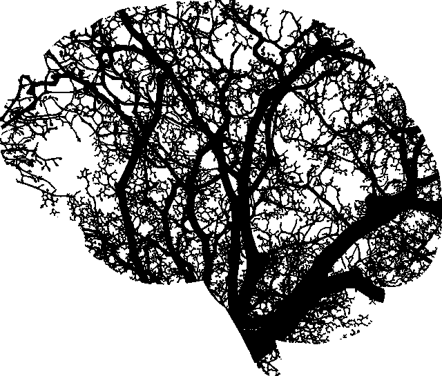
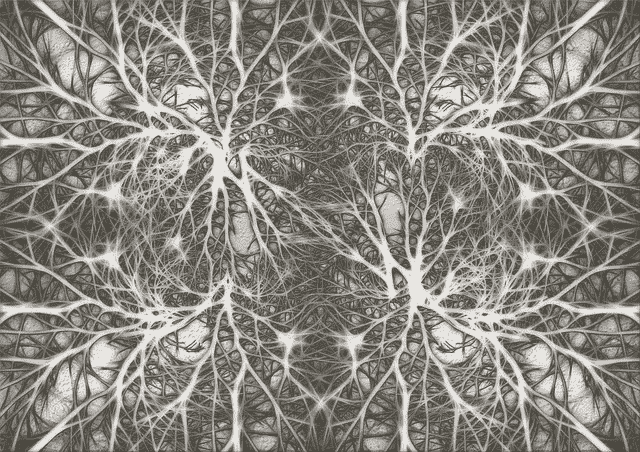
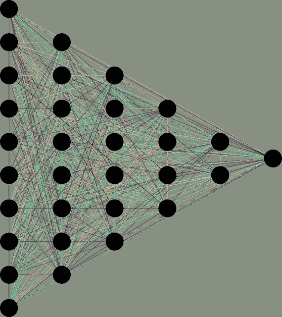
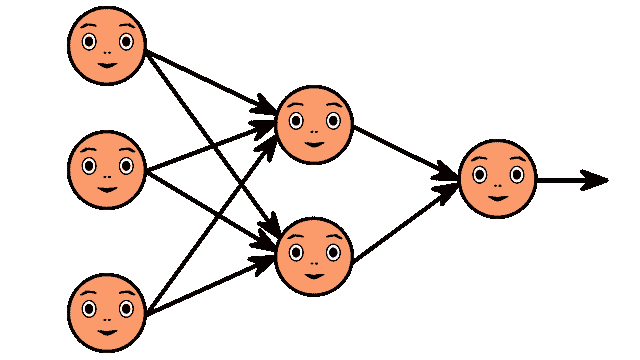

# 深度学习完全初学者指南

> 原文：<https://towardsdatascience.com/intro-to-deep-learning-c025efd92535?source=collection_archive---------7----------------------->

## 为新手、新手和新手征服神经网络

Photo by [ibjennyjenny](https://pixabay.com/photos/nature-animal-portrait-mammal-cute-3301844/) on [Pixabay](https://pixabay.com/photos/nature-animal-portrait-mammal-cute-3301844/)

我们生活在一个无论好坏都不断被深度学习算法包围的世界里。从社交网络过滤到无人驾驶汽车到电影推荐，从金融欺诈检测到药物发现到医学图像处理(*…那是肿块癌吗？*)，深度学习领域每天都在影响着我们的生活和决定。

事实上，你现在可能正在阅读这篇文章，因为深度学习算法认为你应该看到它。

Photo by tookapic on [Pixabay](https://pixabay.com/)

如果你正在寻找深度学习的基础知识，人工神经网络，卷积神经网络，(一般的神经网络…)，反向传播，梯度下降，等等，你来对地方了。在这一系列文章中，我将尽可能简单易懂地解释这些概念。

还会有猫。

有了一点傻气，学习就容易多了。

Photo by skeeze on [Pixabay](http://pixabay.com)

如果你进入深度学习，会有大量非常深入的信息。我会确保为那些想在这些水域游得更深的人提供额外的资源。(例如，你可能想看看 Yann LeCun 等人的[高效反向投影](http://yann.lecun.com/exdb/publis/pdf/lecun-98b.pdf)，这是深度学习领域最重要的人物之一写的。本文特别关注反向传播，但也讨论了深度学习中一些最重要的主题，如梯度下降、随机学习、批量学习等。想看的都在这里！)

现在，让我们开始吧！

Photo by [Laurine Bailly](https://unsplash.com/@laurinebailly?utm_source=medium&utm_medium=referral) on [Unsplash](https://unsplash.com?utm_source=medium&utm_medium=referral)

## 什么是深度学习？

真的，只是 ***学例*** 。差不多就是这样。

在非常基础的层面上，深度学习是一种机器学习技术，它教会计算机通过各层过滤输入(图像、文本或声音形式的观察)，以学习如何预测和分类信息。

深度学习的灵感来源于人类大脑过滤信息的方式！

Photo by [Christopher Campbell](https://unsplash.com/@chrisjoelcampbell?utm_source=medium&utm_medium=referral) on [Unsplash](https://unsplash.com?utm_source=medium&utm_medium=referral)

本质上，深度学习是基于*学习数据表示*(而不是特定任务的算法)的机器学习家族的一部分。深度学习实际上与认知神经科学家在 90 年代初提出的一类关于大脑发育的理论密切相关。就像在大脑中一样(或者更准确地说，在 20 世纪 90 年代研究人员关于人类新大脑皮层发展的理论和模型中)，神经网络使用分层过滤器的层次结构，其中每一层都从前一层学习，然后将其输出传递给下一层。

***深度学习试图模仿新大脑皮层中多层神经元的活动。***

在人类大脑中，大约有 1000 亿个神经元，每个神经元都与大约 100，000 个相邻的神经元相连。从本质上说，这就是我们试图创造的，但在某种程度上是为机器服务的。

Photo by GDJ on [Pixabay](https://pixabay.com/)

深度学习的目的是模仿人脑的工作方式，以便创造一些真正的魔法。

这对神经元、轴突、树突等意味着什么？神经元有一个体，树突和一个轴突。来自一个神经元的信号沿着轴突传递，并被传递到下一个神经元的树突。传递信号的连接(不是实际的物理连接，但仍然是连接)被称为突触。

Photo by mohamed_hassan on [Pixabay](https://pixabay.com/)

神经元本身是没什么用的，但是当你有很多神经元时，它们会一起工作，创造出一些神奇的东西。这就是深度学习算法背后的想法！你从观察中得到输入，你把你的输入放入一个层，这个层产生一个输出，这个输出反过来成为下一层的输入，等等。这种情况反复发生，直到你的最终输出信号！

因此，神经元(或**节点**)获得一个或多个信号(**输入值**)，该信号通过神经元，并传递**输出信号**。把输入层想象成你的感官:你看到的，闻到的，感觉到的，等等。这些是一次观察的独立变量。这些信息被分解成数字和计算机可以使用的二进制数据位。(您需要标准化或规范化这些变量，以便它们在相同的范围内。)

我们的产值可以是多少？可以是**连续**(比如价格)**二元**(是或否)，也可以是**分类**(猫、狗、驼鹿、刺猬、树懒等。).如果是分类的，你要记住你的输出值不会只是一个变量，而是几个输出变量。

Photo by [Hanna Listek](https://unsplash.com/@hanialistek?utm_source=medium&utm_medium=referral) on [Unsplash](https://unsplash.com?utm_source=medium&utm_medium=referral)

此外，请记住，您的 **r 输出值将始终与来自输入值**的同一个观察值相关。例如，如果您的输入值是对一个人的年龄、工资和车辆的观察，那么您的输出值也将与同一个人的相同观察相关。这听起来很基本，但是记住这一点很重要。

那么**突触**呢？每个突触都被分配了权重，这对人工神经网络 (ANNs)至关重要。重量是人工神经网络学习的方式。通过调整权重，人工神经网络决定信号传递的程度。当你训练你的网络时，你决定如何调整权重。

**神经元**内部发生了什么？首先，它得到的所有值相加(计算出**加权和**)。接下来，它应用一个激活函数，这是一个应用于这个特定神经元的函数。由此，神经元知道是否需要传递信号。

这样重复几千甚至几十万遍！

Photo by Geralt on [Pixabay](https://pixabay.com/)

我们创建了一个人工神经网络，其中有用于**输入值**(我们已经知道的/我们想要预测的)和**输出值**(我们的预测)的节点，在这些节点之间，我们有一个隐藏层(或多个层),信息在到达输出之前会在其中传播。这类似于你通过眼睛看到的信息被过滤到你的理解中，而不是直接进入你的大脑。

Image by Geralt on [Pixabay](https://pixabay.com)

深度学习模型可以是有监督的、半监督的和无监督的。

## 说什么？

**监督学习**

你对心理学感兴趣吗？这本质上是“概念学习”的机器版本。你知道什么是概念(例如物体、想法、事件等。)基于每个对象/想法/事件都有共同特征的信念。

这里的想法是，您可以看到一组带有标签的示例对象，并学习根据您已经看到的内容对对象进行分类。你简化了你从展示给你的东西中学到的东西，把它浓缩成一个例子的形式，然后你把这个简化的版本应用到未来的例子中。我们真的称之为“从例子中学习”

Photo by [Gaelle Marcel](https://unsplash.com/@gaellemm?utm_source=medium&utm_medium=referral) on [Unsplash](https://unsplash.com?utm_source=medium&utm_medium=referral)

(把那个宝贝稍微打扮一下，看起来是这样的:*概念学习是指从输入输出的训练样本中推断出一个布尔值函数的过程*。)

简而言之，监督机器学习是学习一个函数的任务，该函数基于示例输入-输出对将输入映射到输出。它与由训练示例组成的**标记的训练数据**一起工作。每个例子都是由一个输入对象(通常是一个向量)和您想要的输出值(也称为监控信号)组成的一对。您的算法监督训练数据，并产生一个可用于映射新示例的推断函数。理想情况下，该算法将允许您对它以前没有见过的示例进行分类。

*基本上，它查看带有标签的东西，并使用它从带标签的东西中学到的东西来预测其他东西的标签。*

**分类任务**倾向于依赖监督学习。这些任务可能包括

*   检测图像中的人脸、身份和面部表情
*   识别图像中的物体，如停车标志、行人和车道标志
*   将文本分类为垃圾邮件
*   识别视频中的手势
*   检测语音和识别音频记录中的情感
*   识别发言者
*   转录语音到文本

**半监督学习**

这个更像是你小时候父母明确告诉你的东西(有标签的信息)和你自己学到的没有标签的东西结合起来的学习方式，就像你观察到的花和树，没有命名也没有计数。

Photo by [Robert Collins](https://unsplash.com/@robbie36?utm_source=medium&utm_medium=referral) on [Unsplash](https://unsplash.com?utm_source=medium&utm_medium=referral)

半监督学习与监督学习做同样的事情，但是它能够利用**标记和未标记数据**进行训练。在半监督学习中，你经常会看到许多未标记的数据和一点点标记的数据。有许多研究人员发现，这个过程可以提供比无监督学习更高的准确性，但没有与标记数据相关的时间和成本。(有时，标记数据需要一个熟练的人来做一些事情，如转录音频文件或分析 3D 图像，以便创建标签，这可能使创建一个完全标记的数据集变得非常不可行，特别是当你处理那些深度学习任务喜欢的大规模数据集时。)

半监督学习可以称为**直推式**(推断给定数据的正确标签)或**归纳式**(推断从 X 到 Y 的正确映射)。

为了做到这一点，深度学习算法必须至少做出以下假设之一:

*   彼此靠近的点可能共享一个标签(**连续性假设**)
*   数据喜欢形成聚类，聚类在一起的点可能共享一个标签(**聚类假设**)
*   数据位于比输入空间维度更低的流形上(**流形假设**)。好吧，这很复杂，但想象一下，如果你试图分析某人的谈话，你可能会想看她的面部肌肉移动她的脸和她的声带发出声音，并停留在那个区域，而不是看所有图像和/或所有声波的空间。

**无监督学习**(又名 *Hebbian 学习*)

无监督学习包括学习数据集中元素之间的关系，以及在没有标签帮助的情况下对数据进行分类。这可以采用很多算法形式，但它们都有相同的目标，即通过搜索隐藏的结构、特征和模式来模仿人类逻辑，以便分析新数据。这些算法可以包括**聚类、异常检测、神经网络**等等。

**聚类**本质上是检测数据集内的相似性或异常性，是无监督学习任务的一个很好的例子。通过比较文档、图像或声音的相似性和异常性，聚类可以产生高度准确的搜索结果。能够通过大量的数据对“鸭子”或者声音进行聚类有很多很多潜在的应用。能够准确检测异常和异常行为对于安全和欺诈检测等应用非常有益。

Photo by [Andrew Wulf](https://unsplash.com/@andreuuuw?utm_source=medium&utm_medium=referral) on [Unsplash](https://unsplash.com?utm_source=medium&utm_medium=referral)

## 回去吧！

深度学习架构已经应用于社交网络过滤、图像识别、金融欺诈检测、语音识别、计算机视觉、医学图像处理、自然语言处理、视觉艺术处理、药物发现和设计、毒理学、生物信息学、客户关系管理、音频识别以及许多许多其他领域和概念。深度学习模型无处不在！

当然，存在许多深度学习技术，如**卷积神经网络**、**递归神经网络**等等。没有哪种网络比其他网络更好，但有些网络肯定更适合特定的任务。

## 深度学习和人工神经网络

大多数现代深度学习架构都基于人工神经网络(ann ),并使用多层非线性处理单元进行特征提取和转换。每个后续层使用前一层的输出作为其输入。他们所学的形成了一个概念的层次结构，其中每一层都学习将其输入数据转换成稍微抽象一些的复合表示。

Image by ahmedgad on [Pixabay](http://pixabay.com)

这意味着，例如，对于一幅图像，输入可能是一个像素矩阵，然后第一层可能编码边缘并组成像素，然后下一层可能组成边缘的排列，然后下一层可能编码鼻子和眼睛，然后下一层可能识别图像包含一张脸，等等。虽然您可能需要做一些微调，但深度学习过程会自行学习将哪些功能放在哪个级别！

Photo by [Cristian Newman](https://unsplash.com/@cristian_newman?utm_source=medium&utm_medium=referral) on [Unsplash](https://unsplash.com?utm_source=medium&utm_medium=referral)

深度学习中的“深”只是指数据经过多少层的转换(它们有一个实质的信用分配路径(CAP)，这是从输入到输出的转换链)。对于一个**前馈神经网络**，帽的深度是网络的深度和隐藏层的数量加一(输出层)。对于一个**递归神经网络**，一个信号可能会通过一个层传播不止一次，因此 CAP 深度可能是无限的！大多数研究人员同意深度学习涉及 CAP depth > 2。

## 卷积神经网络

最流行的神经网络类型之一是卷积神经网络(CNN)。CNN 卷积(不是卷积…)学习输入数据的特征，并使用 2D 卷积层，这意味着这种类型的网络是处理(2D)图像的理想选择。CNN 通过从图像中提取特征来工作，这意味着不再需要手动提取特征。特征没有经过训练！它们是在网络对一组图像进行训练时学习的，这使得深度学习模型对于计算机视觉任务来说极其准确。CNN 通过数十或数百个隐藏层来学习特征检测，每一层都增加了所学习特征的复杂性。

如果你想继续了解我，我们将在第 3 部分深入探讨 CNN！

(想了解更多？查看吴建新和 Yann LeCun 的原创文章 [*卷积神经网络介绍*](https://web.stanford.edu/class/cs231a/lectures/intro_cnn.pdf) ， [*基于梯度的学习应用于文档识别*](http://yann.lecun.com/exdb/publis/pdf/lecun-01a.pdf) 。)

## 递归神经网络

卷积神经网络通常用于处理图像，而递归神经网络(RNNs)用于处理语言。rnn 不只是将信息从一层过滤到下一层，它们有内置的反馈回路，其中一层的输出可能会反馈到其上一层。这实际上给了网络一种记忆。

## 生成对抗网络

在生成性对抗网络(GANs)中，两个神经网络一决雌雄。生成器网络试图创建令人信服的“假”数据，而鉴别器试图区分假数据和真数据。随着每个训练周期的进行，生成器在创建虚假数据方面变得更好，鉴别器在识别虚假数据方面变得更敏锐。通过在训练中让两者相互对抗，两个网络都得到了改善。(基本上这里是衬衫 vs 皮肤。主队正在努力提高自己的水平。)GANs 可以用于非常有趣的应用，包括从书面文本生成图像。GANs 可能很难处理，但更强大的模型正在不断开发中。

## 未来的深度学习

对于任何对深度学习感兴趣的人来说，未来都充满了潜力。神经网络最引人注目的一点是它处理大量不同数据的能力。这变得越来越重要，因为我们生活在一个先进的智能传感器时代，每天每秒都可以收集令人难以置信的大量数据。据估计，我们目前每天产生 2.6 万亿字节的数据。这是一个巨大的数据量。虽然传统计算机难以处理如此多的数据并从中得出结论，但随着数据量的增加， ***深度学习实际上变得更加高效。神经网络能够发现大量非结构化数据中的潜在结构，例如原始媒体，这是世界上的大多数数据。***

可能性是无限的！

还和我在一起吗？

查看**第二部分**:[****人工神经网络****](/simply-deep-learning-an-effortless-introduction-45591a1c4abb)

** [## 深度学习完全初学者指南:人工神经网络

### 深度学习入门！在 15 分钟内攻克人工神经网络的基础知识

towardsdatascience.com](/simply-deep-learning-an-effortless-introduction-45591a1c4abb) 

和**第三部分**:[**图像分类和卷积神经网络**](/wtf-is-image-classification-8e78a8235acb) **！**

* [## 深度学习完全初学者指南:卷积神经网络

### 在几分钟内征服 CNN 和图像分类的基础

towardsdatascience.com](/wtf-is-image-classification-8e78a8235acb) 

和往常一样，如果你对这些信息做了什么很酷的事情，请在下面的评论中留下你的回应，或者随时在 LinkedIn 上联系我们

感谢阅读！***